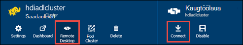

<properties
   pageTitle="Luua Hdinsightiga kogumite Azure'i Lake andmesalve ressursihaldur mallide kasutamine | Microsoft Azure'i"
   description="Azure'i ressursihaldur mallide abil saate luua ja Azure andmesalve Lake Hdinsightiga kogumite kasutamine"
   services="data-lake-store,hdinsight"
   documentationCenter=""
   authors="nitinme"
   manager="jhubbard"
   editor="cgronlun"/>

<tags
   ms.service="data-lake-store"
   ms.devlang="na"
   ms.topic="article"
   ms.tgt_pltfrm="na"
   ms.workload="big-data"
   ms.date="10/21/2016"
   ms.author="nitinme"/>

# <a name="create-an-hdinsight-cluster-with-data-lake-store-using-azure-resource-manager-template"></a>Luua ka Hdinsightiga kobar Lake andmesalve Azure'i ressursihaldur malli abil

> [AZURE.SELECTOR] - [Portaalis](data-lake-store-hdinsight-hadoop-use-portal.md) - [PowerShelli kaudu](data-lake-store-hdinsight-hadoop-use-powershell.md) - [ressursihaldur abil](data-lake-store-hdinsight-hadoop-use-resource-manager-template.md)

Saate teada, kuidas konfigureerida mõne Hdinsightiga kobar juurdepääsu Azure andmesalve Lake Azure'i ressursihaldur malli kasutamiseks. Mõned olulised kaalutlused selles versioonis:

-   **Jaoks säde kogumite (Linux) ja Hadoopi/torm kogumite (Windows ja Linux)**, Lake andmesalve saab kasutada ainult konto täiendav salvestusruum. Sellise rühmad salvestusruumi vaikekonto ikkagi Azure'i salvestusruumi plekid (WASB).

-   **Jaoks HBase kogumite (Windows ja Linux)**, Lake andmesalve saate kasutada vaikimisi salvestusruumi või täiendava salvestusruumi.

> [AZURE.NOTE] Pange tähele, et mõned olulised punktid.
>
> - Võimalus luua Hdinsightiga kogumite juurdepääsu Lake andmesalve on saadaval ainult Hdinsightiga versioonid 3,2 ja 3.4 (for Windows kui ka Linux Hadoopi, HBase ja torm kogumid). Säde kogumite Linux, see suvand on ainult Hdinsightiga 3.4 kogumite saadaval.
>
> - Eespool nimetatud Lake andmesalve on saadaval vaikimisi salvestusruumi teatava kobar (HBase) ja muude kobar (Hadoopi, säde, Storm) täiendav salvestusruum. Kasutades Lake andmesalve konto täiendav salvestusruum mõjutada jõudlust või kirjutuskaitse säilitamist kaudu klaster võimalus. Kui andmesalve Lake kasutatakse täiendav salvestusruum stsenaariumi kirjutada kobar seotud faile (nt logid jne) vaikimisi salvestusruumi (Azure'i plekid), ajal andmed, mida soovite töödelda saab salvestada Lake andmesalve konto.
>

Selles artiklis me ettevalmistamise Hadoopi kobar andmete Lake poe nimega täiendav salvestusruum.

## <a name="prerequisites"></a>Eeltingimused

Enne alustamist selles õpetuses, peab teil olema järgmised:

-   **An Azure'i tellimus**. Leiate [Azure'i saada tasuta prooviversioon](https://azure.microsoft.com/pricing/free-trial/).

-   **Azure'i PowerShelli 1.0 või suurem**. Vaadake, [Kuidas installida ja konfigureerida Azure PowerShelli](../powershell-install-configure.md).

- **Azure Active Directory teenuse põhilise**. Selle õpetuse juhised leiate juhised, kuidas luua teenuse põhilise Azure AD. Siiski peate olema administraator Azure AD saama loomine teenuse põhisumma. Kui olete Azure AD administraator, saate selle nõutav vahele jätta ja jätkata õpetuse.
    
    **Kui te ei ole administraator Azure AD**, ei saa luua teenuse põhilise nõutav toimingute. Sellisel juhul Azure AD administraator peate esmalt looma teenuse põhilise enne saate luua ka Hdinsightiga kobar Lake andmesalve. Lisaks teenuse põhilise tuleb luua serdiga, nagu on kirjeldatud aadressil [põhisumma serdiga teenuse](../resource-group-authenticate-service-principal.md#create-service-principal-with-certificate).

## <a name="create-an-hdinsight-cluster-with-azure-data-lake-store"></a>Azure'i andmesalve Lake mõne Hdinsightiga kobar loomine

Ressursihaldur Mall ja selle malli kasutamise eeltingimused on saadaval veebisaidil [Deploy Hdinsightiga Linux kobar uute andmete Lake poe](https://github.com/Azure/azure-quickstart-templates/tree/master/201-hdinsight-datalake-store-azure-storage)github. Järgige juhiseid seda linki luua mõne Hdinsightiga kobar Lake andmesalve Azure'i nimega täiendav salvestusruum.

Ülalnimetatud link juhiseid vaja PowerShelli. Enne alustamist neid juhiseid, veenduge, et Azure'i kontosse sisselogimine. Oma töölaualt avamine uues aknas Azure PowerShelli ja sisestage järgmine pikad. Kui teil palutakse sisse logida, veenduge, et logite ühe tellimuse admininistrators või omanik.

```
# Log in to your Azure account
Login-AzureRmAccount

# List all the subscriptions associated to your account
Get-AzureRmSubscription

# Select a subscription
Set-AzureRmContext -SubscriptionId <subscription ID>
```

## <a name="upload-sample-data-to-the-azure-data-lake-store"></a>Azure'i andmesalve Lake Näidisandmete üleslaadimine

Ressursihaldur mall loob uue Lake andmesalve konto ja seostab Hdinsightiga kobar. Nüüd tuleb Näidisandmete Lake andmesalve üleslaadimiseks. Peate andmed allpool olevat õpetuse käivitada töö Hdinsightiga kobar, mis Lake andmesalve andmeid. Üles laadida andmete juhised leiate teemast [oma Lake andmesalve faili üleslaadimine](data-lake-store-get-started-portal.md#uploaddata). Kui otsite Näidisandmete üles laadida, saate kausta **Kiirabi andmed** [Azure'i andmed Lake Git hoidla](https://github.com/Azure/usql/tree/master/Examples/Samples/Data/AmbulanceData).

## <a name="set-relevant-acls-on-the-sample-data"></a>Näidisandmete oluline ACL-ID määramine

Veendumaks, et laadite Näidisandmete pääseb juurde Hdinsightiga kobar, peate tagama, et Azure AD rakendus, mida kasutatakse identiteedi Hdinsightiga kobar ja Lake andmesalve vahel on juurdepääs faili/kausta üritate juurde pääseda. Selleks tehke järgmist.

1.  Leiate Azure'i AD Rakenduse, mis on seotud Hdinsightiga kobar ja Lake andmesalve nimi. Otsige nime üheks võimaluseks on avada Hdinsightiga kobar tera ressursihaldur malli abil loodud, klõpsake vahekaarti **Kobar AAD identiteedi** ja vaadake, kas **Teenuse põhilise kuvatav nimi**väärtus.

2.  Nüüd anda juurdepääsu selle Azure AD Rakenduse fail/kaust, kuhu soovite juurde pääseda Hdinsightiga kobar. Õige ACL-ID faili/kausta andmete Lake poes, vaadake [turvamine andmete Lake andmesalve](data-lake-store-secure-data.md#assign-users-or-security-group-as-acls-to-the-azure-data-lake-store-file-system).

## <a name="run-test-jobs-on-the-hdinsight-cluster-to-use-the-data-lake-store"></a>Hdinsightiga klaster kasutada Lake andmesalve testi tööde käitamine

Pärast seda, kui olete konfigureerinud mõne Hdinsightiga kobar, käivitada kobar testida, et Hdinsightiga kobar on juurdepääs Lake andmesalve testi tööde haldamine. Selleks võtame valimi taru tööd, mis loob teie andmesalve Lake varem üleslaaditud Näidisandmete abil tabeli.

### <a name="for-a-linux-cluster"></a>Jaoks Linux kobar

Selles jaotises saate küll SSH kobar ja Käivita on valimi taru päringu. Windows ei paku sisseehitatud SSH klient. Soovitame kasutada **kitt**, mille saate alla laadida [http://www.chiark.greenend.org.uk/~sgtatham/putty/download.html](http://www.chiark.greenend.org.uk/~sgtatham/putty/download.html).

PuTTY kasutamise kohta leiate lisateavet teemast [Kasutamine SSH koos Linux-põhine Hadoopi Hdinsightiga Windows ](../hdinsight/hdinsight-hadoop-linux-use-ssh-windows.md).

1.  Kui ühendus on loodud, käivitage taru CLI järgmine käsk:

    ```
    hive
    ```

2.  Sisestage CLI kasutades nimega **sõidukite** Lake andmesalve Näidisandmete abil uue tabeli loomiseks järgmistest:

    ```
    DROP TABLE vehicles;
    CREATE EXTERNAL TABLE vehicles (str string) LOCATION 'adl://<mydatalakestore>.azuredatalakestore.net:443/';
    SELECT * FROM vehicles LIMIT 10;
    ```

    Peaksite nägema järgmine väljund:

    ```
    1,1,2014-09-14 00:00:03,46.81006,-92.08174,51,S,1
    1,2,2014-09-14 00:00:06,46.81006,-92.08174,13,NE,1
    1,3,2014-09-14 00:00:09,46.81006,-92.08174,48,NE,1
    1,4,2014-09-14 00:00:12,46.81006,-92.08174,30,W,1
    1,5,2014-09-14 00:00:15,46.81006,-92.08174,47,S,1
    1,6,2014-09-14 00:00:18,46.81006,-92.08174,9,S,1
    1,7,2014-09-14 00:00:21,46.81006,-92.08174,53,N,1
    1,8,2014-09-14 00:00:24,46.81006,-92.08174,63,SW,1
    1,9,2014-09-14 00:00:27,46.81006,-92.08174,4,NE,1
    1,10,2014-09-14 00:00:30,46.81006,-92.08174,31,N,1
    ```

### <a name="for-a-windows-cluster"></a>For Windows kobar

Kasutage taru päringu käivitamiseks järgmised cmdlet-käsud. Selles päringus Lake andmesalve andmete põhjal tabeli loomiseks ja käivitage päring loodud tabel.

```
$queryString = "DROP TABLE vehicles;" + "CREATE EXTERNAL TABLE vehicles (str string) LOCATION 'adl://$dataLakeStoreName.azuredatalakestore.net:443/';" + "SELECT * FROM vehicles LIMIT 10;"

$hiveJobDefinition = New-AzureRmHDInsightHiveJobDefinition -Query $queryString

$hiveJob = Start-AzureRmHDInsightJob -ResourceGroupName $resourceGroupName -ClusterName $clusterName -JobDefinition $hiveJobDefinition -ClusterCredential $httpCredentials

Wait-AzureRmHDInsightJob -ResourceGroupName $resourceGroupName -ClusterName $clusterName -JobId $hiveJob.JobId -ClusterCredential $httpCredentials
```

See on järgmine väljund. **ExitValue** 0 väljund soovitab töö lõpule viidud.

```
Cluster         : hdiadlcluster.
HttpEndpoint    : hdiadlcluster.azurehdinsight.net
State           : SUCCEEDED
JobId           : job_1445386885331_0012
ParentId        :
PercentComplete :
ExitValue       : 0
User            : admin
Callback        :
Completed       : done
```

Tuua väljund töö abil järgmine cmdlet-käsk:

```
Get-AzureRmHDInsightJobOutput -ClusterName $clusterName -JobId $hiveJob.JobId -DefaultContainer $containerName -DefaultStorageAccountName $storageAccountName -DefaultStorageAccountKey $storageAccountKey -ClusterCredential $httpCredentials
```

Töö väljund sarnaneb järgmisega:

```
1,1,2014-09-14 00:00:03,46.81006,-92.08174,51,S,1
1,2,2014-09-14 00:00:06,46.81006,-92.08174,13,NE,1
1,3,2014-09-14 00:00:09,46.81006,-92.08174,48,NE,1
1,4,2014-09-14 00:00:12,46.81006,-92.08174,30,W,1
1,5,2014-09-14 00:00:15,46.81006,-92.08174,47,S,1
1,6,2014-09-14 00:00:18,46.81006,-92.08174,9,S,1
1,7,2014-09-14 00:00:21,46.81006,-92.08174,53,N,1
1,8,2014-09-14 00:00:24,46.81006,-92.08174,63,SW,1
1,9,2014-09-14 00:00:27,46.81006,-92.08174,4,NE,1
1,10,2014-09-14 00:00:30,46.81006,-92.08174,31,N,1
```

## <a name="access-data-lake-store-using-hdfs-commands"></a>Accessi andmete Lake poe HDFS käskude kasutamine

Kui olete konfigureerinud Hdinsightiga kobar Lake andmesalve kasutada, saate HDFS shell käsud juurdepääs store.

### <a name="for-a-linux-cluster"></a>Jaoks Linux kobar

Selle jaotise kuvatakse SSH klaster sisse ja käivitage HDFS käsud. Windows ei paku sisseehitatud SSH klient. Soovitame kasutada **kitt**, mille saate alla laadida [http://www.chiark.greenend.org.uk/~sgtatham/putty/download.html](http://www.chiark.greenend.org.uk/~sgtatham/putty/download.html).

PuTTY kasutamise kohta leiate lisateavet teemast [Kasutamine SSH koos Linux-põhine Hadoopi Hdinsightiga Windows ](../hdinsight/hdinsight-hadoop-linux-use-ssh-windows.md).

Kui ühendus on loodud, kasutage järgmist HDFS failisüsteemi käsku Lake andmesalve faili.

```
hdfs dfs -ls adl://<Data Lake Store account name>.azuredatalakestore.net:443/
```

See peaks loendis andmesalve Lake varem üleslaaditud faili.

```
15/09/17 21:41:15 INFO web.CaboWebHdfsFileSystem: Replacing original urlConnectionFactory with org.apache.hadoop.hdfs.web.URLConnectionFactory@21a728d6
Found 1 items
-rwxrwxrwx   0 NotSupportYet NotSupportYet     671388 2015-09-16 22:16 adl://mydatalakestore.azuredatalakestore.net:443/mynewfolder
```

Saate kasutada ka funktsiooni `hdfs dfs -put` Lake andmesalve mõned failide üleslaadimine ja seejärel kasutage käsku `hdfs dfs -ls` kontrollida, kas failid on edukalt üles.

### <a name="for-a-windows-cluster"></a>For Windows kobar

1.  Uue [Azure portaali](https://portal.azure.com)sisse logida.

2.  Klõpsake nuppu **Sirvi**, klõpsake **Hdinsightiga kogumite**ja klõpsake Hdinsightiga kobar loodud.

3.  Klõpsake **Kaugtöölaua**labale kobar ja seejärel **Kaugtöölaua** tera, klõpsake käsku **Ühenda**.

    

    Küsimise korral sisestage esitatud serveri töölaua kasutaja mandaat.

4.  Kaugseanss, käivitage Windows PowerShelli ja Azure Lake andmesalve faili HDFS failisüsteemi käskude abil.

    ```
    hdfs dfs -ls adl://<Data Lake Store account name>.azuredatalakestore.net:443/
    ```

    See peaks loendis andmesalve Lake varem üleslaaditud faili.

    ```
    15/09/17 21:41:15 INFO web.CaboWebHdfsFileSystem: Replacing original urlConnectionFactory with org.apache.hadoop.hdfs.web.URLConnectionFactory@21a728d6
    Found 1 items
    -rwxrwxrwx   0 NotSupportYet NotSupportYet     671388 2015-09-16 22:16 adl://mydatalakestore.azuredatalakestore.net:443/vehicle1_09142014.csv
    ```

    Saate kasutada ka funktsiooni `hdfs dfs -put` Lake andmesalve mõned failide üleslaadimine ja seejärel kasutage käsku `hdfs dfs -ls` kontrollida, kas failid on edukalt üles.

## <a name="next-steps"></a>Järgmised sammud

-   [Azure'i salvestusruumi plekid andmete kopeerimine andmesalve Lake](data-lake-store-copy-data-wasb-distcp.md)
