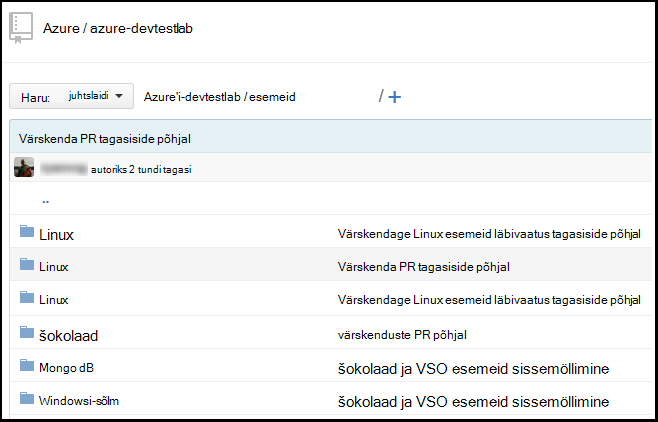

<properties
    pageTitle="Azure'i DevTest Labsissa lab Git artefakt hoidla lisamine | Microsoft Azure'i"
    description="Lisada kohandatud esemeid allikas GitHub või Visual Studio meeskonnatöö teenuste Git hoidla Azure'i DevTest Labs"
    services="devtest-lab,virtual-machines,visual-studio-online"
    documentationCenter="na"
    authors="tomarcher"
    manager="douge"
    editor=""/>

<tags
    ms.service="devtest-lab"
    ms.workload="na"
    ms.tgt_pltfrm="na"
    ms.devlang="na"
    ms.topic="article"
    ms.date="09/06/2016"
    ms.author="tarcher"/>

# Azure'i DevTest Labsissa lab Git artefakt hoidla lisamine

> [AZURE.VIDEO how-to-add-your-private-artifacts-repository-in-a-devtest-lab]

Azure'i DevTest Labs, on esemeid *toimingud* – näiteks installida tarkvara või töötava skripte ja käsud - VM loomisel. Vaikimisi sisaldab lab esemeid ametlik Azure'i DevTest Labs artefakt hoidla. Saate lisada oma lab kaasata esemeid, mis loob teie meeskond Git artefakt hoidla. Hoidla saate majutatud [github](https://github.com) või [Visual Studio meeskonnatöö teenused (VSTS)](https://visualstudio.com).

- Saate teada, kuidas luua hoidla GitHub, vt [GitHub Bootcamp](https://help.github.com/categories/bootcamp/).
- Siit saate teada, kuidas luua meeskonnatöö teenuste projekti Git hoidla, vt [ühenduse Visual Studio Team Services](https://www.visualstudio.com/get-started/setup/connect-to-visual-studio-online).

Järgmine pilt kujutab näidet hoidla, mis sisaldab esemeid GitHub ilme võib:  

## Hoidla teavet ja mandaadi hankimine

Teie lab on artefakt hoidla lisamiseks peate esmalt saada teatud teavet oma hoidla. Järgmistes jaotistes juhatavad teid artefakt hoidlate majutatud GitHub ja Visual Studio Team Services seda teavet saada.

### GitHub hoidla klooni URL- ja isiklike Accessi Turbeloa hankimine

URL-i ja isikliku juurdepääsu luba GitHub hoidla klooni saamiseks tehke järgmist.

1. Liikuge sirvides GitHub hoidla, mis sisaldab artefakt määratlused avalehele.

1. Valige **klooni või alla laadida**.

1. Valige nupp **HTTPS klooni URL-i** kopeerimine lõikelauale ja URL-i edaspidiseks kasutamiseks salvestada.

1. Valige paremas ülanurgas GitHub profiili pilt ja valige **sätted**.

1. Valige **isikliku Accessi sõned**vasakpoolses menüüs **isiklikke sätteid** .

1. Valige **Loo uus luba**.

1. Klõpsake lehel **Uus isiklik juurdepääsu luba** **Luba kirjeldus**, aktsepteerimiseks **Valige otsinguulatuste**vaikimisi üksuste ja valige **Luua Turbeloa**.

1. Salvestavad loodud luba teil hiljem vaja.

1. Nüüd saate sulgeda GitHub.   

1. [Ühenduse loomine oma lab hoidlasse artefakt](#connect-your-lab-to-the-artifact-repository) jaotis jätkata.

### Visual Studio Team Services hoidla klooni URL-i ja isikliku juurdepääsu luba hankimine

Visual Studio Team Services hoidla klooni URL- ja isiklike juurdepääsu luba saamiseks tehke järgmist.

1. Avage oma meeskonna saidikogumi Avaleht (nt `https://contoso-web-team.visualstudio.com`), ja seejärel valige artefakt projekti.

1. Valige avalehel projekti **kood**.

1. Lehel projekti **koodi** klooni URL-i vaatamiseks valige **klooni**.

1. Salvestage URL-i vajadusel hiljem sisse selles õpetuses.

1. Isikliku Accessi Turbeloa loomiseks valige rippmenüüst kasutajale konto kaudu **Minu profiil** .

1. Valige lehel profiili teabe **Turvalisus**.

1. Klõpsake vahekaarti **Turve** , valige **Lisa**.

1. **Loo isiklik juurdepääsu luba** lehte tehke järgmist.

    - Sisestage **Kirjeldus** luba.
    - Valige loendist **Aegub rakenduses** **180 päeva** .
    - Valige loendist **kontod** **puuetega inimestele juurdepääsetavate kõik kontod** .
    - Valige suvand **Kõik otsinguulatuste** .
    - Valige **Turbeloa loomine**.

1. Kui olete lõpetanud, kuvatakse uus luba **Isikliku Accessi sõned** loendis. Valige **Kopeeri Turbeloa**ja seejärel salvestage Turbeloa väärtus hilisemaks kasutamiseks.

1. [Ühenduse loomine oma lab hoidlasse artefakt](#connect-your-lab-to-the-artifact-repository) jaotis jätkata.

##Ühenduse loomine oma lab artefakt hoidlasse

1. [Azure'i portaali](http://go.microsoft.com/fwlink/p/?LinkID=525040)sisse logida.

1. Valige **Rohkem teenuseid**ja seejärel valige loendist **DevTest Labs** .

1. Labs loendist valige soovitud lab.   

1. Valige lab labale **konfigureerimine**.

1. Valige lab **konfiguratsiooni** labale **Esemeid hoidlate**.

1. Enne **Esemeid hoidlate** , valige **+ Lisa**.

    
 
1. Teine **Esemeid hoidlate** enne, määrake järgmine:

    - **Nimi** – Sisestage andmebaasi nimi.
    - **Git klooni Url** - sisestage Git HTTPS klooni URL, mis varem kopeeritud GitHub või Visual Studio Team Services. 
    - **Kausta tee** - sisestage kausta tee suhtes klooni URL, mis sisaldab teie artefakt määratlusi.
    - **Haru** - sisestage haru saada oma artefakt määratlusi.
    - **Isikliku Accessi Turbeloa** – sisestage isikliku juurdepääsu luba teil varem saadud GitHub või Visual Studio Team Services. 
     
    

1. Valige **Salvesta**.

[AZURE.INCLUDE [devtest-lab-try-it-out](../../includes/devtest-lab-try-it-out.md)]

## Seotud ajaveebipostituste
- [Puudumisel esemeid AzureDevTestLabs tõrkeotsing](http://www.visualstudiogeeks.com/blog/DevOps/How-to-troubleshoot-failing-artifacts-in-AzureDevTestLabs)
- [Liitumine VM olemasoleva AD domeeni Azure'i arendaja katselabori ARM malli kasutamine](http://www.visualstudiogeeks.com/blog/DevOps/Join-a-VM-to-existing-AD-domain-using-ARM-template-AzureDevTestLabs)