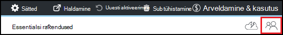

<properties
    pageTitle="Azure'i DevTest Labsissa omanikud ja kasutajate lisamine | Microsoft Azure'i"
    description="Omanike ja kasutajate lisamine Azure'i DevTest Labsissa Azure portaali või PowerShelli abil"
    services="devtest-lab,virtual-machines"
    documentationCenter="na"
    authors="tomarcher"
    manager="douge"
    editor=""/>

<tags
    ms.service="devtest-lab"
    ms.workload="na"
    ms.tgt_pltfrm="na"
    ms.devlang="na"
    ms.topic="article"
    ms.date="09/12/2016"
    ms.author="tarcher"/>

# Azure'i DevTest Labsissa omanikud ja kasutajate lisamine

> [AZURE.VIDEO how-to-set-security-in-your-devtest-lab]

Juurdepääs Azure'i DevTest Labsissa kontrollib [Azure Role-Based juurdepääsu juhtimine (RBAC)](../active-directory/role-based-access-control-what-is.md). RBAC kasutamisel võite eraldada ülesandeid oma meeskonna *rollid* , kui annate ainult summa vaja teha oma tööd kasutajate juurdepääs sisse. Kolm RBAC rollidest on *omanik*, *DevTest Labs kasutaja*ja *kaasautor*. Selles artiklis saate teada, milliseid toiminguid saate teha iga kolm peamist RBAC rolli. Sealt saate teada, lab – nii portaali kaudu ja PowerShelli skripti, kasutajate lisamine ja kasutajate lisamine tellimuse tasemel.

## Toimingud, mida saab teha iga rolli

On kolm peamist ülesannet, et saate määrata kasutaja.

- Omanik
- DevTest Labs kasutaja
- Kaasautor

Järgmine tabel näitab toimingud, mida saab teha kõigi kasutajate poolt.

| **Selle rolli toimingud kasutajad saavad teha** | **DevTest Labs kasutaja**            | **Omanik** | **Kaasautor** |
|---|---|---|---|
| **Lab tööülesanded**                          |                              |       |             |
| Kasutajate lisamine lab                     | Ei                           | Jah   | Ei          |
| Maksumus sätete värskendamine                   | Ei                           | Jah   | Jah         |
| **VM base tööülesanded**                      |                              |       |             |
| Lisamine ja eemaldamine kohandatud pilte           | Ei                           | Jah   | Jah         |
| Lisamine, värskendamine ja kustutamine valemid       | Jah                          | Jah   | Jah         |
| Piltide nimekiri Azure turuplatsiga     | Ei                           | Jah   | Jah         |
| **VM tööülesanded**                           |                              |       |             |
| VMs loomine                             | Jah                          | Jah   | Jah         |
| Alustamine, lõpetamine ja VMs kustutamine            | Ainult VMs kasutaja loodud | Jah   | Jah         |
| Värskendage VM poliitika                     | Ei                           | Jah   | Jah         |
| Andmete ketast VMs ja sealt lisamine või eemaldamine      | Ainult VMs kasutaja loodud | Jah   | Jah         |
| **Artefakt tööülesanded**                     |                              |       |             |
| Lisamine ja eemaldamine artefakt hoidlate   | Ei                           | Jah   | Jah         |
| Rakendada esemeid                        | Jah                          | Jah   | Jah         |

> [AZURE.NOTE] Kui kasutaja loob VM, sellele kasutajale määratakse automaatselt loodud VM **omanik** roll.

## Lab tasemel omanik või kasutaja lisamine

Omanikud ja kasutaja saab lisada lab tasemel Azure portaali kaudu. See hõlmab väliste kasutajate kehtiv [Microsofti konto (MSA)](devtest-lab-faq.md#what-is-a-microsoft-account).
Järgmised toimingud juhatavad teid lab Azure'i DevTest Labsissa omanik või kasutaja lisamise protsessi:

1. [Azure'i portaali](http://go.microsoft.com/fwlink/p/?LinkID=525040)sisse logida.

1. Valige **rohkem teenuseid**ja seejärel valige loendist **DevTest Labs** .

1. Labs loendist valige soovitud lab.

1. Valige lab labale **konfigureerimine**. 

1. Enne **konfiguratsiooni** , valige **Kasutajad**.

1. Enne **Kasutajad** , valige **+ Lisa**.

    

1. Enne **Valige roll,** valige soovitud roll. Jaotises [toimingud, mida saab teha iga rolli](#actions-that-can-be-performed-in-each-role) on loetletud erinevaid toiminguid, mida saab teha, mida kasutajad omanik, DevTest kasutaja ja kaasautor rollid.

1. Enne **kasutajate lisamine** , Sisestage meiliaadress ja soovite lisada määratud roll kasutaja nimi. Kui kasutaja ei leita, selgitatakse tõrketeate probleem. Kui kasutaja on kasutaja on loetletud ja valitud. 

1. **Valige**valimine

1. Valige **OK** , et sulgeda **lisamine Accessi** tera.

1. **Kasutajate** tera naastes kasutajat lisada.  

## Lab PowerShelli abil välise kasutaja lisamine

Lisaks Azure portaali kasutajate lisamine, saate lisada oma lab PowerShelli skripti abil välise kasutaja. Järgmises näites lihtsalt muutke parameetrite väärtused **väärtusi muuta** kommentaari all.
Saate tuua selle `subscriptionId`, `labResourceGroup`, ja `labName` Azure'i portaalis keelest lab väärtused.

> [AZURE.NOTE]
> Skripti näide eeldab, kas määratud kasutajal on lisatud külalisena Active Directory ja nurjub, kui see ei ole. Kasutaja lisamine pole Active Directorys lab abil Azure portaali kasutajale määrata rolli, nagu on kirjeldatud jaotises [Lisa omanik või kasutaja lab tasemel](#add-an-owner-or-user-at-the-lab-level).   

    # Add an external user in DevTest Labs user role to a lab
    # Ensure that guest users can be added to the Azure Active directory:
    # https://azure.microsoft.com/en-us/documentation/articles/active-directory-create-users/#set-guest-user-access-policies

    # Values to change
    $subscriptionId = "<Enter Azure subscription ID here>"
    $labResourceGroup = "<Enter lab's resource name here>"
    $labName = "<Enter lab name here>"
    $userDisplayName = "<Enter user's display name here>"

    # Log into your Azure account
    Login-AzureRmAccount
    
    # Select the Azure subscription that contains the lab. 
    # This step is optional if you have only one subscription.
    Select-AzureRmSubscription -SubscriptionId $subscriptionId
    
    # Retrieve the user object
    $adObject = Get-AzureRmADUser -SearchString $userDisplayName
    
    # Create the role assignment. 
    $labId = ('subscriptions/' + $subscriptionId + '/resourceGroups/' + $labResourceGroup + '/providers/Microsoft.DevTestLab/labs/' + $labName)
    New-AzureRmRoleAssignment -ObjectId $adObject.Id -RoleDefinitionName 'DevTest Labs User' -Scope $labId

## Tasemel tellimuse omanik või kasutaja lisamine

Azure'i õigused paljundatakse hulgast ema lapse ulatus Azure. Seetõttu Azure'i tellimus, mis sisaldab labs omanikud automaatselt nende labs omanikud. Need on ka ise VMs ja muud ressursid, mis on loodud lab kasutajate ja teenuse Azure DevTest Labs. 

Saate lisada täiendavad omanikud lab lab blade [Azure portaali](http://go.microsoft.com/fwlink/p/?LinkID=525040)kaudu. Siiski lisatud omanik Administreerimine on kitsam kui tellimuse omanik ulatust. Näiteks lisatud omanikud pole täielik juurdepääs mõned ressursid, mis on loodud tellimuse DevTest Labs teenuse. 

Azure'i tellimuse omaniku lisamiseks tehke järgmist.

1. [Azure'i portaali](http://go.microsoft.com/fwlink/p/?LinkID=525040)sisse logida.

1. Valige **Rohkem teenuseid**ja seejärel valige **tellimuste** loendis.

1. Valige soovitud tellimus.

1. Valige **Accessi** ikoon. 

    

1. Enne **Kasutajad** , valige **Lisa**.

    

1. **Valige roll** enne valige **omanik**.

1. Enne **kasutajate lisamine** , Sisestage lisatava omanikuna kasutaja nimi ja meiliaadress. Kui kasutaja ei leita, kuvatakse tõrketeade, mis selgitab probleemi. Kui kasutaja on leitud, kuvatakse selle kasutaja **kasutaja** tekstivälja all.

1. Valige asub kasutajanimi.

1. **Valige**valimine

1. Valige **OK** , et sulgeda **lisamine Accessi** tera.

1. **Kasutajate** tera naastes kasutaja on lisatud omanikuna. Sellele kasutajale on nüüd kõik labs loodud selle tellimuse omanik ja seega on võimalik teha omanik toiminguid. 

[AZURE.INCLUDE [devtest-lab-try-it-out](../../includes/devtest-lab-try-it-out.md)]
