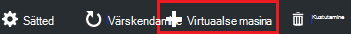
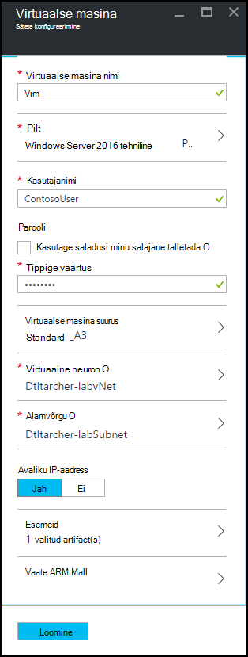
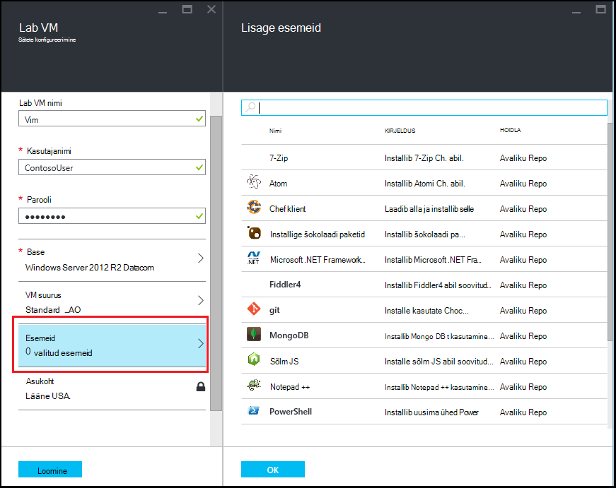
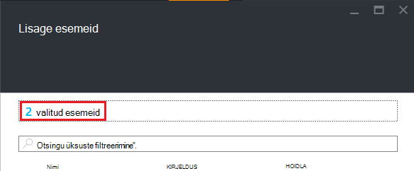

<properties
    pageTitle="Azure'i DevTest Labsissa lab koos esemeid VM lisamine | Microsoft Azure'i"
    description="Saate teada, kuidas lisada koos esemeid VM Azure DevTest Labs"
    services="devtest-lab,virtual-machines"
    documentationCenter="na"
    authors="tomarcher"
    manager="douge"
    editor=""/>

<tags
    ms.service="devtest-lab"
    ms.workload="na"
    ms.tgt_pltfrm="na"
    ms.devlang="na"
    ms.topic="article"
    ms.date="08/30/2016"
    ms.author="tarcher"/>

# Azure'i DevTest Labsissa lab koos esemeid VM lisamine

> [AZURE.VIDEO how-to-create-vms-with-artifacts-in-a-devtest-lab]

Saate luua VM lab kaudu on *alus* , mis on kas [kohandatud pilt](./devtest-lab-create-template.md), [valemit](./devtest-lab-manage-formulas.md)või [turuplatsi pilt](./devtest-lab-configure-marketplace-images.md).

DevTest Labs *esemeid* abil saate määrata *toimingud* , mis on läbi VM loomisel. 

Artefakt toiminguid saate teha, näiteks töötab Windows PowerShelli skriptide Bash käsud ja tarkvara installimise. 

Artefakt *parameetrite* abil saate kohandada kindla milline olukord teie artefakt.

Selles artiklis kirjeldatakse, kuidas luua oma lab koos esemeid VM.

## Lisage VM esemeid abil

1. [Azure'i portaali](http://go.microsoft.com/fwlink/p/?LinkID=525040)sisse logida.

1. Valige **Rohkem teenuseid**ja seejärel valige loendist **DevTest Labs** .

1. Valige loendist Labs lab, milles soovite luua VM.  

1. Valige lab **Ülevaade** labale **+ virtuaalse masina**.  
    

1. **Valige alus** enne, valige alus VM.

1. Enne **virtuaalse masina** , sisestage nimi uue virtuaalse masina **virtuaalse masina nimi** tekstiväljale.

    

1. Sisestage **Kasutaja nimi** , mis antakse virtual arvutis administraatori õigusi.  

1. Kui soovite kasutada oma *salajane poe*talletatud parooli, märkige ruut **Kasuta saladusi minu salajane poest**ja määrake võtmeväärtuse, mis vastab teie salajane (parool). Muul juhul lihtsalt sisestage parool väljale tekst väljale **Tüüp väärtus**.
 
1. Valige **virtuaalse masina suurus** ja valige üks järgmistest eelmääratletud üksused, mis määravad selle protsessori, RAM suurus ja VM loomiseks kõvaketta mahtu.

1. **Virtuaalne võrk** ja valige soovitud virtuaalse võrgu.

1. Valige **alamvõrgu** ning alamvõrgu.

1. Kui lab poliitika on seatud luba avaliku IP-aadresside valitud alamvõrku, määrake, kas soovite IP-aadress on avalik, valides kas **Jah** või **ei**. Muul juhul see suvand on keelatud ja **pole**valitud. 

1. Valige **esemeid** - ja valige loendist esemeid - ja konfigureerida esemeid, mille soovite lisada pilti. 
**Märkus:** Kui olete uus DevTest Labs või konfigureerimine esemeid, minge jaotise [lisamine olemasoleva artefakt VM](#add-an-existing-artifact-to-a-vm) ja seejärel siia tagasi, kui olete valmis.

1. Kui soovite vaadata või Azure ressursihaldur malli kopeerida, [salvestada Azure'i ressursihaldur malli](#save-arm-template) siirduge ja siia tagasi, kui olete valmis.

1. Valige **Loo** lab määratud VM lisamiseks.

1. Lab tera kuvab selle VM loomine; esmalt nimega **loomine**, siis **töötab** VM pärast käivitamist.

1. Liikuge jaotisse [Järgmised toimingud](#next-steps) . 

## Olemasoleva artefakt VM lisamine

VM loomisel saate lisada olemasolevaid esemeid. Iga lab sisaldab esemeid avaliku DevTest Labs artefakt hoidla kui ka esemeid, mille olete loonud ja oma artefakt hoidla lisatakse.
Saate teada, kuidas luua esemeid, leiate artiklist, [saate teada, kuidas Autor oma esemeid DevTest Labs kasutamiseks](devtest-lab-artifact-author.md).

1. Enne **virtuaalse masina** , valige **esemeid**. 

1. **Lisa esemeid** enne, valige soovitud artefakt.  

    

1. Sisestage nõutav parameetrite väärtused ja valikuliste parameetrite, mida vajate.  

1. Valige **Lisa** artefakt lisamine ja **Lisada esemeid** tera naasmiseks.

1. Jätkake lisamise esemeid vastavalt vajadusele oma VM jaoks.

1. Kui olete lisanud oma esemeid, saate seda teha [, kus käivitatakse esemeid järjestuse muutmine](#change-the-order-in-which-artifacts-are-run). Saate ka minge tagasi [vaadata](#view-or-modify-an-artifact)ega muuta artefakt.

## Kus käivitatakse esemeid järjestuse muutmine

Vaikimisi on esemeid täidetakse selles järjestuses, milles need lisatakse VM. Järgmised juhised selgitavad, kuidas, kus käivitatakse esemeid järjestuse muutmiseks.

1. Valige **Lisada esemeid** tera ülaosas esemeid, mis on lisatud VM arv, mis näitab, link.

    

1. Kus käivitatakse esemeid järjestuse määramiseks lohistada esemeid arvesse soovitud järjekorras. **Märkus:** Kui teil on probleeme, lohistades artefakt, veenduge, et te lohistate artefakt vasakult poolelt. 

1. Klõpsake nuppu **OK** kui valmis.  

## Saate vaadata või muuta artefakt

Järgmised juhised selgitavad, kuidas kuvada või muuta artefakt parameetrid:

1. Valige **Lisada esemeid** tera ülaosas esemeid, mis on lisatud VM arv, mis näitab, link.

    

1. **Valitud esemeid** enne, valige artefakt, mida soovite vaadata või redigeerida.  

1. Enne **Artefakt lisada** , tehke sätetes soovitud muudatused ja sulgemiseks nuppu **OK** **Lisamine artefakt** tera.

1. Valige **OK** , et sulgeda **Valitud esemeid** tera.

## Azure'i ressursihaldur malli salvestamine

Mõni Azure ressursihaldur Mall võimaldab määratleda korratavad juurutamise deklaratiivseid. Järgmised juhised selgitavad on loodud VM Azure ressursihaldur malli salvestamiseks.
Kui salvestanud, saate kasutada Azure ressursihaldur malli juurutada [uue VMs Azure'i PowerShelli abil](../azure-resource-manager/resource-group-overview.md#template-deployment).

1. Enne **virtuaalse masina** , valige **Kuva ARM Mall**.

1. Valige **vaate Azure'i ressursihaldur malli blade**malli teksti.

1. Valitud teksti kopeerimine lõikelauale.

1. Valige **OK** , et sulgeda **View Azure'i ressursihaldur malli tera**.

1. Avage tekstiredaktor.

1. Malli teksti lõikelaualt kleepida.

1. Salvestage fail hilisemaks kasutamiseks.

[AZURE.INCLUDE [devtest-lab-try-it-out](../../includes/devtest-lab-try-it-out.md)]

## Järgmised sammud

- Kui VM on loodud, saate luua ühenduse VM, valides soovitud VM tera **ühendus** .
- Siit saate teada, kuidas [luua kohandatud esemeid oma DevTest Labs VM jaoks](devtest-lab-artifact-author.md).
- Tutvumine [DevTest Labs ARM Kiirjuhend malli Galerii](https://github.com/Azure/azure-devtestlab/tree/master/ARMTemplates)