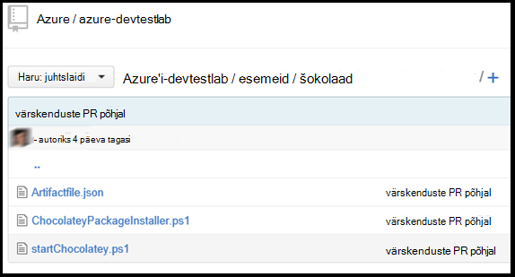

<properties 
    pageTitle="Luua kohandatud esemeid oma DevTest Labs VM | Microsoft Azure'i"
    description="Siit saate teada, kuidas Autor oma esemeid DevTest Labs kasutamiseks"
    services="devtest-lab,virtual-machines"
    documentationCenter="na"
    authors="tomarcher"
    manager="douge"
    editor=""/>

<tags
    ms.service="devtest-lab"
    ms.workload="na"
    ms.tgt_pltfrm="na"
    ms.devlang="na"
    ms.topic="article"
    ms.date="08/25/2016"
    ms.author="tarcher"/>

#Luua kohandatud esemeid oma DevTest Labs VM

> [AZURE.VIDEO how-to-author-custom-artifacts] 

## Ülevaade
**Esemeid** kasutatakse juurutada ja konfigureerida rakenduse pärast VM on ette valmistatud. Artefakt koosneb on artefakt definitsioonifail ja muude skripti faile, mis on talletatud git hoidla kausta. Artefakt määratlus failid koosnevad JSON ja avaldised, mille abil saate määrata, mida soovite installida VM. Näiteks saate määratleda artefakt, käsk ja parameetrid, mis tehakse kättesaadavaks käsu käitamisel nime. Saate viidata muude skripti failide artefakt määratluse faili nime järgi.

##Artefakt määratlus failivorming
Järgmises näites on kujutatud jaotised, mis moodustavad määratluse faili põhistruktuur.

    {
      "$schema": "https://raw.githubusercontent.com/Azure/azure-devtestlab/master/schemas/2015-01-01/dtlArtifacts.json",
      "title": "",
      "description": "",
      "iconUri": "",
      "targetOsType": "",
      "parameters": {
        "<parameterName>": {
          "type": "",
          "displayName": "",
          "description": ""
        }
      },
      "runCommand": {
        "commandToExecute": ""
      }
    }

| Elemendi nime | See on nõutav? | Kirjeldus
| ------------ | --------- | -----------
| $schema      | Ei        | JSON skeemifaili, mis aitab testimine kehtivust määratluse faili asukoht.
| pealkiri        | Jah       | Nimi kuvatakse lab artefakt.
| kirjeldus  | Jah       | Kirjeldus kuvatakse lab artefakt.
| iconUri      | Ei        | URI lab kuvatakse ikooni.
| targetOsType | Jah       | Kuhu on installitud artefakt VM operatsioonisüsteem. Toetatud suvandid on: Windows ja Linux.
| parameetrid   | Ei        | Väärtused, mis on esitatud artefakt installi käsu käitamisel arvutisse. See aitab teie artefakt kohandamine.
| Käivita_käsk   | Jah       | Artefakt installimine käsk, mis on täide VM.

###Artefakt parameetrid

Parameetrite osas määratluse faili, saate määrata, milliseid väärtusi kasutaja saab sisestada artefakt installimisel. Viidata saate need väärtused artefakt käsk installi.

Määratlege parameetrid on järgmine struktuur.

    "parameters": {
        "<parameterName>": {
          "type": "<type-of-parameter-value>",
          "displayName": "<display-name-of-parameter>",
          "description": "<description-of-parameter>"
        }
      }

| Elemendi nime | See on nõutav? | Kirjeldus
| ------------ | --------- | -----------
| tüüp         | Jah       | Parameetri väärtuse tüüp. Siit leiate loendi all lubatud tüüpi:
| displayName Jah       | Parameetri lab kasutajale kuvatav nimi.
| kirjeldus  | Jah       | Parameeter, mis kuvatakse lab kirjeldus.

Lubatud on:

- stringi – mis tahes kehtiv JSON string
- int – mis tahes sobiv JSON täisarv
- bool – mis tahes kehtiv JSON kahendmuutujaga
- massiiv – mis tahes kehtiv JSON

##Artefakt avaldiste ja funktsioonide

Saate kasutada avaldist ja funktsioonide ehitada artefakt installimine käsk.
Avaldised on lisatud nurksulud ([ja]), ja analüüsitakse artefakt installimisel. Avaldiste saate kuvada igal pool JSON stringiväärtus ja alati tagastusväärtus teise JSON. Kui peate kasutama sõnasõnaline string, mis algab sulu [, kasutage kahe sulgudes [[.
Tavaliselt kasutatakse avaldiste koos funktsioonidega ehitada väärtus. Nii nagu JavaScript, funktsioon kõnede vormindatud functionName(arg1,arg2,arg3)

Järgmises loendis on esitatud levinud funktsioonid.

- parameters(parameterName) – tagastab parameetri väärtuse, mis on esitatud artefakt käsu käitamisel.
- concat (arg1 arg2, arg3,...) - ühendab mitu stringi väärtuse. See funktsioon võib kuluda mõni argumentide arv.

Järgmises näites on kujutatud ehitada väärtus avaldis ja funktsioonide kasutamise kohta.

    runCommand": {
         "commandToExecute": "[concat('powershell.exe -File startChocolatey.ps1'
    , ' -RawPackagesList ', parameters('packages')
    , ' -Username ', parameters('installUsername')
    , ' -Password ', parameters('installPassword'))]"
    }

##Luua kohandatud artefakt

Looge oma kohandatud artefakt järgides juhiseid allpool.

1. Installige JSON-redaktor - peate JSON-redaktor artefakt määratlus failidega töötamiseks. Soovitame kasutada [Visual Studio kood](https://code.visualstudio.com/), mis on saadaval Windows, Linux ja OS X.

1. Saada valimi artifactfile.json - väljamöllimise esemeid loodud Azure'i DevTest Labs meeskonnaga meie [GitHub hoidla](https://github.com/Azure/azure-devtestlab) , kus oleme loonud rikkaliku teegi esemeid, mis aitavad teil luua oma esemeid. Artefakt määratluse faili ja muuta seda, et luua oma esemeid.

1. IntelliSense – võimendada IntelliSense'i kehtiv elemendid, mida saab kasutada ka artefakt definitsioonifail ehitada kuvamiseks kasutada. Näete elemendi väärtuste erinevaid võimalusi. Näiteks IntelliSense'i näitab teile kaks valikut Windowsi või Linuxi **targetOsType** elemendi redigeerimisel.

1. Talletada artefakt git hoidla
    1. Luua eraldi kataloog iga artefakt, kus kataloogi nimi on sama mis artefakt nimi.
    1. Talletage loodud kataloogis artefakt definitsioonifail (artifactfile.json).
    1. Talletage skriptide viidatud artefakt käsk installi.

    Siin on näide mõne artefakt kausta ilme võib:

    

1. Lisage esemeid hoidla lab – lugege artiklit, [Lisa Git artefakt hoidla lab](devtest-lab-add-artifact-repo.md).

[AZURE.INCLUDE [devtest-lab-try-it-out](../../includes/devtest-lab-try-it-out.md)]

## Seotud ajaveebipostituste
- [Puudumisel esemeid AzureDevTestLabs tõrkeotsing](http://www.visualstudiogeeks.com/blog/DevOps/How-to-troubleshoot-failing-artifacts-in-AzureDevTestLabs)
- [Liitumine VM olemasoleva AD domeeni Azure'i arendaja katselabori ARM malli kasutamine](http://www.visualstudiogeeks.com/blog/DevOps/Join-a-VM-to-existing-AD-domain-using-ARM-template-AzureDevTestLabs)

## Järgmised sammud

- Siit saate teada, kuidas [lisada Git artefakt hoidla lab](devtest-lab-add-artifact-repo.md).
