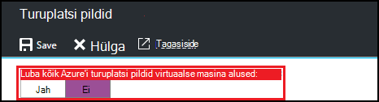
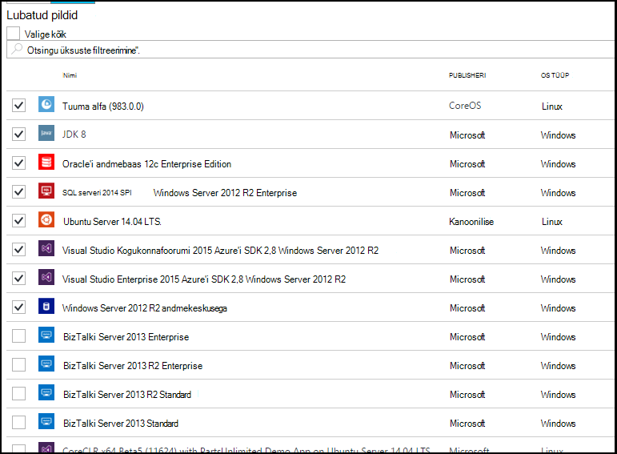

<properties
    pageTitle="Azure'i turuplatsi pildi sätete konfigureerimiseks Azure'i DevTest Labs | Microsoft Azure'i"
    description="Azure'i turuplatsi pilte saate kasutada, kui loote VM Azure'i DevTest Labsissa konfigureerimine"
    services="devtest-lab,virtual-machines"
    documentationCenter="na"
    authors="tomarcher"
    manager="douge"
    editor=""/>

<tags
    ms.service="devtest-lab"
    ms.workload="na"
    ms.tgt_pltfrm="na"
    ms.devlang="na"
    ms.topic="article"
    ms.date="09/06/2016"
    ms.author="tarcher"/>

# Azure'i DevTest Labsissa Azure'i turuplatsi pildi sätete konfigureerimine

DevTest Labs toetab loomise VMs põhjal Azure'i turuplatsi piltide sõltuvalt sellest, kuidas olete konfigureerinud Azure'i turuplatsi pilte kasutada oma lab. Selles artiklis kirjeldatakse, kuidas saate määrata, millised, Azure'i turuplatsi pilte saab kasutada, kui loote VMs Lab.

## Valige, millised Azure'i turuplatsi pildid on lubatud VM loomisel

1. [Azure'i portaali](http://go.microsoft.com/fwlink/p/?LinkID=525040)sisse logida.

1. Valige **Rohkem teenuseid**ja seejärel valige loendist **DevTest Labs** .

1. Labs loendist valige soovitud lab. 

1. Valige lab labale **konfigureerimine**.
    
1. Valige lab **konfiguratsiooni** labale **turuplatsi pildid**

1. Määrake, kas soovite kõik kvalifitseeritud Azure'i turuplatsi pildid uue VM alusena kasutada. Kui valite **Jah**, siis kõik vastate järgmistele kriteeriumitele Azure'i turuplatsi pildid on lubatud lab:

    - Pildi loob ühe VM, **ja**
    - Pilt kasutab Azure ressursihaldur VMs **ja** ettevalmistamine
    - Pilt ei nõua kuvatakse hulgilitsentsimise lisatööd lepingu ostmist
    
    Kui soovite lubada pole pilte või soovite määrata, millised pildid saab kasutada, valige **ei**.
 
    
 
1. Kui te **pole** eelmist toimingut, **Lubatud pildid ja valige kõik** ruut on lubatud. Saate selle suvandi koos otsinguvälja kiiresti märkige või tühjendage ruut kõik loendis kuvatavate üksuste.
Samuti võite märkida ruudu Azure'i turuplatsi pilte soovite lubada VM loomise eraldi, märkides ruudu iga kujutist vastav ruut.
Valige midagi loendist, kui te ei soovi lubada Azure'i turuplatsi pilte kasutada lab.

    

[AZURE.INCLUDE [devtest-lab-try-it-out](../../includes/devtest-lab-try-it-out.md)]

## Järgmised sammud

Kui olete konfigureerinud kuidas Azure'i turuplatsi pildid on lubatud, kui loote VM, on järgmiseks [lisada oma lab VM](./devtest-lab-add-vm-with-artifacts.md).