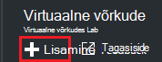
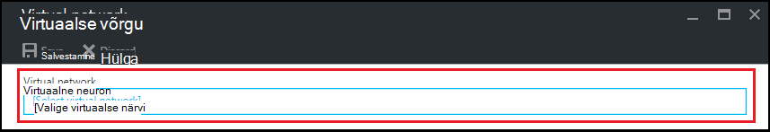
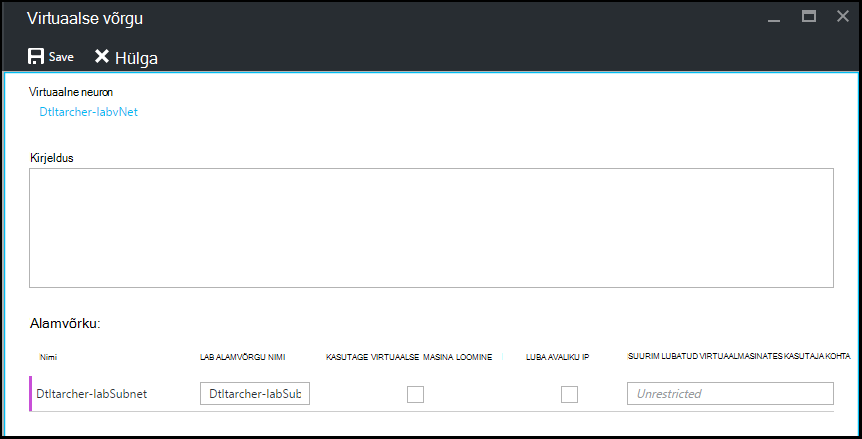

<properties
    pageTitle="Azure'i DevTest Labsissa virtuaalse võrgu konfigureerimine | Microsoft Azure'i"
    description="Saate teada, kuidas konfigureerida mõne olemasoleva virtuaalse võrgu ja alamvõrgu ja VM Azure DevTest Labs kasutamine"
    services="devtest-lab,virtual-machines"
    documentationCenter="na"
    authors="tomarcher"
    manager="douge"
    editor=""/>

<tags
    ms.service="devtest-lab"
    ms.workload="na"
    ms.tgt_pltfrm="na"
    ms.devlang="na"
    ms.topic="article"
    ms.date="09/06/2016"
    ms.author="tarcher"/>

# Azure'i DevTest Labsissa virtuaalse võrgu konfigureerimine

Nagu on selgitatud artikli, [Lisa koos esemeid lab VM](devtest-lab-add-vm-with-artifacts.md), kui loote VM laboris, saate määrata konfigureeritud virtuaalse võrgu. Üks stsenaarium selleks on, kui peate juurde pääseda oma VMs konfigureeritud ExpressRoute või VPN saidilt virtuaalse võrgu kaudu oma corpnet ressursse. Järgmistes jaotistes selgitavad, kuidas lisada olemasoleva virtuaalse võrgu on lab virtuaalse võrgu sätteid nii, et see on saadaval VMs loomisel valida.

## Virtuaalse võrgu jaoks Azure'i portaalis lab konfigureerimine
Järgmised toimingud sõelub lisada mõne olemasoleva virtuaalse võrgu (ja alamvõrgu) lab nii, et seda saab kasutada samasse VM loomisel. 

1. [Azure'i portaali](http://go.microsoft.com/fwlink/p/?LinkID=525040)sisse logida.

1. Valige **Rohkem teenuseid**ja seejärel valige loendist **DevTest Labs** .

1. Labs loendist valige soovitud lab. 

1. Valige lab labale **konfigureerimine**.

1. Valige lab **konfiguratsiooni** tera, **virtuaalne võrkude**.

1. **Virtuaalne võrkude** enne, kuvatakse loendi virtuaalse võrgu praegune lab kui ka teie lab luuakse vaikimisi virtuaalse võrgu jaoks konfigureeritud. 

1. Valige **+ Lisa**.

    
    
1. Enne **Virtual võrgu** , valige **[valige virtuaalse võrgu]**.

    
    
1. Enne **virtuaalse võrgu valimine** , valige soovitud virtuaalse võrgu. Tera kuvatakse kõik virtuaalse võrgud, mis on sama piirkonna tellimuse nimega lab jaotises.  

1. Pärast valiku virtuaalse võrk, naasete **Virtual võrgu** tera ja mitu välja on lubatud.  

    

1. Määrake virtuaalse võrgu kirjeldus / lab kombinatsioon.

1. Alamvõrku, kasutatakse lab VM loomise lubamiseks valige **Kasuta tolli VIRTUAALSE masina loomine**.

1. Lubada avaliku IP-aadresside lisamine alamvõrku, valige **Luba avaliku IP**.

1. Määrake väljal **Maksimaalne VIRTUAALMASINATES kasutaja kohta** , kuni VMs kasutaja kohta, iga alamvõrgu. Kui soovite mõne VMs arvule, jätke see väli tühjaks.

1. Valige **Salvesta**.

1. Nüüd, kui virtuaalse võrgu on konfigureeritud, saate valida VM koostamisel. Et näha, kuidas luua VM ja määrata virtuaalse võrgu, lugege artiklit, [lisamine koos esemeid lab VM](devtest-lab-add-vm-with-artifacts.md). 

[AZURE.INCLUDE [devtest-lab-try-it-out](../../includes/devtest-lab-try-it-out.md)]

## Järgmised sammud

Kui olete lisanud oma lab soovitud virtuaalse võrgu, on järgmiseks [lisada oma lab VM](devtest-lab-add-vm-with-artifacts.md).