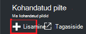

<properties
    pageTitle="Azure'i DevTest Labs kohandatud pilte luua VMs haldamine | Microsoft Azure'i"
    description="Saate teada, kuidas luua kohandatud pildi VHD faili või mõne olemasoleva VM Azure DevTest Labsissa"
    services="devtest-lab,virtual-machines"
    documentationCenter="na"
    authors="tomarcher"
    manager="douge"
    editor=""/>

<tags
    ms.service="devtest-lab"
    ms.workload="na"
    ms.tgt_pltfrm="na"
    ms.devlang="na"
    ms.topic="article"
    ms.date="09/07/2016"
    ms.author="tarcher"/>

# Azure'i DevTest Labs kohandatud pilte luua VMs haldamine

Azure'i DevTest Labsissa, kohandatud pilte võimaldavad teil luua VMs kiiresti kõik vajalik tarkvara installimiseks sihtarvutis ootamata. Kohandatud pilte võimaldavad eelnevalt installida tarkvara, mida teil on vaja VHD faili ja luua VM VHD faili abil. Kuna tarkvara on juba installitud, on palju kiirem VM loomise ajal. Lisaks kohandatud pilte kasutatakse klooni VMs, luua kohandatud pildi VM ja seejärel luua VMs, et kohandatud pilt.

Sellest artiklist saate teada, kuidas:

- [Loo kohandatud pilt failist VHD](#create-a-custom-image-from-a-vhd-file) nii, et te saate luua VM, et kohandatud pilt. 
- [Loo kohandatud pilt: VM](#create-a-custom-image-from-a-vm) kloonimiseks kiire VM.

## Luua kohandatud pilt failist VHD

Selles jaotises näete, kuidas luua kohandatud pilt failist VHD.
Teil on vaja juurdepääsu toimingute kõik selle jaotise sobiv VHD fail.   

1. [Azure'i portaali](http://go.microsoft.com/fwlink/p/?LinkID=525040)sisse logida.

1. Valige **rohkem teenuseid**ja seejärel valige loendist **DevTest Labs** .

1. Labs loendist valige soovitud lab.  

1. Valige lab labale **konfigureerimine**. 

1. Enne lab **konfiguratsiooni** , valige **kohandatud pilte**.

1. Enne **kohandatud pilte** , valige **+ kohandatud pildi**.

    

1. Sisestage soovitud nimi kohandatud pildi. See nimi kuvatakse loendis alus piltide loomisel VM.

1. Sisestage kohandatud pildi kirjeldus. See kirjeldus kuvatakse loendis alus piltide VM loomisel.

1. Valige **VHD faili**.

1. Kui teil on juurdepääs VHD faili, mida pole loendis, lisage see järgides juhiseid jaotises [VHD faili üleslaadimine](#upload-a-vhd-file) ja siia tagasi, kui olete valmis.

1. Valige soovitud VHD fail.

1. Valige **OK** , et sulgeda **VHD faili** tera.

1. Valige **OS konfigureerimine**.

1. Valige vahekaardil **OS konfiguratsiooni** **Windows** või **Linux**.

1. Kui **Windows** on valitud, määrake kaudu ruut kas *Sysprep* käivitamist arvutis.

1. Valige **OK** , et sulgeda **OS konfiguratsiooni** tera.

1. Valige **OK** , et luua kohandatud pildi.

1. Liikuge jaotisse [Järgmised toimingud](#next-steps) .

###VHD faili üleslaadimine

Kohandatud pildi lisamiseks peate olema juurdepääs VHD faili.

1. Enne **VHD faili** , valige **faili üles laadimine VHD PowerShelli kaudu**.

    

1. Järgmise tera kuvatakse juhiseid muutmine ja käitamise PowerShelli skripti, et lisatud Azure tellimuse VHD faili. 
**Märkus:** See protsess võib olla pikk VHD faili ja teie ühenduskiirust suurusest.

## Luua kohandatud pildi VM
Kui teil on juba konfigureeritud VM, saate luua kohandatud pildi selle VM ja hiljem teiste identse VMs loomiseks kasutada seda kohandatud pildi. Järgnevalt kirjeldatakse, kuidas luua kohandatud pildi VM:

1. [Azure'i portaali](http://go.microsoft.com/fwlink/p/?LinkID=525040)sisse logida.

1. Valige **rohkem teenuseid**ja seejärel valige loendist **DevTest Labs** .

1. Labs loendist valige soovitud lab.  

1. Valige **minu virtuaalmasinates**lab labale.
 
1. Valige **minu virtuaalmasinates** enne, VM, millest soovite luua kohandatud pilt.

1. Valige soovitud VM tera, **Loo kohandatud pilt (VHD)**.

    

1. Enne **loomine pilt** , sisestage nimi ja kirjeldus teie kohandatud pildi. See teave kuvatakse loendis aluste VM loomisel.

    

1. Valige, kas sysprep töötasid VM. Kui sysprep oli VM ei tööta, määrake, kas soovite sysprep käivitamine VM loomisel selle kohandatud pildi.

1. Klõpsake nuppu **OK** lõpetades luua kohandatud pilt.

[AZURE.INCLUDE [devtest-lab-try-it-out](../../includes/devtest-lab-try-it-out.md)]

## Seotud ajaveebipostituste

- [Kohandatud pilte või valemite?](https://blogs.msdn.microsoft.com/devtestlab/2016/04/06/custom-images-or-formulas/)
- [Azure'i DevTest Labs vahel kohandatud piltide kopeerimine](http://www.visualstudiogeeks.com/blog/DevOps/How-To-Move-CustomImages-VHD-Between-AzureDevTestLabs#copying-custom-images-between-azure-devtest-labs)

##Järgmised sammud

Kui olete lisanud kohandatud pildi kasutamiseks VM loomisel, on järgmiseks [lisada oma lab VM](./devtest-lab-add-vm-with-artifacts.md).