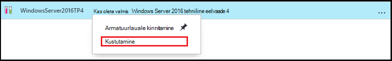

<properties
    pageTitle="Azure'i DevTest Labs luua VMs valemite haldamine | Microsoft Azure'i"
    description="Siit saate teada, kuidas luua, värskendada, ja eemaldada Azure'i DevTest Labs valemeid ja nende abil saate luua uue VMs."
    services="devtest-lab,virtual-machines"
    documentationCenter="na"
    authors="tomarcher"
    manager="douge"
    editor=""/>

<tags
    ms.service="devtest-lab"
    ms.workload="na"
    ms.tgt_pltfrm="na"
    ms.devlang="na"
    ms.topic="article"
    ms.date="08/30/2016"
    ms.author="tarcher"/>

# DevTest Labs valemeid luua VMs haldamine

Azure'i DevTest Labs valem on atribuut vaikeväärtuste saab luua virtuaalse masina (VM) loend. VM: valemi loomisel vaikeväärtused saab kasutada-on või muudetud. Nagu [kohandatud pilte](./devtest-lab-create-template.md) ja [turuplatsi pildid](./devtest-lab-configure-marketplace-images.md), valemid pakuvad kiiresti VM ettevalmistamise süsteem.  

Sellest artiklist saate teada, kuidas teha järgmisi toiminguid:

- [Valemi loomine](#create-a-formula)
- [Valemi kasutamine VM ettevalmistamine](#use-a-formula-to-provision-a-vm)
- [Valemi muutmine](#modify-a-formula)
- [Valemi kustutamine](#delete-a-formula)

> [AZURE.NOTE] Valemite – näiteks [kohandatud pilte](./devtest-lab-create-template.md) - võimaldavad teil luua alus pilt failist VHD. Pilti saab kasutada siis ettevalmistamise uute VM. Selleks, et otsustada, mis sobib teie keskkonnas, lugege artiklit, [võrdlemine kohandatud pilte ja valemite DevTest Labsissa](./devtest-lab-comparing-vm-base-image-types.md).

## Valemi loomine
Kõik, kellel on DevTest Labs *kasutajate* õiguste on võimalik luua VMs aluseks valemi abil. On kaks võimalust luua valemeid. 

- Kui soovite valemi omaduste määratlemiseks kasutada kaudu põhi.
- Olemasoleva laborist VM - põhjal, kui soovite valemi loomine mõne olemasoleva VM sätted.

### Valemi loomine alus:
Järgmised toimingud juhatavad teid kohandatud pilt, turuplatsi pilt või muu valem valemi loomisel.

1. [Azure'i portaali](http://go.microsoft.com/fwlink/p/?LinkID=525040)sisse logida.

1. Valige **Rohkem teenuseid**ja seejärel valige loendist **DevTest Labs** .

1. Labs loendist valige soovitud lab.  

1. Valige lab tera, **valemid (korduvkasutatava alused)**.

    

1. Enne **Lab valemeid** , valige **+ Lisa**.

    

1. **Valige alus** enne, valige base (kohandatud pildi, turuplatsi pilt või valemi), millest soovite valemi loomiseks.

    

1. Enne **loomine valemi** , määrake järgmised väärtused:

    - **Valemi nimi** - Sisestage soovitud valem nimi. See väärtus kuvatakse loendis alus piltide VM loomisel. Nimi on kinnitatud, kui sisestate seda ja kui ei sobi, näitab sõnumi nõuded sobiv nimi.
    - **Kirjeldus** – Sisestage soovitud valem tähendusrikas kirjeldus. See väärtus on saadaval kontekstimenüüs valemi loomisel VM.
    - **Kasutajanimi** - Sisestage kasutaja nimi, mida administraatoriõigused.
    - **Parool** - sisestage - või valige rippmenüüst - väärtus, mis on seotud salajane (parool), mida soovite kasutada määratud kasutajale.  
    - **Pilt** - väli kuvatakse teie valitud pilti nimi eelmise enne. 
    - **Virtuaalse masina suurus** – eelmääratletud üksused, mis määravad selle protsessori, RAM suurus ja kõvaketta mahtu VM loomiseks valige üks.
    - **Virtuaalne võrgu** - määrake soovitud virtuaalse võrgu.
    - **Alamvõrgu** - määrake soovitud alamvõrgu.
    - **Avaliku IP-aadressi** - kui lab poliitika on seatud luba avaliku IP-aadresside valitud alamvõrku, määrata, kas soovite IP-aadress on avalik, valides kas **Jah** või **ei**. Muul juhul see suvand on keelatud ja **pole**valitud.
    - **Esemeid** – valige ja konfigureerida esemeid, mida soovite pilti lisada. Turvaline string väärtused ei salvestata valemiga. Seetõttu ei kuvata turvaline stringide artefakt parameetritest. 

        

1. Valige **Loo** valemi loomiseks.

### VM: valemi loomine
Järgmised toimingud juhatavad teid mõne olemasoleva VM põhineva valemi loomine. 

> [AZURE.NOTE] Valemi loomiseks kaudu VM VM peavad olema loodud pärast 30 märts 2016. 

1. [Azure'i portaali](http://go.microsoft.com/fwlink/p/?LinkID=525040)sisse logida.

1. Valige **Rohkem teenuseid**ja seejärel valige loendist **DevTest Labs** .

1. Labs loendist valige soovitud lab.  

1. Valige lab **Ülevaade** labale, millest soovite luua valemi VM.

    

1. Valige soovitud VM labale **valemi (korduvkasutatava alus) loomine**.

    

1. Enne **loomine valemit** , sisestage **nimi** ja **Kirjeldus** uue valemi.

    

1. Valige **OK** , et luua valem.

## Valemi kasutamine VM ettevalmistamine
Kui olete loonud valemit, saate luua selle valem VM. Jaotise [lisamine koos esemeid VM](devtest-lab-add-vm-with-artifacts.md#add-a-vm-with-artifacts) juhatab teid läbi protsessi.

## Valemi muutmine
Valemi muutmiseks tehke järgmist.

1. [Azure'i portaali](http://go.microsoft.com/fwlink/p/?LinkID=525040)sisse logida.

1. Valige **Rohkem teenuseid**ja seejärel valige loendist **DevTest Labs** .

1. Labs loendist valige soovitud lab.  

1. Valige lab tera, **valemid (korduvkasutatava alused)**.

    

1. Valige enne **Lab valemid** , valem, mida soovite muuta.

1. Enne **valemi värskendada** , tehke soovitud muudatused ja valige **Värskenda**.

## Valemi kustutamine 
Valemi kustutamiseks tehke järgmist.

1. [Azure'i portaali](http://go.microsoft.com/fwlink/p/?LinkID=525040)sisse logida.

1. Valige **Rohkem teenuseid**ja seejärel valige loendist **DevTest Labs** .

1. Labs loendist valige soovitud lab.  

1. Enne lab **sätted** , valige **valemid**.

    

1. Enne **Lab valemeid** , valige kolmikpunkt paremas servas valem, mida soovite kustutada.

    

1. Valemi kontekstimenüü kaudu, valige **Kustuta**.

    

1. Valige **Jah** , kustutamise kinnitamise dialoogiboks.

[AZURE.INCLUDE [devtest-lab-try-it-out](../../includes/devtest-lab-try-it-out.md)]

## Seotud ajaveebipostituste

- [Kohandatud pilte või valemite?](https://blogs.msdn.microsoft.com/devtestlab/2016/04/06/custom-images-or-formulas/)

## Järgmised sammud
Kui olete loonud kasutamiseks valemi loomisel VM, on järgmiseks [lisada oma lab VM](./devtest-lab-add-vm-with-artifacts.md).