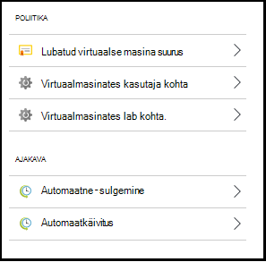
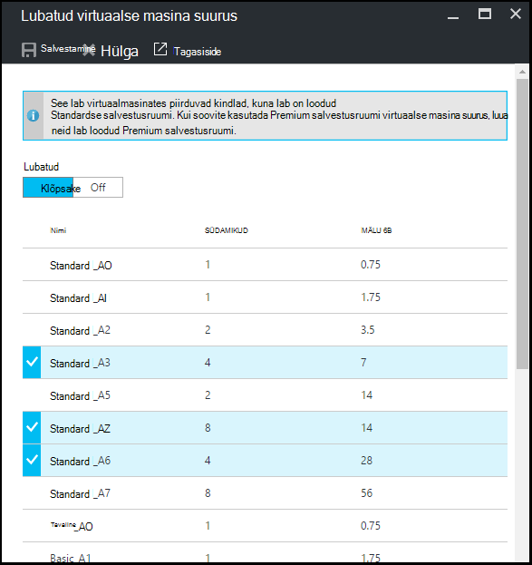
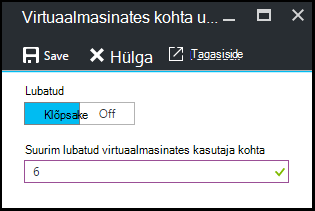
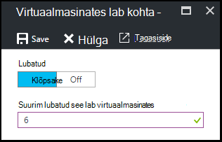
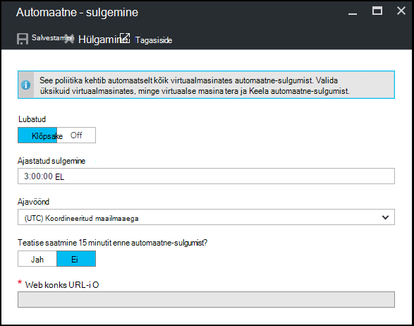
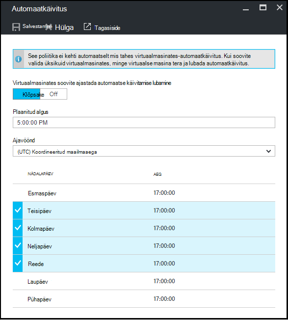

<properties
    pageTitle="Azure'i DevTest Labsissa lab määratlemiseks | Microsoft Azure'i"
    description="Saate teada, kuidas määratlemiseks lab näiteks VM suurused, kuni VMs kohta kasutaja ja sulgumist automatiseerimine."
    services="devtest-lab,virtual-machines"
    documentationCenter="na"
    authors="tomarcher"
    manager="douge"
    editor=""/>

<tags
    ms.service="devtest-lab"
    ms.workload="na"
    ms.tgt_pltfrm="na"
    ms.devlang="na"
    ms.topic="article"
    ms.date="09/12/2016"
    ms.author="tarcher"/>

# Azure'i DevTest Labs lab poliitikate määratlemine

> [AZURE.VIDEO how-to-set-vm-policies-in-a-devtest-lab]

Azure'i DevTest Labs võimaldab teil määrata klahv poliitikad, mille abil saate määrata kulu ja minimeerimine oma labs suhtes. Need poliitikad lab kaasata VMs loodud kasutaja kohta lab ja automaatne-Sule ja automaatkäivitus Valikud maksimaalne arv. 

## Juurdepääs on lab poliitikate Azure'i DevTest Labs

Järgmised juhised aitavad teil poliitikate jaoks lab Azure'i DevTest Labsissa häälestamiseks:

Vaatamiseks (ja muuta) poliitikate jaoks lab, toimige järgmiselt.

1. [Azure'i portaali](http://go.microsoft.com/fwlink/p/?LinkID=525040)sisse logida.

1. Valige **rohkem teenuseid**ja seejärel valige loendist **DevTest Labs** .

1. Labs loendist valige soovitud lab.   

1. Valige **sätted**.

1. **Poliitikasätted** tera sisaldab menüü sätted, mida saate määrata. 

    

    Poliitika määramise kohta lisateabe saamiseks valige järgmisest loendist.

    - [Lubatud virtuaalse masina suurused](#set-allowed-virtual-machine-sizes) - valige loendist VM suuruses lubatud Lab. Kasutaja saab luua VMs ainult selles loendis.

    - [Kasutaja kohta virtuaalmasinates](#set-virtual-machines-per-user) - määrata kasutaja loodud VMs maksimaalne arv. 

    - [Virtuaalmasinates kohta lab](#set-virtual-machines-per-lab) - määrata VMs lab jaoks loodud maksimaalne arv. 

    - [Automaatne – sulgumist](#set-auto-shutdown) - Määrake kui praegune lab kasutaja VMs automaatselt sulgeda.

    - [Automaatkäivitus](#set-auto-start) - Määrake kui praegune lab VMs automaatselt käivitada.

## Lubatud virtuaalse masina suurused määramine

Poliitika häälestuse lubatud VM suurused aitab, võimaldades teil määrata, millised VM on lubatud lab lab jäätmete minimeerimiseks. Kui see poliitika on aktiveeritud, saab luua VMs ainult VM suurused sellest loendist.

1. Valige lab **poliitikasätted** labale **lubatud virtuaalmasinates suurused**.

    
 
1. Valige, **klõpsake** selle poliitika lubamiseks ja **välja** lülitada.

1. Kui lubate selle poliitika, valige üks või mitu saab luua oma lab VM suurused.

1. Valige **Salvesta**.

## Seadmine virtuaalmasinates kasutaja kohta

Poliitika **virtuaalmasinates iga kasutaja** jaoks võimaldab teil määrata individuaalse kasutaja loodud VMs maksimaalne arv. Kui kasutaja üritab luua VM, kui kasutaja limiit on täidetud, kuvatakse tõrketeade näitab VM ei saa luua. 

1. Valige lab **poliitikasätted** labale **virtuaalmasinates kasutaja kohta**.

    

1. Valige, **klõpsake** selle poliitika lubamiseks ja **välja** lülitada.

1. Kui lubate selle poliitika, sisestage arvulise väärtuse, mis näitab kasutaja loodud VMs maksimaalne arv. Kui sisestate arvu, mis ei sobi, UI kuvatakse selle välja jaoks lubatud maksimum.

1. Valige **Salvesta**.

## Seadmine virtuaalmasinates lab kohta.

Poliitika **kohta lab virtuaalmasinates** abil saab määrata praeguse lab loodud VMs maksimaalne arv. Kui kasutaja üritab luua VM, siis lab limiit on täidetud, kuvatakse tõrketeade näitab VM ei saa luua. 

1. Valige lab **poliitikasätted** labale **virtuaalmasinates lab kohta**.

    

1. Valige, **klõpsake** selle poliitika lubamiseks ja **välja** lülitada.

1. Kui lubate selle poliitika, sisestage arvulise väärtuse, mis näitab praeguse lab loodud VMs maksimaalne arv. Kui sisestate arvu, mis ei sobi, UI kuvatakse selle välja jaoks lubatud maksimum.

1. Valige **Salvesta**.

## Automaatne – sulgumist määramine

Automaatne – sulgumist poliitika aitab vähendada lab jäätmete, võimaldades teil määrata aeg, et see lab VMs sulgeda.

1. Valige lab **poliitikasätted** labale **Automaatne-sulgumist**.

    

1. Valige, **klõpsake** selle poliitika lubamiseks ja **välja** lülitada.

1. Kui lubate selle poliitika, määrata kohalikku aega sulgeda kõik VMs praeguse Lab.

1. Valige **Salvesta**.

1. Vaikimisi, kui lubatud, see poliitika kehtib kõik VMs praeguse Lab. Teatud VM selle sätte eemaldamiseks avage soovitud VM blade ja **Automaatne-sulgumist** selle sätte muutmine 

## Seadmine automaatkäivitus

Automaatkäivitus poliitika võimaldab teil määrata, kui praegune lab VMs alustada.  

1. Valige lab **poliitikasätted** labale **- automaatkäivitus**.

    

1. Valige, **klõpsake** selle poliitika lubamiseks ja **välja** lülitada.

1. Kui lubate selle poliitika, määrake kohalikus ajastatud algusaeg ja nädalapäevad, mille kehtib aeg. 

1. Valige **Salvesta**.

1. Kui lubatud, selle poliitika ei rakendatakse automaatselt praeguse lab ühtegi vms. Selle sätte rakendamiseks teatud VM, avage soovitud VM blade ja **automaatkäivitus –** selle sätte muutmine 

[AZURE.INCLUDE [devtest-lab-try-it-out](../../includes/devtest-lab-try-it-out.md)]

## Järgmised sammud

Kui olete määratletud ja rakendatud erinevad VM rühmapoliitika sätted oma lab, siis siin on mõned asjad edasi:

- [Konfigureerimine kulude haldamine](./devtest-lab-configure-cost-management.md) – näitab **Igakuine eeldatav maksumus Trend** diagrammi kasutamise kohta  
praegune kuu kuvamiseks kasutaja eeldatav maksumus kuupäeva ja kuu lõpu plaanitud maksumus.
- [Loo kohandatud pilt](./devtest-lab-create-template.md) - VM loomisel, saate määrata base, mis võib olla kohandatud pildi või turuplatsi pilt. Selles artiklis on näidatud, kuidas luua kohandatud pilt failist VHD.
- [Turuplatsi konfigureerimine pildid](./devtest-lab-configure-marketplace-images.md) - Azure'i DevTest Labs toetab loomise VMs Azure'i turuplatsi piltide põhjal. Selles artiklis illustreerib, kuidas määrata, milline, kui Azure'i turuplatsi pilte saab kasutada, kui loote VMs Lab.
- [Loo VM lab](./devtest-lab-add-vm-with-artifacts.md) - illustreerib, kuidas luua VM base pildilt (kas kohandatud või turuplats), ja kuidas töötada oma VM esemeid.
