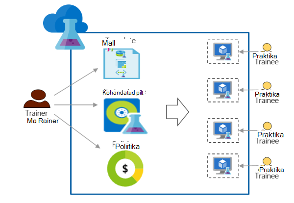

<properties
    pageTitle="Azure'i DevTest Labs kasutamiseks koolitus | Microsoft Azure'i"
    description="Saate teada, kuidas kasutada Azure DevTest Labs koolitus stsenaariumid."
    services="devtest-lab,virtual-machines"
    documentationCenter="na"
    authors="steved0x"
    manager="douge"
    editor=""/>

<tags
    ms.service="devtest-lab"
    ms.workload="na"
    ms.tgt_pltfrm="na"
    ms.devlang="na"
    ms.topic="article"
    ms.date="09/12/2016"
    ms.author="sdanie"/>

# Azure'i DevTest Labs kasutamiseks koolitus

Azure'i DevTest Labs saab rakendada mitme üles loetletud tähtsaimad stsenaariumid Lisaks arendaja katse. Üks stsenaariumid on häälestamine lab koolitus. Azure'i DevTest Labs võimaldab teil luua lab, kuhu saate sisestada kohandatud malle, mida iga praktika abil saate luua identse ja eraldatud keskkonnas koolitus. Saate tagada, et keskkondades on saadaval iga praktika ainult siis, kui nad on vaja need ja sisaldavad piisavalt ressursse – näiteks virtuaalmasinates – koolituse nõutav. Lõpetuseks, saate hõlpsalt jagada lab praktikantide, mille nad pääsevad ühe klõpsuga.   

Azure'i DevTest Labs vastab järgmistele nõuetele, korraldada koolitust, mis tahes virtuaalse keskkonnas vajalikud: 

-   Praktikantide ei kuvata VMs loodud muude praktikantide
-   Iga seadme koolitus, tuleks
-   Praktikantide saate kiiresti ettevalmistamise oma koolitus keskkonnas
-   Maksumus, tagades, et praktikantide ei saa rohkem VMs, kui nad vajavad koolitus ja sulgumist VMs, kui nad kasutavad nende juhtimine
-   Koolitus lab hõlpsalt ühiskasutusse iga praktika
-   Koolitus lab ikka ja jälle uuesti kasutamine

Selles artiklis saate teavet eri Azure'i DevTest Labs funktsioone, mida saab kasutada ka üksikasjalikud juhised, mis lab koolitus häälestamiseks tehke eelnevalt kirjeldatud koolitus.  

## Koolitus: Azure'i DevTest Labs rakendamine

1. **Lab loomine** 

    Labs on Azure DevTest Labsissa alguspunkti. Kui olete loonud lab, saate teha toiminguid näiteks, kui kasutajad (praktikantide) lisamine lab, seatud poliitika määrata kulude, määratlemine VM pilte, mida saate kiiresti luua ja palju muud.   

    Lisateavet lugeda järgmises tabelis olevaid linke klõpsates.

  	| Ülesanne                                                            | Saate teada, mis                                                    |
|-----------------------------------------------------------------|----------------------------------------------------------------------|
| [Azure'i DevTest Labsissa lab loomine](devtest-lab-create-lab.md) | Saate teada, kuidas luua lab Azure'i DevTest Labs Azure portaalis. |

2. **Luua koolitus VMs minutit valmis turuplatsi pilte ja kohandatud piltide abil** 
    
    Saate valida erinevaid pildid valmis kujutised Azure'i turuplatsil ja praktikantide lab jaoks kättesaadavaks teha. Kui valmis pilte ei vasta teie vajadustele, saate luua kohandatud pilt, luues lab VM abil valmis pilt Azure'i turuplatsilt, tarkvara, mida vajate kohandatud pildina lab koolitus ja salvestate VM installimisel. 

    Lisateavet lugeda järgmises tabelis olevaid linke klõpsates.

  	| Ülesanne                                                                              | Saate teada, mis                                                                                                                                  |
|-----------------------------------------------------------------------------------|-------------------------------------------------------------------------------------------------------------------------------------------------|
| [Azure'i turuplatsi piltide konfigureerimine](devtest-lab-configure-marketplace-images.md) | Siit saate teada, kuidas saate nimekiri Azure'i turuplatsi pilte; valiku jaoks kättesaadavaks tegemine ainult pildid soovite koolitus.                 |
| [Luua kohandatud pilt](devtest-lab-create-template.md)                           | Luua kohandatud eelnevalt installite tarkvara peate koolitus, et praktikantide saate kiiresti luua, kasutades kohandatud pilt VM. |

3. **Luua taaskasutatava malli masinad koolitus** 

    Azure'i DevTest Labsissa valem on vaikimisi atribuudi väärtuste VM loomiseks kasutatud loendi. Saate luua valemi lab pilt, VM suurus (kombinatsiooni CPU ja RAM) ja virtuaalse network valides. Iga praktika saate vaadata lab valem ja selle abil saate luua VM. 

    Lisateavet lugeda järgmises tabelis olevaid linke klõpsates.

  	| Ülesanne                                                                         | Saate teada, mis                                                                                                          |
|------------------------------------------------------------------------------|-------------------------------------------------------------------------------------------------------------------------|
| [DevTest Labs valemeid luua VMs haldamine](devtest-lab-manage-formulas.md) | Siit saate teada, kuidas saate valemi, valides üles pilt, VM suurus (kombinatsioon CPU ja RAM) ja virtuaalse võrgu loomine. |

4. **Juhtelemendi kulud**

    Azure'i DevTest Labs võimaldab lab määramiseks suurima arvu VMs on praktika lab poolt loodud poliitika määramine. 

    Kui on läbi mitme päeva koolitus ja soovite peatada kõik VMs teatud ajal päeva ja seejärel automaatselt uuesti neid järgmine päev, saate täita seda seadmisega automaatne-sulgemine ja automaatkäivitus poliitikate Lab. 

    Lõpetuseks, kui koolitus on lõpule viidud saate kustutada kõik VMs korraga ühe PowerShelli skripti käivitades. 

    Lisateavet lugeda järgmises tabelis olevaid linke klõpsates.

  	| Ülesanne                                                                                                                                    | Saate teada, mis                                                      |
|-----------------------------------------------------------------------------------------------------------------------------------------|---------------------------------------------------------------------|
| [Lab poliitikate määratlemine](devtest-lab-set-lab-policy.md)                                                                                    | Määrata kulude, määrates poliitikad Lab.                       |
| [Kustutage kõik lab VMs PowerShelli skripti abil](devtest-lab-faq.md#how-can-i-automate-the-process-of-deleting-all-the-vms-in-my-lab) | Kustutada kõik labs ühe toiminguga kui koolitus on lõpule viidud. |

5. **Iga praktika lab ühiskasutusse**

    Labs pääseb otse, link, mille saate ühiskasutusse anda oma praktikantide abil. Oma praktikantide ei pea olema Azure'i konto, kui nad on [Microsofti konto](devtest-lab-faq.md#what-is-a-microsoft-account). Praktikantide ei näe loodud muude praktikantide VMs.  

    Lisateavet lugeda järgmises tabelis olevaid linke klõpsates.

  	| Ülesanne                                                                                                                                | Saate teada, mis                                                   |
|-------------------------------------------------------------------------------------------------------------------------------------|------------------------------------------------------------------|
| [Azure'i DevTest Labsissa lab on praktika lisamine](devtest-lab-add-devtest-user.md)                                                     | Azure portaali abil saate lisada oma koolitus lab praktikantide.       |
| [Lisage praktikantide lab PowerShelli skripti abil](devtest-lab-add-devtest-user.md#add-an-external-user-to-a-lab-using-powershell) | PowerShelli kasutamine lisamise praktikantide oma koolitus lab automatiseerimiseks. |
| [Hangi link Lab](devtest-lab-faq.md#how-do-i-share-a-direct-link-to-my-lab)                                                  | Siit saate teada, kuidas lab otse pääseb hüperlingi.        |

6. **Lab ikka ja jälle uuesti kasutamine** 

    Ressursihaldur malli loomine ja selle loomiseks identse labs ikka ja jälle kasutades kohandatud sätteid, sh lab loomise automatiseerida. 

    Lisateavet lugeda järgmises tabelis olevaid linke klõpsates.

  	| Ülesanne                                                                                                                               | Saate teada, mis                                                      |
|------------------------------------------------------------------------------------------------------------------------------------|---------------------------------------------------------------------|
| [Luua lab ressursihaldur malli abil](devtest-lab-faq.md#how-do-i-create-a-lab-from-an-azure-resource-manager-template) | Luua labs Azure DevTest Labs ressursihaldur mallide kasutamine. |

[AZURE.INCLUDE [devtest-lab-try-it-out](../../includes/devtest-lab-try-it-out.md)]  

