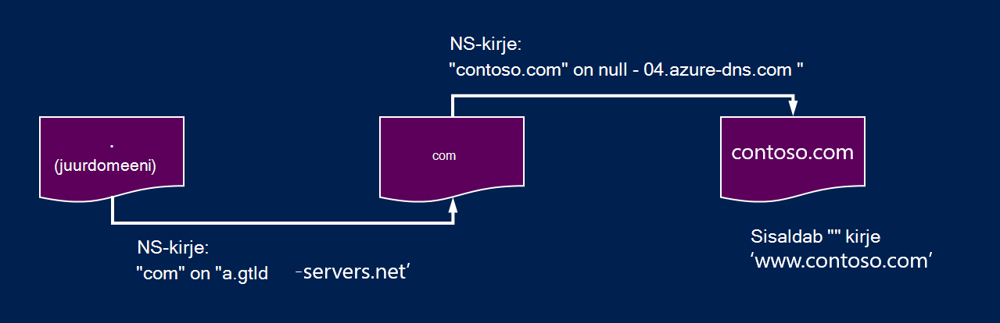
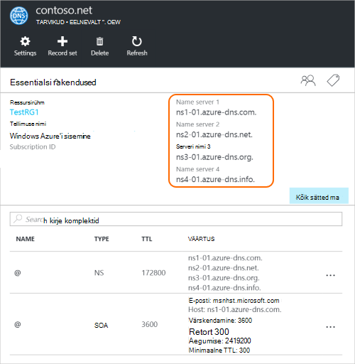

<properties
   pageTitle="Volitatud esindaja Azure'i DNS-i domeeni | Microsoft Azure'i"
   description="Mõista, kuidas muuta domeeni delegeerimine ja pakkuda domeeni hosting nimeserverite Azure'i DNS-i abil."
   services="dns"
   documentationCenter="na"
   authors="sdwheeler"
   manager="carmonm"
   editor=""/>

<tags
   ms.service="dns"
   ms.devlang="na"
   ms.topic="get-started-article"
   ms.tgt_pltfrm="na"
   ms.workload="infrastructure-services"
   ms.date="06/30/2016"
   ms.author="sewhee"/>

# Volitatud esindaja Azure'i DNS-i domeeni

Azure'i DNS-i võimaldab majuta DNS-i tsooni ja Azure domeeni DNS-kirjeid hallata. Et jõuda Azure'i DNS-i domeeni DNS-i päringute, domeeni on delegeerida Azure'i DNS-i ema domeeni. Pidage meeles, Azure'i DNS-i pole domeeniregistraatori. Selles artiklis selgitatakse domeeni delegeerimine tööpõhimõte ja kuidas volitatud esindaja domains Azure'i DNS-i.

## DNS-i delegeerimine tööpõhimõte

### Domeenide ja tsoonid

IP-aadress on domeeni hierarhia. Hierarhia algab '' juurdomeeni nime, kelle nimi on lihtsalt**.**.  Selle all tulevad üladomeenide, nt com, "neto", "organisatsiooniskeemi", "Suurbritannia" või "jp".  Need allpool on teise taseme domeenid, näiteks "org.uk" või "co.jp".  Jne. Domeenide DNS-i hierarhias majutatakse eraldi DNS-i tsoonid abil. Tsoonid on globaalselt jaotatud korraldaja DNS-i nimeserverite kogu maailmas.

**DNS-i tsooni**

Domeen on domeeni nimeserveri, näiteks "contoso.com" kordumatu nimi. DNS-i tsooni kasutatakse domeeni DNS-i kirjeid. Näiteks "contoso.com" domeeni võib sisaldada arvu DNS-i kirjeid, nt mail.contoso.com"(meiliserver) jaoks ja www.contoso.com" (veebisaidi) jaoks.

**Domeeniregistraatori**

Domeeniregistraatori on mõni ettevõte, kes pakub Interneti domeeninimede. Nad kontrollida, kui Interneti-domeeni, mida soovite kasutada, on saadaval ja võimaldab teil seda osta. Kui domeeninimi on registreeritud, saab juriidiline omanik domeeni nime. Kui teil juba on Interneti-domeeni, kasutate praegune domeeniregistraator delegeerida Azure'i DNS-i.

>[AZURE.NOTE] Kellele antud domeeninime või osta domeeni kohta lisateavet, lugege teemast [Interneti domeenihaldus Azure AD](https://msdn.microsoft.com/library/azure/hh969248.aspx).

### Eraldusvõime ja delegeerimine

On kahte tüüpi DNS-serverid.

- _Autoriteetsete_ DNS server server majutab DNS-i tsoonid. See on vastus DNS-i päringute kirjeid ainult nendes piirkondades.
- _Rekursiivsed_ DNS-i server ei majuta DNS-i tsoonid. Selle vastused, helistades autoriteetsete DNS-serverid koguda andmeid on vaja kõik DNS-i päringud.

>[AZURE.NOTE] Azure'i DNS-i pakub autoriteetsete DNS-i teenuse.  See ei paku Rekursiivsed DNS-i teenus.

> Pilveteenustega ja Azure VMs automaatselt konfigureeritud kasutama Rekursiivsed DNS-teenused, mis on esitatud eraldi Azure taristu osana.  Need DNS-i sätete muutmise kohta leiate teavet teemast [Azure nimelahendus](../virtual-network/virtual-networks-name-resolution-for-vms-and-role-instances.md#name-resolution-using-your-own-dns-server).

DNS-i kliendid PC- või mobiilsideseadmete helistage tavaliselt Rekursiivsed DNS-i server, mis tahes DNS-i päringute kliendi rakendused on vaja teha.

Kui Rekursiivsed DNS-i server saab päringu DNS-i kirje, näiteks "www.contoso.com", tuleb kõigepealt majutusteenuse tsooni "contoso.com" domeeni nimeserveri otsimine. Selleks juurkausta nimeserverite algab, ja sealt leiab majutusteenuse "com" zone nimeserverite. See siis päringute 'com' nimeserverite majutusteenuse "contoso.com" zone nimeserverite leidmiseks.  Lisaks on võimalik päringu nende nimeserverite "www.contoso.com".

Seda nimetatakse lahendamine DNS-i nimi. Põhimõtteliselt, DNS-i resolvimise hõlmab näiteks järgmised CNAMEs lisatoimingud, kuid see pole oluline mõistmine, kuidas DNS-i delegeerimine töötab.

Kuidas ei ema zone "käsk" lapse tsooni nimeservereid? Seda tehakse kasutamine eri tüüpi DNS-i kirje, nimetatakse NS-kirje (NS tähistab "serveri nimi"). Näiteks juurkausta tsooni sisaldab NS-kirjed "com" ja kuvab nimeservereid "com" tsooni. Omakorda sisaldab "com" zone "contoso.com", mis näitab nimeservereid "contoso.com" tsooni NS-kirjed. Häälestamise lapse tsooni ema zone NS-kirjed nimetatakse delegeerivad domeeni.

Iga delegeerimine on tegelikult kaks eksemplari NS-kirjed ühe ema tsooni osutab laps ja teise lapse tsooni ise. "Contoso.com" tsooni sisaldab NS-kirjeid contoso.com"(lisaks NS-kirjed"com"). Neid nimetatakse autoriteetsete NS-kirjed ja need istuda lapse tsooni tipus.

## Azure'i DNS-i domeeni delegeerivad

Kui loote oma DNS-i tsooni Azure'i DNS-i, peate häälestamine NS-kirjed ema tsooni autoriteetsete allika nimi resolutsioon oma tsooni Azure'i DNS-i teha. Domeenide osta mõnelt registraatorilt, oma domeeniregistraatori pakub võimalust NS-kirjete häälestamiseks.

>[AZURE.NOTE] Teil pole oma domeeni DNS-i tsooni loomiseks Azure'i DNS-i domeeni nimega. Siiski peate häälestamiseks delegeerida Azure'i DNS-i domeeniregistraatori juures domeeni omanik.

Oletame näiteks, et teil osta domeeni "contoso.com" ja Azure DNS-i nimi contoso.com piirkond loomine. Kui domeeni omanik, oma domeeniregistraatori pakub teile konfigureerimise name server aadressid (st NS-kirjed) valikut oma domeeni. Funktsiooni domeeniregistraatori salvestab ema domeeni, praegusel juhul '.com' NS-kirjed. Klientidele kogu maailmas siis suunatakse Azure DNS-i tsooni domeeni kui proovite lahendada DNS-i kirjete "contoso.com".

### Nime serveri nime otsimine

Enne saate delegeerida oma DNS-i tsooni Azure'i DNS-i, peate esmalt teadma oma tsooni serveri nimi nimed. Azure'i DNS-i eraldab nimeserverite kaustast iga kord, kui luuakse ala.

Lihtsaim viis oma tsooni määratud nimeserverite kuvamiseks on Azure portaali kaudu.  Selles näites on tsooni "contoso.net" määratud nimeserverite ' ns1-01.azure-dns.com ","ns2, 01.azure ja DNS-i .net-i"," ns3-01.azure-dns.org ", ja" ns4-01.azure-dns.info ":

 

Azure'i DNS-i loob automaatselt teie tsooni määratud nimeserverite sisaldav autoriteetsete NS-kirjed.  Azure'i PowerShelli või Azure CLI kaudu nimi serverinimed kuvamiseks peate lihtsalt tuua need kirjed.

Azure'i PowerShelli kaudu autoriteetsete NS-kirjed saate alla laadida järgmiselt. Pange tähele, et kirje nimi “@” tähistatakse kirjete tsooni tipus.

    PS> $zone = Get-AzureRmDnsZone –Name contoso.net –ResourceGroupName MyResourceGroup
    PS> Get-AzureRmDnsRecordSet –Name “@” –RecordType NS –Zone $zone

    Name              : @
    ZoneName          : contoso.net
    ResourceGroupName : MyResourceGroup
    Ttl               : 3600
    Etag              : 5fe92e48-cc76-4912-a78c-7652d362ca18
    RecordType        : NS
    Records           : {ns1-01.azure-dns.com, ns2-01.azure-dns.net, ns3-01.azure-dns.org,
                        ns4-01.azure-dns.info}
    Tags              : {}

Saate mitu platvormi Azure'i CLI tuua autoriteetsete NS-kirjed ja seega leida oma tsooni määratud nimeserverite:

    C:\> azure network dns record-set show MyResourceGroup contoso.net @ NS
    info:    Executing command network dns record-set show
        + Looking up the DNS Record Set "@" of type "NS"
    data:    Id                              : /subscriptions/.../resourceGroups/MyResourceGroup/providers/Microsoft.Network/dnszones/contoso.net/NS/@
    data:    Name                            : @
    data:    Type                            : Microsoft.Network/dnszones/NS
    data:    Location                        : global
    data:    TTL                             : 172800
    data:    NS records
    data:        Name server domain name     : ns1-01.azure-dns.com.
    data:        Name server domain name     : ns2-01.azure-dns.net.
    data:        Name server domain name     : ns3-01.azure-dns.org.
    data:        Name server domain name     : ns4-01.azure-dns.info.
    data:
    info:    network dns record-set show command OK

### Häälestada delegeerimine

Iga domeeniregistraatori on domeeni nimeserveri kirjeid muuta oma DNS-i Haldustööriistad. Funktsiooni domeeniregistraatori DNS-i halduse lehel NS-kirjete redigeerimine ja asendada need Azure'i DNS-i loodud NS-kirjed.

Kui delegeerivad Azure'i DNS-i domeeni, kasutage nime serverite nimed, mida Azure'i DNS-i.  Kasutage alati kõik 4 nimi serverite nimed, olenemata teie domeeni nimi.  Domeeni delegeerimine ei nõua nime serveri nime kasutada sama kõrgema taseme Domeen oma domeeni nimega.

Ärge kasutage 'liimi kirjed' osutamiseks Azure'i DNS-i nimi serveri IP-aadressid, kuna need IP-aadressid võib tulevikus muutuda. Oma tsooni, nimetatakse "vanity nimeserverite" nimi serveri nimede kasutamine esinduste ei toeta praegu Azure'i DNS-i.

### Kinnitamiseks nimelahendus ei tööta

Pärast delegeerimine, saate kontrollida, kas nimelahendus toimib tööriist, näiteks 'nslookup' abil päringu SOA kirje oma tsooni (mis on automaatselt loodud tsooni loomisel).

Pange tähele, et teil pole määramiseks Azure'i DNS-i nimeservereid, kuna tavaline DNS-i eraldusvõime protsessi otsib nimeservereid automaatselt, kui delegeerimine on loodud õigesti.

    nslookup –type=SOA contoso.com

    Server: ns1-04.azure-dns.com
    Address: 208.76.47.4

    contoso.com
    primary name server = ns1-04.azure-dns.com
    responsible mail addr = msnhst.microsoft.com
    serial = 1
    refresh = 900 (15 mins)
    retry = 300 (5 mins)
    expire = 604800 (7 days)
    default TTL = 300 (5 mins)

## Delegeeriv alamdomeenide Azure'i DNS-serveris

Kui soovite häälestada eraldi lapse tsooni, saate delegeerida alamdomeeni Azure'i DNS-serveris. Näiteks võttes häälestamine ja delegeeritud "contoso.com" Azure DNS-i, Oletame, et soovite häälestada eraldi lapse tsooni, "partners.contoso.com".

Tavaline delegeerimine sub domeeni häälestamist tuleneb sarnase protsessi. Ainult erinevus on see, et sammus 3 NS-kirjed tuleb luua ema tsooni "contoso.com" Azure DNS-i, mitte luuakse domeeniregistraatori kaudu.

1. Lapse tsooni 'partners.contoso.com' Azure DNS-i luua.
2. Otsige lapse tsooni saada lapse tsooni Azure'i DNS-i majutusteenuse nimeservereid autoriteetsete NS-kirjed.
3. Volitatud esindaja lapse tsooni konfigureerimisega ema tsooni osutab lapse tsooni NS-kirjed.

### Sub domain volitatud

Järgmises näites PowerShelli näitab, kuidas see toimib. Azure'i portaali kaudu või mitu platvormi Azure'i CLI kaudu saab teostada samu juhiseid.

#### Samm 1. Luua vanema tsoonid

Kõigepealt loome vanema tsoonid. Need võivad olla sama ressursirühm või muu ressursi rühmad.

    $parent = New-AzureRmDnsZone -Name contoso.com -ResourceGroupName RG1
    $child = New-AzureRmDnsZone -Name partners.contoso.com -ResourceGroupName RG1

#### Samm 2. Too NS-kirjed

Järgmiseks tuua autoriteetsete NS-kirjed lapse piirkonnast, nagu on näidatud järgmises näites.  See sisaldab lapse tsooni määratud nimeserverite.

    $child_ns_recordset = Get-AzureRmDnsRecordSet -Zone $child -Name "@" -RecordType NS

#### Samm 3. Volitatud esindaja lapse tsooni

Looge vastavate NS kirje määramine ema tsooni delegeerimine lõpuleviimiseks. Pange tähele, et ema tsooni määramine kirje nimi vastab lapse tsooni nimi, sel juhul "partnerid".

    $parent_ns_recordset = New-AzureRmDnsRecordSet -Zone $parent -Name "partners" -RecordType NS -Ttl 3600
    $parent_ns_recordset.Records = $child_ns_recordset.Records
    Set-AzureRmDnsRecordSet -RecordSet $parent_ns_recordset

### Kinnitamiseks nimelahendus ei tööta

Saate kontrollida, kas kõik on õigesti häälestatud otsides SOA kirje lapse tsooni.

    nslookup –type=SOA partners.contoso.com

    Server: ns1-08.azure-dns.com
    Address: 208.76.47.8

    partners.contoso.com
        primary name server = ns1-08.azure-dns.com
        responsible mail addr = msnhst.microsoft.com
        serial = 1
        refresh = 900 (15 mins)
        retry = 300 (5 mins)
        expire = 604800 (7 days)
        default TTL = 300 (5 mins)

## Järgmised sammud

[DNS-i tsoonid haldamine](dns-operations-dnszones.md)

[DNS-i kirjete haldamine](dns-operations-recordsets.md)

