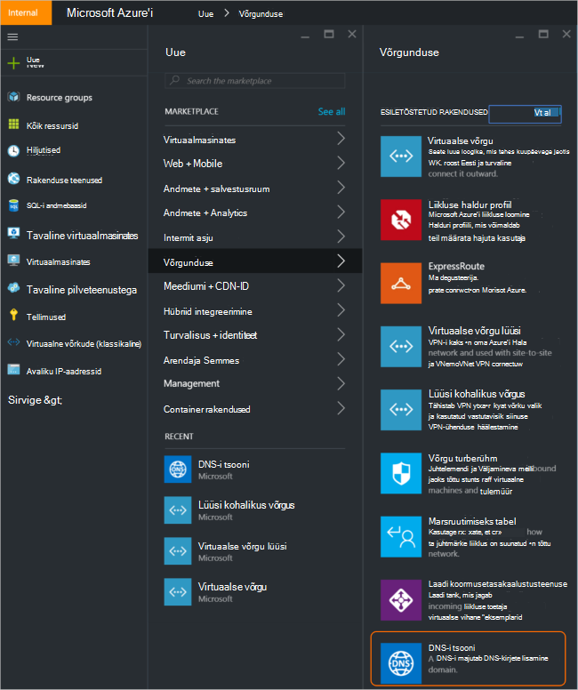
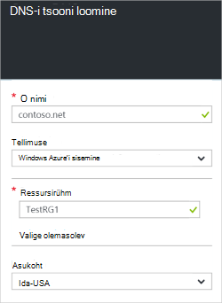
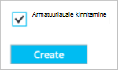
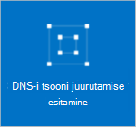
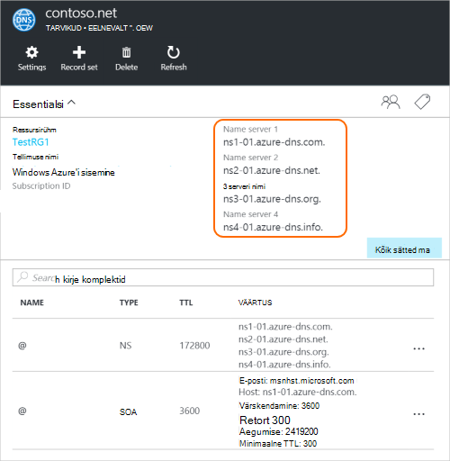
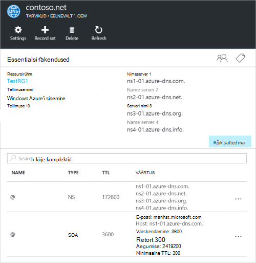

<properties
   pageTitle="Kuidas luua ja hallata oma DNS-i tsooni Azure'i portaalis | Microsoft Azure'i"
   description="Saate teada, kuidas luua DNS-i tsoonid Azure'i DNS-i. See on samm-sammult juhendi luua ja hallata oma DNS-i esimese ja käivitage Azure'i portaalis domeeni DNS-i majutusteenuse."
   services="dns"
   documentationCenter="na"
   authors="sdwheeler"
   manager="carmonm"
   editor=""
   tags="azure-resource-manager"/>

<tags
   ms.service="dns"
   ms.devlang="na"
   ms.topic="article"
   ms.tgt_pltfrm="na"
   ms.workload="infrastructure-services"
   ms.date="08/16/2016"
   ms.author="sewhee"/>

# Looge DNS-i tsooni Azure'i portaalis

> [AZURE.SELECTOR]
- [Azure'i portaal](dns-getstarted-create-dnszone-portal.md)
- [PowerShelli](dns-getstarted-create-dnszone.md)
- [Azure'i CLI](dns-getstarted-create-dnszone-cli.md)

Selles artiklis juhendab teid juhised DNS-i tsooni loomiseks Azure portaali kaudu. Samuti saate luua PowerShelli või CLI DNS-i tsooni.

[AZURE.INCLUDE [dns-create-zone-about](../../includes/dns-create-zone-about-include.md)]

### Azure'i DNS-i Sildid

Sildid on loendi nimi ja väärtuse paarideks ja kasutatakse Azure ressursihaldur selles arvelduse ja rühmitamistasemel sildi ressurssidele. Siltide kohta leiate lisateavet artiklist [kasutamine siltide korraldamiseks oma Azure ressursse](../resource-group-using-tags.md).

Silte saate lisada Azure'i portaalis **sätted** tera abil oma DNS-i tsooni.

## DNS-i tsooni loomine

1. Azure'i portaali sisselogimine

2. Klõpsake menüü jaoturi ja klõpsake nuppu **uus > Networking >** ja seejärel klõpsake nuppu **DNS-i tsooni** DNS-i tsooni tera avamiseks.

    

3. Enne **DNS-i tsooni** , klõpsake allservas nuppu **Loo** . **Looge DNS-i tsooni** tera avaneb.

    

4. **Looge DNS-i tsooni** enne, nimi oma DNS-i tsooni. Nt *contoso.com*. Lugege teemat [DNS-i tsooni nimed](#names) eelmises jaotises.

5. Järgmisena Määrake ressursirühm, mida soovite kasutada. Saate luua uue ressursirühma või valige üks, mis on juba olemas.

6. Valige rippmenüüst **asukoht** ressursirühma asukoha määramine. Pange tähele, et see säte ei viita ressursirühma, mitte asukoha DNS-i tsooni. Tegelik DNS-i tsooni ressursi on automaatselt "Üldine" ja pole midagi, mida saate (või tuleb) määramiseks portaalis.

7. **PIN-koodi armatuurlaud** ruut märgituks, kui soovite lihtne leida oma uue tsooni armatuurlauale jätta. Klõpsake nuppu **Loo**.

    

8. Kui klõpsate nuppu Loo, näete oma uue tsooni konfigureeritava armatuurlaual.

    

9. Teie uus zone loomisel avab oma uue tsooni tera armatuurlaual.

## Kirjete vaatamine

DNS-i tsooni loomine loob ka järgmisi kirjeid:

- "Käivitamine, asutus" (SOA) kirje. Iga DNS-i tsooni keskmes on SOA.
- Autoriteetsete nimeserveri (NS) kirjeid. Need näitavad, millised nimeserverite hosting tsooni. Azure'i DNS-i kasutab kogumi nimeserverite ja nii erinevad nimeserverite ülesandeks võidakse määrata Azure'i DNS-i tsooni. Lisateavet leiate [Azure'i DNS-i domeeni volitatud esindaja](dns-domain-delegation.md) .

Saate vaadata Azure portaali kirjeid

1. Klõpsake oma **DNS-i tsooni** labale **Kõik sätted** , et avada **sätted blade** ja DNS-i tsooni.

    

2. Paani Essentialsi alumises osas näete kirje määrab ja DNS-i tsooni.

    

## Test

DNS-i tööriistade näiteks nslookup, dig või [lahenda DnsName PowerShelli cmdlet-käsu](https://technet.microsoft.com/library/jj590781.aspx)abil saate oma DNS-i tsooni testida.

Kui te pole veel oma domeeni kasutama uut tsooni Azure'i DNS-i, peate DNS-i päringu otse mõnele oma tsooni nimeservereid suunaks. Nimeserverite oma tsooni NS-kirjed on esitatud loetletud `Get-AzureRmDnsRecordSet` kohal. Kindlasti funktsiooni substitute õigete väärtuste oma tsooni sisse käsu alla.

    nslookup
    > set type=SOA
    > server ns1-01.azure-dns.com
    > contoso.com

    Server: ns1-01.azure-dns.com
    Address:  208.76.47.1

    contoso.com
            primary name server = ns1-01.azure-dns.com
            responsible mail addr = msnhst.microsoft.com
            serial  = 1
            refresh = 900 (15 mins)
            retry   = 300 (5 mins)
            expire  = 604800 (7 days)
            default TTL = 300 (5 mins)

## DNS-i tsooni kustutamine

Saate kustutada DNS-tsooni otse portaalis. Enne kustutamist DNS-i tsooni Azure'i DNS-i, peate kustutada kõik kirjed komplekti, välja arvatud NS ja SOA kirjete tsooni juurtasemel automaatselt loodud tsooni loomisel.

1. Otsige üles **DNS-i tsooni** tera tsooni, mille soovite kustutada ja seejärel käsku **Kustuta** tera ülaosas.

2. Kuvatakse teade, andes märku, et kustutage kõik kirjed komplekti, välja arvatud NS ja SOA kirjed, mis on automaatselt loodud. Kui olete kustutanud oma kirje komplekti, klõpsake nuppu **Jah**. Pange tähele, et DNS-i tsooni kustutamisel portaalist ressursirühm, mis on seotud DNS-tsooni ei kustutata.

## Järgmised sammud

Pärast DNS-i tsooni loomist Looge [kirje komplekti ja kirjete](dns-getstarted-create-recordset-portal.md) alustamiseks lahendavad nimesid oma Interneti-domeeni.
