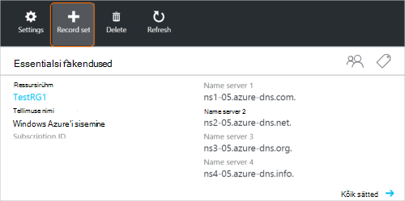
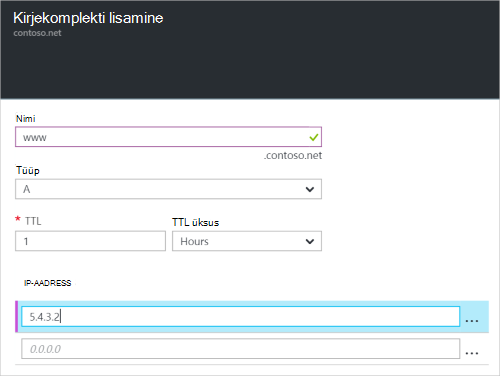

<properties
   pageTitle="Kirjekomplekti ja Azure portaalis DNS-i tsooni kirjeid luua | Microsoft Azure'i"
   description="Azure'i DNS-i hosti kirjete loomine ja salvestamine komplekti ja Azure portaalis kirjete loomine"
   services="dns"
   documentationCenter="na"
   authors="sdwheeler"
   manager="carmonm"
   editor=""
   tags="azure-resource-manager"/>

<tags
   ms.service="dns"
   ms.devlang="na"
   ms.topic="article"
   ms.tgt_pltfrm="na"
   ms.workload="infrastructure-services"
   ms.date="08/16/2016"
   ms.author="sewhee"/>

# DNS-i kirje komplekti ja kirjete loomine Azure portaali abil

> [AZURE.SELECTOR]
- [Azure'i portaal](dns-getstarted-create-recordset-portal.md)
- [PowerShelli](dns-getstarted-create-recordset.md)
- [Azure'i CLI](dns-getstarted-create-recordset-cli.md)

Selles artiklis tutvustatakse loomisprotsessi kirjeid ja kirjete komplektid Azure portaali kaudu. Kui loote oma DNS-i tsooni, lisada oma domeeni DNS-i kirjed. Selle tegemiseks peate esmalt mõista DNS-i kirjed ja kirje komplektid.

[AZURE.INCLUDE [dns-about-records-include](../../includes/dns-about-records-include.md)]

## Kirjekomplekti ja kirje loomine

Järgmine näide juhatab teid läbi, kasutades Azure portaali kirjekomplekti ja kirje loomise protsess. Kasutame DNS-i "A" kirjetüüpi.

1. Portaali sisse logida.

2. Avage **DNS-i tsooni** , kus soovite luua kirjekomplekti tera.

3. **DNS-i tsooni** tera ülaosas valige **kirje määramine** **lisamine kirje määramine** tera avamiseks.

    

4. **Kirje lisamine seadmine** enne nimi oma kirjekomplekti. Näiteks võib nime kirjekomplekti "**www**".

    

5. Valige loodava kirjetüübi. Näiteks valige **A**.

6. Määrake **TTL**. Vaikimisi time to live portaalis on üks tund.

7. Lisage IP-aadressid, üks IP-aadress rea kohta. Kui kasutate pakutud kirje nimi ja ülalkirjeldatud kirjetüübi seadmine, IPv4 IP-aadresside lisamine **A** -kirje www kirjekomplekti.

8. Kui olete lõpetanud, lisades IP-aadressid, klõpsake nuppu **OK** tera allosas. DNS-i kirjekomplekti luuakse.

## Järgmised sammud

Kirjekomplekti ja kirjete haldamiseks, lugege teemat [Halda DNS-i kirjed ja kirje määrab Azure portaali kaudu](dns-operations-recordsets-portal.md).

Azure'i DNS-i kohta leiate lisateavet teemast [Azure DNS-i ülevaade](dns-overview.md).
