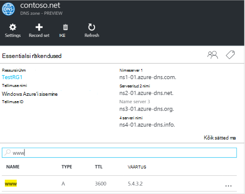
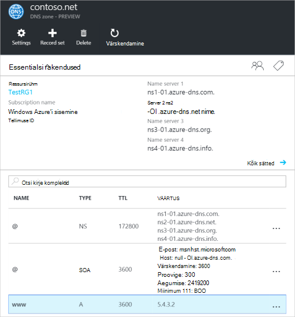
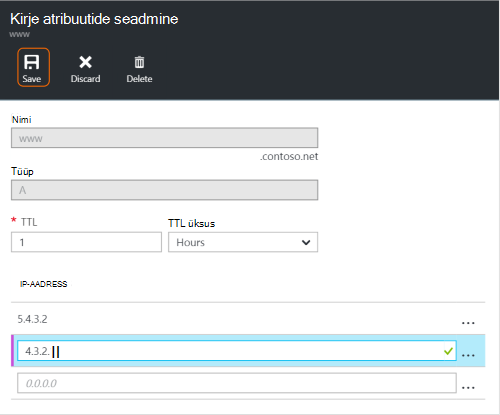
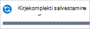
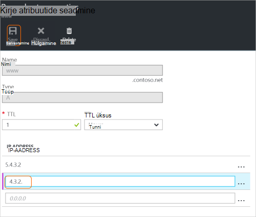
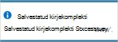
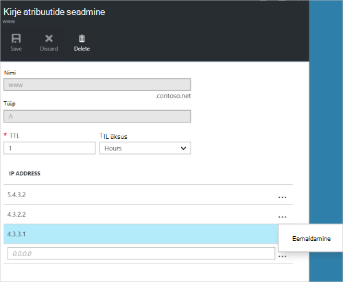
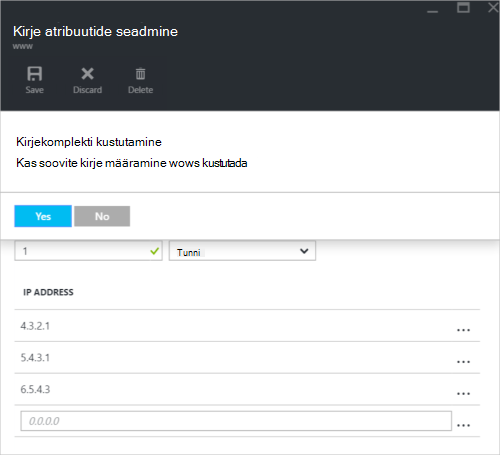

<properties
   pageTitle="DNS-i kirje komplekti ja Azure portaalis kirjete haldamine | Microsoft Azure'i"
   description="Haldamise DNS-i kirje määrab ja kui oma domeeni Azure'i DNS-i kirjeid."
   services="dns"
   documentationCenter="na"
   authors="sdwheeler"
   manager="carmonm"
   editor=""
   tags="azure-resource-manager"/>

<tags
   ms.service="dns"
   ms.devlang="na"
   ms.topic="article"
   ms.tgt_pltfrm="na"
   ms.workload="infrastructure-services"
   ms.date="08/16/2016"
   ms.author="sewhee"/>

# DNS-i kirjeid hallata ja kirje määrab Azure portaali kaudu

> [AZURE.SELECTOR]
- [Azure'i portaal](dns-operations-recordsets-portal.md)
- [Azure'i CLI](dns-operations-recordsets-cli.md)
- [PowerShelli](dns-operations-recordsets.md)

Selles artiklis kirjeldatakse, kuidas kirje komplekti ja oma DNS-i tsooni kirjeid hallata Azure portaali kaudu.

See on oluline erinevus DNS-i kirje komplekti ja üksikute DNS-i kirjed. Kirjekomplekti on tsoonis kirjed, mis on sama nime ja on sama tüüpi kogum. Lisateabe saamiseks vt [loomine DNS-i kirje komplekti ja kirjete Azure portaali kaudu](dns-getstarted-create-recordset-portal.md).

## Uue kirjekomplekti ja kirje loomine

Azure'i portaalis seadmine kirje loomiseks vaadake teemat [Azure portaali kaudu luua DNS-i kirjed](dns-getstarted-create-recordset-portal.md).

## Kirjekomplekti kuvamine

1. Azure'i portaalis, minge **DNS-i tsooni** tera.

2. Otsige soovitud kirjekomplekti ja valige see. Avatakse kirje atribuutide seadmine.

    

## Kirjekomplekti uue kirje lisamine

Saate lisada mis tahes kirjekomplekti kuni 20 kirjed. Kirjekomplekti ei tohi sisaldada kaks identse kirjet. Tühi kirje komplektid (koos null-kirjed) saab luua, kuid ei kuvata serverites Azure'i DNS-i nimi. Kirje tüüp: CNAME komplekti võib sisaldada kuni üks kirje.

1. Klõpsake **atribuutide seadmine kirje** enne oma DNS-i tsooni, kirjekomplekti, mida soovite kirje lisada.

    

2. Määrake kirje atribuutide seadmine täitke väljad.

    

2. Klõpsake nuppu **Salvesta** tera ülaosas sätete salvestamiseks. Sulgege tera.

3. Ülanurgas kuvatakse kirje salvestab.

    

Pärast kirje on salvestatud, kajastuvad väärtused **DNS-i tsooni** enne uue kirje.

## Kirje värskendamine

Mõne olemasoleva kirjekomplekti kirje värskendamisel saate värskendada väljad sõltuvad kirje tüüp, millega töötate.

1. **Kirje atribuutide seadmine** enne oma kirjekomplekti jaoks, saate otsida kirje.

2. Muutke kirjet. Kui kirje muutmiseks saate muuta kirje saadaval sätted. Järgmises näites on valitud välja **IP-aadress** ja IP-aadress on protsess on muudetud.

    

3. Klõpsake nuppu **Salvesta** tera ülaosas sätete salvestamiseks. Paremas ülanurgas kuvatakse teade, mis on salvestatud kirje.

    

Pärast kirje on salvestatud, määrata **DNS-i tsooni** enne kirje väärtused kajastuvad värskendatud kirje.

## Kirje eemaldamine kirjekomplekti

Saate kirjete eemaldamiseks kirjekomplekti Azure portaali. Pange tähele, et viimase kirje eemaldamine kirjekomplekti Kustuta kirje määramine.

1. **Kirje atribuutide seadmine** enne oma kirjekomplekti jaoks, saate otsida kirje.

2. Klõpsake kirjet, mille soovite eemaldada. Valige **Eemalda**.

    

3. Klõpsake nuppu **Salvesta** tera ülaosas sätete salvestamiseks.

3. Pärast kirje on eemaldatud, kajastuvad väärtused **DNS-i tsooni** enne kirje eemaldamine.

## Kirje kustutamine

1. **Kirje atribuutide seadmine** blade oma kirje määramine, klõpsake nuppu **Kustuta**.

    

2. Kui soovite kustutada kirjekomplekti, kuvatakse teade küsimusega.

3. Veenduge, et väljal nimi vastab kirjekomplekti, mille soovite kustutada, ja seejärel klõpsake nuppu **Jah**.

4. **DNS-i tsooni** enne, veenduge, et kirjekomplekti on enam nähtav.

## NS ja SOA kirjetega töötamine

Muud kirjetüübid hallatakse teisiti SOA- ja NS-kirjed, mis luuakse automaatselt.

### SOA kirjete muutmine

Te ei saa lisamine või eemaldamine kirjed automaatselt loodud SOA kirje tsooni tipus määramine (nime = "@"). Siiski saate muuta parameetrid SOA kirjes (välja arvatud "Host") ja kirje Määrake TTL.

### NS-kirjed tsooni tipus muutmine

Ei saa lisada, eemaldada või muuta automaatselt loodud NS kirje määramine tipus tsooni kirjeid (nime = "@"). Mis on lubatud ainult muudatus on muuta kirjekomplekti TTL.

### SOA või NS kirje komplekti kustutamine

Te ei saa kustutada SOA ja NS-kirje, mis määrab tsooni tipus (nime = "@") , mis luuakse automaatselt tsooni loomisel. Kustutatakse automaatselt, kui kustutate selle tsooni.

## Järgmised sammud

-   Azure'i DNS-i kohta leiate lisateavet teemast [Azure DNS-i ülevaade](dns-overview.md).
-   Automatiseerimise DNS-i kohta lisateabe saamiseks lugege teemat [DNS-i loomise alad ja kirje määrab SDK .net-i abil](dns-sdk.md).
-   Vastupidise DNS-i kirjete kohta lisateabe saamiseks vaadake, [Kuidas hallata oma teenuste PowerShelli kaudu vastupidise DNS-i kirjeid](dns-reverse-dns-record-operations-ps.md).
