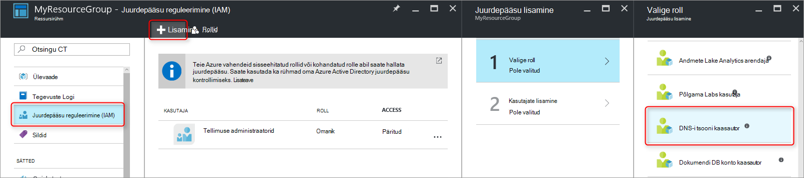
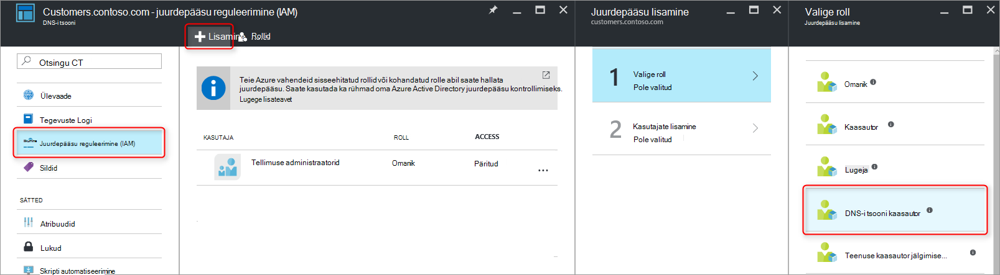
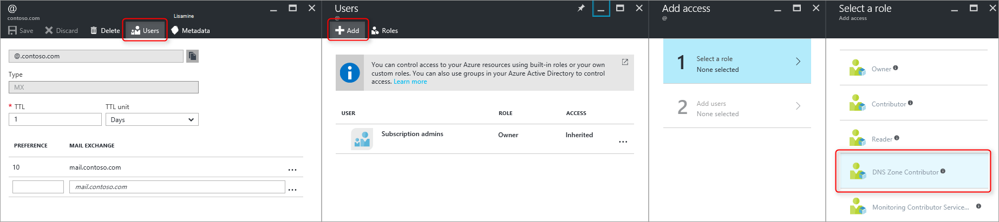
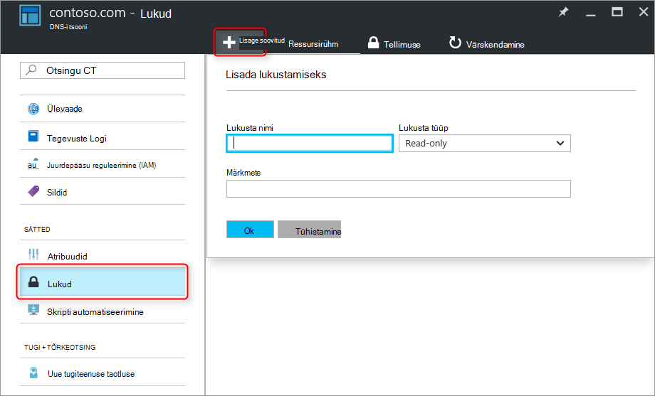

<properties 
   pageTitle="DNS-i tsoonid ja kirjete kaitsmine | Microsoft Azure'i" 
   description="Kuidas kaitsta DNS-i tsoonid ja kirje määrab Microsoft Azure'i DNS-serveris." 
   services="dns" 
   documentationCenter="na" 
   authors="jtuliani" 
   manager="carmonm" 
   editor=""/>

<tags
   ms.service="dns"
   ms.devlang="na"
   ms.topic="article"
   ms.tgt_pltfrm="na"
   ms.workload="infrastructure-services" 
   ms.date="10/20/2016"
   ms.author="jtuliani"/>

# DNS-i tsoonid ja kirjete kaitsmise kohta

DNS-i tsoonid ja kirjed on kriitilised ressursid. DNS-i tsooni või isegi ainult ühe DNS-i kirje kustutamist võib põhjustada kokku teenuse katkestuste.  Seetõttu on oluline, et kriitilised DNS-i tsoonid ja kirjete kaitstud volitamata või ekslike muudatuste.

Selles artiklis selgitatakse, kuidas Azure'i DNS-i võimaldab teil kaitsta oma DNS-i tsoonid ja kirjete muudatused vastu.  Me rakendada kahe võimsaid turbefunktsioonid Azure'i ressursihaldur: [Rollipõhine juurdepääsu reguleerimine](../active-directory/role-based-access-control-what-is.md) ja - [lukkude ressursi](../resource-group-lock-resources.md).

## Rollipõhine juurdepääsu reguleerimine

Azure'i Rollipõhine juurdepääsu juhtimine (RBAC) võimaldab kohandatud Accessi halduse Azure'i kasutajate, rühmade ja ressursse. RBAC kasutamisel saate anda täpselt Accessi summa, et kasutajatel on vaja teha oma tööd. Kuidas RBAC aitab hallata juurdepääsu kohta leiate lisateavet teemast [mis on Rollipõhine juurdepääsu reguleerimine](../active-directory/role-based-access-control-what-is.md).

### 'DNS-i tsooni kaasautori' roll

'DNS-i tsooni kaasautori' roll on esitatud Azure haldamise DNS-i ressursid sisseehitatud roll.  DNS-i tsooni kaasautor õiguste määramisel kasutaja või rühma võimaldab selle rühma haldamiseks DNS-i ressursid, kuid mitte ressursse, mis tahes tüüpi.

Oletame näiteks, et ressursi rühma "myzones sisaldab viis tsoonid Contoso ettevõtte jaoks. DNS-i administraatori 'DNS-i tsooni kaasautor' kasutusõiguste selle ressursirühma andmist võimaldab need DNS-i tsoonid üle täielik kontroll. Oleks andmise mittevajalike õigused, näiteks DNS-i haldur ei saa luua ega Peata Virtuaalmasinates.

Lihtsaim viis RBAC õiguste määramine on [Azure portaali kaudu](../active-directory/role-based-access-control-configure.md).  Avage 'Juurdepääsu reguleerimine (IAM)' tera ressursirühma, seejärel klõpsake 'lisa ja seejärel valige 'DNS-i tsooni kaasautori' roll ja valige on nõutav kasutajatele või rühmadele anda õigused.

Õigusi saab ka [antud Azure'i PowerShelli kaudu](../active-directory/role-based-access-control-manage-access-powershell.md):

    # Grant 'DNS Zone Contributor' permissions to all zones in a resource group
    New-AzureRmRoleAssignment -SignInName <user email address> -RoleDefinitionName "DNS Zone Contributor" -ResourceGroupName <resource group name>

Võrdväärne käsk on [saadaval Azure CLI kaudu](../active-directory/role-based-access-control-manage-access-azure-cli.md):

    # Grant 'DNS Zone Contributor' permissions to all zones in a resource group
    azure role assignment create --signInName  <user email address> --roleName "DNS Zone Contributor" --resourceGroup <resource group name>

### Tsooni tase RBAC

Azure'i RBAC reegleid saab rakendada tellimus, ressursirühma või on üksikute ressurss. Azure'i DNS-i, puhul selle ressursi võib olla ka üksikute DNS-i tsooni või isegi üksikute kirjekomplekti.

Oletame näiteks, et ressursi rühma "myzones sisaldab zone contoso.com ja subzone 'customers.contoso.com' iga kliendi konto luuakse CNAME-kirje.  Konto abil saate hallata neid CNAME-kirje peaks olema määratud õigused 'customers.contoso.com' tsoonis ainult kirjete loomiseks, see peaks olema juurdepääs ülejäänud alad.

Azure portaali kaudu saab anda Zone taseme RBAC õigused.  Avage 'Juurdepääsu reguleerimine (IAM)' tera tsooni, seejärel klõpsake 'lisa ja seejärel valige 'DNS-i tsooni kaasautori' roll ja valige on nõutav kasutajatele või rühmadele anda õigused.

Õigusi saab ka [antud Azure'i PowerShelli kaudu](../active-directory/role-based-access-control-manage-access-powershell.md):

    # Grant 'DNS Zone Contributor' permissions to a specific zone
    New-AzureRmRoleAssignment -SignInName <user email address> -RoleDefinitionName "DNS Zone Contributor" -ResourceGroupName <resource group name> -ResourceName <zone name> -ResourceType Microsoft.Network/DNSZones

Võrdväärne käsk on [saadaval Azure CLI kaudu](../active-directory/role-based-access-control-manage-access-azure-cli.md):

    # Grant 'DNS Zone Contributor' permissions to a specific zone
    azure role assignment create --signInName <user email address> --roleName "DNS Zone Contributor" --resource-name <zone name> --resource-type Microsoft.Network/DNSZones --resource-group <resource group name>

### Kirje määramine taseme RBAC

Minna sammu võrra edasi. Kaaluge meiliadministraatori Contoso Corporation, kellel on vaja juurdepääsu MX ja TXT records 'contoso.com' tsooni tipus.  Ta ei pea kõik muud MX- või TXT-kirjed, või mis tahes muud tüüpi kirjed.  Azure'i DNS-i võimaldab teil määrata õiguste taseme täpselt e-posti administraator peab olema juurdepääs kirjete määramine kirjet.  E-posti administraator on antud täpselt juhtelemendi ta peab ja ei saa muid muudatusi teha.
  
Kirje seadistatud taseme RBAC õigused saab konfigureerida Azure portaali, 'Kasutajad' nupuga kirje määramine tera kaudu:

Kirje seadistatud taseme RBAC õigused võib olla ka [antud Azure'i PowerShelli kaudu](../active-directory/role-based-access-control-manage-access-powershell.md):

    # Grant permissions to a specific record set
    New-AzureRmRoleAssignment -SignInName <user email address> -RoleDefinitionName "DNS Zone Contributor" -Scope "/subscriptions/<subscription id>/resourceGroups/<resource group name>/providers/Microsoft.Network/dnszones/<zone name>/<record type>/<record name>" 

Võrdväärne käsk on [saadaval Azure CLI kaudu](../active-directory/role-based-access-control-manage-access-azure-cli.md):

    # Grant permissions to a specific record set
    azure role assignment create --signInName <user email address> --roleName "DNS Zone Contributor" --scope "/subscriptions/<subscription id>/resourceGroups/<resource group name>/providers/Microsoft.Network/dnszones/<zone name>/<record type>/<record name>"

### Kohandatud rollid

Sisseehitatud 'DNS-i tsooni kaasautori' roll võimaldab DNS-i ressursikeskuse üle täielik kontroll. Samuti on võimalik luua oma kliendi Azure'i rollid, isegi peenem tekstuuriga kontrolliks.

Kaaluge võimalust uuesti näide, kus luuakse CNAME-kirje tsoonis 'customers.contoso.com' iga Contoso Corporation kliendi konto.  Konto abil saate hallata neid CNAMEs olema antud õigus hallata ainult CNAME-kirje.  Seejärel ei saa muuta (nt muuta MX-kirjed) muud tüüpi kirjeid või zone taseme toiminguid nagu zone Kustuta.

Järgmises näites on kujutatud kohandatud määratlus haldamise ainult CNAME-kirje:

    {
        "Name": "DNS CNAME Contributor",
        "Id": "",
        "IsCustom": true,
        "Description": "Can manage DNS CNAME records only.",
        "Actions": [
            "Microsoft.Network/dnsZones/CNAME/*",
            "Microsoft.Network/dnsZones/read",
            "Microsoft.Authorization/*/read",
            "Microsoft.Insights/alertRules/*",
            "Microsoft.ResourceHealth/availabilityStatuses/read",
            "Microsoft.Resources/deployments/*",
            "Microsoft.Resources/subscriptions/resourceGroups/read",
            "Microsoft.Support/*"
        ],
        "NotActions": [
        ],
        "AssignableScopes": [
            "/subscriptions/ c276fc76-9cd4-44c9-99a7-4fd71546436e"
        ]
    }

Atribuudi toimingud määratleb DNS-i kohased järgmisi õigusi:

- `Microsoft.Network/dnsZones/CNAME/*`toetused CNAME-kirje üle täielik kontroll
- `Microsoft.Network/dnsZones/read`annab õiguse DNS-i tsoonid lugeda, kuid mitte muuta, mis võimaldab teil näha, kus luuakse CNAME-i tsooni.

Ülejäänud toimingute kopeeritakse [sisseehitatud DNS-i tsooni kaasautori roll](../active-directory/role-based-access-built-in-roles.md#dns-zone-contributor).

>[AZURE.NOTE] Kohandatud RBAC rolli abil saate vältida kustutamine kirje komplekti ajal lubatakse neid värskendada pole tõhus kontroll. See takistab kirje komplektid on kustutatud, kuid see ei takista nende muutmist.  Lubatud muudatused sisaldavad lisamine ja eemaldamine kirjekomplekti, sh kõik kirjed, mis on "tühja" kirjekomplekti jätta eemaldamise kirjeid. See on sama mõju seadmine eraldusvõime seisukohast DNS-i kirje kustutamist.

Praegu ei saa kohandatud määratlused määratleda Azure portaali kaudu. Azure'i PowerShelli abil saab luua kohandatud rolli alusel selle rolli määratlus:

    # Create new role definition based on input file
    New-AzureRmRoleDefinition -InputFile <file path>

Ta saab luua ka Azure CLI kaudu:

    # Create new role definition based on input file
    azure role create –inputfile <file path>

Roll saab määrata seejärel samamoodi nagu sisseehitatud rollid, nagu on kirjeldatud selles artiklis.

Lisateavet selle kohta, kuidas luua, hallata ja määrata kohandatud rollid, leiate [Azure'i RBAC kohandatud rollid](../active-directory/role-based-access-control-custom-roles.md).

## Ressursi lukud

Lisaks RBAC, toetab Azure ressursihaldur teist tüüpi turvalisus juhtelement, milleks võimalus 'lock' ressursid. Kus RBAC reeglite abil saate kontrollida toimingud kindlatele kasutajatele ja rühmadele, ressursside lukud rakendatakse ressurss ja kehtivad kõigi kasutajate ja rollide üle. Lisateabe saamiseks vt [Lock ressursse Azure'i ressursihaldur](../resource-group-lock-resources.md).

On kahte tüüpi ressursside lukustamine: **DoNotDelete** ja **kirjutuskaitstud**. Neid saab rakendada DNS-i tsooni või mõne üksiku kirjekomplekti.  Järgmistes jaotistes kirjeldatakse mitme levinud stsenaariumi, ja kuidas neid toetada ressursside lukud abil.

### Kõikide muudatuste eest kaitsmine

Et vältida tehtud muudatusi, rakendada kirjutuskaitstud Lukusta tsooni.  Uue kirje komplekti takistab see on loodud ja olemasoleva kirje komplekti muudetud või kustutatud.

Tsooni taseme ressursside lukud saab luua Azure portaali kaudu.  DNS-i tsooni blade, klõpsake "Lukud", siis lisage":

Tsooni taseme ressursside lukud saab luua ka Azure PowerShelli kaudu:

    # Lock a DNS zone
    New-AzureRmResourceLock -LockLevel <lock level> -LockName <lock name> -ResourceName <zone name> -ResourceType Microsoft.Network/DNSZones -ResourceGroupName <resource group name> 

Azure'i ressursi lukkude konfigureerimine praegu ei toetata Azure'i CLI kaudu.

### Üksikute kirjete kaitsmine
Selleks, et määrata muutmise eest olemasoleva DNS-i kirje, rakendada kirjekomplekti kirjutuskaitstud lukustamine.

>[AZURE.NOTE] Rakendades DoNotDelete Lukusta kirjekomplekti pole tõhus kontroll. See takistab kirje kustutamise määramine, kuid see ei takista see on muudetud.  Lubatud muudatused sisaldavad lisamine ja eemaldamine kirjekomplekti, sh kõik kirjed, mis on "tühja" kirjekomplekti jätta eemaldamise kirjeid. See on sama mõju seadmine eraldusvõime seisukohast DNS-i kirje kustutamist.

Kirje määramine taseme ressursside lukud saab praegu ainult olema konfigureeritud Azure PowerShelli kaudu.  Ei toetata Azure portaali või Azure CLI.

    # Lock a DNS record set
    New-AzureRmResourceLock -LockLevel <lock level> -LockName <lock name> -ResourceName <zone name>/<record set name> -ResourceType Microsoft.Network/DNSZones/<record type> -ResourceGroupName <resource group name> 

### Tsooni kustutamise eest kaitsmine

Azure'i DNS-i tsooni kustutamisel kustutatakse ka kõik kirje komplekti tsoonis.  Seda toimingut ei saa tagasi võtta.  Kogemata kustutamine kriitilised zone on oluline business mõju.  Seetõttu on väga oluline juhusliku zone kustutamise eest kaitsta.

Rakendades DoNotDelete Lukusta tsooni takistab tsooni on kustutatud.  Kuna lukud päritakse lapse süsteemiressurssidega, see välistab ka mis tahes alal kustutamise, mis võib olla soovimatu kirje komplektid.  Lisaks märkus eespool kirjeldatud on ka ebaefektiivne Kuna kirjete eemaldamist ikka olemasoleva kirje komplekti.

Teise võimalusena võiksite DoNotDelete Lukusta rakendamine seadmine alal, nt SOA kirjekomplekti kirje.  Kuna tsooni ei saa kustutada ka kustutamata kirje kriteeriumikogumile, see kaitseb zone kustutamine, kuid lubatakse kirje komplekti asuvatesse vabalt muuta. Kui proovitakse kustutamiseks tsooni, Azure'i ressursihaldur tuvastab see oleks ka kustutada SOA kirjekomplekti ja blokeerib kõne, kuna SOA on lukustatud.  Pole kirje komplekti kustutatakse.

PowerShelli käsk loob DoNotDelete suhtes antud tsooni SOA kirje:

    # Protect against zone delete with DoNotDelete lock on the record set
    New-AzureRmResourceLock -LockLevel DoNotDelete -LockName <lock name> -ResourceName <zone name>/@ -ResourceType Microsoft.Network/DNSZones/SOA -ResourceGroupName <resource group name> 

Teine võimalus vältida juhuslikku zone kustutamist on kohandatud rolli abil, et tagada tehtemärk ja teenuse konto abil saate hallata oma tsoonid ei ole zone õiguste kustutamine. Kui soovite kustutada tsooni, saate jõustada kaheastmelise Kustuta, esimese andva zone Kustuta õigused (veebisaidil tsooni ulatus vältimiseks kustutamine valesti tsooni) ja teise kustutada tsooni.

See teise lähenemisviisi eelis, et see toimib kõik korrad nende kontode loomine mis tahes lukud meeles tsoonid. See on kahjuks kontodest tellimuse omanik, nt zone Kustuta õigustega endiselt kogemata kustutada kriitilised tsooni.

On võimalik kasutada mõlema lähenemisel - lukkude ressursside ja kohandatud rollid - samal ajal, nagu kaitsevallid põhjalikud lähenemine DNS-i tsooni kaitse.

## Järgmised sammud

- RBAC töötamise kohta leiate lisateavet teemast [Azure portaali Accessi kasutamist alustada](../active-directory/role-based-access-control-what-is.md). 
- Ressursi lukud töötamise kohta leiate lisateavet teemast [Lock ressursse Azure'i ressursihaldur](../resource-group-lock-resources.md).
- Vt lisateavet oma Azure ressursse [turvakaalutlused Azure'i ressursihaldur](../best-practices-resource-manager-security.md).
