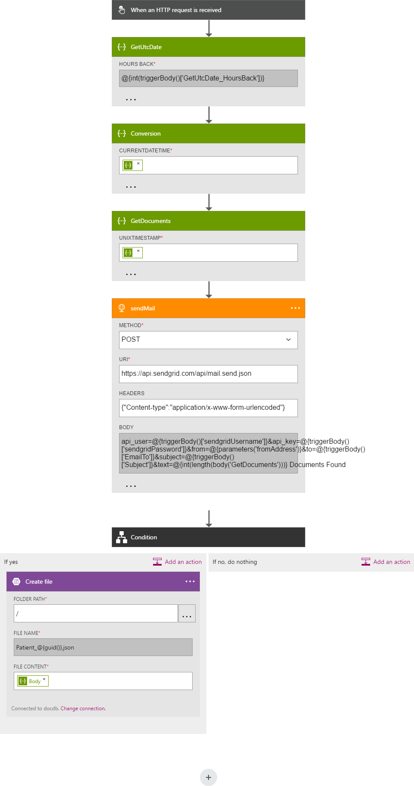

<properties 
    pageTitle="DocumentDB muutmine abil loogika rakenduste teatised | Microsoft Azure'i" 
    description="." 
    keywords="teatise muutmine"
    services="documentdb" 
    authors="hedidin" 
    manager="jhubbard" 
    editor="mimig" 
    documentationCenter=""/>

<tags 
    ms.service="documentdb" 
    ms.workload="data-services" 
    ms.tgt_pltfrm="na" 
    ms.devlang="rest-api" 
    ms.topic="article" 
    ms.date="09/23/2016" 
    ms.author="b-hoedid"/>

# <a name="notifications-for-new-or-changed-documentdb-resources-using-logic-apps"></a>Teatiste uusi või muudetud DocumentDB ressursid loogika rakenduste kasutamine

Selles artiklis pärineb ma kuvati postitatud ühte Azure'i DocumentDB Veebifoorumid küsimuse. Oli **DocumentDB ei toeta teatiste muudetud ressursse**?

Olen töötanud BizTalki serveri aastaid ja see on väga levinud stsenaariumi, kasutades [WCF Kassa adapterit](https://msdn.microsoft.com/library/bb798128.aspx). Seega olen otsustanud vaadata, kui ma võiks dubleerida DocumentDB selle funktsiooni jaoks uue ja/või muudetud dokumendid.

Selles artiklis antakse ülevaade Muuda teatise lahenduse, mis sisaldab [päästik](documentdb-programming.md#trigger) ja [Loogika rakenduse](../app-service-logic/app-service-logic-what-are-logic-apps.md)komponendid. Oluliste Koodilõigud on esitatud teksti sees ja kogu lahendus on saadaval [github](https://github.com/HEDIDIN/DocDbNotifications).

## <a name="use-case"></a>Kasutusmall

Järgmine lugu on käesoleva artikli puhul kasutada.

DocumentDB on seisund taseme seitse International (HL7) kiiresti tervishoiuteenuste Interoperability ressursid (FHIR) dokumentide hoidla. Oletame, et andmebaasi DocumentDB kombineerida API ja loogika rakenduse moodustavad serveriks HL7 FHIR.  Mõne tervishoiuasutuses on talletamine andmed on DocumentDB "Patsientide" andmebaasi. On mitu saidikogumite patsientide andmebaasis; Kliiniliste, tuvastamine jne. Patsientide teavitamise kuulub tuvastamine.  Teil on nimega "Patsientide" kogumi.

Kardioloogia osakonna on jälgimise heath ja ülesanne isikuandmeid. Uusi või muudetud patsientide kirjete otsimine on aeganõudev. Ta küsis IT-osakonna poole, kui on nii, et nad võivad saadetakse teile teatis uute või muudetud patsientide.  

IT-osakonna poole ütles, et nad võivad pakkuda seda. Nad ütlesid, et nad võivad push dokumentide [Azure'i](https://azure.microsoft.com/services/storage/) bloobimälu, nii et kardioloogia osakonna võiks neile hõlpsalt juurde.

## <a name="how-the-it-department-solved-the-problem"></a>Kuidas lahendanud IT-osakonna poole

IT-osakonna poole otsustanud selle rakenduse loomiseks see esmalt mudel.  Tore asi äriprotsessi ja esituses (BPMN) kasutamise kohta on, et tehnilise- ja mittetehnilistest inimesed saavad hõlpsalt aru selle. See teatis kogu protsessi käsitletakse äriprotsessi. 

## <a name="high-level-view-of-notification-process"></a>Üksikasjalik vaade teatis protsess

1. Käivitate loogika rakendusega, kus on timer käivitada. Vaikimisi käivitab töötab tunnis.
2. Järgmine, mida teha mõne HTTP POST loogika rakendus.
3. Loogika rakenduse teeb kogu töö.


### <a name="lets-take-a-look-at-what-this-logic-app-does"></a>Vaatame lähemalt veebisaidil, mida tähendab see loogika rakendus
Kui vaatate on näidatud järgmisel joonisel on mitu toimingut töövoo LogicApp.


Juhised on järgmised:

1. Vajate rakendusest API UTC praegune kuupäev ja kellaaeg.  Vaikeväärtus on üks tund eelmise.

2. Unix ajatempli vormingus teisendatakse UTC kuupäev ja kellaaeg. See on vaikevormingu ajatemplid DocumentDB sisse.

3. Väärtuse POSTITAMINE API rakendus, mis ei saanud DocumentDB päringu. Päringu kasutatakse väärtust.

    ```SQL
        SELECT * FROM Patients p WHERE (p._ts >= @unixTimeStamp)
    ```

    > [AZURE.NOTE] Funktsiooni _ts tähistab ajatempli metaandmete kõik DocumentDB ressursid.

4. Kui on leitud dokumente, saadetakse Azure'i bloobimälu oma vastuse keha.

    > [AZURE.NOTE] Bloobimälu nõuab Azure Storage konto. Peate Azure'i bloobimälu salvestusruumi konto ettevalmistamise ja lisage uus bloobimälu, nimega patsientide. Lisateabe saamiseks vt [kohta Azure salvestusruumi kontod](../storage/storage-create-storage-account.md) ja [Azure'i bloobimälu alustamine](../storage/storage-dotnet-how-to-use-blobs.md).

5. Lõpuks saadetakse meilisõnum, mis teavitab saajat leitud dokumentide arv. Kui dokumente ei leitud, e-posti sisu oleks "0 dokumentide Found". 

Nüüd, kui teil on aimu, milline töövoog ei, vaatame vaadata, kuidas saate rakendada.

### <a name="lets-start-with-the-main-logic-app"></a>Alustame peamine loogika rakendus

Kui olete tuttav loogika rakendused, need on saadaval [Azure'i turuplatsi](https://portal.azure.com/)ja te saate lisateavet neid [mis on loogika rakendused?](../app-service-logic/app-service-logic-what-are-logic-apps.md)

Uue loogika rakenduse loomisel küsitakse **Kuidas soovite alustada?**

Kui klõpsate tekstivälja, peate sündmuste valik. See loogika rakendus, valige **käsitsi – kui an HTTP-päring on saanud** nagu allpool näidatud.


### <a name="design-view-of-your-completed-logic-app"></a>Rakenduse lõplikus loogika kujundusvaates
Vaatame liikumiseks ja vaadake loogika rakenduse, mille nimi on DocDB lõplikus kujundusvaates.



Loogika rakenduse Designer toimingud redigeerimisel teil valida **väljundeid** HTTP-päringu või eelmise toimingu, nagu on näidatud allpool sendMail toiming.


Enne iga toimingu oma töövoo, saate teha otsus; **Toimingu lisa** või **Lisa tingimus** , nagu on näidatud järgmisel joonisel.


Kui valite **Lisa tingimus**, on esitatud kujul, nagu on näidatud järgmisel joonisel sisestada oma loogika.  See on sisuliselt business reegel.  Kui klõpsamist välja, on teil valida parameetrid eelmise toimingu valimine. Võite ka sisestada väärtused otse.


> [AZURE.NOTE] Teil on ka võimalus kõike sisestama koodi vaates.

Vaatame koodi vaates lõpetatud loogika App ülevaade.  

```JSON
   
    "$schema": "https://schema.management.azure.com/providers/Microsoft.Logic/schemas/2015-08-01-preview/workflowdefinition.json#",
    "actions": {
        "Conversion": {
            "conditions": [
                {
                    "dependsOn": "GetUtcDate"
                }
            ],
            "inputs": {
                "method": "post",
                "queries": {
                    "currentdateTime": "@{body('GetUtcDate')}"
                },
                "uri": "https://docdbnotificationapi-debug.azurewebsites.net/api/Conversion"
            },
            "metadata": {
                "apiDefinitionUrl": "https://docdbnotificationapi-debug.azurewebsites.net/swagger/docs/v1",
                "swaggerSource": "custom"
            },
            "type": "Http"
        },
        "Createfile": {
            "conditions": [
                {
                    "expression": "@greater(length(body('GetDocuments')), 0)"
                },
                {
                    "dependsOn": "GetDocuments"
                }
            ],
            "inputs": {
                "body": "@body('GetDocuments')",
                "host": {
                    "api": {
                        "runtimeUrl": "https://logic-apis-westus.azure-apim.net/apim/azureblob"
                    },
                    "connection": {
                        "name": "@parameters('$connections')['azureblob']['connectionId']"
                    }
                },
                "method": "post",
                "path": "/datasets/default/files",
                "queries": {
                    "folderPath": "/patients",
                    "name": "Patient_@{guid()}.json"
                }
            },
            "type": "ApiConnection"
        },
        "GetDocuments": {
            "conditions": [
                {
                    "dependsOn": "Conversion"
                }
            ],
            "inputs": {
                "method": "post",
                "queries": {
                    "unixTimeStamp": "@body('Conversion')"
                },
                "uri": "https://docdbnotificationapi-debug.azurewebsites.net/api/Patient"
            },
            "metadata": {
                "apiDefinitionUrl": "https://docdbnotificationapi-debug.azurewebsites.net/swagger/docs/v1",
                "swaggerSource": "custom"
            },
            "type": "Http"
        },
        "GetUtcDate": {
            "conditions": [],
            "inputs": {
                "method": "get",
                "queries": {
                    "hoursBack": "@{int(triggerBody()['GetUtcDate_HoursBack'])}"
                },
                "uri": "https://docdbnotificationapi-debug.azurewebsites.net/api/Authorization"
            },
            "metadata": {
                "apiDefinitionUrl": "https://docdbnotificationapi-debug.azurewebsites.net/swagger/docs/v1",
                "swaggerSource": "custom"
            },
            "type": "Http"
        },
        "sendMail": {
            "conditions": [
                {
                    "dependsOn": "GetDocuments"
                }
            ],
            "inputs": {
                "body": "api_user=@{triggerBody()['sendgridUsername']}&api_key=@{triggerBody()['sendgridPassword']}&from=@{parameters('fromAddress')}&to=@{triggerBody()['EmailTo']}&subject=@{triggerBody()['Subject']}&text=@{int(length(body('GetDocuments')))} Documents Found",
                "headers": {
                    "Content-type": "application/x-www-form-urlencoded"
                },
                "method": "POST",
                "uri": "https://api.sendgrid.com/api/mail.send.json"
            },
            "type": "Http"
        }
    },
    "contentVersion": "1.0.0.0",
    "outputs": {
        "Results": {
            "type": "String",
            "value": "@{int(length(body('GetDocuments')))} Records Found"
        }
    },
    "parameters": {
        "$connections": {
            "defaultValue": {},
            "type": "Object"
        },
        "fromAddress": {
            "defaultValue": "user@msn.com",
            "type": "String"
        },
        "toAddress": {
            "defaultValue": "XXXXX@XXXXXXX.net",
            "type": "String"
        }
    },
    "triggers": {
        "manual": {
            "inputs": {
                "schema": {
                    "properties": {},
                    "required": [],
                    "type": "object"
                }
            },
            "type": "Manual"
        }
    
```

Kui olete tuttav, mis tähistab erinevate jaotiste kood, saate vaadata dokumentatsiooni [Loogika rakenduse töövoo määratlus keel](http://aka.ms/logicappsdocs) .

Selle töövoo jaoks kasutate mõnda [HTTP Webhook päästik](https://sendgrid.com/blog/whats-webhook/). Kui vaatate ülaltoodud kood, kuvatakse parameetrid nagu järgmises näites.

```C#

    =@{triggerBody()['Subject']}

```

Funktsiooni `triggerBody()` tähistab kaasatud ülejäänud POSTITUSKOHT loogika rakenduse REST API keha parameetrid. Funktsiooni `()['Subject']` tähistab välja. Kõik need parameetrid moodustavad selle JSON vormindatud keha. 

> [AZURE.NOTE] Täielik juurdepääs päise ja keha päästiku taotluse peate Web konksu abil. Selle rakenduse soovite keha.

Nagu eelnevalt mainitud, saate designer määramine parameetrid või koodi vaates teha.
Kui te ei tee seda koodi vaates, siis saate määratleda, mis nõuavad väärtuse, nagu on näidatud järgmises näites kood. 

```JSON

    "triggers": {
        "manual": {
            "inputs": {
            "schema": {
                "properties": {
            "Subject": {
                "type" : "String"   

            }
            },
                "required": [
            "Subject"
                 ],
                "type": "object"
            }
            },
            "type": "Manual"
        }
        }
```

Mida te teete on luua JSON skeem, mis küsimise sisse HTTP POST keha.
Tule oma päästik, peate tagasihelistamise URL-i.  Saate teada, kuidas luua hiljem õpetuse.  

## <a name="actions"></a>Toimingud
Vaatame, mida iga toimingu meie loogika rakenduses.

### <a name="getutcdate"></a>GetUTCDate

**Päringukujundaja vaade**


**Koodi vaade**

```JSON

    "GetUtcDate": {
            "conditions": [],
            "inputs": {
            "method": "get",
            "queries": {
                "hoursBack": "@{int(triggerBody()['GetUtcDate_HoursBack'])}"
            },
            "uri": "https://docdbnotificationapi-debug.azurewebsites.net/api/Authorization"
            },
            "metadata": {
            "apiDefinitionUrl": "https://docdbnotificationapi-debug.azurewebsites.net/swagger/docs/v1"
            },
            "type": "Http"
        },

```

HTTP toimingut teostab toomine toiming.  See nõuab API rakenduse GetUtcDate meetod. Uri kasutab 'GetUtcDate_HoursBack' atribuudi kehasse päästik on möödas.  'GetUtcDate_HoursBack' väärtuseks on seatud esimese loogika rakenduses. Saate teada päästik loogika rakenduse kohta lisateavet, hiljem sisse õpetuse.

See toiming helistab teie API rakenduse UTC kuupäeva stringi väärtuse.

#### <a name="operations"></a>Toimingud

**Taotlemine**

```JSON

    {
        "uri": "https://docdbnotificationapi-debug.azurewebsites.net/api/Authorization",
        "method": "get",
        "queries": {
          "hoursBack": "24"
        }
    }

```

**Vastus**

```JSON

    {
        "statusCode": 200,
        "headers": {
          "pragma": "no-cache",
          "cache-Control": "no-cache",
          "date": "Fri, 26 Feb 2016 15:47:33 GMT",
          "server": "Microsoft-IIS/8.0",
          "x-AspNet-Version": "4.0.30319",
          "x-Powered-By": "ASP.NET"
        },
        "body": "Fri, 15 Jan 2016 23:47:33 GMT"
    }

```

Järgmise sammuna UTC kuupäeva ja kellaaja väärtuse teisendamiseks Unix ajatempli, mis on .NET kahekordsete tüüp.

### <a name="conversion"></a>Teisendamine

##### <a name="designer-view"></a>Päringukujundaja vaade


##### <a name="code-view"></a>Koodi vaade

```JSON

    "Conversion": {
        "conditions": [
        {
            "dependsOn": "GetUtcDate"
        }
        ],
        "inputs": {
        "method": "post",
        "queries": {
            "currentDateTime": "@{body('GetUtcDate')}"
        },
        "uri": "https://docdbnotificationapi-debug.azurewebsites.net/api/Conversion"
        },
        "metadata": {
        "apiDefinitionUrl": "https://docdbnotificationapi-debug.azurewebsites.net/swagger/docs/v1"
        },
        "type": "Http"
    },

```

Selles etapis tuleb teil edastada soovitud GetUTCDate tagastatud väärtus.  Pole ei leia dependsOn tingimus, mis tähendab, et GetUTCDate toiming lõpule viia. Kui ei, siis see toiming vahele. 

See toiming kõned käsitlema teisendamine rakenduse API-ga.

#### <a name="operations"></a>Toimingud

##### <a name="request"></a>Taotlemine

```JSON

    {
        "uri": "https://docdbnotificationapi-debug.azurewebsites.net/api/Conversion",
        "method": "post",
        "queries": {
        "currentDateTime": "Fri, 15 Jan 2016 23:47:33 GMT"
        }
    }   
```

##### <a name="response"></a>Vastus

```JSON

    {
        "statusCode": 200,
        "headers": {
          "pragma": "no-cache",
          "cache-Control": "no-cache",
          "date": "Fri, 26 Feb 2016 15:47:33 GMT",
          "server": "Microsoft-IIS/8.0",
          "x-AspNet-Version": "4.0.30319",
          "x-Powered-By": "ASP.NET"
        },
        "body": 1452901653
    }
```

Järgmise toimingu teete postituse toiming meie API rakendusse.

### <a name="getdocuments"></a>GetDocuments 

##### <a name="designer-view"></a>Päringukujundaja vaade


##### <a name="code-view"></a>Koodi vaade

```JSON

    "GetDocuments": {
        "conditions": [
        {
            "dependsOn": "Conversion"
        }
        ],
        "inputs": {
        "method": "post",
        "queries": {
            "unixTimeStamp": "@{body('Conversion')}"
        },
        "uri": "https://docdbnotificationapi-debug.azurewebsites.net/api/Patient"
        },
        "metadata": {
        "apiDefinitionUrl": "https://docdbnotificationapi-debug.azurewebsites.net/swagger/docs/v1"
        },
        "type": "Http"
    },

```

GetDocuments toimingute jaoks te ei kavatse teisendamine toimingu vastuse kehas edasi. See on parameetri Uri:

 
```C#

    unixTimeStamp=@{body('Conversion')}

```

QueryDocuments toiming ei HTTP POST toiming API rakendus. 

Nimega meetod on **QueryForNewPatientDocuments**.

#### <a name="operations"></a>Toimingud

##### <a name="request"></a>Taotlemine

```JSON

    {
        "uri": "https://docdbnotificationapi-debug.azurewebsites.net/api/Patient",
        "method": "post",
        "queries": {
        "unixTimeStamp": "1452901653"
        }
    }
```

##### <a name="response"></a>Vastus

```JSON

    {
        "statusCode": 200,
        "headers": {
        "pragma": "no-cache",
        "cache-Control": "no-cache",
        "date": "Fri, 26 Feb 2016 15:47:35 GMT",
        "server": "Microsoft-IIS/8.0",
        "x-AspNet-Version": "4.0.30319",
        "x-Powered-By": "ASP.NET"
        },
        "body": [
        {
            "id": "xcda",
            "_rid": "vCYLAP2k6gAXAAAAAAAAAA==",
            "_self": "dbs/vCYLAA==/colls/vCYLAP2k6gA=/docs/vCYLAP2k6gAXAAAAAAAAAA==/",
            "_ts": 1454874620,
            "_etag": "\"00007d01-0000-0000-0000-56b79ffc0000\"",
            "resourceType": "Patient",
            "text": {
            "status": "generated",
            "div": "<div>\n      \n      <p>Henry Levin the 7th</p>\n    \n    </div>"
            },
            "identifier": [
            {
                "use": "usual",
                "type": {
                "coding": [
                    {
                    "system": "http://hl7.org/fhir/v2/0203",
                    "code": "MR"
                    }
                ]
                },
                "system": "urn:oid:2.16.840.1.113883.19.5",
                "value": "12345"
            }
            ],
            "active": true,
            "name": [
            {
                    "family": [
                        "Levin"
                    ],
                    "given": [
                        "Henry"
                    ]
                }
            ],
            "gender": "male",
            "birthDate": "1932-09-24",
            "managingOrganization": {
                "reference": "Organization/2.16.840.1.113883.19.5",
                "display": "Good Health Clinic"
            }
        },

```

Järgmine toiming on [Azure ajaveebi salvestusruumi](https://azure.microsoft.com/services/storage/)dokumentide salvestamiseks. 

> [AZURE.NOTE] Bloobimälu nõuab Azure Storage konto. Peate Azure'i bloobimälu salvestusruumi konto ettevalmistamise ja lisage uus bloobimälu, nimega patsientide. Lisateavet leiate teemast [Alustamine Azure'i bloobimälu](../storage/storage-dotnet-how-to-use-blobs.md).

### <a name="create-file"></a>Faili loomine

##### <a name="designer-view"></a>Päringukujundaja vaade


##### <a name="code-view"></a>Koodi vaade

```JSON

    {
    "host": {
        "api": {
            "runtimeUrl": "https://logic-apis-westus.azure-apim.net/apim/azureblob"
        },
        "connection": {
            "name": "subscriptions/fxxxxxc079-4e5d-b002-xxxxxxxxxx/resourceGroups/Api-Default-Central-US/providers/Microsoft.Web/connections/azureblob"
        }
    },
    "method": "post",
    "path": "/datasets/default/files",
    "queries": {
        "folderPath": "/patients",
        "name": "Patient_17513174-e61d-4b56-88cb-5cf383db4430.json"
    },
    "body": [
        {
            "id": "xcda",
            "_rid": "vCYLAP2k6gAXAAAAAAAAAA==",
            "_self": "dbs/vCYLAA==/colls/vCYLAP2k6gA=/docs/vCYLAP2k6gAXAAAAAAAAAA==/",
            "_ts": 1454874620,
            "_etag": "\"00007d01-0000-0000-0000-56b79ffc0000\"",
            "resourceType": "Patient",
            "text": {
                "status": "generated",
                "div": "<div>\n      \n      <p>Henry Levin the 7th</p>\n    \n    </div>"
            },
            "identifier": [
                {
                    "use": "usual",
                    "type": {
                        "coding": [
                            {
                                "system": "http://hl7.org/fhir/v2/0203",
                                "code": "MR"
                            }
                        ]
                    },
                    "system": "urn:oid:2.16.840.1.113883.19.5",
                    "value": "12345"
                }
            ],
            "active": true,
            "name": [
                {
                    "family": [
                        "Levin"
                    ],
                    "given": [
                        "Henry"
                    ]
                }
            ],
            "gender": "male",
            "birthDate": "1932-09-24",
            "managingOrganization": {
                "reference": "Organization/2.16.840.1.113883.19.5",
                "display": "Good Health Clinic"
            }
        },

```

Toimingu kujundajas luuakse kood. Teil pole muuta koodi.

Kui olete tuttav, kasutades Azure'i bloobimälu API, leiate [Azure'i bloobimälu API kasutamise alustamine](../connectors/connectors-create-api-azureblobstorage.md).

#### <a name="operations"></a>Toimingud

##### <a name="request"></a>Taotlemine

```JSON

    "host": {
        "api": {
            "runtimeUrl": "https://logic-apis-westus.azure-apim.net/apim/azureblob"
        },
        "connection": {
            "name": "subscriptions/fxxxxxc079-4e5d-b002-xxxxxxxxxx/resourceGroups/Api-Default-Central-US/providers/Microsoft.Web/connections/azureblob"
        }
    },
    "method": "post",
    "path": "/datasets/default/files",
    "queries": {
        "folderPath": "/patients",
        "name": "Patient_17513174-e61d-4b56-88cb-5cf383db4430.json"
    },
    "body": [
        {
            "id": "xcda",
            "_rid": "vCYLAP2k6gAXAAAAAAAAAA==",
            "_self": "dbs/vCYLAA==/colls/vCYLAP2k6gA=/docs/vCYLAP2k6gAXAAAAAAAAAA==/",
            "_ts": 1454874620,
            "_etag": "\"00007d01-0000-0000-0000-56b79ffc0000\"",
            "resourceType": "Patient",
            "text": {
                "status": "generated",
                "div": "<div>\n      \n      <p>Henry Levin the 7th</p>\n    \n    </div>"
            },
            "identifier": [
                {
                    "use": "usual",
                    "type": {
                        "coding": [
                            {
                                "system": "http://hl7.org/fhir/v2/0203",
                                "code": "MR"
                            }
                        ]
                    },
                    "system": "urn:oid:2.16.840.1.113883.19.5",
                    "value": "12345"
                }
            ],
            "active": true,
            "name": [
                {
                    "family": [
                        "Levin"
                    ],
                    "given": [
                        "Henry"
                    ]
                }
            ],
            "gender": "male",
            "birthDate": "1932-09-24",
            "managingOrganization": {
                "reference": "Organization/2.16.840.1.113883.19.5",
                "display": "Good Health Clinic"
            }
        },….


```

##### <a name="response"></a>Vastus

```JSON

    {
        "statusCode": 200,
        "headers": {
        "pragma": "no-cache",
        "x-ms-request-id": "2b2f7c57-2623-4d71-8e53-45c26b30ea9d",
        "cache-Control": "no-cache",
        "date": "Fri, 26 Feb 2016 15:47:36 GMT",
        "set-Cookie": "ARRAffinity=29e552cea7db23196f7ffa644003eaaf39bc8eb6dd555511f669d13ab7424faf;Path=/;Domain=127.0.0.1",
        "server": "Microsoft-HTTPAPI/2.0",
        "x-AspNet-Version": "4.0.30319",
        "x-Powered-By": "ASP.NET"
        },
        "body": {
        "Id": "0B0nBzHyMV-_NRGRDcDNMSFAxWFE",
        "Name": "Patient_47a2a0dc-640d-4f01-be38-c74690d085cb.json",
        "DisplayName": "Patient_47a2a0dc-640d-4f01-be38-c74690d085cb.json",
        "Path": "/Patient/Patient_47a2a0dc-640d-4f01-be38-c74690d085cb.json",
        "LastModified": "2016-02-26T15:47:36.215Z",
        "Size": 65647,
        "MediaType": "application/octet-stream",
        "IsFolder": false,
        "ETag": "\"c-g_a-1OtaH-kNQ4WBoXLp3Zv9s/MTQ1NjUwMTY1NjIxNQ\"",
        "FileLocator": "0B0nBzHyMV-_NRGRDcDNMSFAxWFE"
        }
    }
```

Oma viimase sammuna tuleb saata meiliteatise

### <a name="sendemail"></a>sendEmail

##### <a name="designer-view"></a>Päringukujundaja vaade


##### <a name="code-view"></a>Koodi vaade

```JSON


    "sendMail": {
        "conditions": [
        {
            "dependsOn": "GetDocuments"
        }
        ],
        "inputs": {
        "body": "api_user=@{triggerBody()['sendgridUsername']}&api_key=@{triggerBody()['sendgridPassword']}&from=@{parameters('fromAddress')}&to=@{triggerBody()['EmailTo']}&subject=@{triggerBody()['Subject']}&text=@{int(length(body('GetDocuments')))} Documents Found",
        "headers": {
            "Content-type": "application/x-www-form-urlencoded"
        },
        "method": "POST",
        "uri": "https://api.sendgrid.com/api/mail.send.json"
        },
        "type": "Http"
    }
```

See toiming on saadetud meiliteatise.  Kasutate [SendGrid](https://sendgrid.com/marketing/sendgrid-services?cvosrc=PPC.Bing.sendgrib&cvo_cid=SendGrid%20-%20US%20-%20Brand%20-%20&mc=Paid%20Search&mcd=BingAds&keyword=sendgrib&network=o&matchtype=e&mobile=&content=&search=1&utm_source=bing&utm_medium=cpc&utm_term=%5Bsendgrib%5D&utm_content=%21acq%21v2%2134335083397-8303227637-1649139544&utm_campaign=SendGrid+-+US+-+Brand+-+%28English%29).   

Järgmine kood loodud loogika rakendus ja SendGrid, mis on [101 loogika-rakenduse sendgrid Github hoidla](https://github.com/Azure/azure-quickstart-templates/tree/master/101-logic-app-sendgrid)malli abil.
 
HTTP toiming on postitus. 

Luba parameetrid on päästik atribuudid

```JSON

    },
        "sendgridPassword": {
             "type": "SecureString"
         },
         "sendgridUsername": {
            "type": "String"
         }

        In addition, other parameters are static values set in the Parameters section of the Logic App. These are:
        },
        "toAddress": {
            "defaultValue": "XXXX@XXXX.com",
            "type": "String"
        },
        "fromAddress": {
            "defaultValue": "XXX@msn.com",
            "type": "String"
        },
        "emailBody": {
            "defaultValue": "@{string(concat(int(length(actions('QueryDocuments').outputs.body)) Records Found),'/n', actions('QueryDocuments').outputs.body)}",
            "type": "String"
        },

```

Funktsiooni emailBody on ühendades tagastatud päring, mis võib olla veel koos või "0", "Kirjete leitud" dokumentide arv. Ülejäänud parameetrid seatakse päästik parameetrid.

See toiming sõltub **GetDocuments** toiming.

#### <a name="operations"></a>Toimingud

##### <a name="request"></a>Taotlemine
```JSON

    {
        "uri": "https://api.sendgrid.com/api/mail.send.json",
        "method": "POST",
        "headers": {
        "Content-type": "application/x-www-form-urlencoded"
        },
        "body": "api_user=azureuser@azure.com&api_key=Biz@Talk&from=user@msn.com&to=XXXX@XXXX.com&subject=New Patients&text=37 Documents Found"
    }

```

##### <a name="response"></a>Vastus

```JSON

    {
        "statusCode": 200,
        "headers": {
        "connection": "keep-alive",
        "x-Frame-Options": "DENY,DENY",
        "access-Control-Allow-Origin": "https://sendgrid.com",
        "date": "Fri, 26 Feb 2016 15:47:35 GMT",
        "server": "nginx"
        },
        "body": {
        "message": "success"
        }
    }
```

Lõpuks soovite näeksid teie loogika rakenduse tulemused Azure'i portaal. Selleks, et lisada parameeter väljundeid jaotis.


```JSON

    "outputs": {
        "Results": {
            "type": "String",
            "value": "@{int(length(actions('QueryDocuments').outputs.body))} Records Found"
        }

```

See tagastab sama väärtuse, mis on saadetud meilisõnumi kehas. Järgneval joonisel on kujutatud näiteks kui "29 kirjete leitud".


## <a name="metrics"></a>Mõõdikud
Saate konfigureerida põhilise loogika rakenduse portaalis jälgimine. Võimaldab vaadata latentsuse käivitamine ja muid sündmusi, nagu järgmisel joonisel.


## <a name="docdb-trigger"></a>DocDb päästik

Loogika see rakendus on päästik, mis käivitab töövoo peamine loogika rakenduse.

Järgmisel joonisel on kuvatud päringukujundaja vaade.


```JSON

    {
        "$schema": "https://schema.management.azure.com/providers/Microsoft.Logic/schemas/2015-08-01-preview/workflowdefinition.json#",
        "actions": {
        "Http": {
            "conditions": [],
            "inputs": {
            "body": {
                "EmailTo": "XXXXXX@XXXXX.net",
                "GetUtcDate_HoursBack": "24",
                "Subject": "New Patients",
                "sendgridPassword": "********",
                "sendgridUsername": "azureuser@azure.com"
            },
            "method": "POST",
            "uri": "https://prod-01.westus.logic.azure.com:443/workflows/12a1de57e48845bc9ce7a247dfabc887/triggers/manual/run?api-version=2015-08-01-preview&sp=%2Ftriggers%2Fmanual%2Frun&sv=1.0&sig=ObTlihr529ATIuvuG-dhxOgBL4JZjItrvPQ8PV6973c"
            },
            "type": "Http"
        }
        },
        "contentVersion": "1.0.0.0",
        "outputs": {
        "Results": {
            "type": "String",
            "value": "@{body('Http')['status']}"
        }
        },
        "parameters": {},
        "triggers": {
        "recurrence": {
            "recurrence": {
            "frequency": "Hour",
            "interval": 24
            },
            "type": "Recurrence"
        }
        }
    }

```

Käivitab on seatud kordumise 24 tundi. Soovitud toiming on HTTP-POST, mis kasutab tagasihelistamise URL-i peamine loogika rakenduse. Kehatekstis leiduvad JSON skeemiga määratud parameetrid. 

#### <a name="operations"></a>Toimingud

##### <a name="request"></a>Taotlemine

```JSON

    {
        "uri": "https://prod-01.westus.logic.azure.com:443/workflows/12a1de57e48845bc9ce7a247dfabc887/triggers/manual/run?api-version=2015-08-01-preview&sp=%2Ftriggers%2Fmanual%2Frun&sv=1.0&sig=ObTlihr529ATIuvuG-dhxOgBL4JZjItrvPQ8PV6973c",
        "method": "POST",
        "body": {
        "EmailTo": "XXXXXX@XXXXX.net",
        "GetUtcDate_HoursBack": "24",
        "Subject": "New Patients",
        "sendgridPassword": "********",
        "sendgridUsername": "azureuser@azure.com"
        }
    }

```

##### <a name="response"></a>Vastus

```JSON

    {
        "statusCode": 202,
        "headers": {
        "pragma": "no-cache",
        "x-ms-ratelimit-remaining-workflow-writes": "7486",
        "x-ms-ratelimit-burst-remaining-workflow-writes": "1248",
        "x-ms-request-id": "westus:2d440a39-8ba5-4a9c-92a6-f959b8d2357f",
        "cache-Control": "no-cache",
        "date": "Thu, 25 Feb 2016 21:01:06 GMT"
        }
    }
```

Nüüd vaatame API rakendus.

## <a name="docdbnotificationapi"></a>DocDBNotificationApi

Kuigi on mitme toimingu rakenduses, lähevad ainult kasutada kolme.

* GetUtcDate
* ConvertToTimeStamp
* QueryForNewPatientDocuments

### <a name="docdbnotificationapi-operations"></a>DocDBNotificationApi toimingud
Heitkem pilk ärplema dokumentatsiooni kohta

> [AZURE.NOTE] Teil helistada väliselt toimingute lubamiseks peate lisama CORS, mis on lubatud origin väärtuse "*" (ilma jutumärkideta) sätteid API rakenduse, nagu on näidatud järgmisel joonisel.


#### <a name="getutcdate"></a>GetUtcDate


#### <a name="converttotimestamp"></a>ConvertToTimeStamp


#### <a name="queryfornewpatientdocuments"></a>QueryForNewPatientDocuments


Heitkem pilk koodide seda toimingut.

#### <a name="getutcdate"></a>GetUtcDate

```C#

    /// <summary>
    /// Gets the current UTC Date value
    /// </summary>
    /// <returns></returns>
    [H ttpGet]
    [Metadata("GetUtcDate", "Gets the current UTC Date value minus the Hours Back")]
    [SwaggerOperation("GetUtcDate")]
    [SwaggerResponse(HttpStatusCode.OK, type: typeof (string))]
    [SwaggerResponse(HttpStatusCode.InternalServerError, "Internal Server Operation Error")]
    public string GetUtcDate(
       [Metadata("Hours Back", "How many hours back from the current Date Time")] int hoursBack)
    {


        return DateTime.UtcNow.AddHours(-hoursBack).ToString("r");
    }
```

See toiming tagastab lihtsalt tagastab praeguse UTC DateTime miinus HoursBack väärtus.

#### <a name="converttotimestamp"></a>ConvertToTimeStamp

``` C#

        /// <summary>
        ///     Converts DateTime to double
        /// </summary>
        /// <param name="currentdateTime"></param>
        /// <returns></returns>
        [Metadata("Converts Universal DateTime to number")]
        [SwaggerResponse(HttpStatusCode.OK, null, typeof (double))]
        [SwaggerResponse(HttpStatusCode.BadRequest, "DateTime is invalid")]
        [SwaggerResponse(HttpStatusCode.InternalServerError)]
        [SwaggerOperation(nameof(ConvertToTimestamp))]
        public double ConvertToTimestamp(
            [Metadata("currentdateTime", "DateTime value to convert")] string currentdateTime)
        {
            double result;

            try
            {
                var uncoded = HttpContext.Current.Server.UrlDecode(currentdateTime);

                var newDateTime = DateTime.Parse(uncoded);
                //create Timespan by subtracting the value provided from the Unix Epoch
                var span = newDateTime - new DateTime(1970, 1, 1, 0, 0, 0, 0).ToLocalTime();

                //return the total seconds (which is a UNIX timestamp)
                result = span.TotalSeconds;
            }
            catch (Exception e)
            {
                throw new Exception("unable to convert to Timestamp", e.InnerException);
            }

            return result;
        }

```

See toiming teisendab vastuse GetUtcDate toimingu kahekordne väärtus.

#### <a name="queryfornewpatientdocuments"></a>QueryForNewPatientDocuments

```C#

        /// <summary>
        ///     Query for new Patient Documents
        /// </summary>
        /// <param name="unixTimeStamp"></param>
        /// <returns>IList</returns>
        [Metadata("QueryForNewDocuments",
            "Query for new Documents where the Timestamp is greater than or equal to the DateTime value in the query parameters."
            )]
        [SwaggerOperation("QueryForNewDocuments")]
        [SwaggerResponse(HttpStatusCode.OK, type: typeof (Task<IList<Document>>))]
        [SwaggerResponse(HttpStatusCode.BadRequest, "The syntax of the SQL Statement is incorrect")]
        [SwaggerResponse(HttpStatusCode.NotFound, "No Documents were found")]
        [SwaggerResponse(HttpStatusCode.InternalServerError, "Internal Server Operation Error")]
        // ReSharper disable once ConsiderUsingAsyncSuffix
        public IList<Document> QueryForNewPatientDocuments(
            [Metadata("UnixTimeStamp", "The DateTime value used to search from")] double unixTimeStamp)
        {
            var context = new DocumentDbContext();
            var filterQuery = string.Format(InvariantCulture, "SELECT * FROM Patient p WHERE p._ts >=  {0}",
                unixTimeStamp);
            var options = new FeedOptions {MaxItemCount = -1};


            var collectionLink = UriFactory.CreateDocumentCollectionUri(DocumentDbContext.DatabaseId,
                DocumentDbContext.CollectionId);

            var response =
                context.Client.CreateDocumentQuery<Document>(collectionLink, filterQuery, options).AsEnumerable();

            return response.ToList();
    }

```

See toiming kasutab [DocumentDB.NET SDK](documentdb-sdk-dotnet.md) dokumendi päringu loomiseks. 

```C#
     CreateDocumentQuery<Document>(collectionLink, filterQuery, options).AsEnumerable();
```

Vastuse ConvertToTimeStamp toimingu (unixTimeStamp) edastatakse. Toiming tagastab loendi dokumentide `IList<Document>`.

Varem rääkisime soovitud CallbackURL. Peamine loogika rakenduse töövoo käivitamiseks peate helistama abil soovitud CallbackURL.

## <a name="callbackurl"></a>CallbackURL

Käivitamiseks peate Azure AD Turbeloa.  See võib olla keeruline saada see Turbeloa. Otsin on lihtne meetod ja Jeff Hollan, kes on Azure loogika rakenduse programm juht, on soovitatav [armclient](http://blog.davidebbo.com/2015/01/azure-resource-manager-client.html) PowerShelli abil.  Saate installida selle juhiseid järgides.

Need toimingud, mida soovite kasutada on kasutajanimi ja kõne ARM API.
 
Logi sisse: Saate kasutada sama identimisteavet Azure portaali sisse logida. 

Kõne ARM Api toiming on üks, mis loob teie CallBackURL.

PowerShelli, saate helistada see järgmiselt:  

```powershell

    ArmClient.exe post https://management.azure.com/subscriptions/[YOUR SUBSCRIPTION ID/resourcegroups/[YOUR RESOURCE GROUP]/providers/Microsoft.Logic/workflows/[YOUR LOGIC APP NAME/triggers/manual/listcallbackurl?api-version=2015-08-01-preview

```

Tulemi peaks välja nägema umbes järgmine:

```powershell

    https://prod-02.westus.logic.azure.com:443/workflows/12a1de57e48845bc9ce7a247dfabc887/triggers/manual/run?api-version=2015-08-01-prevaiew&sp=%2Ftriggers%2Fmanual%2Frun&sv=1.0&sig=XXXXXXXXXXXXXXXXXXX

```

Saate tööriista nagu [postiljon](http://www.getpostman.com/) testimiseks peamine loogika rakenduse, nagu on näidatud järgmisel joonisel.


Järgmises tabelis on loetletud päästik parameetrid, mis moodustavad DocDB päästik loogika rakenduse keha.

Parameetri | Kirjeldus 
--- | --- 
GetUtcDate_HoursBack | Tundide otsingu alguskuupäev arvu seadmiseks
sendgridUsername | Tundide otsingu alguskuupäev arvu seadmiseks
sendgridPassword | Kasutajanimi ruudustiku saatmine e-posti jaoks
Postiga – | E-posti aadressi, mis saadetakse teatis e-posti
Teema | E-posti teema

## <a name="viewing-the-patient-data-in-the-azure-blob-service"></a>Azure'i bloobimälu teenuse patsientide andmete vaatamine

Minge oma Azure Storage konto ja valige jaotises teenused plekid, nagu on näidatud järgmisel joonisel.

 

On võimalik vaadata patsientide bloobimälu faili teavet, nagu allpool näidatud.


## <a name="summary"></a>Kokkuvõte

Ülevaate, olete õppinud järgmist:

* On võimalik rakendada DocumentDB teatised.
* Loogika rakenduste abil automatiseerida protsessi.
* Loogika rakenduste abil saate vähendada aega kulub taotluse esitamisel.
* HTTP kaudu saab kasutada lihtne loogika rakenduses rakendus API-ga.
* Saate hõlpsalt luua CallBackURL, mis asendab HTTP kuulajale.
* Saate hõlpsasti luua kohandatud töövoogude loogika rakenduste kujundajaga.

Oluline on plaanima ja oma töövoo mudel.

## <a name="next-steps"></a>Järgmised sammud
Laadige alla ja esitatud [github](https://github.com/HEDIDIN/DocDbNotifications)loogika rakenduse kood. Tere tulemast rakenduse koostamine ja esitage repo muudatustest. 

DocumentDB kohta lisateabe saamiseks külastage [Õppeteema](https://azure.microsoft.com/documentation/learning-paths/documentdb/).
