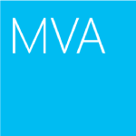

<properties
  pageTitle="DocumentDB ühenduse & Uudised | Microsoft Azure'i"
  description="Liitumine Azure'i DocumentDB ühenduse luua seoseid, oma ja täpsustamiseks teie oskusi."
  services="documentdb"
  documentationCenter=""
  authors="aliuy"
  manager="johnmac"
  editor="mimig"/>

<tags
  ms.service="documentdb"
  ms.devlang="na"
  ms.topic="article"
  ms.tgt_pltfrm="na"
  ms.workload="data-services"
  ms.date="09/26/2016"
  ms.author="andrl"/>

# Kogukonnafoorumi portaal

## Ühenduse tulipunkt

Andke meile edendada projekti! Näitab meile võimas projekti, millega töötate DocumentDB ja aitame oma geenius jagamine kogu maailmaga. Projekti esitada, saatke meile e-posti aadressil: [askdocdb@microsoft.com](mailto:askdocdb@microsoft.com).

### documentdb-lumenize

*Larry Maccherone järgi*

Liitmised (Group by, PivotTable-liigendtabeli ja N mitmedimensioonilised kuup) ja sarja teisendused nimega DocumentDB salvestatud toimingute ajastamine.

Vaadake seda [Github](https://github.com/lmaccherone/documentdb-lumenize) ja [npm](https://www.npmjs.com/package/lumenize).

### DocumentDB Studio

*Mingi Liu järgi*

Mõne kliendi halduse Vieweri/explorer teenuse Microsoft Azure'i DocumentDB.

Vaadake seda [github](https://github.com/mingaliu/DocumentDBStudio).

### DoQmentDB

*Ariel Mashraki järgi*

DoQmentDB on Node.js lubadus-põhine klient, MongoDB nagu kiht peal DocumentDB sisaldava.

Vaadake seda [Github](https://github.com/a8m/doqmentdb) ja [npm](https://www.npmjs.com/package/doqmentdb).

### Ärplema REST API-ga DocumentDB

*Howard Edidin järgi*

DocumentDB REST API ärplema faili, mida saab hõlpsalt kasutada rakenduse API-ga.

Vaadake seda [github](https://github.com/HEDIDIN/DocumentDB-REST/tree/master/DocumentDBRestApi).

### Fluenti lisandmooduli documentdb

*Yoichi Kawasaki*

Fluenti lisandmoodul documentdb on Fluentd lisandmooduli jaoks kirjutamine Azure'i DocumentDB abil.

Vaadake seda [Github](https://github.com/yokawasa/fluent-plugin-documentdb) ja [rubygems](https://rubygems.org/gems/fluent-plugin-documentdb).

*Mitme avatud allika leidmiseks DocumentDB projektide [github](https://github.com/search?p=4&q=documentdb&type=Repositories).*

## Uudiseid, Ajaveebid ja artiklid

Saate ajakohasuse DocumentDB uudiseid ja funktsioonide järgmised [meie ajaveebi](https://azure.microsoft.com/blog/tag/documentdb/).

**Kogukonnafoorumi postitusi:**

- [**Läheb Social koos DocumentDB**](https://blogs.msdn.microsoft.com/mvpawardprogram/2016/03/15/going-social-with-documentdb/) - *Matias Quarantaas järgi*

- [**UWP, Azure rakenduse teenuste ja DocumentDB supp: fotode ühiskasutuse rakenduse**](https://blogs.windows.com/buildingapps/2016/03/17/uwp-azure-app-services-and-documentdb-soup-a-photo-sharing-app/) - *Eric Langland järgi*

- [**Teatiste abil loogika rakenduste uusi või muudetud DocumentDB ressursid**](documentdb-change-notification.md) - *Howard Edidin järgi*

- [**Kogumiseks logide abil Azure'i DocumentDB abil Fluenti lisandmooduli documentdb**](http://unofficialism.info/posts/collecting-logs-into-azure-documentdb-using-fluent-plugin-documentdb/) - *Yoichi Kawasaki*

- [**DocumentDB ülevaatamine osa 1/2 – teooria**](https://peterintheazuresky.wordpress.com/2016/02/19/documentdb-revisited-part-12-the-theory/) - *Peter Mannerhult järgi*

- [**Mida kuulda ja vihkan kohta Azure DocumentDB**](http://blog.falafel.com/4-what-to-love-and-hate-about-azures-documentdb/) - *George Saadeh järgi*

- [**Azure'i DocumentDB serveripoolne skriptimise**](https://www.simple-talk.com/cloud/cloud-data/azure-documentdb-server-side-scripting/) - *Robert Sheldon järgi*

- [**Nagu andmete DocumentDB valamu Azure'i voo Analyticsi**](http://janatdevelopment.com/2015/12/11/documentdb-as-a-data-sink-for-azure-stream-analytics/?utm_source=twitterfeed&utm_medium=twitter) - *, Jaan Hentschel*

- [**Azure'i DocumentDB valmistamisel!** ](http://blog.nexapp.ca/2015/11/30/azure-documentdb-in-production/)  -  *Alexandre Walsh ja Marc-Olivier Duval*

- [**Azure'i otsingu Indexers – DocumentDB päringute (Hispaania)**](http://www.ealsur.com.ar/wp/index.php/2015/11/19/azure-search-indexers-documentdb-queries/) - *Matthias Quaranta järgi*

- [**Azure SQL-i DocumentDB päringu põhitõed (Jaapani)**](http://beachside.hatenablog.com/entry/2015/12/06/000045) - *Atsushi Yokohama järgi*

- [**Andmepunktide - Aurelia vastab DocumentDB: On kosjasobitaja reisi**](https://msdn.microsoft.com/magazine/mt620011.aspx) - *, Julie Lerman*

- [**Taristu kood ja pidev Node.js + Azure'i DocumentDB lahenduse juurutamine**](http://www.talmeida.net/blog/2015/10/26/infrastructure-as-code-and-continuous-deployment-of-a-nodejs-azure-documentdb-solution) - *Thiago Almedia järgi*

- [**Miks DocumentDb on hea äri mõttekas teatud projektide**](http://www.iquestllc.com/blogs/read/405/why-documentdb-makes-good-business-sense-for-some-projects) - *Samuel Uresin järgi*

- [**Azure'i DocumentDB arengu edasiliikumine – arengu kliendi klassi (1 / 2) (Jaapani)**](http://beachside.hatenablog.com/entry/2015/10/01/202734) - *Atsushi Yokohama järgi*

- [**Asjad, mida peaksite teadma, kui kasutate Azure DocumentDB (Jaapani keel)**](http://beachside.hatenablog.com/entry/2015/10/01/202734) - *Atsushi Yokohama järgi*

- [**Tegelemine Azure'i DocumentDB RequestRateTooLarge tõrgete ja jõudluse testimine**](http://blogs.msdn.com/b/bigdatasupport/archive/2015/09/02/dealing-with-requestratetoolarge-errors-in-azure-documentdb-and-testing-documentdb-performance.aspx) - *Azim Uddin järgi*

- [**Andmepunktide – ülevaade Microsoft Azure'i DocumentDB**](https://msdn.microsoft.com/magazine/mt147238.aspx) - *, Julie Lerman*

- [**Kasutades DocumentDB F #**](https://jamessdixon.wordpress.com/2014/12/30/using-documentdb-with-f/) - *Jamie Dixon järgi*

- [**Analüüsimiseks rakenduse logib koos DocumentDB**](http://vincentlauzon.com/2015/09/06/analysing-application-logs-with-documentdb/) - *Vincent-Philippe Lauzon järgi*

- [**Azure'i DocumentDB – aja varukoopiate punkti**](http://softwarejuancarlos.com/2015/09/06/azure-documentdb-point-in-time-backups/) - *, Juan Carlos Sanchez*

*Kas teil on ajaveebipostitus, proovi kood või juhtumianalüüsi, mida soovite ühiskasutusse anda? [Andke meile teada](mailto:askdocdb@microsoft.com)!*

## Sündmuste ja Lindistused

### Ja eelseisvate sündmused

| Sündmuse nimi                                                                                                                 | Kõlar                                                     | Asukoht             | Kuupäev                     | #-Sildi profiililehe |
| -------------------------------------------------------------------------------------------------------------------------- | ----------------------------------------------------------- | -------------------- | ------------------------ | ------- |
| [Otsa 2016](https://myignite.microsoft.com/sessions?q=documentdb)  [Ettekande: Lubamine digitaalse teisendus Joseph Sirosh mõistlik tõhustada A.C.I.D abil](https://myignite.microsoft.com/sessions/34953)  [Seansi: Azure'i DocumentDB suuri tasandil: kliendi edu ja kujunduse mustrite Süüria Kumar Nair ja Andrew Liu](https://myignite.microsoft.com/sessions/3066)  [Seansi: Haldamine Node.js ja DocumentDB koos Joshua Davis asjade varad](https://myignite.microsoft.com/sessions/39704)  [Seansi: Koostada nutikamalt ja scalable rakenduste Microsoft Azure'i andmebaasi teenuste kasutamisel koos Tara Jana ja Moshe Gutman](https://myignite.microsoft.com/sessions/2633)| Andrew Liu, Süüria Kumar Nair ja Tara Jana | Tartu, GA | 26-30 mai 2016 | [#MSIgnite](https://twitter.com/MS_Ignite) |
| [Veebisaidil Ignite Meetup: DocumentDB: täiustatud funktsioone suuremahuliste rakendused](http://www.meetup.com/Azure-in-the-ATL/events/234252070/) | Andrew Liu, Süüria Kumar Nair |  Tartu, GA | 27 mai 2016 | [#MSIgnite](https://twitter.com/MS_Ignite)[@FlatironCity](https://twitter.com/FlatironCity) |
| [Kihtide + Hadoopi maailmas](http://conferences.oreilly.com/strata/hadoop-big-data-ny/?cmp=kn-data-confreg-home-stny16_bing_branded) | Tule külastage meie boksi! | New York, NY | 26-29 mai 2016 | [#StrataConf](https://twitter.com/strataconf) |
| [Muutmine linna .NET kasutajate rühma](http://www.meetup.com/tally-dot-net/events/233768568/) | Santosh Hari | Tallinn, FL | 3 november 2016 | n/a |

*Kas räägib või majutuse sündmuse? [Andke meile teada,](mailto:askdocdb@microsoft.com) kuidas me saame aidata!*

### Eelmise sündmused ja lindistuste

| Sündmuse nimi                                                                                                                 | Kõlar                                                     | Asukoht             | Kuupäev                   | Salvestamise |
| -------------------------------------------------------------------------------------------------------------------------- | ----------------------------------------------------------- | -------------------- | ---------------------- | --------- |
| [DevTeach](http://devteach.com/) | Ken Cenerelli  | Hiina | 4-8 juuli 2016 | [NoSQL, pole probleemi Azure DocumentDB abil](http://www.slideshare.net/KenCenerelli) |
| [Integratsioon ja asjade](http://www.btug.be/events) | Eldert Grootenboer | Kontich, Belgia | 30 juuni 2016 | n/a |
| [MongoDB maailma 2016](https://www.mongodb.com/world16) | Kirill Gavrylyuk | New York, New York | 28-29 juuni 2016 | n/a |
| [Integreerimine kasutaja rühma](http://www.integrationusergroup.com/do-logic-apps-support-error-handling/) | Howard S. Edidin | Veebiesitlus | 20 juuni 2016 | [Kas loogika rakendused toetavad vigade käsitlemise?](http://www.integrationusergroup.com/do-logic-apps-support-error-handling/) |
| [Meetup: Suurbritannia Azure'i kasutaja rühma](http://www.meetup.com/UKAzureUserGroup/events/229673468/)| Andrew Liu  | Londoni aja järgi, Suurbritannia | 12 mai 2016 | n/a
|[Meetup: ONETUG - Orlando .NET kasutaja rühma](http://www.meetup.com/ONETUG/events/230797164/)| Santosh Hari| Orlando, FL| 12 mai 2016| n/a 
| [SQLBits XV](https://sqlbits.com/)                                                                                         | Andrew Liu, Tavahind Ramachandran                            | Liverpool, Suurbritannia        | 4-7 mai 2016            | n/a| 
| [Meetup: NYC .NET arendajad rühma](http://www.meetup.com/NYC-NET-Developers/events/230396260/)                            | Leonard Lobel                                               | New York Cityt, NY    | 21 aprill 2016           | n/a |
| [Integreerimine kasutaja rühma](http://www.integrationusergroup.com/#)                                                            | Howard Edidin                                               | Veebiseminar              | 25 aprill 2016           | n/a |
| [Globaalne Azure Bootcamp: SoCal](http://xprs.imcreator.com/free/vishalishere/gab2016)                                        | Leonard Lobel                                               | Oranž, CA           | 16 Aprill 2016           | n/a |
| [Globaalne Azure Bootcamp: Redmond](https://www.eventbrite.com/e/2016-global-azure-bootcamp-redmond-wa-tickets-21387752343)   | David Makogon                                               | Redmond, WA          | 16 Aprill 2016           | n/a |
| [SQL-i laupäev #481 - Iisrael 2016](http://www.sqlsaturday.com/481/Sessions/Details.aspx?sid=40912)                          | Leonard Lobel                                               | HaMerkaz, Iisrael     | 04 aprill 2016         | n/a |
| [Koosta 2016](https://build.microsoft.com/)                                                                                 | John Macintyre                                              | San Francisco, CA    | 31 märts 2016         | [Pakkuda rakendused skaala DocumentDB Azure NoSQL dokumendi andmebaas](https://channel9.msdn.com/Events/Build/2016/B840)
| [SQL-i laupäev #505 - Belgia 2016](http://www.sqlsaturday.com/505/Sessions/Details.aspx?sid=44217)                         | Mihail Mateev                                               | Suurbritannia     | 19 märts 2016         | n/a |
| [Meetup: CloudTalk](http://www.meetup.com/CloudTalk/events/227963695/)                                                     | Kirat Pandya                                                | Pärnus asuva, WA         | 3 märts 2016          | n/a |
| [Meetup: Azure'i Austin](http://www.meetup.com/azureaustin/events/228209275/)                                                | Merwan Chinta                                               | Arvustus           | 28 Jaanuar 2016       | n/a |
| [Meetup: msdevmtl](http://www.meetup.com/msdevmtl/events/223839818/)                                                       | Vincent-Philippe Lauzon                                     | QC, Kreeka | 1 Detsember 2015       | n/a |
| [Meetup: SeattleJS](http://www.meetup.com/seattlejs/events/220102664/)                                                     | David Makogon                                               | Seattle, WA          | 12 November 2015      | n/a |
| [LIIGU Summit 2015](http://www.sqlpass.org/summit/2015/)                                                                    | Jeff Renz, Andrew Hoh, Tavahind Ramachandran John Macintyre | Seattle, WA          | 27-30 oktoober 2015    | [Tänapäevane rakenduste Azure](https://www.youtube.com/watch?v=k5Z24HX-RyQ) |
| [CloudDevelop 2015](http://www.clouddevelop.org/)                                                                          | David Makogon Ryan Crawcour                                | Columbus, OH         | 23 Oktoober 2015       | n/a |
| [SQL-i laupäev #454 - Torino 2015](http://www.sqlsaturday.com/454/Sessions/Details.aspx?sid=40130)                           | Marco De Nittis                                             | Taani         | 10 Oktoober 2015       | n/a |
| [SQL-i laupäev #430 - Sofia 2015](http://www.sqlsaturday.com/430/Sessions/Details.aspx?sid=36090)                           | Leonard Lobel                                               | Bulgaaria      | 10 Oktoober 2015       | n/a |
| [SQL-i laupäev #444 - CBS 2015](http://www.sqlsaturday.com/444/Sessions/Details.aspx?sid=38576)                     | Jeff Renz                                                   | Kansas City, e      | 3 oktoober 2015        | n/a |
| [SQL-i laupäev #429 - Oporto 2015](http://www.sqlsaturday.com/429/Sessions/Details.aspx?sid=36089)                          | Leonard Lobel                                               | Oporto, Portugal     | 3 oktoober 2015        | n/a |
| [AzureCon](https://azure.microsoft.com/azurecon/)                                                                          | David Makogon, Ryan Crawcour, John Macintyre                | Virtuaalüritus        | 29 mai 2015     | [Azure'i andmed ja analytics platvormi](https://channel9.msdn.com/events/Microsoft-Azure/AzureCon-2015/ACON207) [DocumentDB NoSQL andmetega töötamine](https://channel9.msdn.com/Events/Microsoft-Azure/AzureCon-2015/ACON338) |
| [SQL-i laupäev #434 - Holland 2015](http://www.sqlsaturday.com/434/Sessions/Details.aspx?sid=36413)                         | Leonard Lobel                                               | Soome | 26 mai 2015     | [Azure'i DocumentDB tutvustus](https://channel9.msdn.com/Blogs/Windows-Azure/SQL-Saturday-Holland-2015-Introduction-to-Azure-DocumentDB) |
| [SQL-i laupäev #441 - Denver 2015](http://www.sqlsaturday.com/441/Sessions/Details.aspx?sid=39191)                          | Jeff Renz                                                   | Denver, CO           | 19 mai 2015     | n/a |
| [Meetup: San Francisco Bay Area Azure arendajad](http://www.meetup.com/bayazure/events/223943785/)                        | Andrew Liu                                                  | San Francisco, CA    | 15 mai 2015     | n/a |
| [Valgevene Azure'i kasutaja rühma vasta-Up](https://www.facebook.com/events/786540124800276/)                                       | Alex Zyl                                                    | Minsk, Valgevene       | 9 mai 2015      | [Sissejuhatus DocumentDB mõistet ülevaade, järjepidevuse taset, sharding strateegiad](https://www.youtube.com/watch?v=Uc_qwWzJKH8) |
| [NoSQL nüüd!](http://nosql2015.dataversity.net/)                                                                            | David Makogon Ryan Crawcour                                | Eesti         | 18-20 august 2015     | n/a |
| [@ScaleSeattle](http://www.atscaleconference.com/)                                                                        | Dharma Shukla                                               | Seattle, WA          | 17 juuni 2015          | [Skeemi agnostik koos Azure DocumentDB indekseerimine](https://www.youtube.com/watch?v=VJQ_5qFFVP4) |
| [Tehnoloogia värskendamine 2015](https://channel9.msdn.com/Events/DXPortugal/Tech-Refresh-2015)                                         | Bruno Lopes                                                 | Riigiarhiivis     | 15 juuni 2015          | [DocumentDB 101](https://channel9.msdn.com/Events/DXPortugal/Tech-Refresh-2015/DPDEV01) |
| [SQL-i laupäev #417 - Filipiinid 2015](http://www.sqlsaturday.com/417/Sessions/Details.aspx?sid=21415)                       | Mihail Mateev                                               | Colombo, Suurbritannia   | 06 juuni 2015          | n/a |
| [Meetup: Seattle skaleeritavus Meetup](http://www.meetup.com/Seattle-Scalability-Meetup/events/204010442/)                    | Dharma Shukla                                               | Seattle, WA          | 27 mai 2015           | n/a |
| [SQL-i laupäev #377 - Kiiev 2015](http://www.sqlsaturday.com/377/Sessions/Details.aspx?sid=20322)                            | Mihail Mateev                                               | Kirjutas        | 23 mai 2015           | n/a |
| [Andmebaasi kuu](http://www.databasemonth.com/database/azure-documentdb)                                                   | Dharma Shukla                                               | New York, NY         | 19 mai 2015           | [Azure'i DocumentDB: Oluliselt Scalable, mitme rentniku dokumendi andmebaasi teenus.](https://www.youtube.com/watch?v=iZsqBc3Dkbk) |
| [Meetup: Londoni SQL serveri kasutaja rühma](http://www.meetup.com/London-SQL-Server-User-Group/events/221525058/)               | Allan Mitchell                                              | Londoni aja järgi, Suurbritannia           | 19 mai 2015           | n/a |
| [DevIntersection](https://devintersection.com/)                                                                            | Andrew Liu                                                  | Scottsdale z       | 18-21 mai 2015        | n/a |
| [Meetup: Seattle Web App arendajad rühma](http://www.meetup.com/Seattle-Web-App-Developers-Group/events/220591071/)       | Andrew Liu                                                  | Seattle, WA          | 14 mai 2015           | n/a |
| [Otsa](http://ignite.microsoft.com/)                                                                                     | Andrew Hoh John Macintyre                                  | Chicago, IL          | 4-8 mai 2015          | [Valige Viimane kaudu DocumentDB video](https://azure.microsoft.com/documentation/videos/microsoft-ignite-2015-select-latest-from-microsoft-azure-documentdb/) [DocumentDB ja Azure Hdinsighti: parem koos video](https://azure.microsoft.com/documentation/videos/microsoft-ignite-2015-microsoft-azure-documentdb-and-azure-hdinsight-better-together/) |
| [Koosta 2015](http://www.buildwindows.com/)                                                                                 | Ryan Crawcour                                               | San Francisco, CA    | Aprill 29-1 mai 2015 | [Koostage järgmine suur asi Azure NoSQL teenusega: DocumentDB](https://channel9.msdn.com/Events/Build/2015/2-729) |
| [Globaalne Azure Bootcamp 2015 - Hispaania](http://azurebootcamp.es/)                                                             | Luis Ruiz Pavon, Roberto Gonzalez                           | Hispaania        | 25 aprill 2015         | [#DEAN DocumentDB + AngularJS + Express NodeJS töötavate Azure](https://channel9.msdn.com/events/Developers-Spain-Events/Global-Azure-Bootcamp-2015/DEAN-DocumentDB--Express--AngularJS--NodeJS-running-on-Azure) |
| [Meetup: Azure'i kasutajagruppi Taani](http://www.meetup.com/Azure-Usergroup-Denmark/events/221026670/)                         | Christian Holm Diget                                        | Taani  | 16 aprill 2015         | n/a |
| [Meetup: Charlotte Microsofti pilveteenuse](http://www.meetup.com/Charlotte-Microsoft-Cloud/events/221503519/)                     | Jamie Rance                                                 | Charlotte, NC        | 8 aprill 2015          | n/a |
| [SQL-i laupäev #375 - Edenvale 2015](http://www.sqlsaturday.com/375/Sessions/Details.aspx?sid=15289)                  | IKE Ellis                                                   | Mountain View, CA    | 28 märts 2015         | n/a |
| [Meetup: Istanbul Azure Meetup](http://www.meetup.com/istanbul-azure-meetup/events/220325538/)                             | Daron Yondem                                                | Soome     | 7 märts 2015          | n/a |
| [Meetup: järvede ala .net kasutaja rühma](http://www.meetup.com/Great-Lakes-Area-NET-User-Group-MIGANG/events/220364576/) | Michael Collier                                             | Southfield, MI       | 18 veebruar 2015      | n/a |
| [TechX Azure](https://www.youtube.com/channel/UCDRlI2E4z5qmHsBXTrFOE2Q)                                                    | Magnus Mårtensson                                           | Linnaosapiirkonnas.    | 28-29 jaanuar 2015    | [DocumentDB Azure uue NoSQL suvand pilveteenuses](https://www.youtube.com/watch?v=Hw7hDYoChNI) |

### Videote ja netisaadete

| Kuva                                        | Kõlar                     | Kuupäev               | Episood |
| ------------------------------------------- | --------------------------- | ------------------ | ------- |
| Kanali 9: Microsoft + Ava allikas          | Jose Miguel Parrella         | 14 aprill 2016    | [TÄHENDAB, et DEAN Azure Bitnami, VM skaala komplektid ja DocumentDB kaudu](https://channel9.msdn.com/Blogs/Open/From-MEAN-to-DEAN-in-Azure-with-Bitnami-VM-Scale-Sets-and-DocumentDB) |
| Wired2WinWebinar                            | Sai Sankar Kunnathukuzhiyil | 9 märts 2016      | [Azure'i DocumentDB lahendusi arendamise](https://www.youtube.com/watch?v=xKttEwXv_bs)
| Integreerimine kasutaja rühma                      | Han Wong                    | 17 veebruar 2016  | [Analüüsimine ja DocumentDB + Power BI-relatsiooniliste andmete visualiseerimine](http://www.integrationusergroup.com/analyze-visualize-non-relational-data-documentdb-power-bi/) |
| Azure'i saade                           | Mastaabi tippu                 | 14 Jaanuar 2016   | [Episode 110: DocumentDB ja otsingu abil](http://azpodcast.azurewebsites.net/post/Episode-110-Using-DocumentDB-Search) |
| Kanali 9: Tänapäevased rakendused              | Tara Shankar Jana           | 13 Detsember 2016  | [Tänapäevane lähenemine viimine rakenduste andmed](https://channel9.msdn.com/Series/Modern-Applications/Take-a-modern-approach-to-data-in-your-apps) |
| NinjaTips                                   | Miguel Quintero             | 10 Detsember 2015  | [DocumentDB - Un vistazo üldine](https://channel9.msdn.com/Series/Ninja-Tips/31-NinjaTips-Desarrollo-DocumentDB-1-Vistazo-general) |
| Integreerimine kasutaja rühma                      | Howard Edidin               | 9 November 2015   | [Azure'i DocumentDB tervishoiuteenuste integreerimiseks – osa 2](http://www.integrationusergroup.com/azure-documentdb-for-healthcare-integration-part-2/) |
| Integreerimine kasutaja rühma                      | Howard Edidin               | 5 oktoober 2015    | [Azure'i DocumentDB tervishoiuteenuste integreerimiseks](http://www.integrationusergroup.com/?event=azure-documentdb-and-biztalk) |
| DX Itaalia - #TecHeroes                       | Alessandro Melchiori        | 2 oktoober 2015    | [#TecHeroes - DocumentDB](https://channel9.msdn.com/Shows/TecHeroes/TecHeroes-DocumentDB) |
| Microsofti pilveteenuste Kuva - Podcast              | Andrew Liu                  | 30 mai 2015 | [Episood 099 - Azure'i DocumentDB Andrew Liu](http://www.microsoftcloudshow.com/podcast/Episodes/099-azure-documentdb-with-andrew-liu) |
| .NET rocks!  -Podcast                      | Ryan Crawcour               | 29 mai 2015 | [Andmed koos Ryan CrawCour DocumentDB](https://www.dotnetrocks.com/?show=1197) |
| Esitatud andmed                                | Ryan Crawcour               | 28 mai 2015 | [Mis on uut Azure'i DocumentDB alates GA](https://channel9.msdn.com/Shows/Data-Exposed/Whats-New-with-Azure-DocumentDB-Since-GA) |
| Azure'i saade                           | Mastaabi tippu                 | Detsember 17, 2015 | [Episode 94: azpodcast.com re-arhitektuur](http://azpodcast.azurewebsites.net/post/Episode-94-azpodcastcom-re-architecture) |
| Pilveteenuse tiitelleht                                 | Ryan Crawcour               | 4 mai 2015  | [Episode 185: DocumentDB värskendatakse Ryan CrawCour](https://channel9.msdn.com/Shows/Cloud+Cover/Episode-185-DocDB-Updates-with-Ryan-CrawCour) |
| CodeChat 033                                | Greg Doerr                  | Juuli 28, 2015      | [Greg Doerr Azure'i DocumentDB kohta](https://channel9.msdn.com/Shows/codechat/033) |
| NoSql Central                               | King Wilder                 | 25 mai 2015       | [Golfitarvete jälgimine – video ülevaate, kuidas luua veebirakenduse AngularJS, WebApi 2 ja DocumentDB peal.](http://www.nosqlcentral.net/Story/Details/videos/kahanu/1-documentdb-golf-tracker-overview) |
| Mälu-ja hõlbustusvahendite PASS virtuaalse Peatükk | Stephen Baron               | 25 mai 2015       | [Tere DocumentDB](https://www.youtube.com/watch?v=itFXQCd9-dI) |
| Esitatud andmed                                | Ryan Crawcour               | 8 aprill 2015      | [DocumentDB üldine Availibility ja mis on uut!](https://channel9.msdn.com/Shows/Data-Exposed/DocumentDB-General-Availability-and-Whats-New) |
| Esitatud andmed                                | Andrew Liu                  | 17 märts 2015     | [Java SDK DocumentDB](https://channel9.msdn.com/Shows/Data-Exposed/Java-SDK-for-DocumentDB) |
| #DevHangout                                 | Gustavo Alzate Sandoval     | 11 märts 2015     | [DocumentDB, la alusena de datos NoSql de Microsoft Azure'i](https://www.youtube.com/watch?v=8Ud3jB8KOBA) |
| Andmete arhitektuur virtuaalse Peatükk jõustamine      | IKE Ellis                   | 25 veebruar 2015  | [DocumentDB tutvustus](https://www.youtube.com/watch?v=7BQYdFUkz6s) |

### Veebis tunnid

| Õppekeskuse partneri                                                                                                                                                                      | Kirjeldus |
| ------------------------------------------------------------------------------------------------------------------------------------------------------------------------------------- | ----------- |
|  | [**Microsofti virtuaalakadeemia**](https://mva.microsoft.com/en-US/training-courses/deploying-web-apps-to-azure-app-service-16629) pakub inimesed, kes aitavad koostada Azure'i DocumentDB koolitus. |
|                                                       | [**Pluralsight**](http://www.pluralsight.com/courses/azure-documentdb-introduction) on Microsoft Azure'i koolitus pakub. Kui olete mõne MSDN-i abonendi, kasutada oma eelised Microsoft Azure'i koolitus. |
|                                                  | [**OpsGility**](https://www.opsgility.com/courses/player/introduction_to_azure_documentdb) pakub Microsoft Azure'i tehnilise koolitus. Saada juhendajaga koolituse kohapeal või remote klassi oma valdkonna tunnistada treenerid kaudu. |

## Arutelu

### Twitteri

Järgige meile Twitter [@DocumentDB](https://twitter.com/DocumentDB) ja püsida kursis uusima vestluses #-sildi profiililehe [#DocumentDB](https://twitter.com/hashtag/DocumentDB) kohta.

### Foorumid

| Foorum pakkuja                                                                                                                  | Kirjeldus |
| ------------------------------------------------------------------------------------------------------------------------------- | ----------- |
|  | Keele sõltumatul koostöös redigeerida küsimus ja vastus saidi programmeerijatele. Järgige meie sildi: [Azure'i-documentdb](http://stackoverflow.com/questions/tagged/azure-documentdb) |
|                                 | Hea koht tugiteenuse-ja tagasiside Microsoft Azure'i funktsioone ja teenuseid, nt veebisaidid, DocumentDB jne. |

## Meeskonnaga

Kas vajate tehnilise abi? Kas teil on küsimusi? Kas juurdlete selle üle, kas NoSQL on hea sobib teile? Saate [ajakava 1:1 vestelda otse soovitud DocumentDB meeskond](http://www.askdocdb.com/). Saate ka lase meile [e-posti](mailto:askdocdb@microsoft.com) või piiksuma meile [@DocumentDB](https://twitter.com/DocumentDB). 

## Avage allikas projektid

Projektide aktiivselt on välja töötatud Azure'i DocumentDB meeskonnatöö koostöös meie avatud andmeallika ühenduse.

### SDK-d

| Platvorm | Github                                                                      | Paketi |
| -------- | --------------------------------------------------------------------------- | ------- |
| Node.js  | [Azure'i documentdb-sõlme](https://github.com/Azure/azure-documentdb-node)     | [NPM](https://www.npmjs.com/package/documentdb) |
| Java     | [Azure'i-documentdb-java](https://github.com/Azure/azure-documentdb-java)     | [Maven](http://search.maven.org/#search%7Cga%7C1%7Ca%3A%22azure-documentdb%22) |
| Python   | [Azure'i-documentdb-python](https://github.com/Azure/azure-documentdb-python) | [PyPI](https://pypi.python.org/pypi/pydocumentdb) |

### Muud projektide

| Nimi                | Github                                                                                            | Veebisait |
| ------------------- | ------------------------------------------------------------------------------------------------- | ------- |
| Dokumentatsioon       | [Azure'i-sisu](https://github.com/Azure/azure-content/tree/master/articles/documentdb)           | [Veebisaidi dokumentatsioon](https://azure.microsoft.com/documentation/services/documentdb/) |
| Hadoopi konnektor    | [Azure'i-documentdb-Hadoopi](https://github.com/Azure/azure-documentdb-hadoop)                       | [Maven](http://search.maven.org/#search%7Cga%7C1%7Ca%3A%22azure-documentdb-hadoop%22) |
| Andmete Migreerimistööriista | [Azure'i-documentdb-datamigrationtool](https://github.com/Azure/azure-documentdb-datamigrationtool) | [Microsofti allalaadimiskeskus](http://www.microsoft.com/en-us/download/details.aspx?id=46436) |

## DocumentDB viisardid

DocumentDB viisardeid on ühenduse pilgujuhte, kellele olete näidanud ka eeskujulik kohustuse aitab teistel parimal viisil Azure'i DocumentDB kogemuse. Nad saavad erakorralised kirg, tegelike teadmiste ja tehnilise teadmiste ühendusega ja jagada DocumentDB meeskonnatöö.

Viisard | Pilt 
 --- | --- 
 [Allan Mitchell](https://twitter.com/allansqlis) |  
 [Jen jalus](https://twitter.com/jenstirrup) |             
 [LENNI Lobel](https://twitter.com/lennilobel) |  |          
 [Mihail Mateev](https://twitter.com/mihailmateev) |  |
 [Larry Maccherone](https://twitter.com/lmaccherone) |  
 [Howard Edidin](https://twitter.com/hsedidin) |  
 [Santosh Hari](https://twitter.com/_s_hari) |  

Kas soovite saada DocumentDB viisard? Kuigi saamise DocumentDB viisard ei ole võimalik, mõned meil hinnata kriteeriumid sisaldavad mõju SEB 's osakaalu Foorumid, nt StackOverflow ja MSDN-i; vikid ja võrgusisu; Konverentsid ja kasutajale rühmad; netisaated, Web saidid, Ajaveebid ja sotsiaalmeedia; ja artikleid ja raamatuid. Võite nimetada enda või kellegi teise poolt [meilisõnumi saatmine](mailto:askdocdb@microsoft.com).
