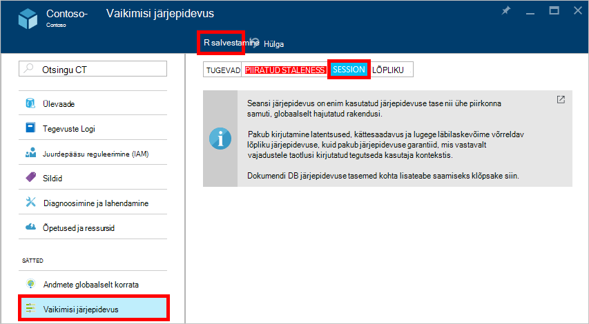

<properties
    pageTitle="Vormindusühtsuse tasemete DocumentDB | Microsoft Azure'i"
    description="DocumentDB on neli järjepidevuse taset saldo lõpliku järjepidevuse, kättesaadavuse ja latentsuse kompromisse abil."
    keywords="lõpliku järjepidevuse documentdb Azure'i, Microsoft Azure'i"
    services="documentdb"
    authors="syamkmsft"
    manager="jhubbard"
    editor="cgronlun"
    documentationCenter=""/>

<tags
    ms.service="documentdb"
    ms.workload="data-services"
    ms.tgt_pltfrm="na"
    ms.devlang="na"
    ms.topic="article"
    ms.date="08/24/2016"
    ms.author="syamk"/>

# Vormindusühtsuse tasemete DocumentDB

Azure'i DocumentDB on loodud üles globaalse jaotuse meeles. See on mõeldud hõlpsalt prognoosida madal latentsus garantiid, 99.99% kättesaadavus SLA ja mitme täpselt määratletud lõdvestunud järjepidevuse mudeleid. Praegu DocumentDB pakub järjepidevuse neli taset: tugev, mis on piiratud staleness, seansiga ja lõpuks. Lisaks **tugeva** ja **lõpuks järjepidevuse** mudeleid tavaliselt pakutud NoSQL muid andmebaase, DocumentDB ka pakub kahte hoolikalt kodeeritud ja operationalized järjepidevuse mudelid – **piiratud staleness** ja **seansi**ja valideerinud nende kasulikkus vastu tõeline kasutamise juhtudel. Ühiselt nende nelja järjepidevuse tasemed võimaldavad teil teha mõislikke kompromisse järjepidevuse kättesaadavus ning latentsuse vahel. 

## Järjepidevuse ulatus

Ühe kasutaja taotluse järjepidevuse granulaarsus on rakendatud. Taotluse täitmine võib vastavad lisa, Asenda, upsert või kustutada tehingu (koos või ilma täitmise seotud eel- või päästik). Või JavaScripti, mis on talletatud protseduuri üle mitme dokumendi sees sektsiooni opsüsteem selgituseks teostamine võib vastavad taotluse täitmine. Sarnaselt kirjutab, lugege teemat päring tehingu on rakendatud ka ühe kasutaja taotluse. Kasutaja võidakse nõuda paginate üle suur tulemite hulk, kestvad mitu sektsiooni, kuid iga lugeda tehingu on rakendatud ühele lehele ja ühe sektsioonis pakutakse.

## Vormindusühtsuse tasemed

Saate konfigureerida vaikimisi järjepidevuse tase kontol andmebaasi, mis kehtib kõigi saidikogumite (üle kõik andmebaasid) oma andmebaasi konto. Vaikimisi kõik loeb ja kasutaja määratletud ressursside antud päringute kasutada andmebaasi kontol määratud vaikimisi järjepidevuse taset. Siiski saate lõõgastuda järjepidevuse tase teatud lugemine päring taotluse, määrates [[x-ms-järjepidevuse-tase]](https://msdn.microsoft.com/library/azure/mt632096.aspx) taotluse päis. On nelja tüüpi järjepidevuse tasemed ei toeta protokolli DocumentDB dispersioonanalüüs varustavate Eemalda loobuda vahel teatud järjepidevuse garantiid ja jõudluse, nagu allpool kirjeldatud.

![DocumentDB pakub mitme, määratletud (lõdvestunud) järjepidevuse mudelid][1]

**Tugevad**: 

- Tugev järjepidevuse pakub [linearizability](https://aphyr.com/posts/313-strong-consistency-models) tagatise loeb tagatud, et tagastada dokumendi uusima versiooni. 
- Tugev järjepidevuse tagab, et kirjutada on nähtav ainult pärast seda, kui see on kinnitatud püsivalt enamik Kvoorumist koopiad. Kirjutada on kas sünkroonselt sooritatud püsivalt esmase ja sekundaaride Kvoorumist või see on katkestatud. Lugeda on alati lugeda kvoorumi enamik kinnitanud, saate ei näe soovitud sisseviimata või osalist kirjutada ja lugeda tunnustatud kirjutamine on alati tagatud kliendi. 
- DocumentDB kontod, mis on konfigureeritud kasutama tugev järjepidevuse ei saa oma kontoga DocumentDB Azure rohkem kui ühe piirkonna seostada. 
- Lugemistoiming (nii [taotluse üksuste](documentdb-request-units.md) tarbitud) kulu tugev järjepidevuse on suurem kui seanss ja lõpuks, kuid sama piiratud staleness.
 

**Bounded staleness**: 

- Mis on piiratud staleness järjepidevuse garantiid, mis loeb võib maha kirjutab kõige *K* versioone ega eesliiteid dokumendi või *t* -ajavahemik. 
- Seega kui valimise piiratud staleness, "staleness" saate konfigureerida kahel viisil: 
    - Dokumendi, mis loeb maha selle kirjutab versioonide *K* arv
    - Aja intervalli *t* 
- Piiratud staleness pakutakse globaalne tellimuse peale "staleness aken" sees. Pange tähele, et monotoonne Loe tagab olemas piirkonnas nii ja väljaspool "staleness akna". 
- Piiratud staleness kasutamine tagab tugevam järjepidevuse kui seansiga või lõpliku järjepidevuse. Globaalselt hajutatud rakenduste, soovitame kasutada piiratud staleness stsenaariumid kui soovite, kuid soovite ka 99,99%-saadavus ja madal latentsus on tugev järjepidevuse. 
- DocumentDB kontod, mis on konfigureeritud piiratud staleness järjepidevuse kontoga saate seostada mõni muu arv Azure piirkondade oma DocumentDB. 
- Maksumust (nii RUs tarbitud) Lugemistoiming piiratud staleness on suurem kui seanss ja lõpuks järjepidevuse, kuid sama tugev järjepidevuse.

**Seansi**: 

- Erinevalt globaalse järjepidevuse mudeleid pakutud tugeva ja piiratud staleness järjepidevuse taset, seansi järjepidevuse on rakendatud kliendi seansi. 
- Kui seadmesse või teisele isikule seansi on seotud, kuna see tagab monotoonne loeb, monotoonne kirjutab ja lugege oma kirjutab (RYW) tagab kõigi stsenaariumide sobib seansi järjepidevuse. 
- Seansi järjepidevuse pakub prognoositavad järjepidevuse seansi jaoks ja maksimum lugeda läbilaskevõime, pakkudes madalam latentsus kirjutab ja loeb. 
- DocumentDB kontod, mis on konfigureeritud seansi järjepidevuse kontoga saate seostada mõni muu arv Azure piirkondi oma DocumentDB. 
- Toote hind Lugemistoiming (nii RUs tarbitud) seansi järjepidevuse tase on väiksem kui tugev ja piiratud staleness, kuid rohkem kui lõpliku järjepidevus
 

**Lõpuks**: 

- Lõpliku järjepidevuse tagab, et mis tahes edasi kirjutab puudumisel koopiad rühmast lõpuks lähenevad. 
- Lõpliku järjepidevus on järjepidevuse nõrgim vormi, kus klient võib saada väärtused, mis on vanemad kui need enne näinud.
- Lõpliku järjepidevuse pakub nõrgim loetuks järjepidevuse, kuid pakub madalam latentsus nii loeb ja kirjutab.
- DocumentDB kontod, mis on konfigureeritud lõpliku järjepidevuse kontoga saate seostada mõni muu arv Azure piirkondi oma DocumentDB. 
- Maksumust (nii RUs tarbitud) Lugemistoiming lõpliku järjepidevus tase on väiksem DocumentDB järjepidevuse kõik tasemed.

## Vormindusühtsuse garantiid

Järgmine tabel sisaldab erinevate järjepidevuse garantiid vastav nelja järjepidevuse tasemed.

| Tagatis                                                         |    Tugevad                                       |    Piiratud Staleness                                                                           |    Seansi                                       |    Lõpliku                                 |
|----------------------------------------------------------|-------------------------------------------------|------------------------------------------------------------------------------------------------|--------------------------------------------------|--------------------------------------------------|
|    **Globaalne tellimuse**                                |    Jah                                          |    Jah, väljaspool "staleness aken"                                                      |    Ei, osalise "seanss" järjestuses                   |    Ei                                            |
|    **Ühtse eesliite tagatis**                       |    Jah                                          |    Jah                                                                                         |    Jah                                           |    Jah                                           |
|    **Monotoonne loeb**                                   |    Jah                                          |    Jah, piirkondade väljaspool staleness akna ja piirkonna kogu aeg.     |    Jah, antud seansi jaoks                    |    Ei                                            |
|    **Monotoonne kirjutab**                                  |    Jah                                          |    Jah                                                                                         |    Jah                                           |    Jah                                           |
|    **Lugege oma kirjutab**                                  |    Jah                                          |    Jah                                                                                         |    Jah (piirkonnas kirjutamine)                      |    Ei                                            |

## Vaikimisi järjepidevuse taset konfigureerimine

1.  Klõpsake [Azure portaali](https://portal.azure.com/), Jumpbar, **DocumentDB (NoSQL)**.

2. Valige **DocumentDB (NoSQL)** labale andmebaasi konto, mida soovite muuta.

3. Klõpsake konto labale **vaikimisi järjepidevuse**.

4. **Vaikimisi järjepidevuse** tera, saate valida uue järjepidevuse ja klõpsake nuppu **Salvesta**.

    

## Päringute järjepidevuse tasemed

Vaikimisi kasutaja määratletud ressursid, järjepidevuse taseme päringute puhul on sama taseme järjepidevus loeb. Vaikimisi värskendatakse registri sünkroonselt iga lisa, Asenda või Kustuta dokumendi kogumi. See võimaldab päringute au mis loeb dokumendi järjepidevuse samal tasemel. Kuigi DocumentDB on optimeeritud kirjutamine ja toetab püsiv dokumendi kirjutab ja sünkroonse index hooldus serveeritakse ühtsete päringuid, saate konfigureerida teatud saidikogumite värskendada oma indeks laisalt. Rongile indekseerimine täpsemalt suurendab kirjutamine jõudlus ja sobib hulgi manustamisest stsenaariumide korral on töökoormus peamiselt raske lugeda.  

Indekseerimise režiim|  Loeb|  Päringud  
-------------|-------|---------
Järjekindel (vaikimisi)|   Valige tugev, piiratud säilitamistähtaja ületamine seansiga või|    Valige tugev, piiratud säilitamistähtaja ületamine seansiga või|
Rongile|   Valige tugev, piiratud säilitamistähtaja ületamine seansiga või|    Lõpliku  

Nimega loetuks taotlusi, võite vähendada konkreetse päringu taotluse järjepidevuse taset, määrates [x ms järjepidevuse taseme](https://msdn.microsoft.com/library/azure/mt632096.aspx) taotluse päis.

## Järgmised sammud

Kui soovite teha veel lugedes järjepidevuse tasemed ja kompromissidega, soovitame järgmistest allikatest:

-   Doug Terry. Kopeeritud andmete järjepidevuse ülevaade baseball (video) kaudu.   
[https://www.youtube.com/watch?v=gluIh8zd26I](https://www.youtube.com/watch?v=gluIh8zd26I)
-   Doug Terry. Kopeeritud andmete järjepidevuse ülevaade pesapalli kaudu.   
[http://Research.microsoft.com/pubs/157411/ConsistencyAndBaseballReport.pdf](http://research.microsoft.com/pubs/157411/ConsistencyAndBaseballReport.pdf)
-   Doug Terry. Seansi garantiid nõrgalt ühtsete kopeeritud andmete jaoks.   
[http://dl.ACM.org/CITATION.cfm?id=383631](http://dl.acm.org/citation.cfm?id=383631)
-   Daniel Abadi. Tänapäevane jaotatud süsteemide andmebaasikujunduse järjepidevuse kompromisse: ots on ainult osa lugu ".   
[http://Computer.org/CSDL/Mags/Co/2012/02/mco2012020037-ABS.html](http://computer.org/csdl/mags/co/2012/02/mco2012020037-abs.html)
-   Peter Bailis, Shivaram Venkataraman, Michael J. Franklin, Joseph M. Hellerstein, Ion Stoica. Tõenäosusel piiratud Staleness (PBS) praktiline osaline otsustusvõimelisuse.   
[http://vldb.org/pvldb/VOL5/p776_peterbailis_vldb2012.pdf](http://vldb.org/pvldb/vol5/p776_peterbailis_vldb2012.pdf)
-   Werner Vogels. Lõpliku ühtsete – vaadata.    
[http://allthingsdistributed.com/2008/12/eventually_consistent.html](http://allthingsdistributed.com/2008/12/eventually_consistent.html)

[1]: ./media/documentdb-consistency-levels/consistency-tradeoffs.png
