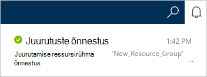

<properties
    pageTitle="Kuidas luua konto DocumentDB | Microsoft Azure'i"
    description="Azure'i DocumentDB NoSQL andmebaasi koostamine. Järgige neid juhiseid DocumentDB konto loomine ja käivitamine koostamise lõõskav kiire ja globaalse skaala NoSQL andmebaasi." 
    keywords="andmebaasi koostamine"
    services="documentdb"
    documentationCenter=""
    authors="mimig1"
    manager="jhubbard"
    editor="monicar"/>

<tags
    ms.service="documentdb"
    ms.workload="data-services"
    ms.tgt_pltfrm="na"
    ms.devlang="na"
    ms.topic="get-started-article"
    ms.date="10/17/2016"
    ms.author="mimig"/>

# Kuidas Azure'i portaalis DocumentDB NoSQL konto loomine

> [AZURE.SELECTOR]
- [Azure'i portaal](documentdb-create-account.md)
- [Azure'i CLI ja Azure ressursihaldur](documentdb-automation-resource-manager-cli.md)

Microsoft Azure'i DocumentDB andmebaasi loomiseks peate tegema järgmist:

- On Azure konto. Kui teil pole seda juba, saate mõne [tasuta Azure'i konto](https://azure.microsoft.com/free) . 
- Looge konto DocumentDB.  

Saate luua DocumentDB konto, kasutades ühte Azure portaali, Azure'i ressursihaldur mallid või Azure käsurea liides (CLI). Selles artiklis kirjeldatakse Azure'i portaalis DocumentDB konto loomiseks tehke järgmist. Azure'i ressursihaldur või Azure CLI abil konto loomiseks vaadake teemat [automatiseerida DocumentDB andmebaasi konto loomine](documentdb-automation-resource-manager-cli.md).

Kas olete kasutanud DocumentDB? [Sellest](https://azure.microsoft.com/documentation/videos/create-documentdb-on-azure/) videost neli minutit, Scott Hanselman kohta leiate teavet veebiportaali kõige levinum toimingu lõpuleviimiseks.

1.  [Azure'i portaali](https://portal.azure.com/)sisse logida.
2.  Jumpbar, klõpsake nuppu **Uus**, klõpsake käsku **andmebaaside**ja klõpsake **DocumentDB (NoSQL)**. 

      

3. **Uue konto** tera, määrake soovitud konfiguratsiooni DocumentDB konto.

    

    - Sisestage väljale **ID** tuvastamiseks DocumentDB konto nimi.  Kui **ID** on kinnitatud, kuvatakse väljal **ID** roheline märge. **ID** väärtus muutub hostinimi URI sees. **ID** võivad sisaldada ainult väiketähed, arve, ja "-" märkide ja peab olema 3 – 50 märki. Pange tähele, et *documents.azure.com* on lisatud lõpp-punkti nimi otsustate, mille tulemusena muutub DocumentDB konto lõpp-punkti.

    - Valige väljal **NoSQL API** programmeerimise mudeli kasutamine:
        - **DocumentDB**: The DocumentDB API on saadaval .NET, Java, Node.js, Python ja JavaScripti [SDK-d](documentdb-sdk-dotnet.md), samuti HTTP [ülejäänud](https://msdn.microsoft.com/library/azure/dn781481.aspx)ja pakub Programmeerimisjuurdepääs DocumentDB funktsioone. 
       
        - **MongoDB**: DocumentDB pakub [taseme protokolli tugi](documentdb-protocol-mongodb.md) **MongoDB** API-de jaoks. Kui valite suvandi MongoDB API, saate olemasoleva MongoDB SDK-d ja [tööriistu](documentdb-mongodb-mongochef.md) DocumentDB rääkida. Saate [teisaldada](documentdb-import-data.md) oma olemasolevad MongoDB rakenduste kasutamiseks [vajalik koodi muudatusi](documentdb-connect-mongodb-account.md)DocumentDB, ja ära täielikult hallatud andmebaasi teenust, piiramatu skaala, globaalne kopeerimise ja muid võimalusi.

    - Valige **tellimus**, Azure'i tellimus, mida soovite kasutada konto DocumentDB. Kui teie konto on ainult üks tellimus, on vaikimisi valitud konto.

    - **Ressursirühm**valige või looge konto DocumentDB ressursirühma.  Vaikimisi on loodud uue ressursirühma. Lisateabe saamiseks lugege teemat [Azure portaalis hallata oma Azure ressursse](../articles/azure-portal/resource-group-portal.md).

    - **Asukoht** abil saate määrata geograafiline asukoht, kus majutada DocumentDB kontole. 

4.  Pärast uue DocumentDB Kontosuvandid on konfigureeritud, klõpsake nuppu **Loo**. Juurutamise oleku, märkige ruut jaoturi teatised.  

      

    

5.  Pärast DocumentDB konto on loodud, on kasutamiseks valmis vaikesätted. Vaikimisi järjepidevuse DocumentDB konto on seatud **seanss**.  Saate reguleerida, klõpsates menüüs ressursi **Vaikimisi järjepidevuse** vaikimisi järjepidevuse. Pakutud DocumentDB järjepidevuse tasemete kohta leiate lisateavet teemast [järjepidevuse tasemete DocumentDB](documentdb-consistency-levels.md).

      

      

[How to: Create a DocumentDB account]: #Howto
[Next steps]: #NextSteps
[documentdb-manage]:../articles/documentdb/documentdb-manage.md

## Järgmised sammud

Nüüd, kui teil on DocumentDB konto, on järgmiseks DocumentDB saidikogumi ja andmebaasi loomiseks. 

Saate luua uue saidikogumi ja andmebaas, kasutades ühte järgmistest:

- Azure'i portaali, nagu on kirjeldatud [DocumentDB kogumi Azure portaali loomine](documentdb-create-collection.md).
- Kõik hinna sees Õppematerjalid, mis hõlmavad andmete näidis: [.net-i](documentdb-get-started.md), [.NET MVC](documentdb-dotnet-application.md), [Java](documentdb-java-application.md), [Node.js](documentdb-nodejs-application.md)või [Python](documentdb-python-application.md).
- [.Net-i](documentdb-dotnet-samples.md#database-examples), [Node.js](documentdb-nodejs-samples.md#database-examples)või [Python](documentdb-python-samples.md#database-examples) proovi kood GitHub saadaval.
- Funktsiooni [.net-i](documentdb-sdk-dotnet.md), [Node.js](documentdb-sdk-node.md), [Java](documentdb-sdk-java.md), [Python](documentdb-sdk-python.md)ja [ülejäänud](https://msdn.microsoft.com/library/azure/mt489072.aspx) SDK-d.

Pärast oma andmebaasi ja saidikogumi loomine, peate [dokumentide lisamine](documentdb-view-json-document-explorer.md) soovitud saidikogumid.

Kui teil on dokumentide kogumi, saate [DocumentDB SQL-i](documentdb-sql-query.md) käivitada [päringuid](documentdb-sql-query.md#executing-queries) teie dokumentide vastu. Päringu käivitamiseks [Päringu Exploreri](documentdb-query-collections-query-explorer.md) portaali, [REST API -ga](https://msdn.microsoft.com/library/azure/dn781481.aspx)või üks [SDK-d](documentdb-sdk-dotnet.md).

### Lisateave

Lisateavet DocumentDB, saate nende ressursside:

-   [Õppeteema DocumentDB jaoks](https://azure.microsoft.com/documentation/learning-paths/documentdb/)
-   [DocumentDB hierarhilise ressursi mudel ja mõisted](documentdb-resources.md)
