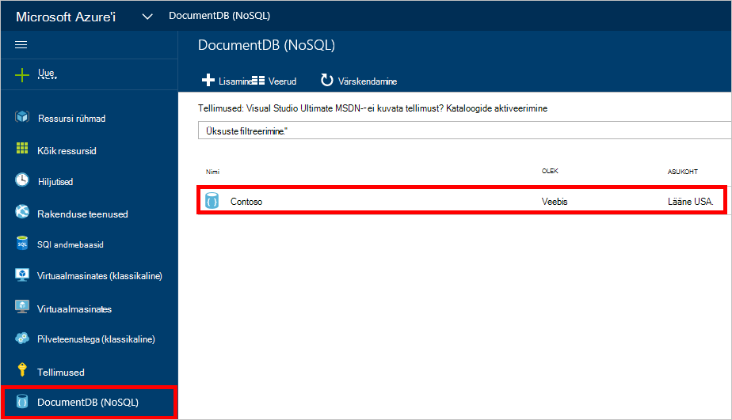
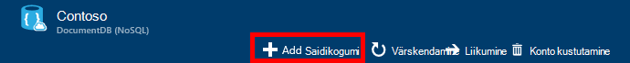
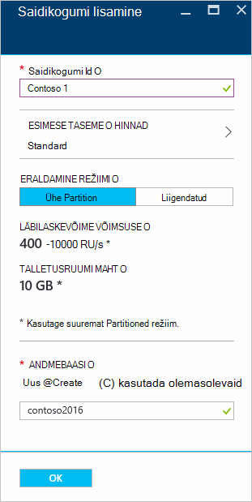
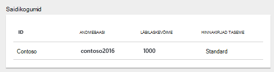
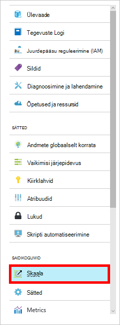

<properties 
    pageTitle="DocumentDB andmebaasi ja saidikogumi loomine | Microsoft Azure'i" 
    description="Saate teada, kuidas luua NoSQL andmebaasid ja JSON dokumendi saidikogumid portaali Online'i teenuse kasutamise Azure'i DocumentDB, pilv vastavalt dokumendi andmebaasi. Saada tasuta prooviversiooni juba täna." 
    services="documentdb" 
    authors="mimig1" 
    manager="jhubbard" 
    editor="monicar" 
    documentationCenter=""/>

<tags 
    ms.service="documentdb" 
    ms.workload="data-services" 
    ms.tgt_pltfrm="na" 
    ms.devlang="na" 
    ms.topic="article" 
    ms.date="10/17/2016" 
    ms.author="mimig"/>

# Kuidas luua DocumentDB saidikogumi ja andmebaasi Azure'i portaalis

Microsoft Azure'i DocumentDB kasutamiseks peab teil on [DocumentDB konto](documentdb-create-account.md), andmebaasi, kogumi ja dokumendid. Selles teemas kirjeldatakse, kuidas luua DocumentDB Azure'i portaalis. 

Pole kindel, millist saidikogumi on? Vt [mis on DocumentDB saidikogumi?](#what-is-a-documentdb-collection)

1.  [Azure'i portaali](https://portal.azure.com/)sisse Jumpbar, klõpsake **DocumentDB (NoSQL)**ja seejärel **DocumentDB (NoSQL)** tera, valige konto, kuhu saate lisada kogumi. Kui teil pole loetletud kontodest, peate [DocumentDB konto](documentdb-create-account.md)loomiseks.

    
    
    Kui **DocumentDB (NoSQL)** ei ole nähtav, klõpsake selle Jumpbar, klõpsake nuppu **Rohkem teenuseid** ja klõpsake **DocumentDB (NoSQL)**. Kui teil pole loetletud kontodest, peate [DocumentDB konto](documentdb-create-account.md)loomiseks.

2. Klõpsake valitud konto labale **DocumentDB konto** **Lisamine saidikogumi**.

    

3. **Lisada saidikogumi** labale **ID** väljale Sisestage oma uue saidikogumi ID-d. Saidikogumi nimed peab olema vahemikus 1 kuni 255 märki ja ei tohi sisaldada `/ \ # ?` või lõpust tühik. Kui nimi on kinnitatud, kuvatakse väljal ID roheline märge.

    

4. Vaikimisi **Taseme hinnad** on seatud **Standard** , et läbilaskevõime ja salvestusruumi saate kohandada oma saidikogumi jaoks. Hinnakirjad taseme kohta leiate lisateavet teemast [jõudluse tasemete DocumentDB](documentdb-performance-levels.md).  

5. Valige **Eraldatav režiimi** kogumiseks, kas **Ühe sektsiooni** või **Partitioned**. 

    **Ühe sektsiooni** on 10 GB mahuga reserveeritud ja võib olla läbilaskevõime tasemed 400-10 000 taotluse üksuste/teine (RU/s). Ühe RU vastab läbilaskevõime 1KB dokumendi lugeda. Taotluse üksuste kohta leiate lisateavet teemast [taotluse üksused](documentdb-request-units.md). 

    **Sektsioonitud saidikogumi** saate piiramatus koguses salvestusruumi käsitlema üle mitme sektsioonid mastaapimiseks ja võib olla alates 10,100 RU/s läbilaskevõime tasemed. Portaalis saate reserveerida suurim talletamist on 250 GB ja enamik läbilaskevõime, saate reserveerida on 250 000 RU/s. Kas kvoodi suurendamiseks faili taotluse [taotlus suurendada DocumentDB konto kvootide](documentdb-increase-limits.md)kirjeldatud. Rohkem informaiton sektsioonitud saidikogumite kohta, vt [ühe sektsiooni ja sektsioonitud saidikogumid](documentdb-partition-data.md#single-partition-and-partitioned-collections).

    Vaikimisi on läbilaskevõime uus sektsioon ühe saidikogumi jaoks seatud RU 1000 s mälumahuga 10 GB. Sektsioonitud kogumiseks saidikogumi läbilaskevõime on seatud 10100 RU s 250 GB mälumahuga. Pärast selle saidikogumi loomist saate muuta läbilaskevõime ja kogumise talletusmahu. 

6. Kui loote sektsioonitud kogumi, valige **Sektsiooni võti** kogumi. Valida õige partition klahvi on oluline kiire saidikogumi loomine. Sektsiooni võtme valimise kohta leiate lisateavet teemast [kujundamise jagamine](documentdb-partition-data.md#designing-for-partitioning).

7. **Andmebaasi** tera, kas uue andmebaasi loomiseks või olemasoleva kasutamiseks. Andmebaasi nimed peab olema vahemikus 1 kuni 255 märki ja ei tohi sisaldada `/ \ # ?` või lõpust tühik. Nime kinnitamiseks klõpsake väljaspool tekstivälja. Kui nimi on kinnitatud, kuvatakse väljal roheline märge.

8. Klõpsake nuppu **OK** ekraani allosas uue saidikogumi loomiseks. 

9. Uue saidikogumi nüüd kuvatakse **Ülevaade** enne Lens **saidikogumid** .
 
    

10. **Valikuline:** Saidikogumi portaalis läbilaskevõime muutmiseks klõpsake menüü ressursi **skaala** . 

    

## Mis on DocumentDB saidikogumi? 

Kogumi on JSON dokumendid ja seotud JavaScripti rakenduse loogika ümbris. Kogumi on tasustatav üksus, milles on määratud kogumi ettevalmistatud läbilaskevõime [kulu](documentdb-performance-levels.md) . Saidikogumite saab ühendada ühe või mitme sektsioonid/serveri ja saab skaala toime praktiliselt piiramatu salvestusruum või läbilaskevõime mahtu.

Saidikogumite on automaatselt liigendatud sisse ühe või mitme füüsilise serveri DocumentDB. Kui loote kogumi, saate määrata ettevalmistatud läbilaskevõime taotluse ühikute sekundis ja sektsiooni võtme atribuut. Selle atribuudi väärtust kasutatakse DocumentDB levitamisviisi dokumentide sektsioonid ja marsruutimiseks taotlusi, nagu päringud. Sektsiooni võtmeväärtuse toimib ka salvestatud toimingute ja käivitab tehingu äärist. Iga saidikogumi on reserveeritud läbilaskevõime teatud selle saidikogumi, mida pole koos muude saidikogumite samale kontole. Seetõttu skaala välja rakenduse nii salvestusruumi ja läbilaskevõime. 

Saidikogumite pole sama, mis tabelite relatsioonandmebaasidest. Saidikogumite Jõusta skeemi, tegelikult DocumentDB Jõusta mis tahes skeemid, on andmebaasi skeemi tasuta. Seega saate talletada eri tüüpi dokumendid, millel on erinevad skeemid sama. Saate kasutada saidikogumid objektide ühte tüüpi tabelitega samamoodi, nagu talletamiseks. Parima mudeli sõltub ainult kuidas andmed kuvatakse koos päringuid ja tehingud.

## Muud võimalused DocumentDB saidikogumi loomine

Saidikogumite ei saa luua portaalis, saate luua ka need [DocumentDB SDK-d](documentdb-sdk-dotnet.md) ja REST API abil. 

- C# koodi valimi, leiate teemast [saidikogumi näidised C#](documentdb-dotnet-samples.md#collection-examples). 
- Node.js proovi kood, vt [Node.js saidikogumi näidised](documentdb-nodejs-samples.md#collection-examples).
- Python proovi kood, vt [Python saidikogumi näidised](documentdb-python-samples.md#collection-examples).
- REST API valimi, leiate teemast [kogumi loomine](https://msdn.microsoft.com/library/azure/mt489078.aspx).

## Tõrkeotsing

Kui **Lisada saidikogumi** on keelatud Azure'i portaalis, see tähendab, et teie konto on praegu keelatud, mis tavaliselt juhul, kui kasutatakse eeliste krediiti vastaval kuul.   

## Järgmised sammud

Nüüd, kui teil on kogumi, järgmise sammuna tuleb dokumentide lisamine või importimine dokumentide kogumist. Kui tegemist on dokumentide lisamine kogumi, on teil mitu valikut.

- Saate dokumendi Exploreriga portaalis [dokumentide lisamine](documentdb-view-json-document-explorer.md) .
- Saate [dokumentide ja andmete](documentdb-import-data.md) DocumentDB andmete migreerimise tööriista, mis võimaldab teil importida JSON- ja CSV-faili kui ka SQL serveri, MongoDB, Azure'i tabelimälu ja muude DocumentDB saidikogumid abil. 
- Või saate lisada dokumente, kasutades ühte järgmistest [DocumentDB SDK-d](documentdb-sdk-dotnet.md). DocumentDB on .NET, Java, Python, Node.js ja JavaScripti API SDK-d. C# koodi näidised näitab, kuidas töötada dokumentidega DocumentDB .NET SDK abil, vt [dokumendi näidised C#](documentdb-dotnet-samples.md#document-examples). Näitab, kuidas DocumentDB Node.js SDK abil dokumentidega töötamine Node.js koodinäiteid, leiate teemast [Node.js dokumendi näidised](documentdb-nodejs-samples.md#document-examples).

Pärast seda, kui teil on dokumentide kogumi, saate [DocumentDB SQL-i](documentdb-sql-query.md) [päringute](documentdb-sql-query.md#executing-queries) käivitada teie dokumentide vastu [Päringu Exploreri](documentdb-query-collections-query-explorer.md) portaali, [REST API -ga](https://msdn.microsoft.com/library/azure/dn781481.aspx)või üks [SDK-d](documentdb-sdk-dotnet.md). 
