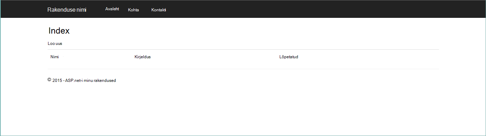
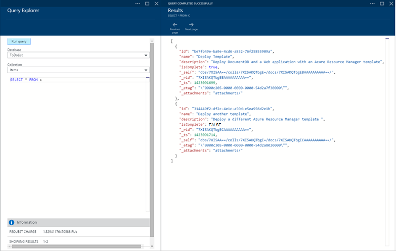

<properties 
    pageTitle="DocumentDB ja on Azure ressursihaldur malli abil Azure'i rakenduse Web Apps juurutamine | Microsoft Azure'i" 
    description="Saate teada, kuidas juurutada DocumentDB konto, Azure'i rakenduse teenuse veebirakenduste ja valimi veebirakenduse on Azure ressursihaldur malli abil." 
    services="documentdb, app-service\web" 
    authors="h0n" 
    manager="jhubbard" 
    editor="monicar" 
    documentationCenter=""/>

<tags 
    ms.service="documentdb" 
    ms.workload="data-services" 
    ms.tgt_pltfrm="na" 
    ms.devlang="na" 
    ms.topic="article" 
    ms.date="08/02/2016" 
    ms.author="hawong"/>

# DocumentDB ja on Azure ressursihaldur malli abil Azure'i rakenduse Web Apps juurutamine

Selle õpetuse näidatakse, kuidas juurutada ja integreerida [Microsoft Azure'i DocumentDB](https://azure.microsoft.com/services/documentdb/), [Azure'i rakendust Service](http://go.microsoft.com/fwlink/?LinkId=529714) web app ja valimi veebirakenduse Azure'i ressursihaldur malli kasutamiseks.

Azure'i ressursihaldur mallide kasutamine saate hõlpsalt automatiseerida juurutus- ja konfigureerimine oma Azure ressursse.  Selle õpetuse näitab, kuidas veebirakenduse juurutada ja konfigureerida automaatselt DocumentDB konto ühenduse teavet.

Pärast selle õpetuse, on võimalik vastata järgmistele küsimustele:  

-   Kuidas kasutada mõni Azure ressursihaldur Mall juurutada ja integreerida DocumentDB konto ja veebirakenduse teenuses Azure rakendus?
-   Kuidas kasutada mõni Azure ressursihaldur Mall juurutada ja integreerida DocumentDB konto, web app rakenduse teenus veebirakendustes ja Webdeploy rakendus?

## Eeltingimused
> [AZURE.TIP] Ajal selles õpetuses ei vastuta eelnev kogemus Azure'i ressursihaldur malle või JSON, kui soovite muuta viidatud mallid või Juurutussuvandid, siis iga valdkonna tundmine on vaja.

Enne juhiste selles õpetuses, veenduge, et on järgmine:

- Azure'i tellimuse. Azure'i on tellimispõhine platvorm.  Tellimuse hankimise kohta lisateabe saamiseks lugege [Ostu suvandid](https://azure.microsoft.com/pricing/purchase-options/), [Liikme pakub](https://azure.microsoft.com/pricing/member-offers/)või [Tasuta prooviversioon](https://azure.microsoft.com/pricing/free-trial/).

##Samm 1: Malli allalaadimine ##
Alustame allalaadimine malli failid kasutame selles õpetuses.

1. [DocumentDB konto, veebirakenduste, luua ja juurutada demo rakenduse valimi](https://portalcontent.blob.core.windows.net/samples/DocDBWebsiteTodo.json) malli allalaadimiseks kohalikus kaustas (nt C:\DocumentDBTemplates). Selle malli on juurutada DocumentDB konto, teenuse rakenduse web app ja veebirakenduse.  See ka automaatselt konfigureerida veebirakenduse DocumentDB kontoga ühenduse loomiseks.

2. [Loo konto DocumentDB ja veebirakenduste valimi](https://portalcontent.blob.core.windows.net/samples/DocDBWebSite.json) malli allalaadimiseks kohalikus kaustas (nt C:\DocumentDBTemplates). Selle malli on juurutada DocumentDB konto, teenuse rakenduse web appi ja muudab saidi rakenduse sätteid hõlpsasti pinna DocumentDB ühenduse teavet, kuid ei sisalda veebirakenduse.  

##Samm 2: Juurutamine DocumentDB konto, rakenduse teenuse web app ja demo rakenduse näidis

Nüüd vaatame juurutada meie esimene malli.

> [AZURE.TIP] Malli ei kinnita web appi nime ja DocumentDB konto nime all sisestatud on a) kehtivate ja saadaval b).  See on soovitatav on plaanite esitama enne esitamist juurutamise nimed olemasolu kontrollida.

1. Logi [Azure portaali](https://portal.azure.com), klõpsake nuppu Uus ja otsing "Malli juurutamine".
    

2. Valige mall juurutamise üksus ja klõpsake nuppu **Loo**
    

3.  Klõpsake **malli redigeerimine**, DocDBWebsiteTodo.json mallifail sisu kleepimine ja klõpsake nuppu **Salvesta**.
    

4. **Parameetrite redigeerimiseks**klõpsake, sisestama kohustuslik parameetrite väärtused ja klõpsake nuppu **OK**.  Parameetrid on järgmised:

    1. SITENAME: Saate määrata rakenduse teenuse web appi nimi ja URL, mida kasutate juurdepääsuks veebirakendusse ehitada kasutatakse (nt kui määrate "mydemodocdbwebapp", siis on URL, mille pääsete veebirakenduse mydemodocdbwebapp.azurewebsites.net).

    2. HOSTINGPLANNAME: Saate määrata rakenduse majutusteenuse teenusleping loomiseks nime.

    3. ASUKOHT: Azure'i asukoht, kus soovite luua DocumentDB ja web appi ressursid saate määrata.

    4. DATABASEACCOUNTNAME: Saate määrata, et luua DocumentDB konto nimi.   

    

5. Valige ressursi olemasolevasse rühma või teha uue ressursirühma nimi ja valige ressursirühma asukoht.
    
  
6.  Klõpsake **Läbivaatus juriidilised tingimused**, **ostmine**, ja klõpsake nuppu **Loo** juurutamise alustamiseks.  **PIN-koodi armatuurlauale** nii, et tulemuseks juurutamise on nähtaval Azure portaali avalehe valimine
    

7.  Juurutamise lõpulejõudmisel avatakse ressursi rühma tera.
      

8.  Rakenduse kasutamiseks lihtsalt liikuge web appi URL (Ülaltoodud näites URL-i oleks http://mydemodocdbwebapp.azurewebsites.net).  Näete järgmist veebirakendus:

    

9. Minna ja web Appis paar tööülesannete loomine ja naaske ressursi rühma tera Azure'i portaalis. Klõpsake loendis ressursid DocumentDB konto ressursi ja klõpsake **Päringu Explorer**.
      

10. Käivita vaikepäringut, "SELECT *saatja c" ja kontrolli tulemusi.  Pange tähele, et päring on tuua JSON kujutis 7 ülaltoodud juhises loodud todo üksused.  Julgelt eksperimenteerida päringud; Näiteks, proovige valige* : c, kus c.isComplete = true todo kõik üksused, mis on märgitud nii täielikult tagastamiseks.

    

11. Julgelt DocumentDB portaali kogemusi uurida või muuta valimi Todo rakendus.  Kui olete valmis, alustame juurutada teise malli.
    
 
## Samm 3: Juurutamine dokumendi konto ja web appi näidis

Nüüd vaatame juurutada meie teise malli.  Selle malli on kasulik näidata, kuidas te saate annavad DocumentDB ühenduseteavet, nt konto lõpp-punkti ja juhtslaidi klahvi web appi rakenduse sätted või kohandatud ühendusstring. Näiteks võib-olla peate oma veebirakenduse, mida soovite kontoga DocumentDB juurutada ja on automaatselt kasutajanimedega juurutamisel ühendusteabe.

> [AZURE.TIP] Malli ei kinnita web appi nime ja DocumentDB konto nime all sisestatud on a) kehtivate ja saadaval b).  See on soovitatav on plaanite esitama enne esitamist juurutamise nimed olemasolu kontrollida.

1. [Azure portaali](https://portal.azure.com)nuppu Uus ja otsige "Malli juurutamine".
    

2. Valige mall juurutamise üksus ja klõpsake nuppu **Loo**
    

3.  Klõpsake **malli redigeerimine**, DocDBWebSite.json mallifail sisu kleepimine ja klõpsake nuppu **Salvesta**.
    

4. **Parameetrite redigeerimiseks**klõpsake, sisestama kohustuslik parameetrite väärtused ja klõpsake nuppu **OK**.  Parameetrid on järgmised:

    1. SITENAME: Saate määrata rakenduse teenuse web appi nimi ja URL, mida kasutate juurdepääsuks veebirakendusse ehitada kasutatakse (nt kui määrate "mydemodocdbwebapp", siis on URL, mille pääsete veebirakenduse mydemodocdbwebapp.azurewebsites.net).

    2. HOSTINGPLANNAME: Saate määrata rakenduse majutusteenuse teenusleping loomiseks nime.

    3. ASUKOHT: Azure'i asukoht, kus soovite luua DocumentDB ja web appi ressursid saate määrata.

    4. DATABASEACCOUNTNAME: Saate määrata, et luua DocumentDB konto nimi.   

    

5. Valige ressursi olemasolevasse rühma või teha uue ressursirühma nimi ja valige ressursirühma asukoht.
    
  
6.  Klõpsake **Läbivaatus juriidilised tingimused**, **ostmine**, ja klõpsake nuppu **Loo** juurutamise alustamiseks.  **PIN-koodi armatuurlauale** nii, et tulemiks oleva juurutamise on nähtaval Azure portaali avalehe valimine
    

7.  Juurutamise lõpulejõudmisel avatakse ressursi rühma tera.
      

8. Klõpsake veebirakenduse ressursside loendis ressursid ja seejärel nuppu **rakenduse sätted**
      

9. Pange tähele, kuidas on rakenduse sätted Esita DocumentDB lõpp-punkti ja iga DocumentDB juhtslaidi võtmed.
      

10. Võite jätkata uurimine Azure portaali või järgige ühte meie DocumentDB [näidised](http://go.microsoft.com/fwlink/?LinkID=402386) DocumentDB rakenduse loomiseks.

    
    

## Järgmised sammud

Palju õnne! Juurutamist DocumentDB rakenduse teenuse web app ja Azure ressursihaldur mallide kasutamise näidis veebirakenduse.

- DocumentDB kohta lisateabe saamiseks klõpsake [siin](http://azure.com/docdb).
- Azure'i rakenduse teenuse veebirakenduste kohta lisateabe saamiseks klõpsake [siin](http://go.microsoft.com/fwlink/?LinkId=325362).
- Azure'i ressursihaldur mallide kohta lisateabe saamiseks klõpsake [siin](https://msdn.microsoft.com/library/azure/dn790549.aspx).

## Mis on muutunud
* Muuda juhend veebisaitide rakenduse teenusega leiate: [Azure'i rakendust Service ja selle mõju olemasoleva Azure'i teenused](http://go.microsoft.com/fwlink/?LinkId=529714)
* Vana portaali uue portaali muutmine juhendi leiate: [viide Azure klassikaline portaali navigeerimiseks](http://go.microsoft.com/fwlink/?LinkId=529715)

>[AZURE.NOTE] Kui soovite alustada Azure'i rakendust Service enne Azure'i konto kasutajaks, minge [Proovige rakenduse teenus](http://go.microsoft.com/fwlink/?LinkId=523751), kus saate kohe luua lühiajaline starter web app rakenduse teenus. Nõutav; krediitkaardid kohustusi.
 
