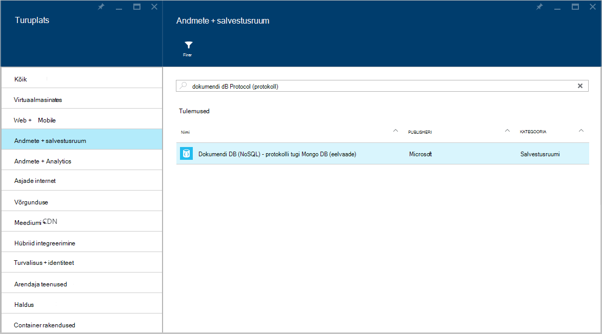
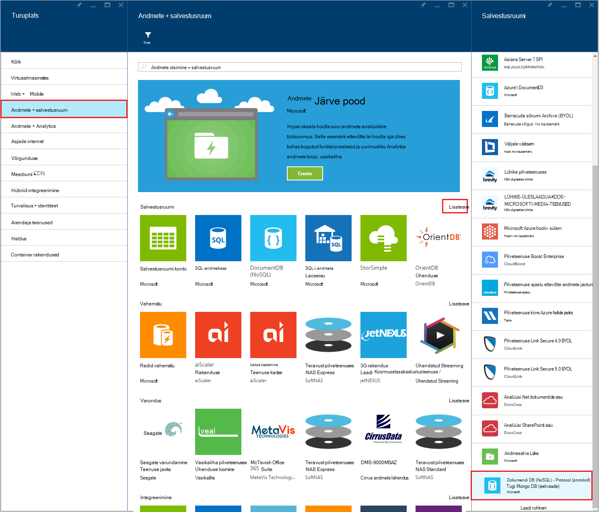
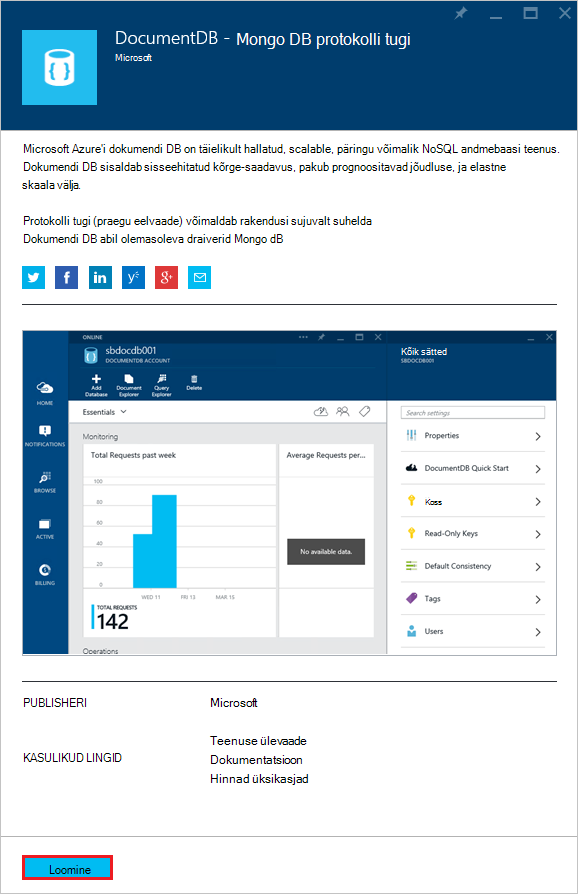
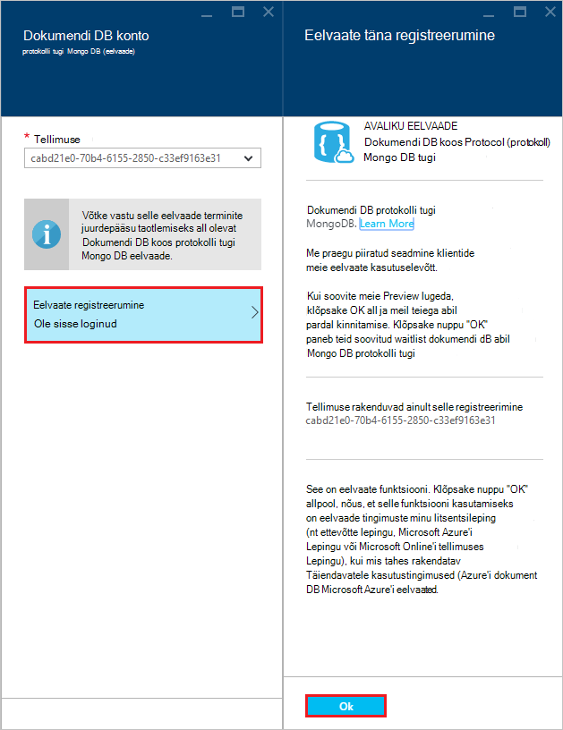
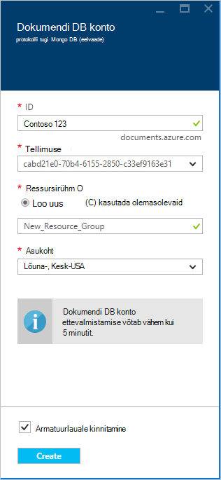
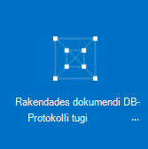
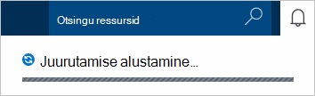
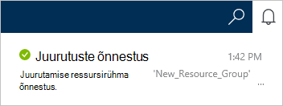
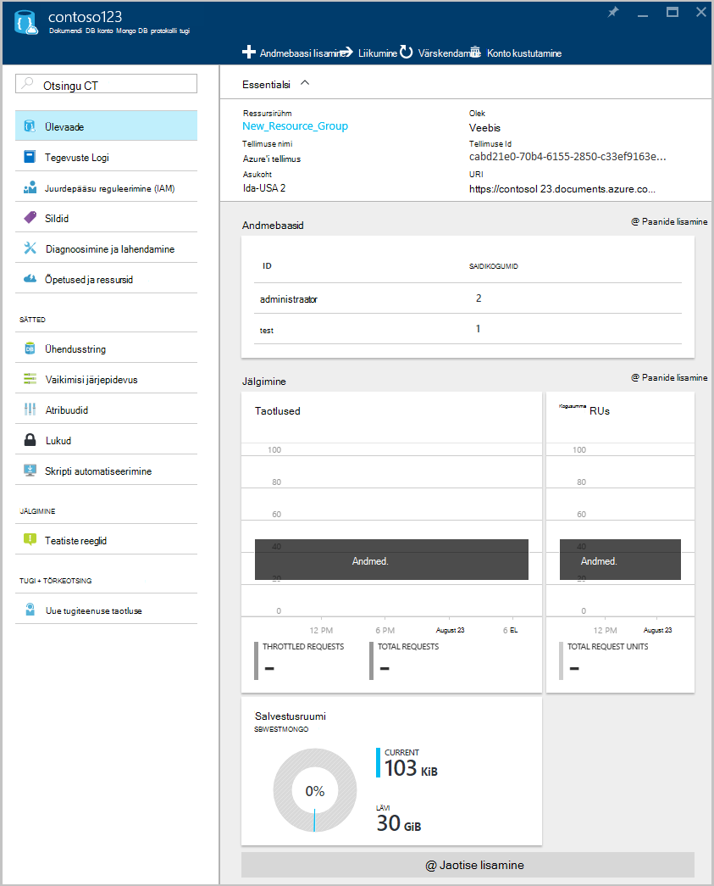

<properties 
    pageTitle="Luua DocumentDB konto protokolli tugi MongoDB | Microsoft Azure'i" 
    description="Siit saate teada, kuidas luua DocumentDB konto protokolli tugi MongoDB, nüüd saadaval eelvaade." 
    services="documentdb" 
    authors="AndrewHoh" 
    manager="jhubbard" 
    editor="" 
    documentationCenter=""/>

<tags 
    ms.service="documentdb" 
    ms.workload="data-services" 
    ms.tgt_pltfrm="na" 
    ms.devlang="na" 
    ms.topic="article" 
    ms.date="10/20/2016" 
    ms.author="anhoh"/>

# Kuidas luua DocumentDB konto MongoDB Azure'i portaalis protokolli tugi

Luua konto Azure DocumentDB protokolli tugi MongoDB, peate tegema järgmist:

- On Azure konto. Kui teil pole seda juba, saate mõne [tasuta Azure'i konto](https://azure.microsoft.com/free/) .

## Konto loomine  

Protokolli tugi MongoDB DocumentDB konto loomiseks tehke järgmist.

1. [Azure portaali](https://portal.azure.com)sisselogimine uues aknas.
2. Klõpsake nuppu **Uus**, klõpsake **andmete + salvestusruumi**, klõpsata nuppu **Kuva kõik**ja otsige "DocumentDB protokoll" **andmete + salvestusruumi** kategooria. Klõpsake **DocumentDB - protokolli tugi MongoDB**.

    

3. Teise võimalusena **andmete + salvestusruumi** kategooria **salvestusruumi**nuppu **veel**ja klõpsake **laadimine veel** üks või mitu korda **DocumentDB - protokolli tugi MongoDB**kuvamiseks. Klõpsake **DocumentDB - protokolli tugi MongoDB**.

    

4. Labale **DocumentDB - protokolli tugi MongoDB (eelvaade)** nuppu **Loo** eelvaade registreerimine protsessi käivitamiseks.

    

5. Klõpsake **DocumentDB konto** labale **eelvaate registreeruda**. Lugege teavet, ja seejärel klõpsake nuppu **OK**.

    

6.  Pärast preview tingimuste aktsepteerimine, tagastatakse tera loomine.  Määrake soovitud konfiguratsiooni konto labale **DocumentDB konto** .

    

    - Sisestage väljale **ID** tuvastamiseks konto nimi.  Kui **ID** on kinnitatud, kuvatakse väljal **ID** roheline märge. **ID** väärtus muutub hostinimi URI sees. **ID** võivad sisaldada ainult väiketähed, arve, ja "-" märkide ja peab olema 3 – 50 märki. Pange tähele, et *documents.azure.com* on lisatud lõpp-punkti nimi valite, mille tulemusena muutuvad teie konto lõpp-punkti.

    - Valige **tellimus**, Azure'i tellimus, mida soovite kasutada konto. Kui teie konto on ainult üks tellimus, on vaikimisi valitud konto.

    - **Ressursirühm**valige või looge konto ressursirühma.  Vaikimisi valitakse ressursi olemasoleva rühma alusel Azure tellimuse.  Siiski saate luua uue ressursirühma, millele soovite konto lisamiseks valige. Lisateabe saamiseks lugege teemat [Azure portaalis hallata oma Azure ressursse](resource-group-portal.md).

    - Majutada konto geograafilise asukoha määramiseks kasutage **asukoht** .
    
    - Valikuline: Märkige ruut **Kinnita armatuurlaud**. Kui kinnitatud armatuurlaud, järgige **samm 8** allpool uuele kontole vasakpoolses navigeerimismenüüs kuvamiseks.

7.  Pärast uue konto suvandid on konfigureeritud, klõpsake nuppu **Loo**.  Võib kuluda mõni minut konto loomiseks.  Kui kinnitatud armatuurlaud, saate selle Startboard ettevalmistamise edenemise jälgida.  
      

    Kui pole kinnitatud armatuurlaud, saate jälgida edenemise teatised keskuse kaudu.  

      

    

8.  Uuele kontole juurdepääsemiseks klõpsake vasakpoolses menüüs **DocumentDB (NoSQL)** . Klõpsake loendis tavalise DocumentDB ja DocumentDB Mongo protokolli tugi kontode uue konto nime.

9.  Nüüd on kasutamiseks valmis vaikesätteid. 

    
    

## Järgmised sammud

- Siit saate teada, kuidas [ühendada](documentdb-connect-mongodb-account.md) DocumentDB konto protokoll MongoDB kasutajatugi.

 
