<properties 
    pageTitle="ASP.net-i MVC DocumentDB õpetus: Veebirakenduste arendamine | Microsoft Azure'i" 
    description="ASP.net-i MVC õpetuse MVC veebirakenduse abil DocumentDB loomiseks. Saate talletada JSON ja pääsevad andmetele juurde majutatud Azure veebisaitide - ASP NET MVC õpetuse samm-sammult todo rakenduse kaudu." 
    keywords="ASP.net-i mvc õpetuse, Veebirakenduste arendamine, mvc veebirakenduse asp net mvc õpetuse samm-sammult"
    services="documentdb" 
    documentationCenter=".net" 
    authors="syamkmsft" 
    manager="jhubbard" 
    editor="cgronlun"/>

<tags 
    ms.service="documentdb" 
    ms.workload="data-services" 
    ms.tgt_pltfrm="na" 
    ms.devlang="dotnet" 
    ms.topic="hero-article" 
    ms.date="08/25/2016" 
    ms.author="syamk"/>

# ASP.net-i MVC õpetus: Veebirakenduste arendamine koos DocumentDB

> [AZURE.SELECTOR]
- [.NET-I](documentdb-dotnet-application.md)
- [Node.js](documentdb-nodejs-application.md)
- [Java](documentdb-java-application.md)
- [Python](documentdb-python-application.md) 

Selles artiklis antakse esiletõstmiseks, kuidas saate kasutada tõhus Azure'i DocumentDB talletamiseks ja päringu JSON dokumentide-lõpuni walk-through, mis näitab, kuidas koostada todo rakenduse Azure'i DocumentDB. Tööülesanded salvestatakse Azure DocumentDB JSON dokumendina.

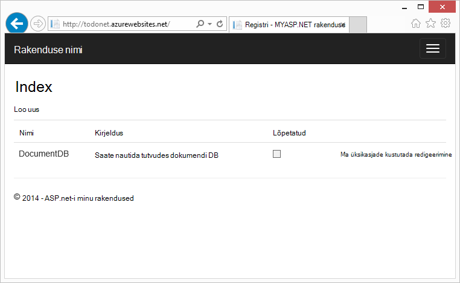

See walk-through näitab, kuidas Azure'i teenus DocumentDB abil saate talletada ja pääseda ASP.net-i MVC veebirakenduse majutatud Azure'i andmetele. Kui otsite õpetuse, mis keskendub ainult DocumentDB ja mitte ASP.net-i MVC komponendid, lugege teemat [koostada DocumentDB C# konsooli rakendus](documentdb-get-started.md).

> [AZURE.TIP] Selle õpetuse eeldab, et teil on eelnev kogemus ASP.net-i MVC ja Azure veebisaitide abil. Kui olete uus ASP.net-i või [eelnevalt nõutud tööriistad](#_Toc395637760), soovitame allalaadimine täieliku valimi projekti [GitHub][] ja selles näites juhiseid. Kui teil on see ehitatud, saate vaadata selles artiklis koodi kontekstis projekti ülevaate saada.

## Selle õpetuse andmebaasi eeltingimused

Enne selle artikli juhiseid järgides, peate tagama, et teil on järgmine:

- Aktiivne Azure'i konto. Kui teil pole kontot, saate luua tasuta prooviversiooni konto vaid paar minutit. Lisateavet leiate teemast [Azure tasuta prooviversioon](https://azure.microsoft.com/pricing/free-trial/).
- [Visual Studio 2015](http://www.visualstudio.com/) või Visual Studio 2013 värskenduse 4 või uuem versioon. Visual Studio 2013 kasutamisel kuvatakse peate installima [Microsoft.Net.Compilers Nugeti paketti](https://www.nuget.org/packages/Microsoft.Net.Compilers/) lisada C# 6.0 tugi. 
- Azure'i SDK .net-i versioon 2.5.1 või uuem versioon, mis on saadaval [Microsoft Web platvormi Installer][]kaudu.

Kõik selles artiklis ekraanipilt on võetud, kasutades Visual Studio 2013 värskenduse 4 rakendatud ja Azure SDK .net-i versioon 2.5.1. Kui teie süsteemi konfiguratsioon on võimalik, et teie ekraanid ja suvandid ei vasta täielikult, kuid kui vastate ülaltoodud eeltingimused see lahendus peaks toimima erinevaid versioone.

## Samm 1: DocumentDB andmebaasi konto loomine

Alustame DocumentDB konto loomine. Kui teil on juba konto, saate vahele jätta [Loo uus MVC ASP.net-i rakendus](#_Toc395637762).

[AZURE.INCLUDE [documentdb-create-dbaccount](../../includes/documentdb-create-dbaccount.md)]

[AZURE.INCLUDE [documentdb-keys](../../includes/documentdb-keys.md)]

 
Nüüd tutvustame kaudu, kuidas luua uus rakendus ASP.net-i MVC maa-üles. 

## Samm 2: Looge uus ASP.net-i MVC rakendus

Nüüd, kui teil on konto, loome meie uut ASP.net-i projekti.

1. Visual Studio, klõpsake menüüs **fail** käsk **Uus**ja seejärel klõpsake nuppu **projekti**.

    Kuvatakse dialoogiboks **Uue projekti** .
2. **Projekti tüübid** paanil laiendage **Mallid**, **Visual C#**, **Web**ja valige **ASP.net-i veebirakenduse**.

    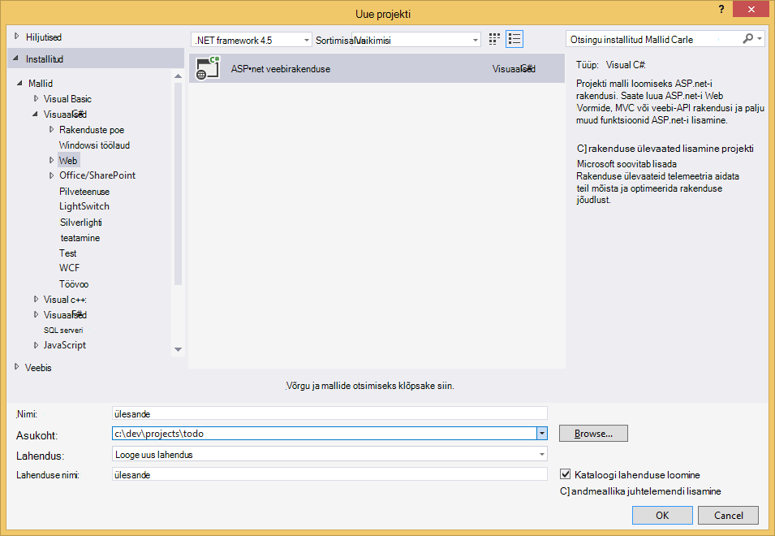

3. Tippige väljale **nimi** projekti nime. Selle õpetuse kasutab nime "todo". Kui otsustate kasutada midagi muud kui see, kuhu selle õpetuse räägib todo nimeruumi, peate kohandada pakutavaid koodinäiteid kasutada mis tahes nimega rakenduse. 

4. Klõpsake nuppu **Sirvi** liikuge kausta, kuhu soovite projekti luua, ja seejärel klõpsake nuppu **OK**.

    Kuvatakse dialoogiboks **Uue ASP.net-i projekti** .

    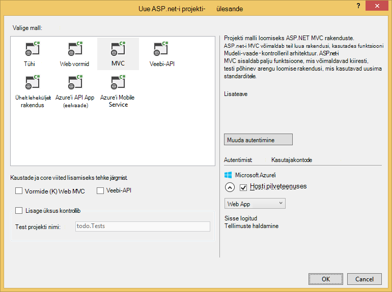

5. Valige paanil mallide **MVC**.

6. Kui plaanite majutada rakenduse Azure valige **Host pilveteenuses** on Azure hosti rakenduse paremal. Olete valinud majutada pilves ja Azure veebisait majutatud rakenduse käivitamiseks. Selle suvandi valimisel preprovision Azure veebisait teile ja muuta elu palju lihtsam, kui neid kordama lõplik töötamine rakenduse juurutamine. Kui see mujal majutada või ei soovi konfigureerida Azure algusest peale, tühjendage lihtsalt **Host pilveteenuses**.

7. Klõpsake nuppu **OK** ja andke Visual Studio teha oma asja ümber tellingud ASP.net-i MVC tühja malli. 

8. Kui valisite majutada see kuvatakse vähemalt ühe täiendava ekraani palub teil oma Azure'i kontosse sisse logida ja mõned väärtused ette uue veebisaidi pilveteenuses. Täiendavad väärtused ja jätkata. 

    Ma ei ole "andmebaasiserveri" siin valinud, kuna me ei kasuta siin Azure SQL-i andmebaasiserver, me ei kavatse Azure'i DocumentDB uue konto luua hiljem Azure'i portaalis.

    **Rakenduse teenusleping** - ja **Ressursirühma**valimise kohta lisateabe saamiseks leiate [Azure'i rakendust Service lepingute põhjalik ülevaade](../app-service/azure-web-sites-web-hosting-plans-in-depth-overview.md).

    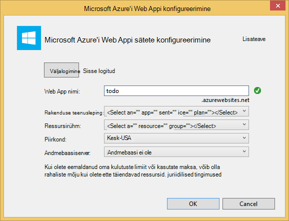

9. Kui Visual Studio on lõpule jõudnud, trafarett MVC rakenduste loomine teil tühja ASP.net-i rakendused, mida saate käitada kohalikult.

    Me kuvatakse vahele töötab projekti kohalikult, kuna olen kindel, et oleme kõik näinud ASP.net-i "Tere, maailm" rakendus. Esmalt minge otse DocumentDB lisamine projekti arendamist ning meie rakendus.

## Samm 3: Lisada DocumentDB MVC web rakenduse projekti

Nüüd kus oleme enamik ASP.net-i MVC sanitaartehniliste, mida läheb vaja seda lahendust, vaatame avada selles õpetuses Azure'i DocumentDB lisamine meie MVC veebirakenduse tegelik eesmärk.

1. DocumentDB .NET SDK pakitud ja jaotatud Nugeti paketina. Visual Studio Nugeti pakett saamiseks kasutage Nugeti package manager Visual Studios, klõpsates projekti **Solution** Exploreris ja seejärel käsku **Halda NuGet-paketid**.

    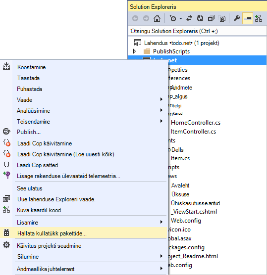

    Kuvatakse dialoogiboks **Haldamine NuGet-paketid** .

2. Tippige väljale Nugeti **sirvimine** ***Azure'i DocumentDB***.
    
    Tulemuste, installige **Microsoft Azure'i DocumentDB kliendi teek** pakett. See alla laadida ja installida DocumentDB paketi kui ka kõik sõltuvusi, nt Newtonsoft.Json. Klõpsake nuppu **OK** **eelvaateaknas** ja **nõustun** **Litsentsiga nõustumine** aknas installimise lõpuleviimiseks.

    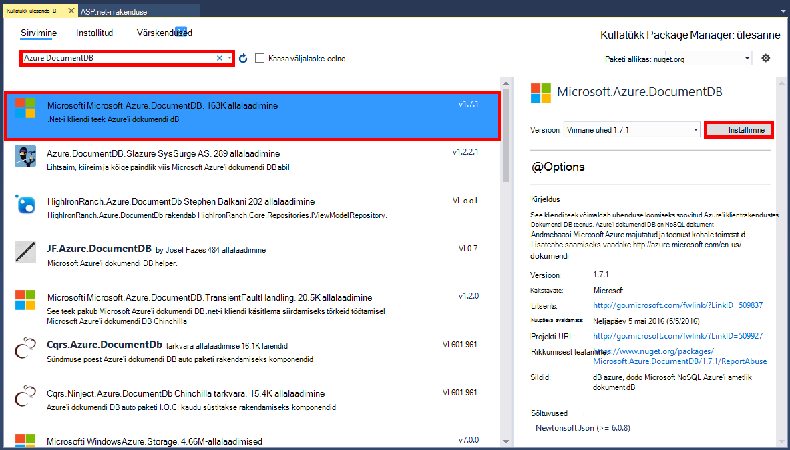

    Teise võimalusena saate installida paketi Package Manager konsooli. Selleks klõpsake menüü **Tööriistad** käsku **Nugeti Package Manager**ja klõpsake **Package Manager konsooli**. Vastava viiba kuvamisel tippige järgmist.

        Install-Package Microsoft.Azure.DocumentDB

3. Kui pakett on installitud, peaks teie Visual Studio lahendus sarnaneb järgmised kaks uut viited lisanud, Microsoft.Azure.Documents.Client ja Newtonsoft.Json.

    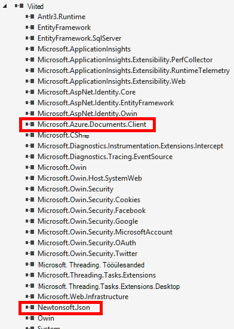

##Samm 4: ASP.NET MVC rakenduste häälestamine
 
Nüüd mudelid, vaadete ja kontrollerid vaatame selle MVC rakenduse lisamine:

- [Lisa mudel](#_Toc395637764).
- [Lisa lisamine kontrolleril](#_Toc395637765).
- [Lisa vaated](#_Toc395637766).

### JSON andmemudeli lisamine

Alustame loomisega **M** MVC mudel. 

1. **Lahenduste Explorer**, paremklõpsake kausta **mudelite** , klõpsake nuppu **Lisa**ja klõpsake **klassi**.

    Kuvatakse dialoogiboks **Lisa uus üksus** .

2. Uuest ainekursuse **Item.cs** nimi ja klõpsake nuppu **Lisa**. 

3. Selle uue **Item.cs** faili lisamine pärast viimast *kasutamine lause*järgmist.
        
        using Newtonsoft.Json;
    
4. Nüüd asendada see kood 
        
        public class Item
        {
        }

    Järgmine kood.

        public class Item
        {
            [JsonProperty(PropertyName = "id")]
            public string Id { get; set; }
             
            [JsonProperty(PropertyName = "name")]
            public string Name { get; set; }

            [JsonProperty(PropertyName = "description")]
            public string Description { get; set; }

            [JsonProperty(PropertyName = "isComplete")]
            public bool Completed { get; set; }
        }

    Kõigi andmete DocumentDB on möödas üle kaabel ja JSON salvestatud. Kuidas kontrollida oma objektid on seeriasertide/deserialized JSON.NET saate kasutada atribuuti **JsonProperty** nagu me äsja loodud **üksuse** klassi. Te ei **ole** seda teha, kuid soovin, et tagada, et minu atribuudid järgige JSON camelCase nimereeglid. 
    
    Mitte ainult saate saate määrata Vorming atribuudi nimi, kui see läheb JSON, kuid saate täielikult ümber nimetada oma .net-i atribuutide nagu ma ei ja atribuudi **Kirjeldus** . 
    

### Lisage soovitud domeenikontrolleri

Mis hoolitseb **M**nüüd vaatame MVC kontrolleril klassi **C** loomine.

1. **Lahenduste Explorer**, paremklõpsake kausta **kontrollerid** , klõpsake nuppu **Lisa**ja klõpsake **kontrolleril**.

    Kuvatakse dialoogiboks **Lisamine tellingud** .

2. Valige **MVC 5 kontrolleril - Tühjenda** ja seejärel klõpsake nuppu **Lisa**.

    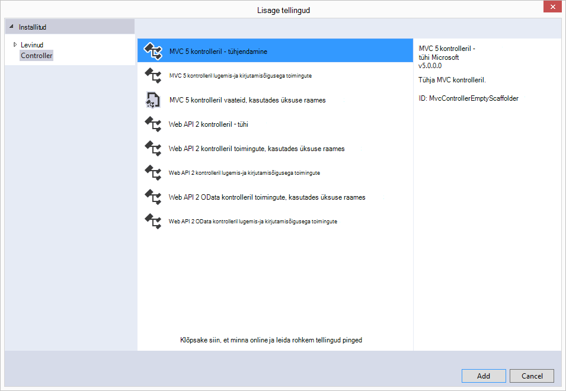

3. Nimi uue kontrolleril, **ItemController.**

    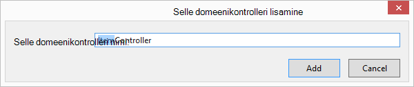

    Kui fail on loodud, näeb teie Visual Studio lahendus uue ItemController.cs failiga **Solution**Exploreris järgmist. Uue Item.cs faili varem loodud, kuvatakse ka.

    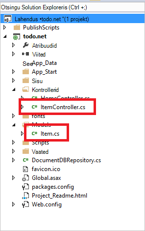

    Saate sulgeda ItemController.cs, saame saate naasta selle hiljem. 

### Vaadete lisamine

Nüüd MVC, vaadete loomine **V** :

- [Lisa üksus Index ülevaade](#AddItemIndexView).
- [Lisa uus üksus vaade](#AddNewIndexView).
- [Lisa ülevaade Redigeeri üksust](#_Toc395888515).

#### Mõne üksuse Index vaate lisamine

1. **Solution Exploreris**, laiendage kausta **vaateid** , paremklõpsake **üksuse** Tühjenda kaust, mis teie jaoks loodud Visual Studios, kui **ItemController** varem lisatud, klõpsake nuppu **Lisa**ja seejärel klõpsake menüüs **Vaade**.

    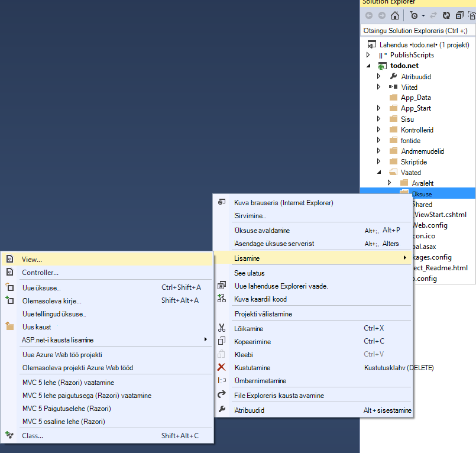

2. Dialoogiboksis **Vaate lisamiseks** tehke järgmist.
    - Tippige väljale **vaate nimi** ***register***.
    - Valige dialoogiboksis **malli** ***loend***.
    - Valige väljal **mudeli klassi** ***üksus (todo. Mudelid)***.
    - **Andmete kontekstis klassi** kasti tühjaks jätta. 
    - Tippige väljale Lehe paigutuse ***~/Views/Shared/_Layout.cshtml***.
    
    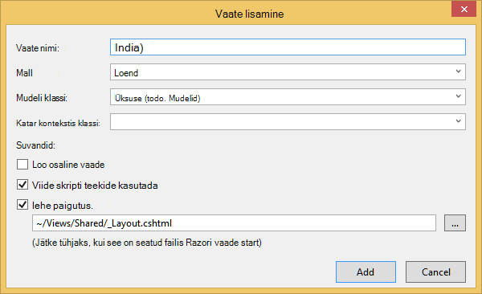

3. Kui kõik need väärtused on määratud, klõpsake nuppu **Lisa** ja andke Visual Studio uue malli vaate loomine. Kui see on tehtud, avaneb cshtml faili, mis on loodud. Me saate Sulgege see fail Visual Studios, nagu me tulevad seda hiljem.

#### Uue üksuse vaate lisamine

Sarnaselt kuidas lõime rakenduse **Üksuse Index** vaate, Nüüd loome uue vaate uute **üksuste**loomine.

1. **Solution Exploreris**, paremklõpsake kausta **üksuse** uuesti, klõpsake nuppu **Lisa**ja seejärel klõpsake menüüs **Vaade**.

2. Dialoogiboksis **Vaate lisamiseks** tehke järgmist.
    - Tippige väljale **vaate nimi** ***loomine***.
    - Valige väljal **malli** ***loomine***.
    - Valige väljal **mudeli klassi** ***üksus (todo. Mudelid)***.
    - **Andmete kontekstis klassi** kasti tühjaks jätta.
    - Tippige väljale Lehe paigutuse ***~/Views/Shared/_Layout.cshtml***.
    - Klõpsake nuppu **Lisa**.

#### Rakenduse Redigeeri üksust vaate lisamine

Ja lõpuks lisada ühe viimase vaate redigeerimine **üksust** samamoodi nagu enne.

1. **Solution Exploreris**, paremklõpsake kausta **üksuse** uuesti, klõpsake nuppu **Lisa**ja seejärel klõpsake menüüs **Vaade**.

2. Dialoogiboksis **Vaate lisamiseks** tehke järgmist.
    - Tippige väljale **vaate nimi** ***redigeerimine***.
    - Valige väljal **malli** ***redigeerimine***.
    - Valige väljal **mudeli klassi** ***üksus (todo. Mudelid)***.
    - **Andmete kontekstis klassi** kasti tühjaks jätta. 
    - Tippige väljale Lehe paigutuse ***~/Views/Shared/_Layout.cshtml***.
    - Klõpsake nuppu **Lisa**.

Kui see on lõpule jõudnud, sulgege cshtml dokumentide Visual Studio anname teada neid vaateid hiljem.

## Juhis 5: Kaabeldus DocumentDB häälestamine

Nüüd, kui normaliseeritud MVC asjade eest on tehtud, vaatame pöörduda DocumentDB koodi lisamine. 

Selles jaotises lisame käsitlema järgmine kood:

- [Loetelu lõpetamata üksuste](#_Toc395637770).
- [Üksuste lisamine](#_Toc395637771).
- [Üksuste redigeerimine](#_Toc395637772).

### Veebirakenduses MVC lõpetamata üksuste loetelu

Kõigepealt tuleb teha siin on klassi, mis sisaldab kõigi ühenduse loomine ja kasutamine DocumentDB loogika lisamine. Selles õpetuses mõeldud meil kuvatakse kapseldada kõigi selle loogika sisse hoidla klassi nimetatakse DocumentDBRepository. 

1. **Lahenduste Explorer**, paremklõpsake projekti, klõpsake nuppu **Lisa**ja klõpsake **klassi**. Selle uue ainekursuse **DocumentDBRepository** nimi ja klõpsake nuppu **Lisa**.
 
2. Klõpsake äsja loodud **DocumentDBRepository** klassi ja lisage järgmised *abil laused* kohal *nimeruumi* deklaratsioon
        
        using Microsoft.Azure.Documents; 
        using Microsoft.Azure.Documents.Client; 
        using Microsoft.Azure.Documents.Linq; 
        using System.Configuration;
        using System.Linq.Expressions;
        using System.Threading.Tasks;

    Nüüd asendada see kood 

        public class DocumentDBRepository
        {
        }

    Järgmine kood.

        public static class DocumentDBRepository<T> where T : class
        {
            private static readonly string DatabaseId = ConfigurationManager.AppSettings["database"];
            private static readonly string CollectionId = ConfigurationManager.AppSettings["collection"];
            private static DocumentClient client;
    
            public static void Initialize()
            {
                client = new DocumentClient(new Uri(ConfigurationManager.AppSettings["endpoint"]), ConfigurationManager.AppSettings["authKey"]);
                CreateDatabaseIfNotExistsAsync().Wait();
                CreateCollectionIfNotExistsAsync().Wait();
            }
    
            private static async Task CreateDatabaseIfNotExistsAsync()
            {
                try
                {
                    await client.ReadDatabaseAsync(UriFactory.CreateDatabaseUri(DatabaseId));
                }
                catch (DocumentClientException e)
                {
                    if (e.StatusCode == System.Net.HttpStatusCode.NotFound)
                    {
                        await client.CreateDatabaseAsync(new Database { Id = DatabaseId });
                    }
                    else
                    {
                        throw;
                    }
                }
            }
    
            private static async Task CreateCollectionIfNotExistsAsync()
            {
                try
                {
                    await client.ReadDocumentCollectionAsync(UriFactory.CreateDocumentCollectionUri(DatabaseId, CollectionId));
                }
                catch (DocumentClientException e)
                {
                    if (e.StatusCode == System.Net.HttpStatusCode.NotFound)
                    {
                        await client.CreateDocumentCollectionAsync(
                            UriFactory.CreateDatabaseUri(DatabaseId),
                            new DocumentCollection { Id = CollectionId },
                            new RequestOptions { OfferThroughput = 1000 });
                    }
                    else
                    {
                        throw;
                    }
                }
            }
        }

    > [AZURE.TIP] Kui loote uue DocumentCollection võite pakkuda RequestOptions valikuline parameeter, OfferType, mis võimaldab teil määrata uue saidikogumi jõudlust. Kui see parameeter on mitte edasi kasutada vaikimisi pakkumise tüüp. Lisateavet DocumentDB pakkumise tüüpi palun vaadake [DocumentDB jõudluse tasemed](documentdb-performance-levels.md)

3. Me lugemine mõned väärtused konfiguratsioon nii Avage **fail rakenduse** ja lisada järgmised read all olevat `<AppSettings>` jaotis.
    
        <add key="endpoint" value="enter the URI from the Keys blade of the Azure Portal"/>
        <add key="authKey" value="enter the PRIMARY KEY, or the SECONDARY KEY, from the Keys blade of the Azure  Portal"/>
        <add key="database" value="ToDoList"/>
        <add key="collection" value="Items"/>
    
4. Nüüd, värskendage väärtused *lõpp-punkti* ja *authKey* Azure portaali tera klahvide abil. Kasutada **URI** keelest klahvid lõpp-punkti sätte väärtus ja kasutada **PRIMAARVÕTME**või **TEISESE võtme** keelest klahvid authKey sätte väärtus.

    Et hoolitseb juhtmestik üles DocumentDB hoidla, nüüd vaatame meie rakenduse loogika lisamine.

5. Kõigepealt soovime todo loendi rakendusega teha on lõpetamata üksuste kuvamiseks.  Kopeerige ja kleepige järgmine koodilõigu suvalist **DocumentDBRepository** tunni jooksul.

        public static async Task<IEnumerable<T>> GetItemsAsync(Expression<Func<T, bool>> predicate)
        {
            IDocumentQuery<T> query = client.CreateDocumentQuery<T>(
                UriFactory.CreateDocumentCollectionUri(DatabaseId, CollectionId))
                .Where(predicate)
                .AsDocumentQuery();

            List<T> results = new List<T>();
            while (query.HasMoreResults)
            {
                results.AddRange(await query.ExecuteNextAsync<T>());
            }

            return results;
        }

6. Avage **ItemController** me varem lisatud ja lisage järgmised *abil laused* nimeruumi deklaratsioon kohal.

        using System.Net;
        using System.Threading.Tasks;
        using todo.Models;

    Kui projekti ei nimega "todo", siis peate värskendama, kasutades "todo. Mudelid"; vastavalt projekti nime.

    Nüüd asendada see kood

        //GET: Item
        public ActionResult Index()
        {
            return View();
        }

    Järgmine kood.

        [ActionName("Index")]
        public async Task<ActionResult> IndexAsync()
        {
            var items = await DocumentDBRepository<Item>.GetItemsAsync(d => !d.Completed);
            return View(items);
        }
    
7. Avage **Global.asax.cs** ja lisage järgmine rida **Application_Start** meetod 
 
        DocumentDBRepository<todo.Models.Item>.Initialize();
    
Selles etapis teie lahendus peaks oskama koostada ilma vigu.

Kui käivitasite rakenduse kohe, saate läheks **HomeController** ja selle domeenikontrolleri **Index** vaate. See on vaikekäitumine MVC malli projekti valisime alguses, kuid ei taha, et! Vaatame muuta selle MVC taotluse muuta selline käitumine marsruutimist.

Avatud ***rakenduse\_Start\RouteConfig.cs*** ja otsige üles rida, alustades "vaikesätted:" ja muuta selle välja näha umbes järgmine.

        defaults: new { controller = "Item", action = "Index", id = UrlParameter.Optional }

Nüüd ütleb ASP.net-i MVC, mis juhul, kui te pole väärtus URL-i kontrolli marsruutimise käitumise selle asemel et **Avaleht**, kasutada **üksuse** domeenikontrolleri ja kasutajale **Index** vaade.

Nüüd, kui käivitate rakenduse, kuvatakse sissehelistamine oma **ItemController** , mis hoidla klassi sisse helistada ja kasutage GetItems meetodit lõpetamata üksuste naasmiseks **vaadete**\\**üksuse**\\**Index** vaade. 

Kui koostamine ja selle projekti kohe käivitada, peaks nüüd näete midagi, mis näeb välja järgmine.    

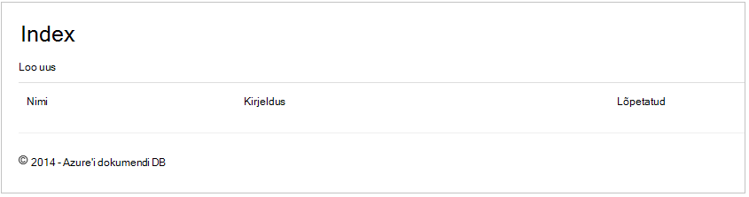

### Üksuste lisamine

Vaatame panna mõne üksuse meie andmebaasi, nii et meil on midagi enamat kui mõnda tühja ruudustiku vaadata.

DocumentDBRepository ja ItemController jää püsima DocumentDB kirje lisamine mõned koodi.

1.  Saate lisada **DocumentDBRepository** tunni järgmisel viisil.

        public static async Task<Document> CreateItemAsync(T item)
        {
            return await client.CreateDocumentAsync(UriFactory.CreateDocumentCollectionUri(DatabaseId, CollectionId), item);
        }

    See meetod lihtsalt objekti selle vastu võtab ja püsib selle DocumentDB.

2. Avage fail ItemController.cs ja lisage järgmised koodilõigu klassi. See on, kuidas ASP.net-i MVC teab, mida **Loo** toimingute jaoks. Sel juhul ainult renderdada seostatud Create.cshtml vaade varem loodud.

        [ActionName("Create")]
        public async Task<ActionResult> CreateAsync()
        {
            return View();
        }

    Nüüd tuleb veel mõned kood selle domeenikontrolleri, mida aktsepteerib esitamist **Loo** vaade.

2. Järgmise ajaploki koodi lisada ItemController.cs klassi, mis ütleb ASP.net-i MVC, mida teha vormi postituse selle domeenikontrolleri.
    
        [HttpPost]
        [ActionName("Create")]
        [ValidateAntiForgeryToken]
        public async Task<ActionResult> CreateAsync([Bind(Include = "Id,Name,Description,Completed")] Item item)
        {
            if (ModelState.IsValid)
            {
                await DocumentDBRepository<Item>.CreateItemAsync(item);
                return RedirectToAction("Index");
            }

            return View(item);
        }

    Järgmine kood on DocumentDBRepository helistab ja kasutab CreateItemAsync meetodit jää püsima todo uue üksuse andmebaasi. 
 
    **Turbeteade**: **ValidateAntiForgeryToken** atribuuti kasutatakse siin selle rakenduse saitidevaheline taotluse võltsimist eest kaitsta. On see rohkem kui lihtsalt lisades atribuudi, oma vaadete tuleb töötada selle anti võltsimist märgiks. Lisateavet teema ja näiteid, kuidas rakendada õigesti, leiate [Vältimine saitidevaheline taotlemine võltsimist][]. Lähtekoodi [github][] esitatud on täielik rakendamine.

    **Turbeteade**: ka kasutame **siduda** atribuudi meetodi parameetri üle postitamise eest kaitsta. Üksikasjalikumat teavet leiate [põhilised CRUD toimingute ASP.net-i MVC][].

Sellega lõpeb meie andmebaasi lisada uued üksused nõutav kood.

### Üksuste redigeerimine

On üks Viimane asi saaksime seda teha, ja see on lisada andmebaasi **üksuste** redigeerimine ja nende lõpuleviiduks märkimine. Redigeerimisvaate juba lisatud projekt, et vaja ainult teatud koodi meie domeenikontrolleri ja **DocumentDBRepository** klassi uuesti lisada.

1. Saate lisada **DocumentDBRepository** klassi järgmist.

        public static async Task<Document> UpdateItemAsync(string id, T item)
        {
            return await client.ReplaceDocumentAsync(UriFactory.CreateDocumentUri(DatabaseId, CollectionId, id), item);
        }

        public static async Task<T> GetItemAsync(string id)
        {
            try
            {
                Document document = await client.ReadDocumentAsync(UriFactory.CreateDocumentUri(DatabaseId, CollectionId, id));
                return (T)(dynamic)document;
            }
            catch (DocumentClientException e)
            {
                if (e.StatusCode == HttpStatusCode.NotFound)
                {
                    return null;
                }
                else
                {
                    throw;
                }
            }
        }
    
    Esimene meetodi **GetItem** tõmbab üksuse kaudu DocumentDB, mis on möödas naasmiseks **ItemController** ning seejärel vaate **redigeerimine** .
    
    Teine meetoditest lisasime lihtsalt asendab **dokumendi** DocumentDB **dokumendi** versiooniga möödunud **ItemController**.

2. Saate lisada **ItemController** klassi järgmist.

        [HttpPost]
        [ActionName("Edit")]
        [ValidateAntiForgeryToken]
        public async Task<ActionResult> EditAsync([Bind(Include = "Id,Name,Description,Completed")] Item item)
        {
            if (ModelState.IsValid)
            {
                await DocumentDBRepository<Item>.UpdateItemAsync(item.Id, item);
                return RedirectToAction("Index");
            }

            return View(item);
        }

        [ActionName("Edit")]
        public async Task<ActionResult> EditAsync(string id)
        {
            if (id == null)
            {
                return new HttpStatusCodeResult(HttpStatusCode.BadRequest);
            }

            Item item = await DocumentDBRepository<Item>.GetItemAsync(id);
            if (item == null)
            {
                return HttpNotFound();
            }

            return View(item);
        }
    
    Esimene meetod tegeleb Http GET, mis juhtub, kui kasutaja klõpsab **Index** vaates **Redigeeri** linki. See meetod toob [**dokumendi**](http://msdn.microsoft.com/library/azure/microsoft.azure.documents.document.aspx) kaudu DocumentDB ja edastab selle vaate **redigeerimine** .

    **Redigeerimisvaates** seejärel mõnda Http POST teha **IndexController**. 
    
    Teine meetod lisasime pidemete läbib värskendatud objekti DocumentDB soovite andmebaasi sunnita.

See on õige, mis on kõik peame meie rakenduse, lõpetamata **üksuste**loendi, lisage uued **üksused**ja **üksuste**redigeerimine.

## Samm 6: Rakenduse käivitada kohalikult

Testige oma kohalikus arvutis rakenduse, tehke järgmist.

1. Vajutage klahvi F5 koostamiseks silumine režiimis rakenduse Visual Studios. See peaks rakenduse ja käivitage me näinud tühja ruudustiku leht brauseris:

    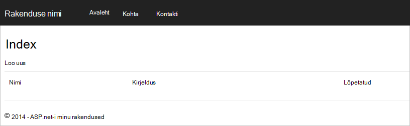

    Kui kasutate Visual Studio 2013 ja kuvatakse tõrketeade "Ei saa ootavad saagi klausel kehas." peate installima [Microsoft.Net.Compilers Nugeti pakett](https://www.nuget.org/packages/Microsoft.Net.Compilers/). Samuti saate võrrelda oma koodi valimi projekti [github][]. 

2. Klõpsake nuppu **Loo uus** link ja lisage väärtused väljadele **nimi** ja **Kirjeldus** . Lahku **lõpetatud** ruut valimata muidu uue **üksuse** lisatakse lõplikus olekus ja algse loendis ei kuvata.

    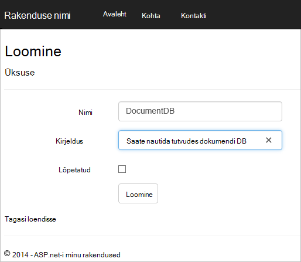

3. Klõpsake nuppu **Loo** ja suunatakse **Index** vaatesse naasmiseks ja oma **üksuse** kuvatakse loendis.

    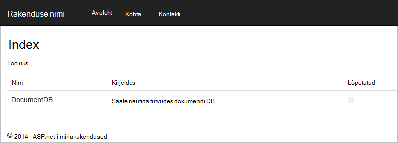

    Võite mõne täiendavate **üksuste** lisamine loendisse todo.

3. Klõpsake nuppu **Redigeeri** kõrval **üksus** ja teil on võetud **redigeerimisvaates** kui värskendate vara objekti, sh **lõppenud** lipp. Kui **täielik** lipuga märkimine ja klõpsake nuppu **Salvesta**, eemaldatakse **üksuse** lõpetamata tööülesannete loend.

    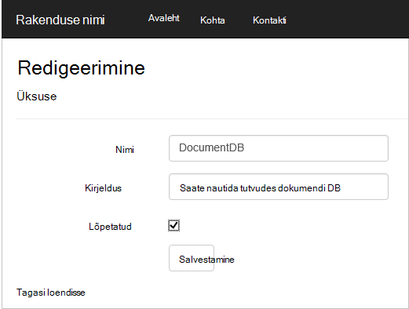

4. Kui te olete testitud rakendus, vajutage klahvikombinatsiooni Ctrl + F5 silumine rakenduse lõpetada. Olete valmis kasutama!

## Juhis 7: Azure'i veebisaitide rakenduse juurutamine

Nüüd, kui teil on õigesti töötamine DocumentDB täieliku taotluse teeme selle veebirakenduse juurutada Azure veebisaitide. Kui valisite **Host pilveteenuses** tühja ASP.net-i MVC projekti loomisel klõpsake Visual Studio teeb selle väga lihtsaks ja teie jaoks kõige töö ei. 

1. Selle rakenduse avaldada teha pole vaja Paremklõpsake **Solution** Exploreris projekt ja klõpsake nuppu **Avalda**.

    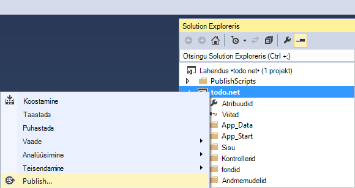

2. Kõik juba olema konfigureeritud vastavalt kirjeldamine; tegelikult veebisaidi on juba loodud Azure teile **Sihtkoha URL-i** näha, on kõik, mida on vaja teha, klõpsake nuppu **Avalda**.

    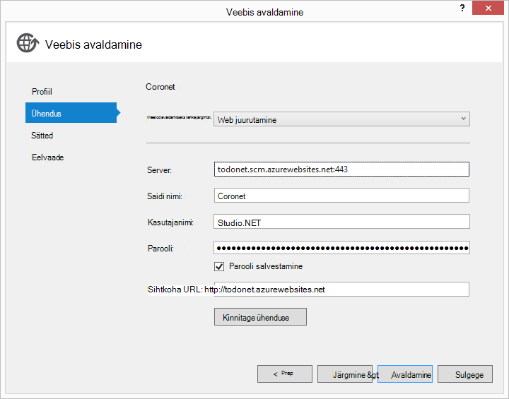

Mõne sekundi, Visual Studio valmis avaldada oma veebirakenduse ja käivitage Siin näete oma mugav töö töötab Azure brauseris!

## Järgmised sammud

Palju õnne! Lihtsalt ehitatud oma esimese ASP.net-i MVC veebirakenduse abil Azure'i DocumentDB ja avaldada Azure veebisaitide. Lähtekoodi täieliku taotluse, sh üksikasjad ja Kustuta funktsioonid, mis ei kuulu selles õpetuses saate alla laadida või kloonitud [GitHub][]kaudu. Kui olete huvitatud lisamine rakenduse, ostke koodi ja lisada selle rakenduse.

Lisafunktsioone lisamiseks rakenduse läbivaatus [DocumentDB .net-i teek](https://msdn.microsoft.com/library/azure/dn948556.aspx) saadaolevate API-de ja julgelt DocumentDB .net-i teeki [github][]edastamiseks. 

[\*]: https://microsoft.sharepoint.com/teams/DocDB/Shared%20Documents/Documentation/Docs.LatestVersions/PicExportError
[Visual Studio Express]: http://www.visualstudio.com/products/visual-studio-express-vs.aspx
[Microsoft Web platvormi Installer]: http://www.microsoft.com/web/downloads/platform.aspx
[Saitidevaheline taotluse võltsimist vältimine]: http://go.microsoft.com/fwlink/?LinkID=517254
[ASP.net-i MVC lihtsa CRUD toimingud]: http://go.microsoft.com/fwlink/?LinkId=317598
[GitHub]: https://github.com/Azure-Samples/documentdb-net-todo-app
