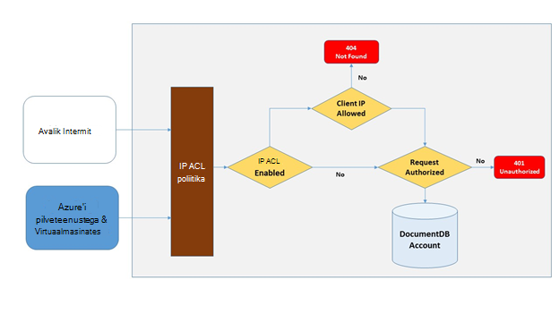
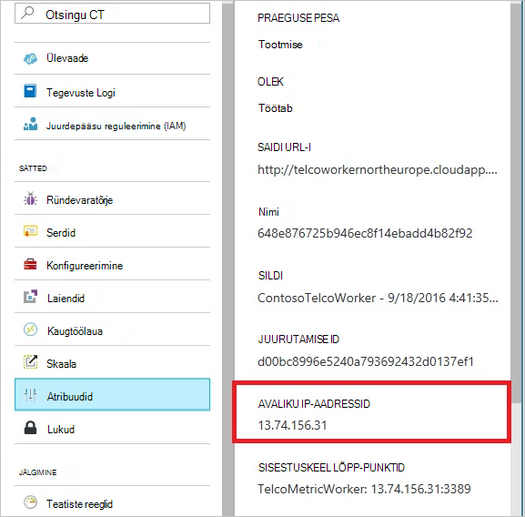
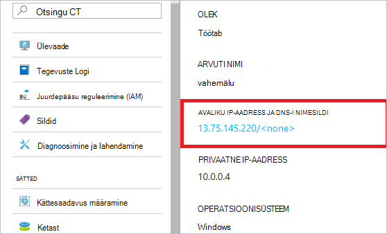
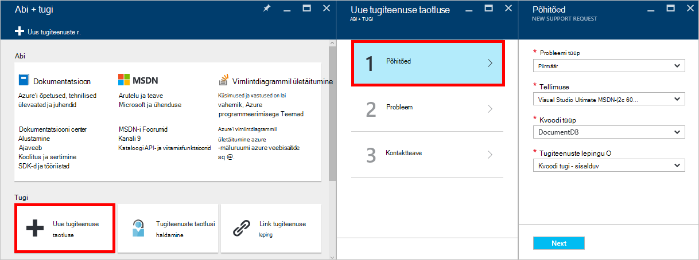
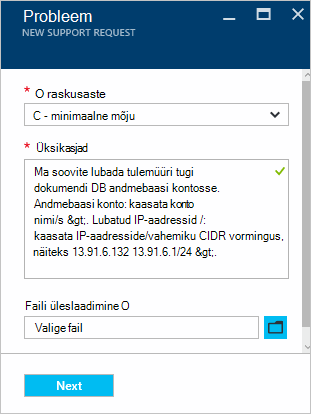

<properties
    pageTitle="DocumentDB tulemüüri tugi | Microsoft Azure'i"
    description="Saate teada, kuidas kasutada IP juurdepääsupoliitikaid juhtelemendi tulemüüri tugiteenuste Azure'i DocumentDB andmebaasi kontodega."
    keywords="IP juurdepääsu reguleerimine, tulemüüri tugi"
    services="documentdb"
    authors="shahankur11"
    manager="jhubbard"
    editor=""
    tags="azure-resource-manager"
    documentationCenter=""/>

<tags 
    ms.service="documentdb" 
    ms.workload="data-services" 
    ms.tgt_pltfrm="na" 
    ms.devlang="na" 
    ms.topic="article" 
    ms.date="10/17/2016" 
    ms.author="ankshah; kraman"/>

# DocumentDB tulemüüri tugi

Salvestatud konto Azure DocumentDB andmebaasi andmete turvamiseks DocumentDB on andnud tugi salajane vastavalt [autoriseerimine mudelit](https://msdn.microsoft.com/library/azure/dn783368.aspx) , mis kasutab tugeva räsi vastavalt sõnumi autentimise koodi (HMAC-i). DocumentDB toetab nüüd, mudelisse salajane vastavalt autoriseerimine, lisaks juhitud IP-põhine Accessi juhtelemendid sissetuleva tulemüüri tugiteenuste poliitika. See mudel on väga sarnane tulemüüri reeglid traditsiooniline andmebaasi süsteemi ja pakub väärtpaberi DocumentDB andmebaasi kontole. Mudeli, saate konfigureerida DocumentDB andmebaasi konto pääseb juurde ainult kinnitatud kogum, masinad ja/või pilveteenused. Teenuste ja nende kinnitatud komplekti DocumentDB ressursid juurdepääsu vajavad endiselt helistaja esitamiseks märgiks kehtiv luba.

## IP juurdepääsu juhtimine ülevaade

Vaikimisi on DocumentDB andmebaasi konto avaliku Interneti kaudu juurdepääsetavad, kui taotlusele on kehtiv luba luba. IP poliitika-põhise juurdepääsu reguleerimine konfigureerimiseks kasutaja peab võimaldama IP-aadresside või IP-aadresside vahemikud CIDR vormi sisalduma kliendi IP-d antud andmebaasi konto jaoks lubatud loendit. Pärast selle konfiguratsiooni kõik päringuid, mis on pärit masinad väljaspool seda lubatud loendi blokeerinud server.  Järgmisel joonisel kirjeldatakse ühenduse töötlemine meilivoo jaoks IP-põhise juurdepääsu reguleerimine.

## Ühenduste pilveteenustega

Azure, pilveteenustega on väga levinud viis hosting teise eesnime, teise teenuse loogika DocumentDB abil. Juurdepääsu lubamine DocumentDB andmebaasi konto kaudu pilveteenus tuleb lubatud IP-aadressid, mida [Azure klienditoega](#configure-ip-policy)DocumentDB andmebaasi kontoga seotud loendisse lisada pilveteenusesse avaliku IP-aadress.  See tagab, et kõik rolli aknad pilveteenuste on konto DocumentDB andmebaasi kasutamiseks. Saate tuua IP-aadresside jaoks oma pilveteenustega Azure'i portaalis, nagu on näidatud järgmises kuvatõmmis. 

Kui muudate oma pilveteenuses, lisades täiendavaid rolli loendisInstance, on need uued eksemplarid automaatselt juurdepääs DocumentDB andmebaasi konto kuna need on osa sellest sama pilveteenuses.

## Ühenduste virtuaalmasinates

[Virtuaalmasinates](https://azure.microsoft.com/services/virtual-machines/) või [virtuaalse masina skaala määrab](../virtual-machine-scale-sets/virtual-machine-scale-sets-overview.md) saab kasutada majutada keskel tasandi teenuseid kasutades DocumentDB.  Konfigureerimine on DocumentDB andmebaasi konto juurdepääsetav virtuaalmasinates, virtuaalse masina ja/või virtuaalse masina skaala määramine avaliku IP-aadressid peavad olema konfigureeritud ühe DocumentDB andmebaasi konto jaoks lubatud IP-aadresside pöördudes [Azure tugi](#configure-ip-policy). IP-aadresside portaalis Azure'i virtuaalmasinates saate alla laadida, nagu on näidatud järgmises kuvatõmmis.

Täiendavad virtuaalse masina eksemplari lisamisel rühma automaatselt neile juurdepääsu konto DocumentDB andmebaasi.

## Ühendused Interneti kaudu

Kui pöördute DocumentDB andmebaasi konto arvutist Interneti-ühendusega arvutid, kliendi IP-aadress või IP-aadresside vahemiku masina lisatakse lubatud IP-aadress DocumentDB andmebaasi konto loendit. 

## IP juurdepääsu juhtimine poliitika konfigureerimine

Azure portaali abil saate esitada taotluse [Azure'i](https://portal.azure.com/?#blade/Microsoft_Azure_Support/HelpAndSupportBlade) toega lubamiseks IP juurdepääsu juhtimine poliitika andmebaasi kontol.

1. [Abi + tugi](https://portal.azure.com/?#blade/Microsoft_Azure_Support/HelpAndSupportBlade) tera, valige **Uus tugiteenuste taotlus**.
2. Valige **Uus tugiteenuste taotlus** blade **põhitõed**.
3. **Põhitõed** tera, valige järgmist:
    - **Probleemi tüüp**: piirmäär
    - **Tellimus**: tellimus, kuhu soovite lisada IP juurdepääsu juhtimine poliitika kontoga seotud.
    - **Kvoodi tüüp**: DocumentDB
    - **Toe kavandamine**: kvoodi - sisaldab tuge.
4. **Probleemi** tera, tehke järgmist.
    - **Raskusaste**: valige C - minimaalne mõju
    - **Üksikasjad**: Kopeerige järgmine tekst väljale ja lisada oma konto nime/s ja IP-aadressi/es: "I soovite lubada tulemüüri tugi DocumentDB andmebaasi kontosse. Andmebaasi kontole: *Lisage konto nimi/s*. Lubatud IP-aadressid /: *kaasata IP-aadresside/vahemiku CIDR vormingus, näiteks 13.91.6.132, 13.91.6.1/24*. "
    - Klõpsake nuppu **edasi**. 
5. **Kontaktteave** tera, täitke oma kontaktandmed ja klõpsake nuppu **Loo**. 

Kui teie taotlus on vastu, IP juurdepääsu reguleerimine peaks olema lubatud 24 tunni jooksul. Teid teavitatakse, kui kutse on lõpule viidud.

## Tõrkeotsingu poliitika IP juurdepääsu juhtimine

### Portaali toimingud

Võimaldades IP juurdepääsu juhtimine poliitika DocumentDB andmebaasi konto jaoks, kõik juurdepääsu konto DocumentDB andmebaasi masinad väljaspool on konfigureeritud lubatud IP-aadresside vahemikud loend on blokeeritud. Selle mudeli alusel sirvimise portaalist andmete lennuk toiming on ka blokeeritud, et tagada juurdepääsu reguleerimine. 

### SDK ja Rest API-ga

Jaoks turvalisuse huvides juurdepääs Tarkvaraarenduskomplektist või REST API kaudu masinad pole lubatud tulemuseks üldine 404 ei leitud vastus ei täiendavad üksikasjad. Kontrollige loend, mis on konfigureeritud DocumentDB andmebaasi konto jaoks lubatud IP tagada õige poliitika konfiguratsiooni DocumentDB andmebaasi kontole.

## Järgmised sammud

Võrgu teavet teemast Näpunäited seotud jõudlusega, [jõudluse näpunäited](documentdb-performance-tips.md).