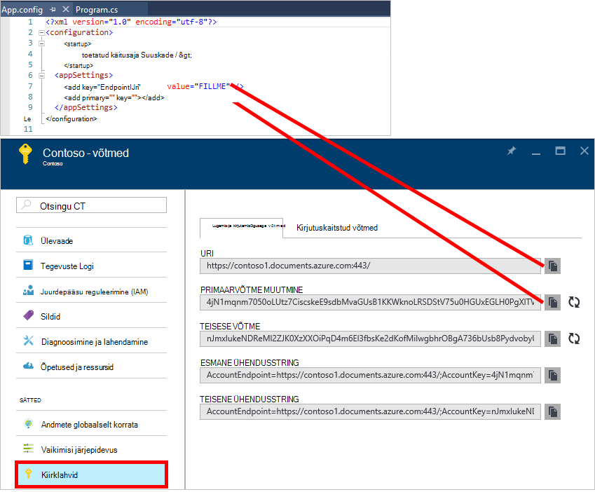
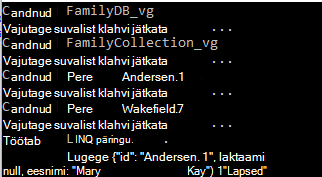
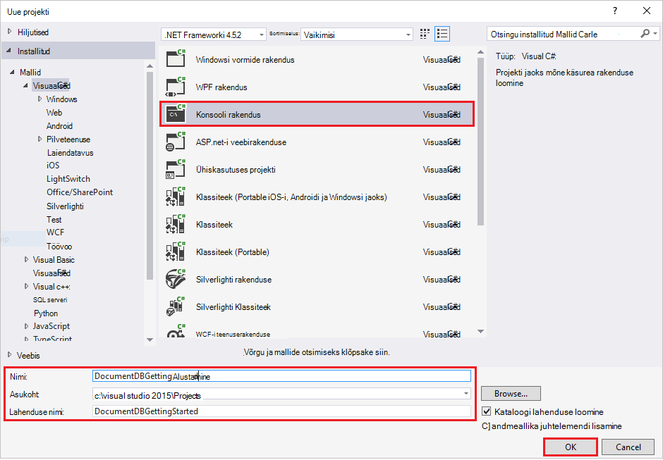
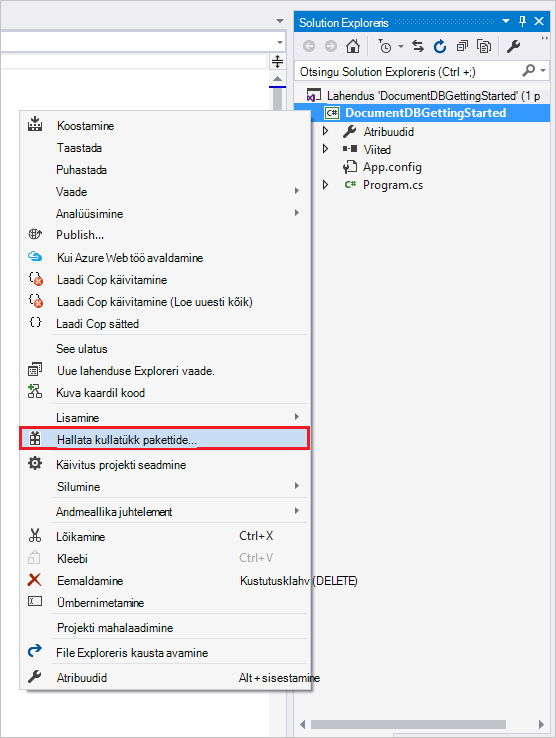
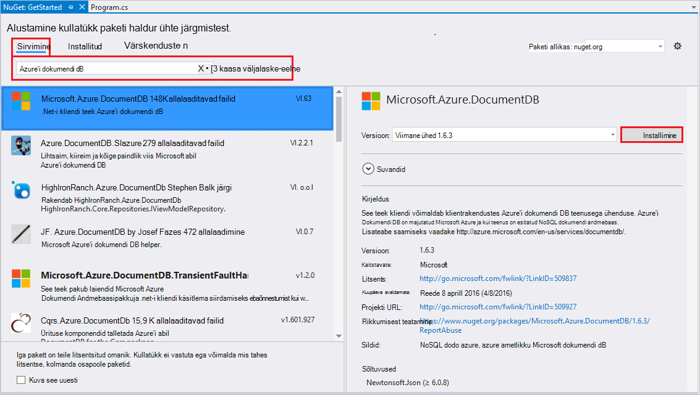
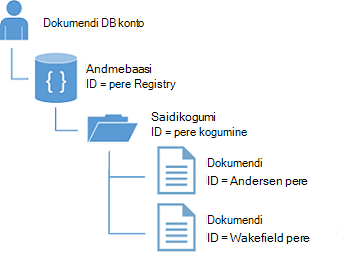
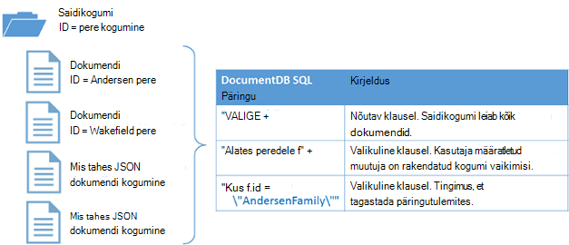

<properties
    pageTitle="NoSQL õpetus: DocumentDB .NET SDK | Microsoft Azure'i"
    description="NoSQL õpetuse, mis loob Online'i andmebaasi ja C# konsooli rakendus DocumentDB .NET SDK abil. DocumentDB on JSON NoSQL andmebaasi."
    keywords="nosql õpetuses online andmebaasi, c# konsooli rakendus"
    services="documentdb"
    documentationCenter=".net"
    authors="AndrewHoh"
    manager="jhubbard"
    editor="monicar"/>

<tags
    ms.service="documentdb"
    ms.workload="data-services"
    ms.tgt_pltfrm="na"
    ms.devlang="dotnet"
    ms.topic="hero-article"
    ms.date="09/01/2016"
    ms.author="anhoh"/>

# NoSQL õpetus: koostada DocumentDB C# konsooli rakendus

> [AZURE.SELECTOR]
- [.NET-I](documentdb-get-started.md)
- [Node.js](documentdb-nodejs-get-started.md)

Tere tulemast NoSQL õpetuse Azure'i DocumentDB .NET SDK! Pärast saada Kiirjuhend projekt või lõpuleviimine õpetuse, siis on teil konsooli rakendus, mis loob ja päringute DocumentDB ressursid.

- **[Kiirjuhend](#quickstart)**: allalaadimine valimi projekt, lisada oma ühenduse teavet ja on DocumentDB rakendus, mis töötab alla 10 minuti.
- **[Õpetus](#tutorial)**: koostada Kiirjuhend rakenduse algusest peale 30 minutit.

## Eeltingimused

- Aktiivne Azure'i konto. Kui teil ei ole üks, te saate registreeruda [tasuta konto](https://azure.microsoft.com/free/).
- [Visual Studio 2013 või Visual Studio 2015](http://www.visualstudio.com/).
- .NET Frameworki 4.6

## Kiirjuhend

1. Alla ZIP valimi projekti [GitHub](https://github.com/Azure-Samples/documentdb-dotnet-getting-started-quickstart/archive/master.zip) või klooni [documentdb-dotnet-saada – alustamine – Kiirjuhend](https://github.com/Azure-Samples/documentdb-dotnet-getting-started-quickstart) repo.
2. Kasutage Azure portaali [DocumentDB konto](documentdb-create-account.md)loomiseks.
3. App.config faili, EndpointUri ja PrimaryKey väärtuste asendamine väärtustega [Azure portaali](https://portal.azure.com/)toodavate liikumine blade **DocumentDB (NoSQL)** , ja seejärel klõpsata **konto nime**ja seejärel käsku **klahvid** menüü ressursi.
    
4. Projekti koostada. Konsooli aknas kuvatakse uus ressursid on loodud, esitatakse selle kohta päring ja seejärel puhastada.
    
    

## Õppeteema

Selles õppeteemas tutvustatakse DocumentDB andmebaasi, DocumentDB saidikogumi ja JSON dokumentide loomine. Seejärel saate saidikogumi, päringu ja puhastamiseks ja andmebaasi kustutamine. Selle õpetuse koostab sama projekti Kiirjuhend projekti, kuid te saate koostada artistide ja saavad selle kohta, lisate projekti kood.

## Samm 1: DocumentDB konto loomine

Loome DocumentDB konto. Kui teil on juba konto, mida soovite kasutada, võite jätkata edasi häälestamine [Teie Visual Studio lahendus](#SetupVS).

[AZURE.INCLUDE [documentdb-create-dbaccount](../../includes/documentdb-create-dbaccount.md)]

## Samm 2: Häälestamine oma Visual Studio lahendus

1. Avage arvutis **Visual Studio 2015** .
2. Klõpsake menüüs **fail** valige **Uus**ja seejärel valige **Project**.
3. Valige dialoogiboksis **Uue projekti** **Mallid** / **Visual C#** / **Konsooli rakendus**, projekti nime ja seejärel klõpsake nuppu **OK**.

4. **Lahenduste Explorer**, paremklõpsake oma uus konsool rakendus, mis on teie Visual Studio lahendus.
5. Menüü lahkumata klõpsake **haldamine Nugeti** pakette... 
 
6. **Nugeti** vahekaardil, klõpsake nuppu **Sirvi**ja tippige otsinguväljale **Azure'i documentdb** .
7. Tulemusi, otsige üles **Microsoft.Azure.DocumentDB** ja klõpsake nuppu **Installi**.
Paketi ID DocumentDB kliendi teek on [Microsoft.Azure.DocumentDB](https://www.nuget.org/packages/Microsoft.Azure.DocumentDB)

Suurepärane! Nüüd, kui olete valmis saanud häälestamise, Alustame mõned koodi kirjutamist. Selle õpetuse lõplikus koodi projekti leiate [GitHub](https://github.com/Azure-Samples/documentdb-dotnet-getting-started/blob/master/src/Program.cs).

## Samm 3: DocumentDB kontoga ühenduse loomine

Esmalt lisage need viited C# rakenduse, algusesse failis Program.cs:

    using System;
    using System.Linq;
    using System.Threading.Tasks;

    // ADD THIS PART TO YOUR CODE
    using System.Net;
    using Microsoft.Azure.Documents;
    using Microsoft.Azure.Documents.Client;
    using Newtonsoft.Json;

> [AZURE.IMPORTANT] Selle õpetuse NoSQL lõpuleviimiseks veenduge, et lisate ülaltoodud sõltuvused.

Nüüd lisage need kaks konstandid ja oma *Kliendi* muutuja avaliku tunni *programmi*all.

    public class Program
    {
        // ADD THIS PART TO YOUR CODE
        private const string EndpointUri = "<your endpoint URI>";
        private const string PrimaryKey = "<your key>";
        private DocumentClient client;

Järgmise, juht [Azure portaali](https://portal.azure.com) tuua oma URI ja primaarvõti. DocumentDB URI ja primaarvõti on vajalikud aru, kus ühenduse loomiseks oma rakenduse DocumentDB oma teenuserakenduse ühendust usaldada.

Azure'i portaalis, liikuge DocumentDB konto ja klõpsake **klahve**.

Portaali URI kopeerige ja kleepige see `<your endpoint URI>` program.cs faili. Klõpsake portaali PRIMAARVÕTME kopeerige ja kleepige see `<your key>`.

![Kuvatõmmis Azure portaali NoSQL õpetuse abil saab luua C# konsooli rakendus. DocumentDB konto, pilt, kus on esile tõstetud aktiivsed jaoturi, on esile tõstetud DocumentDB konto enne klahvid nupp ja URI, PRIMAARVÕTME ja TEISESE võtme väärtusi esile tõstetud klahvid enne][keys]

Alustame kuvatakse saamisega alustamine rakenduse, luues **DocumentClient**uue eksemplari.

All **Esilehele** meetod, lisage see asünkroonne ülesanne nimega **GetStartedDemo**, mis on meie uut **DocumentClient**väärtustada.

    static void Main(string[] args)
    {
    }

    // ADD THIS PART TO YOUR CODE
    private async Task GetStartedDemo()
    {
        this.client = new DocumentClient(new Uri(EndpointUri), PrimaryKey);
    }

Lisage järgmine kood käivitamiseks asünkroonne tööülesande **põhi** -meetod. **Põhi** -meetod on jaole juba erandid ja kirjutada need konsooli.

    static void Main(string[] args)
    {
            // ADD THIS PART TO YOUR CODE
            try
            {
                    Program p = new Program();
                    p.GetStartedDemo().Wait();
            }
            catch (DocumentClientException de)
            {
                    Exception baseException = de.GetBaseException();
                    Console.WriteLine("{0} error occurred: {1}, Message: {2}", de.StatusCode, de.Message, baseException.Message);
            }
            catch (Exception e)
            {
                    Exception baseException = e.GetBaseException();
                    Console.WriteLine("Error: {0}, Message: {1}", e.Message, baseException.Message);
            }
            finally
            {
                    Console.WriteLine("End of demo, press any key to exit.");
                    Console.ReadKey();
            }

Vajutage klahvi **F5** rakenduse käivitada.

Palju õnne! Ühenduse loonud DocumentDB konto, võtame nüüd pilk töötamine DocumentDB ressursid.  

## Samm 4: Andmebaasi loomine
Enne andmebaasi loomiseks koodi lisada, lisage kirjalikult konsool helper meetod.

Kopeerige ja kleepige **WriteToConsoleAndPromptToContinue** meetodit all **GetStartedDemo** meetod.

    // ADD THIS PART TO YOUR CODE
    private void WriteToConsoleAndPromptToContinue(string format, params object[] args)
    {
            Console.WriteLine(format, args);
            Console.WriteLine("Press any key to continue ...");
            Console.ReadKey();
    }

Klassi **DocumentClient** [CreateDatabaseAsync](https://msdn.microsoft.com/library/microsoft.azure.documents.client.documentclient.createdatabaseasync.aspx) meetodi abil saab luua DocumentDB [andmebaasi](documentdb-resources.md#databases) . Andmebaas on loogiline ümbris JSON dokumendi salvestusruumi liigendatud üle saidikogumid.

Kopeerige ja kleepige **CreateDatabaseIfNotExists** meetodit all **WriteToConsoleAndPromptToContinue** meetod.

    // ADD THIS PART TO YOUR CODE
    private async Task CreateDatabaseIfNotExists(string databaseName)
    {
            // Check to verify a database with the id=FamilyDB does not exist
            try
            {
                    await this.client.ReadDatabaseAsync(UriFactory.CreateDatabaseUri(databaseName));
                    this.WriteToConsoleAndPromptToContinue("Found {0}", databaseName);
            }
            catch (DocumentClientException de)
            {
                    // If the database does not exist, create a new database
                    if (de.StatusCode == HttpStatusCode.NotFound)
                    {
                            await this.client.CreateDatabaseAsync(new Database { Id = databaseName });
                            this.WriteToConsoleAndPromptToContinue("Created {0}", databaseName);
                    }
                    else
                    {
                            throw;
                    }
            }
    }

Kopeerige ja kleepige järgmine kood oma **GetStartedDemo** meetodiga all kliendi loomine. See loob *FamilyDB*andmebaas.

    private async Task GetStartedDemo()
    {
        this.client = new DocumentClient(new Uri(EndpointUri), PrimaryKey);

        // ADD THIS PART TO YOUR CODE
        await this.CreateDatabaseIfNotExists("FamilyDB_va");

Vajutage klahvi **F5** rakenduse käivitada.

Palju õnne! Olete loonud DocumentDB andmebaasi.  

## Juhis 5: Kogumi loomine  

> [AZURE.WARNING] **CreateDocumentCollectionAsync** loob uue saidikogumi reserveeritud läbilaskevõime, mis on hinnad mõju. Lisateabe saamiseks külastage meie [hinnad lehele](https://azure.microsoft.com/pricing/details/documentdb/).

[Saidikogumi](documentdb-resources.md#collections) loomist **DocumentClient** klassi [CreateDocumentCollectionAsync](https://msdn.microsoft.com/library/microsoft.azure.documents.client.documentclient.createdocumentcollectionasync.aspx) meetodi abil. Kogumi on JSON dokumendid ja seotud JavaScripti rakenduse loogika ümbris.

Kopeerige ja kleepige **CreateDocumentCollectionIfNotExists** meetodit all oma **CreateDatabaseIfNotExists** meetod.

    // ADD THIS PART TO YOUR CODE
    private async Task CreateDocumentCollectionIfNotExists(string databaseName, string collectionName)
    {
        try
        {
            await this.client.ReadDocumentCollectionAsync(UriFactory.CreateDocumentCollectionUri(databaseName, collectionName));
            this.WriteToConsoleAndPromptToContinue("Found {0}", collectionName);
        }
        catch (DocumentClientException de)
        {
            // If the document collection does not exist, create a new collection
            if (de.StatusCode == HttpStatusCode.NotFound)
            {
                DocumentCollection collectionInfo = new DocumentCollection();
                collectionInfo.Id = collectionName;

                // Configure collections for maximum query flexibility including string range queries.
                collectionInfo.IndexingPolicy = new IndexingPolicy(new RangeIndex(DataType.String) { Precision = -1 });

                // Here we create a collection with 400 RU/s.
                await this.client.CreateDocumentCollectionAsync(
                    UriFactory.CreateDatabaseUri(databaseName),
                    collectionInfo,
                    new RequestOptions { OfferThroughput = 400 });

                this.WriteToConsoleAndPromptToContinue("Created {0}", collectionName);
            }
            else
            {
                throw;
            }
        }
    }

Kopeerige ja kleepige järgmine kood oma **GetStartedDemo** meetodiga all andmebaasi loomine. See loob dokumendi kogumi nimega *FamilyCollection_va*.

        this.client = new DocumentClient(new Uri(EndpointUri), PrimaryKey);

        await this.CreateDatabaseIfNotExists("FamilyDB_oa");

        // ADD THIS PART TO YOUR CODE
        await this.CreateDocumentCollectionIfNotExists("FamilyDB_va", "FamilyCollection_va");

Vajutage klahvi **F5** rakenduse käivitada.

Palju õnne! Olete loonud kogumik DocumentDB.  

## Samm 6: JSON dokumentide loomine
[Dokumendi](documentdb-resources.md#documents) loomist **DocumentClient** klassi [CreateDocumentAsync](https://msdn.microsoft.com/library/microsoft.azure.documents.client.documentclient.createdocumentasync.aspx) meetodi abil. Kasutaja määratletud (suvalise) JSON sisu on dokumendid. Nüüd saame lisada ühe või mitu dokumenti. Kui teil on juba andmeid, mida soovite andmebaasi salvestada, võite kasutada DocumentDB's [andmete Migreerimistööriista](documentdb-import-data.md).

Kõigepealt, on vaja luua **pere** klassi, mis esindab objekte, mis on talletatud DocumentDB selles valimis. Loome ka **ema**, **lapse**, **Pet** **aadress** alaliikide **pere**kasutatud. Pange tähele, et dokumente peab olema **Id** atribuut, mis seeriasertide nimega JSON **ID-d** . Luua need tunnid, lisades järgmised sisemise sub tunnid pärast **GetStartedDemo** meetod.

Kopeerige ja kleepige **pere** **ema** **laps**, **Pet**ja **aadress** tunnid all **WriteToConsoleAndPromptToContinue** meetod.

    private void WriteToConsoleAndPromptToContinue(string format, params object[] args)
    {
        Console.WriteLine(format, args);
        Console.WriteLine("Press any key to continue ...");
        Console.ReadKey();
    }

    // ADD THIS PART TO YOUR CODE
    public class Family
    {
        [JsonProperty(PropertyName = "id")]
        public string Id { get; set; }
        public string LastName { get; set; }
        public Parent[] Parents { get; set; }
        public Child[] Children { get; set; }
        public Address Address { get; set; }
        public bool IsRegistered { get; set; }
        public override string ToString()
        {
                return JsonConvert.SerializeObject(this);
        }
    }

    public class Parent
    {
        public string FamilyName { get; set; }
        public string FirstName { get; set; }
    }

    public class Child
    {
        public string FamilyName { get; set; }
        public string FirstName { get; set; }
        public string Gender { get; set; }
        public int Grade { get; set; }
        public Pet[] Pets { get; set; }
    }

    public class Pet
    {
        public string GivenName { get; set; }
    }

    public class Address
    {
        public string State { get; set; }
        public string County { get; set; }
        public string City { get; set; }
    }

Kopeerige ja kleepige **CreateFamilyDocumentIfNotExists** meetodit all oma **CreateDocumentCollectionIfNotExists** meetod.

    // ADD THIS PART TO YOUR CODE
    private async Task CreateFamilyDocumentIfNotExists(string databaseName, string collectionName, Family family)
    {
        try
        {
            await this.client.ReadDocumentAsync(UriFactory.CreateDocumentUri(databaseName, collectionName, family.Id));
            this.WriteToConsoleAndPromptToContinue("Found {0}", family.Id);
        }
        catch (DocumentClientException de)
        {
            if (de.StatusCode == HttpStatusCode.NotFound)
            {
                await this.client.CreateDocumentAsync(UriFactory.CreateDocumentCollectionUri(databaseName, collectionName), family);
                this.WriteToConsoleAndPromptToContinue("Created Family {0}", family.Id);
            }
            else
            {
                throw;
            }
        }
    }

Ja lisage üks Andersen pere ja pere Wakefield kaks dokumendid.

Kopeerige ja kleepige järgmine kood oma **GetStartedDemo** meetodiga all dokumendi saidikogumi loomine.

    await this.CreateDatabaseIfNotExists("FamilyDB_va");

    await this.CreateDocumentCollectionIfNotExists("FamilyDB_va", "FamilyCollection_va");

    // ADD THIS PART TO YOUR CODE
    Family andersenFamily = new Family
    {
            Id = "Andersen.1",
            LastName = "Andersen",
            Parents = new Parent[]
            {
                    new Parent { FirstName = "Thomas" },
                    new Parent { FirstName = "Mary Kay" }
            },
            Children = new Child[]
            {
                    new Child
                    {
                            FirstName = "Henriette Thaulow",
                            Gender = "female",
                            Grade = 5,
                            Pets = new Pet[]
                            {
                                    new Pet { GivenName = "Fluffy" }
                            }
                    }
            },
            Address = new Address { State = "WA", County = "King", City = "Seattle" },
            IsRegistered = true
    };

    await this.CreateFamilyDocumentIfNotExists("FamilyDB_va", "FamilyCollection_va", andersenFamily);

    Family wakefieldFamily = new Family
    {
            Id = "Wakefield.7",
            LastName = "Wakefield",
            Parents = new Parent[]
            {
                    new Parent { FamilyName = "Wakefield", FirstName = "Robin" },
                    new Parent { FamilyName = "Miller", FirstName = "Ben" }
            },
            Children = new Child[]
            {
                    new Child
                    {
                            FamilyName = "Merriam",
                            FirstName = "Jesse",
                            Gender = "female",
                            Grade = 8,
                            Pets = new Pet[]
                            {
                                    new Pet { GivenName = "Goofy" },
                                    new Pet { GivenName = "Shadow" }
                            }
                    },
                    new Child
                    {
                            FamilyName = "Miller",
                            FirstName = "Lisa",
                            Gender = "female",
                            Grade = 1
                    }
            },
            Address = new Address { State = "NY", County = "Manhattan", City = "NY" },
            IsRegistered = false
    };

    await this.CreateFamilyDocumentIfNotExists("FamilyDB_va", "FamilyCollection_va", wakefieldFamily);

Vajutage klahvi **F5** rakenduse käivitada.

Palju õnne! Olete loonud kaks DocumentDB dokumendid.  

##Juhis 7: Päringu DocumentDB ressursid

DocumentDB toetab rikkalike [päringute](documentdb-sql-query.md) vastu JSON dokumendid salvestatakse iga saidikogumi.  Järgmine kood näidis kuvatakse - kasutavate päringute nii DocumentDB SQL-süntaks, samuti LINQ – mis võtame me lisatakse eelmises etapis dokumentide vastu.

Kopeerige ja kleepige **ExecuteSimpleQuery** meetodit all oma **CreateFamilyDocumentIfNotExists** meetod.

    // ADD THIS PART TO YOUR CODE
    private void ExecuteSimpleQuery(string databaseName, string collectionName)
    {
        // Set some common query options
        FeedOptions queryOptions = new FeedOptions { MaxItemCount = -1 };

            // Here we find the Andersen family via its LastName
            IQueryable<Family> familyQuery = this.client.CreateDocumentQuery<Family>(
                    UriFactory.CreateDocumentCollectionUri(databaseName, collectionName), queryOptions)
                    .Where(f => f.LastName == "Andersen");

            // The query is executed synchronously here, but can also be executed asynchronously via the IDocumentQuery<T> interface
            Console.WriteLine("Running LINQ query...");
            foreach (Family family in familyQuery)
            {
                    Console.WriteLine("\tRead {0}", family);
            }

            // Now execute the same query via direct SQL
            IQueryable<Family> familyQueryInSql = this.client.CreateDocumentQuery<Family>(
                    UriFactory.CreateDocumentCollectionUri(databaseName, collectionName),
                    "SELECT * FROM Family WHERE Family.LastName = 'Andersen'",
                    queryOptions);

            Console.WriteLine("Running direct SQL query...");
            foreach (Family family in familyQueryInSql)
            {
                    Console.WriteLine("\tRead {0}", family);
            }

            Console.WriteLine("Press any key to continue ...");
            Console.ReadKey();
    }

Kopeerige ja kleepige järgmine kood oma **GetStartedDemo** meetodiga all teise dokumendi loomine.

    await this.CreateFamilyDocumentIfNotExists("FamilyDB_va", "FamilyCollection_va", wakefieldFamily);

    // ADD THIS PART TO YOUR CODE
    this.ExecuteSimpleQuery("FamilyDB_va", "FamilyCollection_va");

Vajutage klahvi **F5** rakenduse käivitada.

Palju õnne! Teil on edukalt esitatakse selle kohta päring DocumentDB saidikogumi suhtes.

Järgmine diagramm näitab, kuidas päringusüntaksit nimetatakse loodud kogumise vastu DocumentDB SQL-i ja sama loogika kehtib ka LINQ päringu.

[Saatja](documentdb-sql-query.md#from-clause) märksõna on valikuline, päringu, kuna DocumentDB päringud on juba rakendatud ühe saidikogumi. Seetõttu "peredele f" kaudu saate olla vahetasin "Kaudu juurkausta r" või mis tahes muu muutuja nimi, saate valida. DocumentDB tuletab ise perekonnad, root või valisite, viidata praeguse saidikogumi vaikimisi muutuja nimi.

##Samm 8: Asendage JSON dokumendi

DocumentDB toetab JSON asendades dokumendid.  

Kopeerige ja kleepige **ReplaceFamilyDocument** meetodit all oma **ExecuteSimpleQuery** meetod.

    // ADD THIS PART TO YOUR CODE
    private async Task ReplaceFamilyDocument(string databaseName, string collectionName, string familyName, Family updatedFamily)
    {
        try
        {
            await this.client.ReplaceDocumentAsync(UriFactory.CreateDocumentUri(databaseName, collectionName, familyName), updatedFamily);
            this.WriteToConsoleAndPromptToContinue("Replaced Family {0}", familyName);
        }
        catch (DocumentClientException de)
        {
            throw;
        }
    }

Kopeerige ja kleepige järgmine kood oma **GetStartedDemo** meetodiga päringu täitmise all. Pärast dokumendi asendades, käivituvad sama päringu uuesti muudetud dokumendi vaatamiseks.

    await this.CreateFamilyDocumentIfNotExists("FamilyDB_va", "FamilyCollection_va", wakefieldFamily);

    this.ExecuteSimpleQuery("FamilyDB_va", "FamilyCollection_va");

    // ADD THIS PART TO YOUR CODE
    // Update the Grade of the Andersen Family child
    andersenFamily.Children[0].Grade = 6;

    await this.ReplaceFamilyDocument("FamilyDB_va", "FamilyCollection_va", "Andersen.1", andersenFamily);

    this.ExecuteSimpleQuery("FamilyDB_va", "FamilyCollection_va");

Vajutage klahvi **F5** rakenduse käivitada.

Palju õnne! Teil on edukalt asendada DocumentDB dokumendi.

##Samm 9: JSON dokumentide kustutamine

DocumentDB toetab JSON kustutamise dokumendid.  

Kopeerige ja kleepige **DeleteFamilyDocument** meetodit all oma **ReplaceFamilyDocument** meetod.

    // ADD THIS PART TO YOUR CODE
    private async Task DeleteFamilyDocument(string databaseName, string collectionName, string documentName)
    {
        try
        {
            await this.client.DeleteDocumentAsync(UriFactory.CreateDocumentUri(databaseName, collectionName, documentName));
            Console.WriteLine("Deleted Family {0}", documentName);
        }
        catch (DocumentClientException de)
        {
            throw;
        }
    }

Kopeerige ja kleepige järgmine kood oma **GetStartedDemo** meetodiga teise päringu täitmise all.

    await this.ReplaceFamilyDocument("FamilyDB_va", "FamilyCollection_va", "Andersen.1", andersenFamily);

    this.ExecuteSimpleQuery("FamilyDB_va", "FamilyCollection_va");

    // ADD THIS PART TO CODE
    await this.DeleteFamilyDocument("FamilyDB_va", "FamilyCollection_va", "Andersen.1");

Vajutage klahvi **F5** rakenduse käivitada.

Palju õnne! Edukalt kustutatud DocumentDB dokumendi.

##Samm 10: Andmebaasi kustutamine

Kustutamine loodud andmebaasi eemaldab andmebaas ja kõik laste ressursid (saidikogumid, dokumendid).

Kopeerige ja kleepige järgmine kood oma **GetStartedDemo** meetodiga dokumendi all Kustuta abil kustutada kogu andmebaasi ja kõik laste ressursid.

    this.ExecuteSimpleQuery("FamilyDB_va", "FamilyCollection_va");

    await this.DeleteFamilyDocument("FamilyDB_va", "FamilyCollection_va", "Andersen.1");

    // ADD THIS PART TO CODE
    // Clean up/delete the database
    await this.client.DeleteDatabaseAsync(UriFactory.CreateDatabaseUri("FamilyDB_va"));

Vajutage klahvi **F5** rakenduse käivitada.

Palju õnne! Teil on edukalt kustutatud DocumentDB andmebaasi.

##Samm 11: Käivita C# konsooli rakendus kõik koos!

Vajutage klahvi F5 koostamiseks silumine režiimis rakenduse Visual Studios.

Väljundi alustamine rakenduse toomine peaksite nägema. Väljundisse kuvatakse tulemuste päringute lisasime ja peaksid olema samad näide allpool olevat teksti.

    Created FamilyDB_va
    Press any key to continue ...
    Created FamilyCollection_va
    Press any key to continue ...
    Created Family Andersen.1
    Press any key to continue ...
    Created Family Wakefield.7
    Press any key to continue ...
    Running LINQ query...
        Read {"id":"Andersen.1","LastName":"Andersen","District":"WA5","Parents":[{"FamilyName":null,"FirstName":"Thomas"},{"FamilyName":null,"FirstName":"Mary Kay"}],"Children":[{"FamilyName":null,"FirstName":"Henriette Thaulow","Gender":"female","Grade":5,"Pets":[{"GivenName":"Fluffy"}]}],"Address":{"State":"WA","County":"King","City":"Seattle"},"IsRegistered":true}
    Running direct SQL query...
        Read {"id":"Andersen.1","LastName":"Andersen","District":"WA5","Parents":[{"FamilyName":null,"FirstName":"Thomas"},{"FamilyName":null,"FirstName":"Mary Kay"}],"Children":[{"FamilyName":null,"FirstName":"Henriette Thaulow","Gender":"female","Grade":5,"Pets":[{"GivenName":"Fluffy"}]}],"Address":{"State":"WA","County":"King","City":"Seattle"},"IsRegistered":true}
    Replaced Family Andersen.1
    Press any key to continue ...
    Running LINQ query...
        Read {"id":"Andersen.1","LastName":"Andersen","District":"WA5","Parents":[{"FamilyName":null,"FirstName":"Thomas"},{"FamilyName":null,"FirstName":"Mary Kay"}],"Children":[{"FamilyName":null,"FirstName":"Henriette Thaulow","Gender":"female","Grade":6,"Pets":[{"GivenName":"Fluffy"}]}],"Address":{"State":"WA","County":"King","City":"Seattle"},"IsRegistered":true}
    Running direct SQL query...
        Read {"id":"Andersen.1","LastName":"Andersen","District":"WA5","Parents":[{"FamilyName":null,"FirstName":"Thomas"},{"FamilyName":null,"FirstName":"Mary Kay"}],"Children":[{"FamilyName":null,"FirstName":"Henriette Thaulow","Gender":"female","Grade":6,"Pets":[{"GivenName":"Fluffy"}]}],"Address":{"State":"WA","County":"King","City":"Seattle"},"IsRegistered":true}
    Deleted Family Andersen.1
    End of demo, press any key to exit.

Palju õnne! Olete täitnud NoSQL õppeteema ja töötamise C# konsooli rakendus on!

## Järgmised sammud

- Kas soovite keerukamaid ASP.net-i MVC NoSQL õpetuse? Vt [koostada veebirakendust ASP.net-i MVC DocumentDB abil](documentdb-dotnet-application.md).
- Kas soovite skaala ja jõudluse testimine DocumentDB teha? Vt [jõudlus ja skaala Azure'i DocumentDB testimine](documentdb-performance-testing.md)
-   Siit saate teada, kuidas [kuvari DocumentDB konto](documentdb-monitor-accounts.md).
-   Päringute sooritamine meie valimi andmekomplekti [Päring mänguväljak](https://www.documentdb.com/sql/demo)suhtes.
-   Lugege lisateavet programmeerimise mudeli [DocumentDB dokumentatsiooni lehe](https://azure.microsoft.com/documentation/services/documentdb/)jaotises töötada.

[documentdb-create-account]: documentdb-create-account.md
[documentdb-manage]: documentdb-manage.md
[keys]: media/documentdb-get-started-quickstart/nosql-tutorial-keys.png

