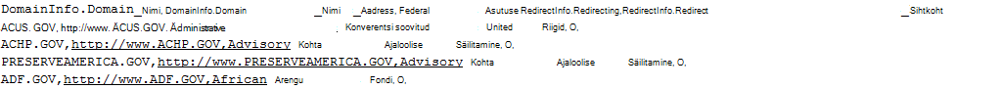
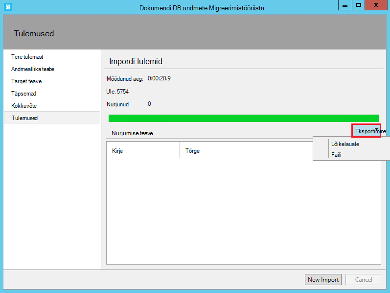

<properties
    pageTitle="Andmebaasiriista migreerimise DocumentDB | Microsoft Azure'i"
    description="Saate teada, kuidas DocumentDB andmete importimine erinevatest allikatest, sh MongoDB, SQL Server, tabeli salvestusruumi, Amazon DynamoDB, CSV ja JSON faile avatud allika DocumentDB andmete migreerimise tööriistade abil. CSV, JSON muutmine."
    keywords="CSV, json, Andmebaasiriistad migration, et teisendada csv json"
    services="documentdb"
    authors="andrewhoh"
    manager="jhubbard"
    editor="monicar"
    documentationCenter=""/>

<tags
    ms.service="documentdb"
    ms.workload="data-services"
    ms.tgt_pltfrm="na"
    ms.devlang="na"
    ms.topic="article"
    ms.date="10/06/2016"
    ms.author="anhoh"/>

# Andmete importimine DocumentDB tööriistaga andmebaasi migreerimine

Selles artiklis kirjeldatakse, kuidas [Microsoft Azure'i DocumentDB](https://azure.microsoft.com/services/documentdb/) andmete importimine erinevatest allikatest, sh JSON failid, CSV-failid, SQL-i, MongoDB, Azure'i tabelimälu, Amazon DynamoDB ja DocumentDB saidikogumite ametlik avatud allikas DocumentDB andmete migreerimise tööriista abil.

Pärast selle artikli lugemist on teil saama vastavad järgmistele küsimustele.  

-   Kuidas saab importida JSON-faili, CSV-faili, SQL serveri või MongoDB andmeid DocumentDB?
-   Kuidas saab importida andmed Azure'i tabelist salvestusruumi, Amazon DynamoDB ja HBase DocumentDB?
-   Kuidas migreerida DocumentDB saidikogumite vahel?

##Eeltingimused

Enne selle artikli juhiste, veenduge, et teil on installitud järgmine:

- [Microsoft .NET Framework 4,51](https://www.microsoft.com/download/developer-tools.aspx) või uuem versioon.

##Migreerimistööriista DocumentDB andmete ülevaade

Migreerimistööriista DocumentDB andmed on avatud allika lahenduse, mis impordib DocumentDB andmeid erinevatest allikatest, sh:

- JSON-failid
- MongoDB
- SQL serveri
- CSV-failid
- Azure'i tabelimälu
- Amazon DynamoDB
- HBase
- DocumentDB saidikogumid

Kuigi import tööriist hõlmab graafilise kasutajaliidese (dtui.exe), see saab juhtida ka käsurea (dt.exe). Tegelikult on võimalus väljasta seotud käsu pärast häälestamist impordi Kasutajaliidese kaudu. Tabelina esitatud andmed (nt SQL serveri või CSV-failid) saab muuta nii, et hierarhiliste seoste (alamdokumentidega) saab luua importimisel. Lugege lisateavet allika suvandid, käsk read importida iga andmeallika, sihtsaidi suvandid ja vaatamise impordi tulemuste Kuulake edasi.

##DocumentDB andmete Migreerimistööriista installimine

Migreerimise tööriista lähtekoodi on saadaval github [selle](https://github.com/azure/azure-documentdb-datamigrationtool) hoidla ja kompileeritud versioon on saadaval [Microsofti](http://www.microsoft.com/downloads/details.aspx?FamilyID=cda7703a-2774-4c07-adcc-ad02ddc1a44d)allalaadimiskeskusest. Võite kas kompileerida lahendus või lihtsalt alla laadida ja ekstraktida kompileeritud versiooni teie valitud kausta. Käivitage kas:

- **Dtui.exe**: graafilist liidest versiooni tööriista
- **DT.exe**: tööriista käsurea versioon

##JSON-failide importimine

JSON faili andmeallika importija suvandi abil saate importimine ühte või ühe dokumendi JSON failid või JSON faile, et iga sisaldavad massiivi JSON dokumendid. Kaustad, mis sisaldavad JSON-failide importimiseks lisamisel teil on võimalik faile alamkaustad otsimine rekursiivselt.

Siin on mõne käsurea näidised JSON-failide importimiseks.

    #Import a single JSON file
    dt.exe /s:JsonFile /s.Files:.\Sessions.json /t:DocumentDBBulk /t.ConnectionString:"AccountEndpoint=<DocumentDB Endpoint>;AccountKey=<DocumentDB Key>;Database=<DocumentDB Database>;" /t.Collection:Sessions /t.CollectionThroughput:2500

    #Import a directory of JSON files
    dt.exe /s:JsonFile /s.Files:C:\TESessions\*.json /t:DocumentDBBulk /t.ConnectionString:" AccountEndpoint=<DocumentDB Endpoint>;AccountKey=<DocumentDB Key>;Database=<DocumentDB Database>;" /t.Collection:Sessions /t.CollectionThroughput:2500

    #Import a directory (including sub-directories) of JSON files
    dt.exe /s:JsonFile /s.Files:C:\LastFMMusic\**\*.json /t:DocumentDBBulk /t.ConnectionString:" AccountEndpoint=<DocumentDB Endpoint>;AccountKey=<DocumentDB Key>;Database=<DocumentDB Database>;" /t.Collection:Music /t.CollectionThroughput:2500

    #Import a directory (single), directory (recursive), and individual JSON files
    dt.exe /s:JsonFile /s.Files:C:\Tweets\*.*;C:\LargeDocs\**\*.*;C:\TESessions\Session48172.json;C:\TESessions\Session48173.json;C:\TESessions\Session48174.json;C:\TESessions\Session48175.json;C:\TESessions\Session48177.json /t:DocumentDBBulk /t.ConnectionString:"AccountEndpoint=<DocumentDB Endpoint>;AccountKey=<DocumentDB Key>;Database=<DocumentDB Database>;" /t.Collection:subs /t.CollectionThroughput:2500

    #Import a single JSON file and partition the data across 4 collections
    dt.exe /s:JsonFile /s.Files:D:\\CompanyData\\Companies.json /t:DocumentDBBulk /t.ConnectionString:"AccountEndpoint=<DocumentDB Endpoint>;AccountKey=<DocumentDB Key>;Database=<DocumentDB Database>;" /t.Collection:comp[1-4] /t.PartitionKey:name /t.CollectionThroughput:2500

##MongoDB importimine

Suvandi MongoDB allika importija võimaldab teil importida üksikuid MongoDB kollektsioonist ja soovi korral filtreerida päringu abil dokumentide ja/või muuta dokumendi struktuuris on projektsiooni abil.  

Ühendusstringi on MongoDB vormi:

    mongodb://<dbuser>:<dbpassword>@<host>:<port>/<database>

> [AZURE.NOTE] Nupp Kinnita abil tagada määratud stringi väljale ühenduse MongoDB eksemplari pääseb.

Sisestage nimi saidikogumi, kus andmed importida. Võite soovi korral määrake või esitada päringu faili (nt {pop: {$gt:5000}}) ja/või projektsiooni (nt {loc:0}) nii filtreerimise ja kujundada andmeid importida.

Siin on mõne käsurea näidised MongoDB importida.

    #Import all documents from a MongoDB collection
    dt.exe /s:MongoDB /s.ConnectionString:mongodb://<dbuser>:<dbpassword>@<host>:<port>/<database> /s.Collection:zips /t:DocumentDBBulk /t.ConnectionString:"AccountEndpoint=<DocumentDB Endpoint>;AccountKey=<DocumentDB Key>;Database=<DocumentDB Database>;" /t.Collection:BulkZips /t.IdField:_id /t.CollectionThroughput:2500

    #Import documents from a MongoDB collection which match the query and exclude the loc field
    dt.exe /s:MongoDB /s.ConnectionString:mongodb://<dbuser>:<dbpassword>@<host>:<port>/<database> /s.Collection:zips /s.Query:{pop:{$gt:50000}} /s.Projection:{loc:0} /t:DocumentDBBulk /t.ConnectionString:"AccountEndpoint=<DocumentDB Endpoint>;AccountKey=<DocumentDB Key>;Database=<DocumentDB Database>;" /t.Collection:BulkZipsTransform /t.IdField:_id/t.CollectionThroughput:2500

##MongoDB ekspordi faili importimine

MongoDB ekspordi JSON faili andmeallika importija suvand saate importida ühe või mitme JSON failide toodeti mongoexport kasuliku.  

Kaustad, mis sisaldavad MongoDB eksportimine JSON-failide importimiseks lisamisel teil on võimalik faile alamkaustad otsimine rekursiivselt.

Siin on MongoDB ekspordi JSON failide importimiseks käsurea näide:

    dt.exe /s:MongoDBExport /s.Files:D:\mongoemployees.json /t:DocumentDBBulk /t.ConnectionString:"AccountEndpoint=<DocumentDB Endpoint>;AccountKey=<DocumentDB Key>;Database=<DocumentDB Database>;" /t.Collection:employees /t.IdField:_id /t.Dates:Epoch /t.CollectionThroughput:2500

##SQL serveri importimine

SQL-i allika importija suvand võimaldab teil importida üksikute SQL Serveri andmebaasiga ja soovi korral filtreerida kirjeid nii, et päringu abil importida. Lisaks saate muuta dokumendi struktuuri, määrates pesastamise eraldaja (rohkem, et hetkel).  

Ühendusstringi vorming on SQL-i ühenduse stringi vormi.

> [AZURE.NOTE] Käsu kinnitamine tagada määratud stringi väljale ühenduse SQL serveri eksemplar pääseb.

Atribuudi pesastamise eraldaja saab luua importimisel hierarhiliste seoste (sub dokumendid). Võtke arvesse järgmist SQL-päringu.

*Valige CAST (BusinessEntityID AS varchar) Id, nimi, AddressType nimega [Address.AddressType], AddressLine1 nimega [Address.AddressLine1], [Address.Location.City] linn, StateProvinceName nimega [Address.Location.StateProvinceName], PostalCode nimega [Address.PostalCode], CountryRegionName nimega [Address.CountryRegionName], kus Sales.vStoreWithAddresses AddressType = 'Main Office'*

Mis tagastab järgmised tulemused (osaline):

Pange tähele pseudonüümid, nt Address.AddressType ja Address.Location.StateProvinceName. Pesastamise eraldaja, määrates ".", aadress ja Address.Location alamdokumentidega importimisel loob impordi tööriist. Siin on näide DocumentDB tulemiks oleva dokumendi:

*{"id": "956", "nimi": "Peenem müük ja teenus", "Aadress": {"AddressType": "Põhi kontor", "AddressLine1": "#500-75 O'Connor tänav", "Asukoht": {"City": "Ottawa", "StateProvinceName": "Ontario"}, "Sihtnumber": "K4B 1S2", "CountryRegionName": "Kanada"}}*

Siin on mõne käsurea näidised importida SQL serverist.

    #Import records from SQL which match a query
    dt.exe /s:SQL /s.ConnectionString:"Data Source=<server>;Initial Catalog=AdventureWorks;User Id=advworks;Password=<password>;" /s.Query:"select CAST(BusinessEntityID AS varchar) as Id, * from Sales.vStoreWithAddresses WHERE AddressType='Main Office'" /t:DocumentDBBulk /t.ConnectionString:" AccountEndpoint=<DocumentDB Endpoint>;AccountKey=<DocumentDB Key>;Database=<DocumentDB Database>;" /t.Collection:Stores /t.IdField:Id /t.CollectionThroughput:2500

    #Import records from sql which match a query and create hierarchical relationships
    dt.exe /s:SQL /s.ConnectionString:"Data Source=<server>;Initial Catalog=AdventureWorks;User Id=advworks;Password=<password>;" /s.Query:"select CAST(BusinessEntityID AS varchar) as Id, Name, AddressType as [Address.AddressType], AddressLine1 as [Address.AddressLine1], City as [Address.Location.City], StateProvinceName as [Address.Location.StateProvinceName], PostalCode as [Address.PostalCode], CountryRegionName as [Address.CountryRegionName] from Sales.vStoreWithAddresses WHERE AddressType='Main Office'" /s.NestingSeparator:. /t:DocumentDBBulk /t.ConnectionString:" AccountEndpoint=<DocumentDB Endpoint>;AccountKey=<DocumentDB Key>;Database=<DocumentDB Database>;" /t.Collection:StoresSub /t.IdField:Id /t.CollectionThroughput:2500

##Importimine CSV-failid - JSON CSV teisendamine

Suvandi CSV-vormingus faili andmeallika importija võimaldab teil ühe või mitme CSV-faili importida. Kaustad, mis sisaldavad CSV-failide importimiseks lisamisel teil on võimalik faile alamkaustad otsimine rekursiivselt.

Sarnane SQL-i allika pesastamise eraldaja atribuudi võib kasutada loomiseks importimisel hierarhiliste seoste (sub dokumendid). Võtke arvesse järgmisi CSV päise rea- ja andmete read.

Pange tähele pseudonüümid, nt DomainInfo.Domain_Name ja RedirectInfo.Redirecting. Pesastamise eraldaja, määrates ".", loob impordi tööriista DomainInfo ja RedirectInfo alamdokumentidega importimisel. Siin on näide DocumentDB tulemiks oleva dokumendi:

*{"DomainInfo": {"Domeeni_nimi": "ACUS.GOV", "Domain_Name_Address": "http://www.ACUS.GOV"}, "Federal asutuse": "haldus konverentsi, Ameerika Ühendriigid", "RedirectInfo": {"Ümbersuunamine": "0", "Redirect_Destination": ""}, "id": "9cc565c5-ebcd-1c03-ebd3-cc3e2ecd814d"}*

Import tööriist proovib tuletamine tüüpi teavet noteerimata väärtuste CSV-failid (pakutud väärtused käsitletakse alati stringid).  Andmetüübid on tuvastatud järgmises järjestuses: arv, kuupäev ja kellaaeg, kahendmuutuja.  

On kaks muud asjad, mida CSV-impordi kohta.

1.  Vaikimisi noteerimata väärtused on alati lõigatud tabelduskohad ja tühikuid, ajal pakutud väärtused säilivad-on. Selline käitumine võib tühistada märkeruut Trim pakutud väärtused või /s.TrimQuoted käsurea suvandit.

2.  Vaikimisi on noteerimata null käsitletakse tühiväärtus. Selline käitumine võib tühistada (st kohelge on noteerimata tühi string "null") on käsitleda noteerimata tühi string ruut või /s.NoUnquotedNulls käsurea suvandit.

Siin on CSV importimiseks käsurea näide:

    dt.exe /s:CsvFile /s.Files:.\Employees.csv /t:DocumentDBBulk /t.ConnectionString:"AccountEndpoint=<DocumentDB Endpoint>;AccountKey=<DocumentDB Key>;Database=<DocumentDB Database>;" /t.Collection:Employees /t.IdField:EntityID /t.CollectionThroughput:2500

##Azure'i tabelimälu importimine

Azure'i tabeli salvestusruumi allika importija suvand võimaldab importida üksikuid Azure'i tabeli salvestusruumi tabelist ja soovi korral filtreerida tabeli üksused importida.  

Azure'i tabeli salvestusruumi ühendusstringi vorming on:

    DefaultEndpointsProtocol=<protocol>;AccountName=<Account Name>;AccountKey=<Account Key>;

> [AZURE.NOTE] Käsu kinnitamine tagada määratud stringi väljale ühenduse Azure'i tabeli salvestusruumi eksemplari pääseb.

Sisestage nimi Azure tabel, kus andmed importida. Soovi korral võite määrata [filter](https://msdn.microsoft.com/library/azure/ff683669.aspx).

Azure'i tabeli salvestusruumi allika importija suvandit on järgmised täiendavad suvandid.

1. Lisage sisemise väljad
    2. Kõik – kaasata kõik sisemise väljad (PartitionKey, RowKey ja ajatempli)
    3. Puudub – välistamine sisemise kõik väljad
    4. RowKey - kaasata ainult RowKey väli
3. Valige veerud
    1. Azure'i tabeli salvestusruumi filtreid ei toeta prognooside. Kui soovite importida ainult teatud Azure'i tabeli üksuse atribuutide, lisada nende veergude valimine loendis. Kõik muud üksuse atribuudid ignoreeritakse.

Siin on importida Azure'i tabelimälu käsurea näide:

    dt.exe /s:AzureTable /s.ConnectionString:"DefaultEndpointsProtocol=https;AccountName=<Account Name>;AccountKey=<Account Key>" /s.Table:metrics /s.InternalFields:All /s.Filter:"PartitionKey eq 'Partition1' and RowKey gt '00001'" /s.Projection:ObjectCount;ObjectSize  /t:DocumentDBBulk /t.ConnectionString:" AccountEndpoint=<DocumentDB Endpoint>;AccountKey=<DocumentDB Key>;Database=<DocumentDB Database>;" /t.Collection:metrics /t.CollectionThroughput:2500

##Amazon DynamoDB importimine

Amazon DynamoDB allika importija suvand võimaldab teil importida üksikuid Amazon DynamoDB tabelist ja soovi korral filtreerida üksuste importimiseks. Mitme Mallid on olemas, et häälestada impordi on sama lihtne kui võimalik.

Amazon DynamoDB ühendusstringi vorming on:

    ServiceURL=<Service Address>;AccessKey=<Access Key>;SecretKey=<Secret Key>;

> [AZURE.NOTE] Käsu kinnitamine väljale ühenduse stringi määratud Amazon DynamoDB eksemplari pääseb tagamiseks.

Siin on importida Amazon DynamoDB käsurea näide:

    dt.exe /s:DynamoDB /s.ConnectionString:ServiceURL=https://dynamodb.us-east-1.amazonaws.com;AccessKey=<accessKey>;SecretKey=<secretKey> /s.Request:"{   """TableName""": """ProductCatalog""" }" /t:DocumentDBBulk /t.ConnectionString:"AccountEndpoint=<DocumentDB Endpoint>;AccountKey=<DocumentDB Key>;Database=<DocumentDB Database>;" /t.Collection:catalogCollection /t.CollectionThroughput:2500

##Failide importimine Azure'i bloobimälu

JSON-faili, MongoDB ekspordi faili ja CSV faili andmeallika importija suvandid võimaldavad Azure'i bloobimälu üks või mitu faili importimine. Pärast bloobimälu container URL-i ja konto võti, sisestage lihtsalt regulaarne avaldis imporditava faili valimiseks.

Siin on käsurea valimi Azure'i bloobimälu JSON-failide importimiseks.

    dt.exe /s:JsonFile /s.Files:"blobs://<account key>@account.blob.core.windows.net:443/importcontainer/.*" /t:DocumentDBBulk /t.ConnectionString:"AccountEndpoint=<DocumentDB Endpoint>;AccountKey=<DocumentDB Key>;Database=<DocumentDB Database>;" /t.Collection:doctest

##DocumentDB importimine

DocumentDB allika importija suvand võimaldab teil ühe või mitme DocumentDB saidikogumite andmete importimine ja soovi korral filtreerida dokumente päringu abil.  

Ühendusstringi DocumentDB vorming on:

    AccountEndpoint=<DocumentDB Endpoint>;AccountKey=<DocumentDB Key>;Database=<DocumentDB Database>;

DocumentDB, konto ühendusstringi saate tuua Azure portaali keelest klahvid, nagu on kirjeldatud, [Kuidas hallata DocumentDB konto](documentdb-manage-account.md), aga andmebaasi nimi peab lisatakse ühendusstringi järgmises vormingus:

    Database=<DocumentDB Database>;

> [AZURE.NOTE] Käsu kinnitamine väljale ühenduse stringi määratud DocumentDB eksemplari pääseb tagamiseks.

Ühe DocumentDB kogumi importimine, sisestage nimi saidikogumi, kus andmed importida. Mitme DocumentDB saidikogumid importida, sisestage regular expression, otsida ühte või mitut saidikogumi nime (nt collection01 | collection02 | collection03). Soovi korral võib määrata, või sisestada faili, nii filter ja kuju andmete importimiseks päringu.

> [AZURE.NOTE] Kuna saidikogumi väli aktsepteerib regulaaravaldised, kui impordite ühe saidikogumi, mille nimi sisaldab Lihtavaldise märki, siis neid märke peab tuleb seda vältida vastavalt sellele.

Suvandi DocumentDB allika importija on järgmine Täpsemad suvandid.

1. Sisemise väljad on järgmised: Saate määrata, kas kaasata DocumentDB dokumendi Süsteemiatribuudid ekspordi (nt _rid, _ts).
2. Tõrke kohta korduste arv: saate määrata, mitu korda uuesti DocumentDB ühendus korral siirdamiseks tõrked (nt võrk ühenduvuse pidevalt).
3. Uuesti intervalli: Saate määrata, kui kaua oodata vahelise ühenduse DocumentDB siirdamiseks tõrked (nt võrk ühenduvuse pidevalt) korral proovitakse uuesti.
4. Ühendusega režiimi: Määrab ühendusega režiimi DocumentDB kasutamiseks. Saadaolevate valikute on DirectTcp, DirectHttps ja lüüsi. Otse režiimid on kiirem kui lüüsi režiim on veel tulemüüri sõbralik, kui seda kasutatakse ainult pordi 443.

> [AZURE.TIP] Tööriista importimine vaikimisi ühendusega režiimis DirectTcp. Kui teil on probleeme tulemüüri, lülitumine ühenduse lüüs, mis nõuab ainult pordi 443.

Siin on mõne käsurea näidised DocumentDB importida.

    #Migrate data from one DocumentDB collection to another DocumentDB collections
    dt.exe /s:DocumentDB /s.ConnectionString:"AccountEndpoint=<DocumentDB Endpoint>;AccountKey=<DocumentDB Key>;Database=<DocumentDB Database>;" /s.Collection:TEColl /t:DocumentDBBulk /t.ConnectionString:" AccountEndpoint=<DocumentDB Endpoint>;AccountKey=<DocumentDB Key>;Database=<DocumentDB Database>;" /t.Collection:TESessions /t.CollectionThroughput:2500

    #Migrate data from multiple DocumentDB collections to a single DocumentDB collection
    dt.exe /s:DocumentDB /s.ConnectionString:"AccountEndpoint=<DocumentDB Endpoint>;AccountKey=<DocumentDB Key>;Database=<DocumentDB Database>;" /s.Collection:comp1|comp2|comp3|comp4 /t:DocumentDBBulk /t.ConnectionString:"AccountEndpoint=<DocumentDB Endpoint>;AccountKey=<DocumentDB Key>;Database=<DocumentDB Database>;" /t.Collection:singleCollection /t.CollectionThroughput:2500

    #Export a DocumentDB collection to a JSON file
    dt.exe /s:DocumentDB /s.ConnectionString:"AccountEndpoint=<DocumentDB Endpoint>;AccountKey=<DocumentDB Key>;Database=<DocumentDB Database>;" /s.Collection:StoresSub /t:JsonFile /t.File:StoresExport.json /t.Overwrite /t.CollectionThroughput:2500

##HBase importimine

Suvandi HBase allika importija võimaldab andmete importimine HBase tabelist ja soovi korral andmete filtreerimine. Mitme Mallid on olemas, et häälestada impordi on sama lihtne kui võimalik.

Ühendusstringi HBase Stargate vorming on:

    ServiceURL=<server-address>;Username=<username>;Password=<password>

> [AZURE.NOTE] Käsu kinnitamine väljale ühenduse stringi määratud HBase eksemplari pääseb tagamiseks.

Siin on importida HBase käsurea näide:

    dt.exe /s:HBase /s.ConnectionString:ServiceURL=<server-address>;Username=<username>;Password=<password> /s.Table:Contacts /t:DocumentDBBulk /t.ConnectionString:"AccountEndpoint=<DocumentDB Endpoint>;AccountKey=<DocumentDB Key>;Database=<DocumentDB Database>;" /t.Collection:hbaseimport

##Importimise DocumentDB (hulgi importida)

DocumentDB hulgi importija saate importida saadaval allika suvandeid, kasutades DocumentDB salvestatud protseduur suurendamiseks. See tööriist toetab ühe ühe liigendatud DocumentDB kogumi importimine, samuti sharded impordi, mille puhul on liigendatud andmete üle mitme ühe liigendatud DocumentDB saidikogumid. Andmete eraldamine kohta leiate lisateavet teemast [Eraldatav ja mastaapimist Azure'i DocumentDB sisse](documentdb-partition-data.md). Tööriista loomine, käivitada, ja seejärel kustutage salvestatud protseduur target collection(s).  

Ühendusstringi DocumentDB vorming on:

    AccountEndpoint=<DocumentDB Endpoint>;AccountKey=<DocumentDB Key>;Database=<DocumentDB Database>;

DocumentDB, konto ühendusstringi saate tuua Azure portaali keelest klahvid, nagu on kirjeldatud, [Kuidas hallata DocumentDB konto](documentdb-manage-account.md), aga andmebaasi nimi peab lisatakse ühendusstringi järgmises vormingus:

    Database=<DocumentDB Database>;

> [AZURE.NOTE] Käsu kinnitamine väljale ühenduse stringi määratud DocumentDB eksemplari pääseb tagamiseks.

Ühe saidikogumi importida, sisestage nimi saidikogumi andmeid importida, ja klõpsake nuppu Lisa. Mitme saidikogumid importida, kas iga saidikogumi nimi Sisestage ükshaaval või järgmise süntaksi abil saate määrata mitu saidikogumite: *collection_prefix*[start index - end index]. Kui määrata mitu saidikogumite teel eelnimetatud süntaks, pidage meeles järgmist:

1. Toetatakse ainult täisarv vahemikus nimi mustrite. Näiteks täpsustades saidikogumi [0-3] koostab järgmised saidikogumid: collection0, collection1, collection2 collection3.
2. Saate kasutada ka lühendatud süntaks: väljastab saidikogumi [3] sama valiku saidikogumid mainitud juhises 1.
3. Rohkem kui üks asendamine on saadaval. Näiteks saidikogumi [0-1] [0 – 9] loob 20 saidikogumi nimed, mille ees on null (collection01,... 02. 03).

Kui määratud on saidikogumi nimed, valige soovitud läbilaskevõime, collection(s) (kuni 10 000 RUs 400 RUs). Valige impordi parima jõudluse, suurema läbilaskevõimega. Jõudluse tasemeid kohta leiate lisateavet teemast [jõudluse tasemete DocumentDB](documentdb-performance-levels.md).

> [AZURE.NOTE] Jõudluse läbilaskevõime säte rakendub ainult saidikogumi loomine. Kui määratud kogu juba olemas, siis selle läbilaskevõime ei muudeta.

Mitme saidikogumid importimisel impordi tööriista toetab räsi vastavalt sharding. Selle stsenaariumi korral määrake dokumendi atribuut, mida soovite kasutada Partition võti (Partition klahvi tühjaks, dokumentide korral sharded CEIP üle target saidikogumite).

Soovi korral võite määrata, millised välja importimise lähtekoht tuleks kasutada DocumentDB dokumendi id atribuut importimisel (Pange tähele, et kui dokumente ei sisalda seda atribuuti, siis impordi tööriist loob väärtusena id atribuut GUID).

Importimisel on saadaval mitmesuguseid Täpsemad suvandid. Esmalt ajal tööriist sisaldab vaikimisi hulgi importida salvestatud protseduur (BulkInsert.js), võite määrata oma impordi salvestatud protseduur:

 

Lisaks, kui importida kuupäev tüüpi (nt SQL serveri või MongoDB), saate valida kolme impordi suvandite vahel.

 

-   String: Püsida stringi väärtus
-   Epohhi: Püsida väärtusena epohhi arv
-   Mõlemad: Püsida stringis ja epohhi arvväärtuse. See suvand Loo alamdokument, näiteks: "date_joined": {"Value": "2013-10-21T21:17:25.2410000Z", "epohhi": 1382390245}

DocumentDB hulgi importija on järgmised täiendavad Täpsemad suvandid.

1. Paketi suurus: Tööriista vaikimisi suurusega 50.  Kui imporditava dokumendid on suur, kaaluge langetamine paketi suurus. Vastupidi, kui imporditava dokumendid on väike, kaaluge paketi mahu suurendamine.
2. Max Script suurus (baiti): tööriist on vaikimisi max script suurus 512 KB
3. Keela Id automaatseks: Kui iga imporditava dokumendi id-välja, siis selle suvandi valimisel saate suurendada jõudlust. Puuduvad ainuidentifikaator välja dokumente ei impordita.
4. Värskenduse olemasolevad dokumendid: Tööriista vaikimisi pole asendades olemasolevad dokumendid id konfliktid. Selle suvandi valimisel võimaldab ülekirjutamise olemasolevaid dokumente sobitamine ID-d. See funktsioon on kasulik ajastatud andmete migratsioon, et värskendada olemasolevad dokumendid.
5. Tõrke kohta korduste arv: saate määrata, mitu korda uuesti DocumentDB ühendus korral siirdamiseks tõrked (nt võrk ühenduvuse pidevalt).
6. Uuesti intervalli: Saate määrata, kui kaua oodata vahelise ühenduse DocumentDB siirdamiseks tõrked (nt võrk ühenduvuse pidevalt) korral proovitakse uuesti.
7. Ühendusega režiimi: Määrab ühendusega režiimi DocumentDB kasutamiseks. Saadaolevate valikute on DirectTcp, DirectHttps ja lüüsi. Otse režiimid on kiirem kui lüüsi režiim on veel tulemüüri sõbralik, kui seda kasutatakse ainult pordi 443.

> [AZURE.TIP] Tööriista importimine vaikimisi ühendusega režiimis DirectTcp. Kui teil on probleeme tulemüüri, lülitumine ühenduse lüüs, mis nõuab ainult pordi 443.

##Importimise DocumentDB (järjestikku kirje importida)

DocumentDB järjestikku kirje importija võimaldab teil importida saadaval allika suvandeid kirje, kirje alusel. Võib valige see suvand, kui soovite olemasoleva saidikogumi, mis on jõudnud selle piirmäära salvestatud toimingute abil importida. See tööriist toetab ühele (nii ühe-sektsiooni ja mitme partition) DocumentDB saidikogumi, samuti nagu sharded importida, mille üle mitme ühe-sektsiooni ja/või mitme DocumentDB saidikogumid on liigendatud andmete importimine. Andmete eraldamine kohta leiate lisateavet teemast [Eraldatav ja mastaapimist Azure'i DocumentDB sisse](documentdb-partition-data.md).

Ühendusstringi DocumentDB vorming on:

    AccountEndpoint=<DocumentDB Endpoint>;AccountKey=<DocumentDB Key>;Database=<DocumentDB Database>;

DocumentDB, konto ühendusstringi saate tuua Azure portaali keelest klahvid, nagu on kirjeldatud, [Kuidas hallata DocumentDB konto](documentdb-manage-account.md), aga andmebaasi nimi peab lisatakse ühendusstringi järgmises vormingus:

    Database=<DocumentDB Database>;

> [AZURE.NOTE] Käsu kinnitamine väljale ühenduse stringi määratud DocumentDB eksemplari pääseb tagamiseks.

Ühe saidikogumi importida, sisestage nimi saidikogumi andmeid importida, ja klõpsake nuppu Lisa. Mitme saidikogumid importida, kas iga saidikogumi nimi Sisestage ükshaaval või järgmise süntaksi abil saate määrata mitu saidikogumite: *collection_prefix*[start index - end index]. Kui määrata mitu saidikogumite teel eelnimetatud süntaks, pidage meeles järgmist:

1. Toetatakse ainult täisarv vahemikus nimi mustrite. Näiteks täpsustades saidikogumi [0-3] koostab järgmised saidikogumid: collection0, collection1, collection2 collection3.
2. Saate kasutada ka lühendatud süntaks: väljastab saidikogumi [3] sama valiku saidikogumid mainitud juhises 1.
3. Rohkem kui üks asendamine on saadaval. Näiteks saidikogumi [0-1] [0 – 9] loob 20 saidikogumi nimed, mille ees on null (collection01,... 02. 03).

Kui määratud on saidikogumi nimed, valige soovitud läbilaskevõime, collection(s) (kuni 250 000 RUs 400 RUs). Valige impordi parima jõudluse, suurema läbilaskevõimega. Jõudluse tasemeid kohta leiate lisateavet teemast [jõudluse tasemete DocumentDB](documentdb-performance-levels.md). Mis tahes importimise läbilaskevõime saidikogumid > 10 000 RUs vajavad sektsiooni võti. Kui valite on rohkem kui 250 000 RUs, lugege teemat [taotlemine suurendada DocumentDB konto piirangud](documentdb-increase-limits.md).

> [AZURE.NOTE] Läbilaskevõime säte rakendub ainult saidikogumi loomine. Kui määratud kogu juba olemas, siis selle läbilaskevõime ei muudeta.

Mitme saidikogumid importimisel impordi tööriista toetab räsi vastavalt sharding. Selle stsenaariumi korral määrake dokumendi atribuut, mida soovite kasutada Partition võti (Partition klahvi tühjaks, dokumentide korral sharded CEIP üle target saidikogumite).

Soovi korral võite määrata, millised välja importimise lähtekoht tuleks kasutada DocumentDB dokumendi id atribuut importimisel (Pange tähele, et kui dokumente ei sisalda seda atribuuti, siis impordi tööriist loob väärtusena id atribuut GUID).

Importimisel on saadaval mitmesuguseid Täpsemad suvandid. Esmalt importimisel kuupäeva tüüpi (nt SQL serveri MongoDB), saate valida kolme impordi suvandite vahel.

 

-   String: Püsida stringi väärtus
-   Epohhi: Püsida väärtusena epohhi arv
-   Mõlemad: Püsida stringis ja epohhi arvväärtuse. See suvand Loo alamdokument, näiteks: "date_joined": {"Value": "2013-10-21T21:17:25.2410000Z", "epohhi": 1382390245}

DocumentDB - järjestikku kirje importija on järgmised täiendavad Täpsemad suvandid.

1. Paralleelne taotluste arv: tööriista, mis on vaikimisi 2 paralleelselt taotlused. Kui imporditava dokumendid on väike, kaaluge tõstmine paralleelselt taotluste arv. Pange tähele, et kui see arv on liiga palju astmes, importimine kokku puutuda pidurdamise.
2. Keela Id automaatseks: Kui iga imporditava dokumendi id-välja, siis selle suvandi valimisel saate suurendada jõudlust. Puuduvad ainuidentifikaator välja dokumente ei impordita.
3. Värskenduse olemasolevad dokumendid: Tööriista vaikimisi pole asendades olemasolevad dokumendid id konfliktid. Selle suvandi valimisel võimaldab ülekirjutamise olemasolevaid dokumente sobitamine ID-d. See funktsioon on kasulik ajastatud andmete migratsioon, et värskendada olemasolevad dokumendid.
4. Tõrke kohta korduste arv: saate määrata, mitu korda uuesti DocumentDB ühendus korral siirdamiseks tõrked (nt võrk ühenduvuse pidevalt).
5. Uuesti intervalli: Saate määrata, kui kaua oodata vahelise ühenduse DocumentDB siirdamiseks tõrked (nt võrk ühenduvuse pidevalt) korral proovitakse uuesti.
6. Ühendusega režiimi: Määrab ühendusega režiimi DocumentDB kasutamiseks. Saadaolevate valikute on DirectTcp, DirectHttps ja lüüsi. Otse režiimid on kiirem kui lüüsi režiim on veel tulemüüri sõbralik, kui seda kasutatakse ainult pordi 443.

> [AZURE.TIP] Tööriista importimine vaikimisi ühendusega režiimis DirectTcp. Kui teil on probleeme tulemüüri, lülitumine ühenduse lüüs, mis nõuab ainult pordi 443.

##Määrake indekseerimise poliitika DocumentDB Saidikogumite loomine

Kui lubate Migreerimistööriista Saidikogumite loomine importimise ajal, saate määrata selle kogumite indekseerimise poliitika. Täpsemad suvandid jaotises DocumentDB hulgi importida ja DocumentDB järjestikku kirje suvandid, liikuge jaotises indekseerimine poliitika.

Täpsem suvand indekseerimine poliitika kasutamisel saate valige indekseerimise poliitika faili, käsitsi sisestage indekseerimise poliitika, või valige vaikemallid kogumist (klõpsates paremklõpsake indekseerimise poliitika tekstiväljale).

Tööriist hõlmab poliitika Mallid on:

- Vaikimisi. Selle poliitika on parim, kui olete läbimiseks võrdse päringute stringide vastu ja ORDER BY, vahemik ja võrdse päringute kasutamine arvude jaoks. See poliitika on on väiksem index salvestusruumi pea kohal kui vahemik.
- Vahemik. See poliitika on parim kasutate ORDER BY, vahemik ja võrdse päringute nii arvud ja stringid. See on suurem registri salvestusruumi õhuliini kui vaikimisi või räsi.

> [AZURE.NOTE] Kui te ei määra indekseerimise poliitika, siis vaikepoliitika rakendatakse. Indekseerimise poliitika kohta leiate lisateavet teemast [DocumentDB indekseerimise poliitika](documentdb-indexing-policies.md).

## JSON-faili eksportimine

Olevale DocumentDB JSON võimaldab suvandid saadaval allika JSON dokumentide massiivi sisaldava JSON faili eksportida. Tööriist tegeleb ekspordi teile või soovite, et tulemiks oleva migreerimise käsk Kuva ja käivitage käsk ise. JSON fail võib talletatud kohalik või Azure'i bloobimälu.

Soovi korral võite prettify tulemuseks JSON, mis suurendab suurus tulemuseks dokumendi sisu rohkem tehes inimeste loetav.

    Standard JSON export
    [{"id":"Sample","Title":"About Paris","Language":{"Name":"English"},"Author":{"Name":"Don","Location":{"City":"Paris","Country":"France"}},"Content":"Don's document in DocumentDB is a valid JSON document as defined by the JSON spec.","PageViews":10000,"Topics":[{"Title":"History of Paris"},{"Title":"Places to see in Paris"}]}]

    Prettified JSON export
    [
    {
    "id": "Sample",
    "Title": "About Paris",
    "Language": {
      "Name": "English"
    },
    "Author": {
      "Name": "Don",
      "Location": {
        "City": "Paris",
        "Country": "France"
      }
    },
    "Content": "Don's document in DocumentDB is a valid JSON document as defined by the JSON spec.",
    "PageViews": 10000,
    "Topics": [
      {
        "Title": "History of Paris"
      },
      {
        "Title": "Places to see in Paris"
      }
    ]
    }]

## Täiustatud konfigureerimine

Kuva täpsemad konfigureerimine Määrake asukoht, millele soovite kirjutada vigu logifaili. Sellelt lehelt rakendatakse järgmised reeglid.

1.  Kui faili nimi ei esitata, siis kõik vead tagastatakse lehel tulemused.
2.  Kui ilma kataloog pole faili nimi, siis fail on loodud (või kirjutatakse üle) praegust keskkonna kausta.
3.  Kui valite olemasoleva kirjutatakse fail ja seejärel faili, ei ole lisa võimalust.

Seejärel valige, kas soovite sisse logida, kriitiliste, või tõrketeateid. Lõpuks otsustada, kui sageli sees Kuva Edasta sõnum värskendatakse edenemisega.

    

## Kinnitage impordisätete ja käsurea kuvamine

1. Pärast andmeallika teabe, teavet ja Täpsem konfiguratsiooni, läbi Kokkuvõte migreerimise ja, soovi korral saate vaate/kopeerida tulemuseks migreerimise käsk (kopeerimise käsk on kasulik impordi automatiseerimiseks):

    

    

2. Kui olete oma lähte- ja suvandid, klõpsake nuppu **impordi**. Möödunud aeg, edastatud count ja nurjumise teave (kui see ei paku Täpsem konfiguratsiooni faili nimi) värskendatakse importimine on pooleli. Kui olete lõpetanud, saate eksportida tulemused (nt mis tahes impordi tõrgete lahendamiseks).

    

3. Võite ka alustada uue impordi, säilitamise olemasoleva sätted (nt ühenduse string teabe, lähte- ja valik jne) või lähtestamise kõik väärtused.

    

## Järgmised sammud

- DocumentDB kohta leiate lisateavet teemast [Õppeteema](https://azure.microsoft.com/documentation/learning-paths/documentdb/).
