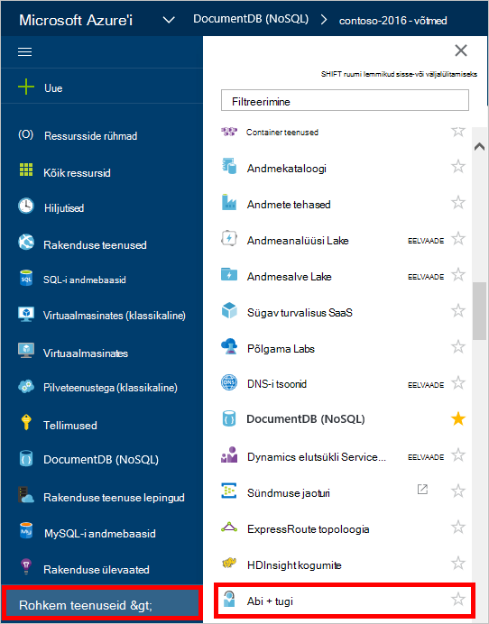
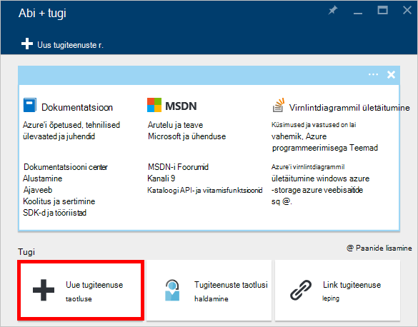
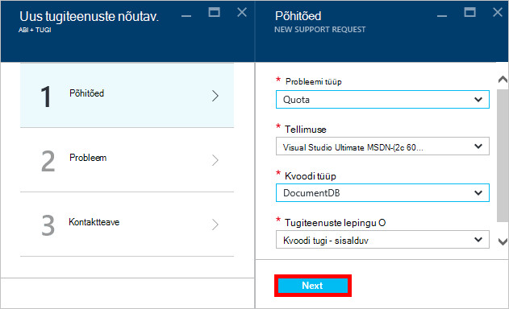
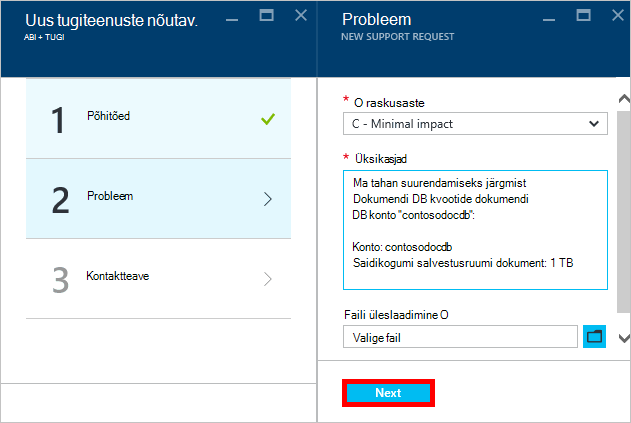
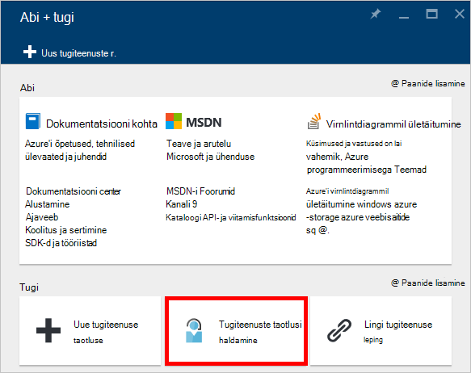

<properties
    pageTitle="Taotluse suurendada DocumentDB konto kvootide | Microsoft Azure'i"
    description="Saate teada, kuidas taotleda DocumentDB andmebaasi kvoote, nt dokumendi salvestamiseks ja ühe saidikogumi kohandamine."
    services="documentdb"
    authors="AndrewHoh"
    manager="jhubbard"
    editor="monicar"
    documentationCenter=""/>

<tags
    ms.service="documentdb"
    ms.workload="data-services"
    ms.tgt_pltfrm="na"
    ms.devlang="na"
    ms.topic="article"
    ms.date="08/25/2016"
    ms.author="anhoh"/>

# Taotluse suurendada DocumentDB konto piirangud

[Microsoft Azure'i DocumentDB](https://azure.microsoft.com/services/documentdb/) on vaikimisi piirmäära, mis saab reguleerida Azure toe poole pöördumist kogumi.  Selles artiklis kirjeldatakse, kuidas taotleda kvoodi suurendamist.

Pärast selle artikli lugemist on teil saama vastavad järgmistele küsimustele.  

-   Mis DocumentDB andmebaasi kvootide Azure klienditoega saab muuta?
-   Kuidas taotleda DocumentDB konto kvoodi korrigeerimine?

##DocumentDB konto kvoote

Järgmises tabelis kirjeldatakse DocumentDB piirmäärasid. Azure'i klienditoega saab reguleerida piirmäära, mis sisaldavad tärni (*):

[AZURE.INCLUDE [azure-documentdb-limits](../../includes/azure-documentdb-limits.md)]

##Taotluse kvoodi kohandamine
Järgmised toimingud näitab, kuidas taotleda kvoodi kohandamine.

1. [Azure'i portaal](https://portal.azure.com), klõpsake nuppu **Rohkem teenuseid**ja klõpsake **Spikker + tugi**.

    

2. **Abi + tugi** labale nuppu **Uus tugiteenuste taotlus**.

    

3. Klõpsake **Uus tugiteenuste taotlus** blade **põhitõed**. Järgmise, määramine **probleemi tüüp** **kvoodi**, tellimuse, mis hostib teie DocumentDB **tellimuse** konto, **DocumentDB** **kvoodi tüüp** ja **Kvoodi tugi - sisalduv** **toe kavandamine** . Klõpsake nuppu **edasi**.

    

4. **Probleemi** tera, valige soovitud raskusaste ja lisada teavet oma kvoodi suurendada **üksikasjad**. Klõpsake nuppu **edasi**.

    

5. Lõpetuseks, täitke oma kontaktandmeid tera **Kontaktteave** ja klõpsake nuppu **Loo**.

Kui Piletite tugi on loodud, peaksite nägema tugiteenuse taotluse number, e-posti teel.  Tugiteenuse taotluse saate vaadata ka, klõpsates nuppu **Halda tugi taotleb** **abi + tugi** tera.

##Järgmised sammud
- DocumentDB kohta lisateabe saamiseks klõpsake [siin](http://azure.com/docdb).
