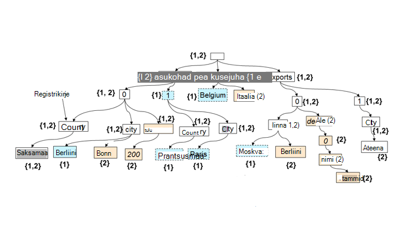

<properties 
    pageTitle="Automaatse indekseerimise rakenduses DocumentDB | Microsoft Azure'i" 
    description="Saate teada, kuidas automaatne indekseerimise töötab Azure'i DocumentDB kohta." 
    services="documentdb" 
    authors="arramac" 
    manager="jhubbard" 
    editor="mimig" 
    documentationCenter=""/>

<tags 
    ms.service="documentdb" 
    ms.workload="data-services" 
    ms.tgt_pltfrm="na" 
    ms.devlang="na" 
    ms.topic="article" 
    ms.date="10/27/2016" 
    ms.author="arramac"/>
    
# Automaatne sisse Azure'i DocumentDB indekseerimine

Selles artiklis on põhineb ["skeemi diagnostika indekseerimine koos Azure'i DocumentDB"](http://www.vldb.org/pvldb/vol8/p1668-shukla.pdf) paberi, mis esitatakse [41 sisemise konverentsiga väga suurte andmebaaside](http://www.vldb.org/2015/) vahel August 31 – 4 mai 2015 ja sellest, kuidas tutvustus on indekseerimine Azure'i DocumentDB töötab. 

Pärast lugemine on teil vastata järgmistele küsimustele.

- Kuidas DocumentDB tuletamine dokumendist JSON skeemiga?
- Kuidas koostada DocumentDB registri eri dokumentide üle?
- Kuidas DocumentDB automaatse indekseerimise tasandil teha?

##Kuidas töötab DocumentDB indekseerimine

[Microsoft Azure'i DocumentDB](https://azure.microsoft.com/services/documentdb/) on tõene skeemi tasuta andmebaasi otstarbe, JSON ehitatud. See oodata või nõua skeemi või andmete indekseerimiseks skaala indeks määratlusi. See võimaldab teil kiiresti määratlemine ja saades rakenduse andmemudelite DocumentDB abil. Dokumentide lisamisel kogumi indeksite DocumentDB kõik dokumendi atribuudid automaatselt, nii, et need on saadaval, saate päringusse. Automaatse indekseerimise võimaldab salvestada dokumente täielikult suvalise skeemid ilma muretsema skeemid või sekundaarne registrid.

Eesmärk kõrvaldada impedantsi lahknevuse andmebaasi ja rakenduse programmeerimise mudelite, kasutab DocumentDB JSON lihtsad ja selle puudumine skeemi määratlus. See muudab pole oletused dokumentide kohta ning võimaldab dokumente DocumentDB saidikogumi skeemi Lisaks eksemplari kindlad väärtused muuta. Vastupidiselt dokumendi muid andmebaase, toimib DocumentDB's andmebaasimootor otse tasemel JSON grammatika, ülejäänud agnostik dokumendi skeemi mõiste ja hägustamine dokumentide struktuuri ja eksemplari väärtuste vahelist piiri. See, sisse-lülita, võimaldab see automaatselt registrisse dokumendid nõudmata skeemi või sekundaarne registrid.

Indekseerimine DocumentDB ära asjaolu, et JSON grammatika võimaldab dokumentide **puude arvuna**. JSON dokumendi puu esindajana, fiktiivne juurkausta sõlm tuleb luua mis vanemad ülejäänud tegelik sõlmed dokumendi all. Igale sildile, sh massiivi indeksid JSON dokumendi muutub sõlm puu. Joonis illustreerib näide JSON dokument ja selle puu esinduse.

>[AZURE.NOTE] Kuna JSON on omas kirjeldavad st iga dokumendi sisaldab nii skeemi (metaandmed) ja andmed, nt `{"locationId": 5, "city": "Moscow"}` näitab, et on kaks atribuudid `locationId` ja `city`, ning nad on arv ja stringi kinnisvarahindade. DocumentDB on võimalik tuletab Microsoft dokumendid ja indeks neid, kui need on lisatud või asendada, pole kunagi vaja skeemid või sekundaarne registrid määratlemine.

**JSON dokumentidele, juhul kui:**

Näiteks klõpsake eeltoodud näites:

- Atribuudi JSON `{"headquarters": "Belgium"}` tee/headquarters/Belgia vastab atribuudi eeltoodud näites.
- JSON massiiv `{"exports": [{"city": “Moscow"}`, `{"city": Athens"}]}` vastab teed `/exports/[]/city/Moscow` ja `/exports/[]/city/Athens`.

Automaatsete indekseerimine, (1) dokumendi puus iga tee on indekseeritud (v.a juhul, kui arendaja on konfigureeritud indekseerimise poliitika välistada teatud tee mustreid). (2) iga värskenduse DocumentDB saidikogumi dokumendi viib struktuuri (st põhjused lisamise või eemaldamisega sõlmed) registri värskendamiseks. Üks esmane nõuetele dokumentide automaatse indekseerimise tagamaks, et maksumus index ja päringu dokumendi sügavalt pesastatud struktuuriga, teatavad, et 10 taset, on sama, mis koosneb võti ja väärtuse paarideks vaid ühe taseme tasapinnalise JSON dokumendi. Seetõttu on normaliseeritud tee esituse foundation, mille nii automaatne indekseerimine ja päringu allsüsteemide ehitatakse.

Oluline mõju käsitlemisel nii ühtlaselt osas teed skeemi ja eksemplari väärtused on see loogiliselt, just nagu üksikuid dokumente, mis hoiab vahel teed kaardil kujutatud kahe dokumendi registri ja dokumendi ID, mis sisaldab selle tee saate arvuna puu. DocumentDB kasutab sellest, et koostada register puu, mis on ehitatud Liidu kõik tähistav üksikdokumente kogumis puude välja. Registri puu DocumentDB saidikogumite kasvab aja jooksul uusi dokumente lisatud või uuendatud kogumi.

**DocumentDB Index puu:**

Hoolimata skeemi vaba, DocumentDB's SQL-i ja JavaScripti päringu keelte pakuvad relatsiooniline prognooside ja filtrid, hierarhilise navigeerimise üle dokumentide, ruumiline toimingute ja kutsumise UDF kirjutatud täiesti JavaScript. Funktsiooni DocumentDB päringu käitusaja on need päringud toetama, kuna seda saab kasutada otse selle indeksi puu kujutis andmed.

Indekseerimise vaikepoliitika automaatselt indeksid kõigi dokumentide kõik atribuudid ja pakub ühtsete päringuid (st registri värskendatakse sünkroonselt dokumendi kirjutamine). Kuidas DocumentDB toetab ühtsete värskenduste index puu skaala? DocumentDB kasutab optimeeritud kirjutamine, tasuta lukustamine ja logige liigendatud index hooldustööd meetodite abil. See tähendab, et DocumentDB toetab püsiv helitugevuse kiiresti kirjutab ühtsete päringute kandmise ajal. 

DocumentDB's indekseerimine on mõeldud tõhusama salvestamise ja mitme rendiõigus käsitlema. Maksumus tõhustada, on kettal salvestusruumi pea kohal, indeksi hõlpsalt prognoosida ja madala. Registri uuendused tehakse ka süsteemiressursside DocumentDB saidikogumi eraldatud eelarve piires.

##Järgmised sammud
- Laadige alla ["skeemi diagnostika indekseerimise koos Azure'i DocumentDB"](http://www.vldb.org/pvldb/vol8/p1668-shukla.pdf), esitatakse väga suurte andmebaaside 41 sisemise konverentsil August 31 – 4 mai 2015.
- [Päringu DocumentDB SQL-i abil](documentdb-sql-query.md)
- Teada, kuidas kohandada DocumentDB index [siin](documentdb-indexing-policies.md)
 
