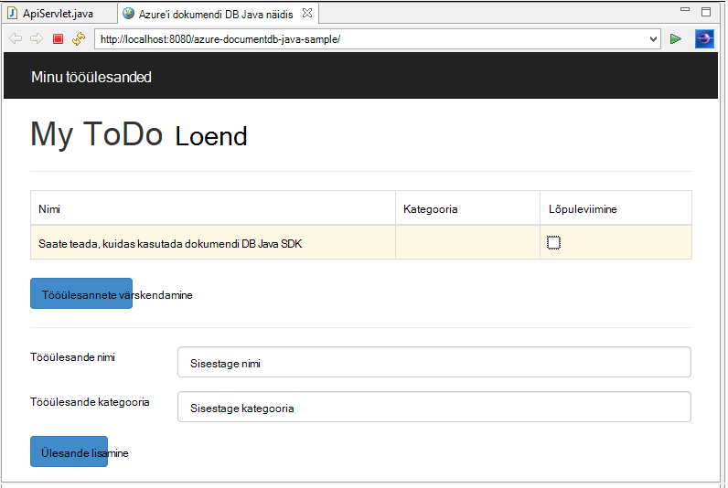
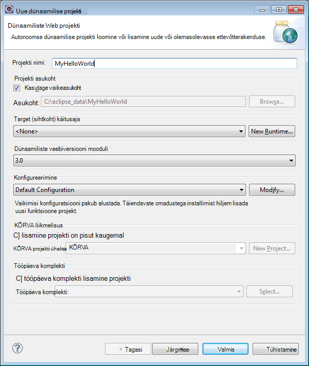
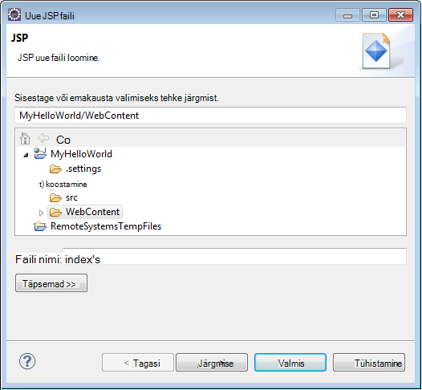
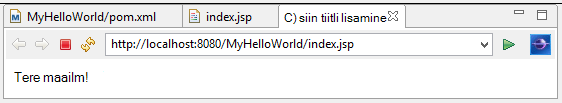
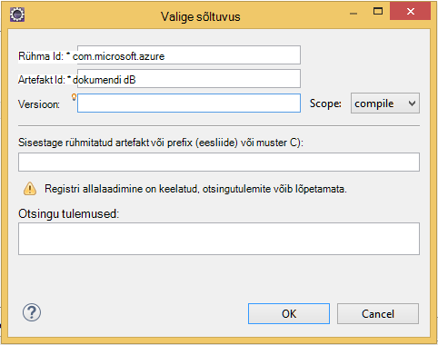

<properties
    pageTitle="Java rakenduste arendamise õpetuse DocumentDB abil | Microsoft Azure'i"
    description="Õppeteema Java web rakenduse näete Azure'i DocumentDB teenuse abil saate talletada ja Java rakenduse majutatud veebisaiti Azure'i andmetele juurde."
    keywords="Rakenduste arendamise, andmebaasi õpetuse, java rakendus, java web rakenduse õpetuse, documentdb, Azure'i, Microsoft Azure'i"
    services="documentdb"
    documentationCenter="java"
    authors="dennyglee"
    manager="jhubbard"
    editor="mimig"/>

<tags
    ms.service="documentdb"
    ms.devlang="java"
    ms.topic="hero-article"
    ms.tgt_pltfrm="NA"
    ms.workload="data-services"
    ms.date="08/24/2016"
    ms.author="denlee"/>

# Java veebirakenduse abil DocumentDB koostamine

> [AZURE.SELECTOR]
- [.NET-I](documentdb-dotnet-application.md)
- [Node.js](documentdb-nodejs-application.md)
- [Java](documentdb-java-application.md)
- [Python](documentdb-python-application.md)

Õppeteema Java web rakenduse näete [Microsoft Azure'i DocumentDB](https://portal.azure.com/#gallery/Microsoft.DocumentDB) teenuse abil saate talletada ja Java rakenduse majutatud veebisaiti Azure'i andmetele juurde. Selles teemas kirjeldatakse:

- Kuidas luua lihtsa JSP rakenduses Eclipse.
- Kuidas töötada Azure'i DocumentDB teenuse [DocumentDB Java SDK](https://github.com/Azure/azure-documentdb-java)abil.

Õppeteema Java rakenduse näitab, kuidas luua veebipõhine ülesandehaldustööristad rakendus, mis võimaldab teil luua, tuua ja lõpuleviiduks tööülesanded nii, nagu on näidatud järgmisel pildil. Azure'i DocumentDB JSON dokumentide salvestatakse iga ToDo loendis tööülesanded.

> [AZURE.TIP] Õppeteema rakenduste arendamise eeldab, et teil on eelnev kogemus Java abil. Kui olete uus Java või [eelnevalt nõutud tööriistad](#Prerequisites), soovitame täieliku [todo](https://github.com/Azure-Samples/documentdb-java-todo-app) projekti allalaadimisega GitHub ja hoone see [käesoleva artikli lõpus juhiste](#GetProject)abil. Kui teil on see ehitatud, saate vaadata artikli koodi kontekstis projekti ülevaate saada.  

##Õppeteema Java web rakenduse eeltingimused
Enne alustamist õppeteema rakenduste arendamise, peab teil olema järgmised:

- Aktiivne Azure'i konto. Kui teil pole kontot, saate luua tasuta prooviversiooni konto vaid paar minutit. Lisateavet leiate teemast [Azure tasuta prooviversioon](https://azure.microsoft.com/pricing/free-trial/).
- [Java arenduskomplekt (JDK 7 +)](http://www.oracle.com/technetwork/java/javase/downloads/index.html).
- [Eclipse IDE Java EE arendajatele.](http://www.eclipse.org/downloads/packages/eclipse-ide-java-ee-developers/lunasr1)
- [Azure'i veebisaidi Java runtime keskkond (nt Tomcat või Jetty) lubatud.](../app-service-web/web-sites-java-get-started.md)

Kui installite nende tööriistade esimest korda, coreservlets.com pakub walk-through installimise käigus Kiirkäivituse jaotises nende [õpetus: TomCat7 installimine ja kasutamine Eclipse](http://www.coreservlets.com/Apache-Tomcat-Tutorial/tomcat-7-with-eclipse.html) artikkel.

##Samm 1: DocumentDB andmebaasi konto loomine

Alustame DocumentDB konto loomine. Kui teil on juba konto, võite jätkata [Samm 2: Java JSP rakenduse loomine](#CreateJSP).

[AZURE.INCLUDE [documentdb-create-dbaccount](../../includes/documentdb-create-dbaccount.md)]

[AZURE.INCLUDE [documentdb-keys](../../includes/documentdb-keys.md)]

##Samm 2: Looge Java JSP rakendus

JSP rakenduse loomiseks tehke järgmist.

1. Kõigepealt tuleb Alustame Java projekti loomise teel. Käivitage Eclipse, seejärel klõpsake menüüd **fail**, nuppu **Uus**ja klõpsake **Dünaamiline Web projekti**. Kui te ei näe **Dünaamiline Web projekti** loendis Saadaolevad projekti, tehke järgmist: klõpsake menüüd **fail**, nuppu **Uus**, valige **Project**..., laiendage **Web**, valige **Dünaamiline Web Project**ja klõpsake nuppu **edasi**.

    

2. Sisestage projekti nimi **projekti nimi** väljale nimi ja **Sihtkoht käitusaja** rippmenüü, soovi korral valige väärtus (nt Apache Tomcat v7.0) ja klõpsake siis nuppu **valmis**. Target (sihtkoht) käitusaja valimine võimaldab projekti kohalikult läbida Eclipse.
3. Laiendage Eclipse, vaates Project Exploreri projekti. Paremklõpsake **WebContent**, klõpsake nuppu **Uus**ja valige **JSP fail**.
4. Dialoogiboksis **Uue JSP faili** nimi faili **index.jsp**. Hoida emakausta **WebContent**, nagu on näidatud järgmisel pildil, ja seejärel klõpsake nuppu **edasi**.

    

5. Selleks, et selles õpetuses **Uue JSP faili (html)**Valige dialoogiboksis **Valige JSP malli** ja seejärel klõpsake nuppu **valmis**.

6. Index.jsp faili avamisel Eclipse lisamine kuvatav tekst **Tere, maailm!** jäävad <body> element. Teie värskendatud <body> sisu peaks välja nägema järgmine kood:

        <body>
            <% out.println("Hello World!"); %>
        </body>

8. Salvestage fail index.jsp.
9. Kui seate target käitusaja etappi 2, võite klõpsata nuppu **projekti** ja seejärel **käivitage** kohalikult JSP rakenduse käivitamiseks.

    

##Samm 3: Installida DocumentDB Java SDK ##

Lihtsaim viis tõmmata DocumentDB Java SDK ja sõltuvustega on [Apache Maven](http://maven.apache.org/)kaudu.

Selle tegemiseks peate projekti teisendamiseks maven projekti, tehes järgmist:

1. Paremklõpsake Project Exploreri projekti, klõpsake nuppu **Konfigureeri**, klõpsake **teisendamine Maven projekti**.
2. Aknas **Loo uus POM** aktsepteerige vaikesätted ja klõpsake nuppu **valmis**.
3. Valige **Project Exploreri**pom.xml faili avada.
4. Vahekaardil **sõltuvused** **sõltuvused** paanil, klõpsake nuppu **Lisa**.
4. **Valige sõltuvus** aknas, tehke järgmist.
 - Sisestage väljale **GroupId** com.microsoft.azure.
 - Sisestage väljale **Artefakt Id** azure-documentdb.
 - Sisestage väljale **versiooni** 1.5.1.

    

    Või lisada sõltuvus XML-i GroupId ja ArtifactId otse pom.xml tekstiredaktoris kaudu tehke järgmist.

        <dependency>
            <groupId>com.microsoft.azure</groupId>
            <artifactId>azure-documentdb</artifactId>
            <version>1.5.1</version>
        </dependency>

5. Klõpsake nuppu **Ok** ja Maven installib DocumentDB Java SDK.
6. Salvestage fail pom.xml.

##Samm 4: Java rakenduse DocumentDB teenuse kasutamine

1. Kõigepealt loome määratlemine TodoItem objekti:

        @Data
        @Builder
        public class TodoItem {
            private String category;
            private boolean complete;
            private String id;
            private String name;
        }

    Selle projekti kasutame [Projekti Lombok](http://projectlombok.org/) ehitaja, getters, kehtestajate ja Koosturi loomiseks. Teise võimalusena saate selle koodi käsitsi kirjutamine või on IDE genereerimine seda.

2. Kasuta teenust DocumentDB, et peate väärtustada uue **DocumentClient**. Üldiselt on parem taaskasutamine **DocumentClient** - asemel koostada uue kliendi iga järgmise taotlus. Me saab pakkimine kliendi soovitud **DocumentClientFactory**kliendi korduvalt kasutada. See on ka see, kuhu soovite kleepida URI ja PRIMAARVÕTME väärtus on salvestatud teie lõikelauale juhises [1](#CreateDB). Asendage [teie\_lõpp-punkti\_siin] oma URI ja Asenda [teie\_klahvi\_siin] koos oma primaarvõti.

        private static final String HOST = "[YOUR_ENDPOINT_HERE]";
        private static final String MASTER_KEY = "[YOUR_KEY_HERE]";

        private static DocumentClient documentClient;

        public static DocumentClient getDocumentClient() {
            if (documentClient == null) {
                documentClient = new DocumentClient(HOST, MASTER_KEY,
                        ConnectionPolicy.GetDefault(), ConsistencyLevel.Session);
            }

            return documentClient;
        }

3. Nüüd on andmed Accessi objekti (DAO) abstraktse püsib meie ToDo DocumentDB üksuste loomine.

    ToDo üksuste salvestamiseks kogumi, peab klient teada, millised andmebaas ja püsivad, et saidikogumi (nagu on kirjeldatud, omas lingid). Üldiselt on parem vahemälu andmebaas ja saidikogumi kui võimalik, et vältida täiendavate vormimallikujundaja andmebaasi.

    Järgmine kood on näidatud, kuidas tuua meie andmebaas ja saidikogumi, kui see on olemas või looge uus, kui seda pole:

        public class DocDbDao implements TodoDao {
            // The name of our database.
            private static final String DATABASE_ID = "TodoDB";

            // The name of our collection.
            private static final String COLLECTION_ID = "TodoCollection";

            // The DocumentDB Client
            private static DocumentClient documentClient = DocumentClientFactory
                    .getDocumentClient();

            // Cache for the database object, so we don't have to query for it to
            // retrieve self links.
            private static Database databaseCache;

            // Cache for the collection object, so we don't have to query for it to
            // retrieve self links.
            private static DocumentCollection collectionCache;

            private Database getTodoDatabase() {
                if (databaseCache == null) {
                    // Get the database if it exists
                    List<Database> databaseList = documentClient
                            .queryDatabases(
                                    "SELECT * FROM root r WHERE r.id='" + DATABASE_ID
                                            + "'", null).getQueryIterable().toList();

                    if (databaseList.size() > 0) {
                        // Cache the database object so we won't have to query for it
                        // later to retrieve the selfLink.
                        databaseCache = databaseList.get(0);
                    } else {
                        // Create the database if it doesn't exist.
                        try {
                            Database databaseDefinition = new Database();
                            databaseDefinition.setId(DATABASE_ID);

                            databaseCache = documentClient.createDatabase(
                                    databaseDefinition, null).getResource();
                        } catch (DocumentClientException e) {
                            // TODO: Something has gone terribly wrong - the app wasn't
                            // able to query or create the collection.
                            // Verify your connection, endpoint, and key.
                            e.printStackTrace();
                        }
                    }
                }

                return databaseCache;
            }

            private DocumentCollection getTodoCollection() {
                if (collectionCache == null) {
                    // Get the collection if it exists.
                    List<DocumentCollection> collectionList = documentClient
                            .queryCollections(
                                    getTodoDatabase().getSelfLink(),
                                    "SELECT * FROM root r WHERE r.id='" + COLLECTION_ID
                                            + "'", null).getQueryIterable().toList();

                    if (collectionList.size() > 0) {
                        // Cache the collection object so we won't have to query for it
                        // later to retrieve the selfLink.
                        collectionCache = collectionList.get(0);
                    } else {
                        // Create the collection if it doesn't exist.
                        try {
                            DocumentCollection collectionDefinition = new DocumentCollection();
                            collectionDefinition.setId(COLLECTION_ID);

                            collectionCache = documentClient.createCollection(
                                    getTodoDatabase().getSelfLink(),
                                    collectionDefinition, null).getResource();
                        } catch (DocumentClientException e) {
                            // TODO: Something has gone terribly wrong - the app wasn't
                            // able to query or create the collection.
                            // Verify your connection, endpoint, and key.
                            e.printStackTrace();
                        }
                    }
                }

                return collectionCache;
            }
        }

4. Järgmiseks on mõned koodi jää püsima TodoItems sisse kogumi kirjutada. Selles näites me kasutame [ePoeg](https://code.google.com/p/google-gson/) serialiseerida ja tühistage serialiseerida JSON dokumentide TodoItem lihtsat vana Java objektid (POJOs). [Jackson](http://jackson.codehaus.org/) või oma kohandatud serializer on suurepärane alternatiive jaotamine POJOs.

        // We'll use Gson for POJO <=> JSON serialization for this example.
        private static Gson gson = new Gson();

        @Override
        public TodoItem createTodoItem(TodoItem todoItem) {
            // Serialize the TodoItem as a JSON Document.
            Document todoItemDocument = new Document(gson.toJson(todoItem));

            // Annotate the document as a TodoItem for retrieval (so that we can
            // store multiple entity types in the collection).
            todoItemDocument.set("entityType", "todoItem");

            try {
                // Persist the document using the DocumentClient.
                todoItemDocument = documentClient.createDocument(
                        getTodoCollection().getSelfLink(), todoItemDocument, null,
                        false).getResource();
            } catch (DocumentClientException e) {
                e.printStackTrace();
                return null;
            }

            return gson.fromJson(todoItemDocument.toString(), TodoItem.class);
        }

5. DocumentDB andmebaasid ja saidikogumite, näiteks viidata ka dokumentide järgi omas lingid. Järgmised helper funktsioon võimaldab meile tuua dokumentide teise atribuudi (nt "id"), mitte omas link:

        private Document getDocumentById(String id) {
            // Retrieve the document using the DocumentClient.
            List<Document> documentList = documentClient
                    .queryDocuments(getTodoCollection().getSelfLink(),
                            "SELECT * FROM root r WHERE r.id='" + id + "'", null)
                    .getQueryIterable().toList();

            if (documentList.size() > 0) {
                return documentList.get(0);
            } else {
                return null;
            }
        }

6. Kasutame helper meetodit juhises 5 ja seejärel selle abil soovitud POJO andmeatribuutide alla laadida TodoItem JSON dokumendi ID:

        @Override
        public TodoItem readTodoItem(String id) {
            // Retrieve the document by id using our helper method.
            Document todoItemDocument = getDocumentById(id);

            if (todoItemDocument != null) {
                // De-serialize the document in to a TodoItem.
                return gson.fromJson(todoItemDocument.toString(), TodoItem.class);
            } else {
                return null;
            }
        }

7. Funktsiooni DocumentClient abil saate ka saidikogumi või loendi TodoItems DocumentDB SQL-i abil:

        @Override
        public List<TodoItem> readTodoItems() {
            List<TodoItem> todoItems = new ArrayList<TodoItem>();

            // Retrieve the TodoItem documents
            List<Document> documentList = documentClient
                    .queryDocuments(getTodoCollection().getSelfLink(),
                            "SELECT * FROM root r WHERE r.entityType = 'todoItem'",
                            null).getQueryIterable().toList();

            // De-serialize the documents in to TodoItems.
            for (Document todoItemDocument : documentList) {
                todoItems.add(gson.fromJson(todoItemDocument.toString(),
                        TodoItem.class));
            }

            return todoItems;
        }

8. On palju võimalusi, kuidas värskendada dokumendi soovitud DocumentClient. Meie Todo loendi rakenduses, soovime saama tavalise kas on TodoItem on lõpule viidud. Selle saavutamiseks, värskendades "terviklik" atribuuti dokumendis:

        @Override
        public TodoItem updateTodoItem(String id, boolean isComplete) {
            // Retrieve the document from the database
            Document todoItemDocument = getDocumentById(id);

            // You can update the document as a JSON document directly.
            // For more complex operations - you could de-serialize the document in
            // to a POJO, update the POJO, and then re-serialize the POJO back in to
            // a document.
            todoItemDocument.set("complete", isComplete);

            try {
                // Persist/replace the updated document.
                todoItemDocument = documentClient.replaceDocument(todoItemDocument,
                        null).getResource();
            } catch (DocumentClientException e) {
                e.printStackTrace();
                return null;
            }

            return gson.fromJson(todoItemDocument.toString(), TodoItem.class);
        }

9. Lõpetuseks, soovime meie loendist soovitud TodoItem kustutada. Selleks kasutame helper meetodit me kirjutasin varem tuua omas link ja seejärel kindlaks kliendi selle kustutada:

        @Override
        public boolean deleteTodoItem(String id) {
            // DocumentDB refers to documents by self link rather than id.

            // Query for the document to retrieve the self link.
            Document todoItemDocument = getDocumentById(id);

            try {
                // Delete the document by self link.
                documentClient.deleteDocument(todoItemDocument.getSelfLink(), null);
            } catch (DocumentClientException e) {
                e.printStackTrace();
                return false;
            }

            return true;
        }

##Juhis 5: Juhtmestik ülejäänud soovitud Java rakenduste arendamise projekti koos

Nüüd kus oleme olete valmis tööst bittide – kõik vasakule koostada kiirülevaate kasutaja on kasutajaliides ja seda kuni meie DAO traat.

1. Esmalt Alustame koostamise kontrolleril, helistada meie DAO:

        public class TodoItemController {
            public static TodoItemController getInstance() {
                if (todoItemController == null) {
                    todoItemController = new TodoItemController(TodoDaoFactory.getDao());
                }
                return todoItemController;
            }

            private static TodoItemController todoItemController;

            private final TodoDao todoDao;

            TodoItemController(TodoDao todoDao) {
                this.todoDao = todoDao;
            }

            public TodoItem createTodoItem(@NonNull String name,
                    @NonNull String category, boolean isComplete) {
                TodoItem todoItem = TodoItem.builder().name(name).category(category)
                        .complete(isComplete).build();
                return todoDao.createTodoItem(todoItem);
            }

            public boolean deleteTodoItem(@NonNull String id) {
                return todoDao.deleteTodoItem(id);
            }

            public TodoItem getTodoItemById(@NonNull String id) {
                return todoDao.readTodoItem(id);
            }

            public List<TodoItem> getTodoItems() {
                return todoDao.readTodoItems();
            }

            public TodoItem updateTodoItem(@NonNull String id, boolean isComplete) {
                return todoDao.updateTodoItem(id, isComplete);
            }
        }

    Keerukamaid rakenduses, võib selle domeenikontrolleri maja keeruline äriloogika DAO peal.

2. Järgmiseks loome on servlet marsruutimiseks HTTP pööramise selle domeenikontrolleri:

        public class TodoServlet extends HttpServlet {
            // API Keys
            public static final String API_METHOD = "method";

            // API Methods
            public static final String CREATE_TODO_ITEM = "createTodoItem";
            public static final String GET_TODO_ITEMS = "getTodoItems";
            public static final String UPDATE_TODO_ITEM = "updateTodoItem";

            // API Parameters
            public static final String TODO_ITEM_ID = "todoItemId";
            public static final String TODO_ITEM_NAME = "todoItemName";
            public static final String TODO_ITEM_CATEGORY = "todoItemCategory";
            public static final String TODO_ITEM_COMPLETE = "todoItemComplete";

            public static final String MESSAGE_ERROR_INVALID_METHOD = "{'error': 'Invalid method'}";

            private static final long serialVersionUID = 1L;
            private static final Gson gson = new Gson();

            @Override
            protected void doGet(HttpServletRequest request,
                    HttpServletResponse response) throws ServletException, IOException {

                String apiResponse = MESSAGE_ERROR_INVALID_METHOD;

                TodoItemController todoItemController = TodoItemController
                        .getInstance();

                String id = request.getParameter(TODO_ITEM_ID);
                String name = request.getParameter(TODO_ITEM_NAME);
                String category = request.getParameter(TODO_ITEM_CATEGORY);
                boolean isComplete = StringUtils.equalsIgnoreCase("true",
                        request.getParameter(TODO_ITEM_COMPLETE)) ? true : false;

                switch (request.getParameter(API_METHOD)) {
                case CREATE_TODO_ITEM:
                    apiResponse = gson.toJson(todoItemController.createTodoItem(name,
                            category, isComplete));
                    break;
                case GET_TODO_ITEMS:
                    apiResponse = gson.toJson(todoItemController.getTodoItems());
                    break;
                case UPDATE_TODO_ITEM:
                    apiResponse = gson.toJson(todoItemController.updateTodoItem(id,
                            isComplete));
                    break;
                default:
                    break;
                }

                response.getWriter().println(apiResponse);
            }

            @Override
            protected void doPost(HttpServletRequest request,
                    HttpServletResponse response) throws ServletException, IOException {
                doGet(request, response);
            }
        }

3. Vajame Web kasutajaliidese kuvamiseks kasutajale. Vaatame uuesti kirjutada selle index.jsp me varem loodud:

        <html>
        <head>
          <meta http-equiv="Content-Type" content="text/html; charset=ISO-8859-1">
          <meta http-equiv="X-UA-Compatible" content="IE=edge;" />
          <title>Azure DocumentDB Java Sample</title>

          <!-- Bootstrap -->
          <link href="//ajax.aspnetcdn.com/ajax/bootstrap/3.2.0/css/bootstrap.min.css" rel="stylesheet">

          
        </head>
        <body>
          <!-- Nav Bar -->
          

            

              

                <a class="navbar-brand" href="#">My Tasks</a>
              

            

          

          <!-- Body -->
          

            <h1>My ToDo List</h1>

            

            <!-- The ToDo List -->
            

              <table class="table table-bordered table-striped" id="todoItems">
                <thead>
                  <tr>
                    <th>Name</th>
                    <th>Category</th>
                    <th>Complete</th>
                  </tr>
                </thead>
                <tbody>
                </tbody>
              </table>

              <!-- Update Button -->
              

                <form class="form-horizontal" role="form">
                  <button type="button" class="btn btn-primary">Update Tasks</button>
                </form>
              

            

            

            <!-- Item Input Form -->
            

              <form class="form-horizontal" role="form">
                

                  <label for="inputItemName" class="col-sm-2">Task Name</label>
                  

                    <input type="text" class="form-control" id="inputItemName" placeholder="Enter name">
                  

                

                

                  <label for="inputItemCategory" class="col-sm-2">Task Category</label>
                  

                    <input type="text" class="form-control" id="inputItemCategory" placeholder="Enter category">
                  

                

                <button type="button" class="btn btn-primary">Add Task</button>
              </form>
            

          

          <!-- Placed at the end of the document so the pages load faster -->
          
          
          
        </body>
        </html>

4. Ja lõpuks kirjutada mõned kliendipoolne JavaScripti siduda kasutajaliides web ja selle servlet koos:

        var todoApp = {
          /*
           * API methods to call Java backend.
           */
          apiEndpoint: "api",

          createTodoItem: function(name, category, isComplete) {
            $.post(todoApp.apiEndpoint, {
                "method": "createTodoItem",
                "todoItemName": name,
                "todoItemCategory": category,
                "todoItemComplete": isComplete
              },
              function(data) {
                var todoItem = data;
                todoApp.addTodoItemToTable(todoItem.id, todoItem.name, todoItem.category, todoItem.complete);
              },
              "json");
          },

          getTodoItems: function() {
            $.post(todoApp.apiEndpoint, {
                "method": "getTodoItems"
              },
              function(data) {
                var todoItemArr = data;
                $.each(todoItemArr, function(index, value) {
                  todoApp.addTodoItemToTable(value.id, value.name, value.category, value.complete);
                });
              },
              "json");
          },

          updateTodoItem: function(id, isComplete) {
            $.post(todoApp.apiEndpoint, {
                "method": "updateTodoItem",
                "todoItemId": id,
                "todoItemComplete": isComplete
              },
              function(data) {},
              "json");
          },

          /*
           * UI Methods
           */
          addTodoItemToTable: function(id, name, category, isComplete) {
            var rowColor = isComplete ? "active" : "warning";

            todoApp.ui_table().append($("<tr>")
              .append($("<td>").text(name))
              .append($("<td>").text(category))
              .append($("<td>")
                .append($("<input>")
                  .attr("type", "checkbox")
                  .attr("id", id)
                  .attr("checked", isComplete)
                  .attr("class", "isComplete")
                ))
              .addClass(rowColor)
            );
          },

          /*
           * UI Bindings
           */
          bindCreateButton: function() {
            todoApp.ui_createButton().click(function() {
              todoApp.createTodoItem(todoApp.ui_createNameInput().val(), todoApp.ui_createCategoryInput().val(), false);
              todoApp.ui_createNameInput().val("");
              todoApp.ui_createCategoryInput().val("");
            });
          },

          bindUpdateButton: function() {
            todoApp.ui_updateButton().click(function() {
              // Disable button temporarily.
              var myButton = $(this);
              var originalText = myButton.text();
              $(this).text("Updating...");
              $(this).prop("disabled", true);

              // Call api to update todo items.
              $.each(todoApp.ui_updateId(), function(index, value) {
                todoApp.updateTodoItem(value.name, value.value);
                $(value).remove();
              });

              // Re-enable button.
              setTimeout(function() {
                myButton.prop("disabled", false);
                myButton.text(originalText);
              }, 500);
            });
          },

          bindUpdateCheckboxes: function() {
            todoApp.ui_table().on("click", ".isComplete", function(event) {
              var checkboxElement = $(event.currentTarget);
              var rowElement = $(event.currentTarget).parents('tr');
              var id = checkboxElement.attr('id');
              var isComplete = checkboxElement.is(':checked');

              // Toggle table row color
              if (isComplete) {
                rowElement.addClass("active");
                rowElement.removeClass("warning");
              } else {
                rowElement.removeClass("active");
                rowElement.addClass("warning");
              }

              // Update hidden inputs for update panel.
              todoApp.ui_updateForm().children("input[name='" + id + "']").remove();

              todoApp.ui_updateForm().append($("<input>")
                .attr("type", "hidden")
                .attr("class", "updateComplete")
                .attr("name", id)
                .attr("value", isComplete));

            });
          },

          /*
           * UI Elements
           */
          ui_createNameInput: function() {
            return $(".todoForm #inputItemName");
          },

          ui_createCategoryInput: function() {
            return $(".todoForm #inputItemCategory");
          },

          ui_createButton: function() {
            return $(".todoForm button");
          },

          ui_table: function() {
            return $(".todoList table tbody");
          },

          ui_updateButton: function() {
            return $(".todoUpdatePanel button");
          },

          ui_updateForm: function() {
            return $(".todoUpdatePanel form");
          },

          ui_updateId: function() {
            return $(".todoUpdatePanel .updateComplete");
          },

          /*
           * Install the TodoApp
           */
          install: function() {
            todoApp.bindCreateButton();
            todoApp.bindUpdateButton();
            todoApp.bindUpdateCheckboxes();

            todoApp.getTodoItems();
          }
        };

        $(document).ready(function() {
          todoApp.install();
        });

5. Tore! Nüüd on alles on test taotluse. Käivitage rakendus kohalikult ja mõned Todo üksuste lisamine üksuse nimi ja kategooria ning klõpsake nuppu **Lisa ülesanne**.

6. Kui üksus kuvatakse, saate värskendada, kas see on lõpule viidud lülitamise olev ruut ja klõpsake nuppu **Värskenda tööülesanded**.

##Samm 6: Juurutada Java rakendust Azure veebisaitide otseteid.

Azure'i veebisaitide teeb juurutamine Java rakendusi, mis on sama lihtne kui eksportimine rakenduse sõda failina ja kas selle andmeallika juhtelemendi (nt GIT) kaudu üles laadida või FTP.

1. Rakenduse eksportida vähe, paremklõpsake **Project**Exploreri projekti, klõpsake nuppu **ekspordi**ja klõpsake **sõda faili**.
2. Aknas **sõda eksportimiseks** tehke järgmist.
 - Sisestage väljale project Web Azure'i documentdb java valimit.
 - Valige dialoogiboksis sihtkoha sihtkoht sõda faili salvestada.
 - Klõpsake nuppu **valmis**.

3. Nüüd, kui teil on sõda faili käsitsi, saate selle lihtsalt Azure'i veebisaidi **veebirakenduste** kausta üles laadida. Juhised faili üleslaadimisel, vt [Lisage Azure veebisaidi Java rakendus](../app-service-web/web-sites-java-add-app.md).

    Kui sõda faili üleslaadimisel veebirakenduste kataloogi, runtime keskkond tuvastab, et olete lisanud ja seda automaatselt laadida.
4. Lõpetanud toote vaatamiseks liikuge http://YOUR\_saidi\_NAME.azurewebsites.net/azure-documentdb-java-sample/ ja lisada oma tööülesandeid start!

##Projekti GitHub toomine

Kõik näidised selles õpetuses sisalduvad [todo](https://github.com/Azure-Samples/documentdb-java-todo-app) projekti github. Eclipse todo projekti importida, veenduge, et teil on tarkvara ja ressursse, mis on loetletud jaotises [eeltingimused](#Prerequisites) ja seejärel tehke järgmist.

1. Installige [projekti Lombok](http://projectlombok.org/). Lombok kasutatakse ehitajatel, getters, kehtestajate ja projekti loomiseks. Kui olete alla lombok.jar fail, topeltklõpsake seda installimiseks või selle käsurea kaudu installida.
2. Kui Eclipse on avatud, sulgege ja taaskäivitage see Lombok laadimiseks.
3. Eclipse, klõpsake menüüs **fail** nuppu **impordi**.
4. **Importimise** aken, klõpsake **Git**, nuppu **projektid git**ja seejärel klõpsake nuppu **edasi**.
5. Klõpsake aknas **Valige hoidla Source** **Klooni URI**.
6. Kuva **Allikas Git hoidla** **URI** väljale Sisestage https://github.com/Azure-Samples/documentdb-java-todo-app.git ja seejärel klõpsake nuppu **edasi**.
7. Kuval **Haru valiku** tagada selle **juhtslaidi** oleks märgitud, ja klõpsake siis nuppu **edasi**.
8. **Kohalik sihtkoha** kuval klõpsake **Sirvi** valige kaust, kuhu hoidla saab kopeerida ja seejärel klõpsake nuppu **edasi**.
9. Kuval **Valige kasutada projektide importimise viisard** veenduge, et **importida olemasolevaid projekte** oleks märgitud ja seejärel klõpsake nuppu **edasi**.
10. Kuval **Impordi projektide** valimise **DocumentDB** projekti ja klõpsake siis nuppu **valmis**. DocumentDB projekt sisaldab DocumentDB Java Tarkvaraarenduskomplektist, millele lisame sõltuv selle asemel.
11. **Project Exploreri**, liikuge azure-documentdb-java-sample\src\com.microsoft.azure.documentdb.sample.dao\DocumentClientFactory.java HOST ja MASTER_KEY väärtuste asendamine URI ja PRIMAARVÕTME DocumentDB konto ja seejärel salvestage fail. Lisateavet leiate teemast [etappi 1. Looge konto DocumentDB andmebaasi](#CreateDB).
12. **Project Exploreri**Paremklõpsake **Azure'i documentdb java valimit**, klõpsake **Koostada tee**ja klõpsake **Konfigureerimine koostada tee**.
13. **Java koostada tee** Kuva parempoolsel paanil **teekide** menüü valimine ja seejärel klõpsake nuppu **Lisa välise purgid**. Liikuge lombok.jar faili asukoht ja klõpsake nuppu **Ava**ja seejärel klõpsake nuppu **OK**.
14. Kasutage toimingut 12 uuesti avada aken **Atribuudid** ja siis klõpsake vasakpoolsel paanil **Suunatud Runtimes**.
15. Kuval **Suunatud Runtimes** nuppu **Uus**, valige **Apache Tomcat v7.0**ja seejärel klõpsake nuppu **OK**.
16. Samm 12 abil uuesti avada aken **Atribuudid** ja siis klõpsake vasakul paanil **Projekti aspekte**.
17. **Projekti omadustega** kuval Valige **Dünaamiline Web mooduli** ja **Java**ja seejärel klõpsake nuppu **OK**.
18. Ekraani allservas vahekaardil **serverid** **Tomcat v7.0 Server localhost** paremklõpsake ja klõpsake **lisamine ja eemaldamine**.
19. Klõpsake aknas **lisamine ja eemaldamine** **Azure'i documentdb-java valimi** **Configured** väljale liikumine ja klõpsake siis nuppu **valmis**.
20. Vahekaardil **Server** **Tomcat v7.0 Server localhost**paremklõpsake ja klõpsake **uuesti**.
21. Liikuge brauseris, http://localhost:8080 azure-documentdb-java-näidis / ja alustage oma tööülesannete loendisse lisada. Pange tähele, et kui olete muutnud oma vaikeväärtuste port muuta 8080 valitud väärtus.
22. Teemast Azure web site projekti juurutamiseks [samm 6. Juurutada rakendust Azure veebisaitide](#Deploy).

[1]: media/documentdb-java-application/keys.png
