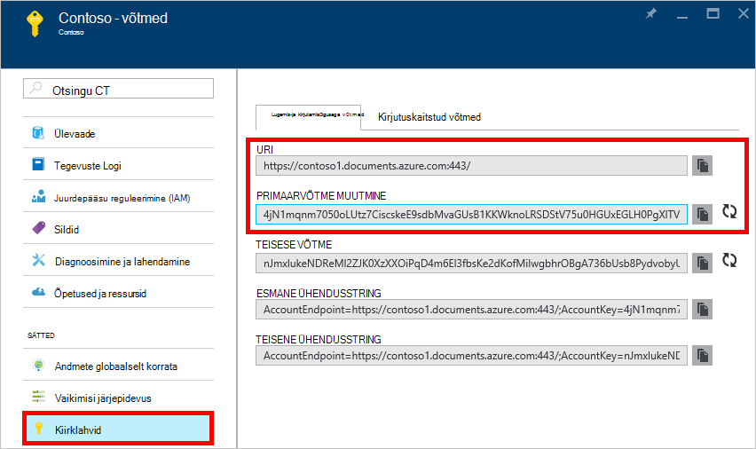
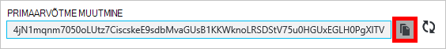
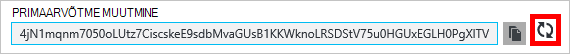
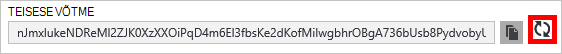
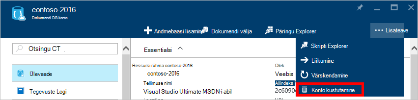
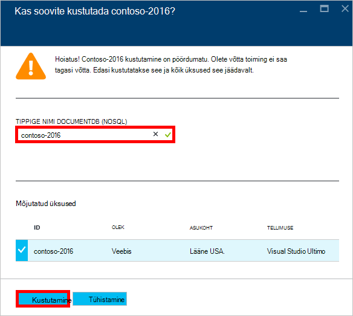

<properties
    pageTitle="DocumentDB konto Azure portaali kaudu haldamine | Microsoft Azure'i"
    description="Saate teada, kuidas hallata DocumentDB kontot Azure portaali kaudu. Leiate Azure'i portaal abil vaadata, kopeerida, kustutada ja juurdepääs kontod juhend."
    keywords="Azure'i portaalis documentdb, Azure'i, Microsoft Azure'i"
    services="documentdb"
    documentationCenter=""
    authors="kirillg"
    manager="jhubbard"
    editor="cgronlun"/>

<tags
    ms.service="documentdb"
    ms.workload="data-services"
    ms.tgt_pltfrm="na"
    ms.devlang="na"
    ms.topic="article"
    ms.date="10/14/2016"
    ms.author="kirillg"/>

# Kuidas DocumentDB konto haldamine

Saate teada, kuidas määrata globaalne järjepidevus, töötamine võtmed ja DocumentDB Azure portaali konto kustutamine.

## DocumentDB järjepidevus sätete haldamine

Valides taseme õige järjepidevuse sõltub rakenduse semantika. Te peaks end DocumentDB saadaval järjepidevus tasemete [kasutamine järjepidevus tasemed kättesaadavus ja jõudluse DocumentDB]lugedes [consistency]. DocumentDB pakub järjepidevuse, kättesaadavuse ja jõudluse garantiid, igal tasemel järjepidevuse andmebaasi teie konto jaoks saadaval. Teie andmebaasi konto konfigureerimist tugev järjepidevuse taseme jaoks on vaja, et teie andmed on piiratud ühe Azure alale ja globaalselt pole saadaval. Teisalt, lõdvestunud järjepidevuse tasemed - piiratud staleness, seansi või lõpliku luba teil mõni muu arv Azure piirkondade seostada oma andmebaasi konto. Järgmised lihtsad toimingud näitavad, kuidas saate valida vaikimisi järjepidevuse andmebaasi konto jaoks. 

### Et määrata vaikimisi järjepidevuse DocumentDB konto jaoks

1. [Azure'i portaalis](https://portal.azure.com/)oma DocumentDB kontole juurdepääsemiseks.
2. Klõpsake konto labale **vaikimisi järjepidevuse**.
3. **Vaikimisi järjepidevuse** tera, saate valida uue järjepidevuse ja klõpsake nuppu **Salvesta**.
    ![Vaikimisi järjepidevuse seanss][5]

## Vaadata, kopeerimine ja taastada kiirklahvide
DocumentDB konto loomisel teenus loob kaks juhtslaidi kiirklahvide, mida saab kasutada autentimiseks kui DocumentDB konto on juurdepääs. Kahe kiirklahvide pakkudes DocumentDB võimaldab teil taastada ilma katkestusteta kontole DocumentDB võtmed. 

[Azure'i portaalis](https://portal.azure.com/)juurde **klahvid** tera **DocumentDB konto** enne vaadata, kopeerida, ja taastada DocumentDB oma kontole juurdepääsemiseks kasutatavate kiirklahvide menüüst ressursi.

> [AZURE.NOTE] **Klahvid** tera ka esmaseid ja teiseseid ühendusstringi, mida saab kasutada [Andmete Migreerimistööriista](documentdb-import-data.md)kontoga ühendada.

Kirjutuskaitstud klahvid on ka see blade saadaval. Loeb ja päringute on kirjutuskaitstud toiminguteks, samal ajal loob, kustutab, ja asendab ei ole.

### Kopeerige võti Azure'i portaal

Enne **klahvide** , klõpsake nuppu **Kopeeri** paremas servas klahvi, mida soovite kopeerida.

### Kiirklahvide taastada

Teil on vaja muuta kiirklahvide perioodiliselt, et hoida oma ühendused turvalisem kontole DocumentDB. Selleks, et saaksite säilitada ühenduste kasutamise ajal saate taastada juurdepääsu võti ühe kiirklahv DocumentDB konto on määratud kahe kiirklahvide.

> [AZURE.WARNING] Teie kiirklahvide regenereeruvate mõjutab kõik rakendused, mis sõltuvad praegune võti. Kõik kliendid, mida kasutada kiirklahv DocumentDB kontole juurdepääsemiseks tuleb värskendada kasutama uue tootenumbri.

Kui teil on rakendused või DocumentDB kontot kasutades pilveteenustega, te kaotate ühenduste kui saate taastada klahvid, juhul, kui pöördute oma võtmed. Järgmised toimingud Liigendage oma klahvide jooksvalt protsess.

1. Värskendage kiirklahv rakenduse koodis viitamiseks teisene kiirklahv DocumentDB konto.
2. Esmane kiirklahv konto DocumentDB taastada. [Azure portaali](https://portal.azure.com/)DocumentDB oma kontole juurdepääsemiseks.
3. Klõpsake **DocumentDB konto** labale **võtmed**.
4. Enne **klahvid** , klõpsake uuesti luua nuppu ja seejärel klõpsake nuppu **Ok** , et kinnitada, et soovite luua uue tootenumbri.
    

5. Kinnitanud, et uue tootenumbri on kasutusvalmis (5 minutit pärast regeneratsiooni), värskendage kiirklahv rakenduse koodis viitamiseks uus esmane kiirklahv.
6. Teisene kiirklahv taastada.

    

> [AZURE.NOTE] Võib kuluda mitu minutit enne äsja loodud võti saab kasutada DocumentDB oma kontole juurde pääseda.

## Ühendusstringi hankimine

Teie ühendusstringi toomiseks tehke järgmist. 

1. [Azure'i portaalis](https://portal.azure.com)oma DocumentDB kontole juurdepääsemiseks.
2. Klõpsake menüüs ressursi **võtmed**.
3. **Esmane ühendusstringi** või **Sekundaarse ühendusstringi** välja kõrval nuppu **Kopeeri** . 

Kui kasutate [DocumentDB andmebaasi Migreerimistööriista](documentdb-import-data.md)ühendusstring, lisa andmebaasi nimi ühendusstringi lõppu. `AccountEndpoint=< >;AccountKey=< >;Database=< >`.

## DocumentDB konto kustutamine
Azure portaali, mida te enam ei kasuta DocumentDB konto eemaldamiseks käsu **Kustuta konto** **DocumentDB konto** enne.

1. [Azure'i portaalis](https://portal.azure.com/)juurde DocumentDB konto, mille soovite kustutada.
2. **DocumentDB konto** enne, nuppu **veel**ja seejärel klõpsake nuppu **Kustuta konto**. Või paremklõpsake andmebaasi nimi ja klõpsake nuppu **Kustuta konto**.
3. Tippige kinnituse tulemuseks enne, DocumentDB konto nime, et kinnitada, et soovite konto kustutada.
4. Klõpsake nuppu **Kustuta** .

## Järgmised sammud

Siit saate teada, kuidas [alustada DocumentDB kontoga](http://go.microsoft.com/fwlink/p/?LinkId=402364).

Lisateavet DocumentDB dokumentatsioonist Azure'i DocumentDB [azure.com](http://go.microsoft.com/fwlink/?LinkID=402319&clcid=0x409).

<!--Image references-->
[1]: ./media/documentdb-manage-account/documentdb_add_region-1.png
[2]: ./media/documentdb-manage-account/documentdb_add_region-2.png
[3]: ./media/documentdb-manage-account/documentdb_change_write_region-1.png
[4]: ./media/documentdb-manage-account/documentdb_change_write_region-2.png
[5]: ./media/documentdb-manage-account/documentdb_change_consistency-1.png
[6]: ./media/documentdb-manage-account/chooseandsaveconsistency.png

<!--Reference style links - using these makes the source content way more readable than using inline links-->
[bcdr]: https://azure.microsoft.com/documentation/articles/best-practices-availability-paired-regions/
[consistency]: https://azure.microsoft.com/documentation/articles/documentdb-consistency-levels/
[azureregions]: https://azure.microsoft.com/en-us/regions/#services
[offers]: https://azure.microsoft.com/en-us/pricing/details/documentdb/
