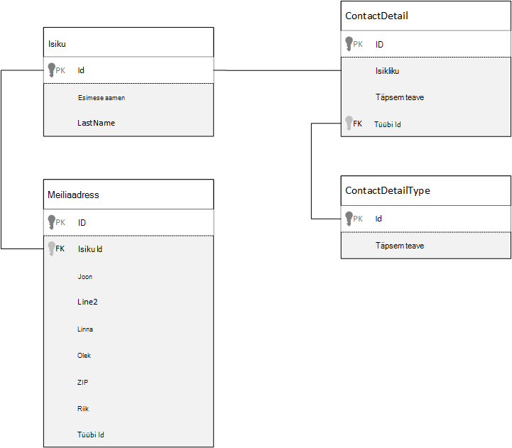
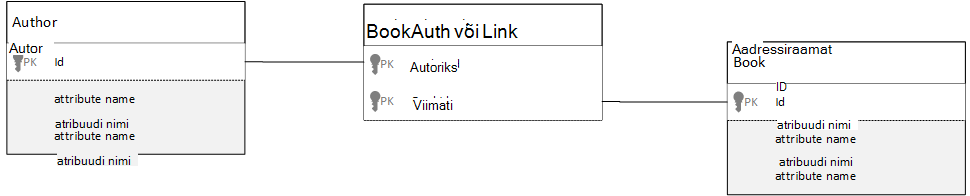

<properties 
    pageTitle="Azure'i DocumentDB andmete modelleerimine | Microsoft Azure'i" 
    description="Lisateavet andmete modelleerimine DocumentDB NoSQL dokumendi andmebaasi." 
    keywords="andmete modelleerimine"
    services="documentdb" 
    authors="kiratp" 
    manager="jhubbard" 
    editor="mimig1" 
    documentationCenter=""/>

<tags 
    ms.service="documentdb" 
    ms.workload="data-services" 
    ms.tgt_pltfrm="na" 
    ms.devlang="na" 
    ms.topic="article" 
    ms.date="08/05/2016" 
    ms.author="kipandya"/>

#Andmete modelleerimine DocumentDB#
Ajal skeemi tasuta andmebaaside Azure'i DocumentDB, nagu oleks väga lihtne omaks andmemudeli muudatuste peaks ikkagi viibite mõne aja mõelda andmete kohta. 

Kuidas toimub andmete talletamise? Kuidas rakenduse saab tuua ja päringu andmeid? Kas teie rakendus raske lugeda või kirjutada raske? 

Pärast selle artikli lugemist on võimalik vastata järgmistele küsimustele:

- Kuidas peaksite mõtlema dokumendi dokumendi andmebaasi?
- Mis on andmete modelleerimise ja miks peaks sellest? 
- Mille poolest erineb dokumendi andmebaasi andmete modelleerimise erinevate relatsiooniandmebaasist?
- Kuidas saan näidata andmete seosed-relatsiooniline andmebaasi?
- Kui Manusta andmed ja kui linkida andmeid?

##Andmete manustamine##
Kui hakkate dokument salvestada, andmete modelleerimine DocumentDB, nt proovige oma üksuste käsitleda **iseseisev dokumentide** esindatud JSON.

Enne me sukelduda liiga palju edasi, andke meile võtab paar sammu tagasi ja vaadata, kuidas me võib mudel midagi relatsiooniandmebaasist paljudele on juba tuttav teema on. Järgmises näites on kujutatud, kuidas isiku võib olla salvestatud relatsiooniandmebaasist. 

Relatsiooniandmebaasid töötamisel me olen olnud õpetatakse normaliseerimine, normaliseerimine, normaliseerimine aastat.

Andmete normaliseerimise tavaliselt hõlmab üksus, nt isik, võttes ja murda see maha eraldi tekstilõigule andmed. Ülaltoodud näites on inimesel võib olla mitu kontakti andmed kirjet, samuti mitu aadressi kirjed. Me isegi minna veelgi täpsemaks ja murda kontaktandmed teel edasise ekstraktimiseks levinud väljad, näiteks tüüp. Sama aadress, iga kirje siin on nagu *kodu* ja *äri* tüüp 

Funktsiooni suunavad eeldus kui normaliseerida andmed on iga kirje puhul **vältida liigsete andmete talletamine** ja pigem olevatele andmetele viidata. Selles näites lugeda isiku oma kontaktandmed ja aadressid, peate kasutama ühenduste käitusajal andmete tõhus liita.

    SELECT p.FirstName, p.LastName, a.City, cd.Detail
    FROM Person p
    JOIN ContactDetail cd ON cd.PersonId = p.Id
    JOIN ContactDetailType on cdt ON cdt.Id = cd.TypeId
    JOIN Address a ON a.PersonId = p.Id

Oma kontaktandmed ja aadressid, üks inimene värskendamine nõuab üle mitme üksikud tabelid kirjutada toiminguid. 

Nüüd vaatame vaadata, kuidas me oleks iseseisev üksuseks dokument andmebaasi andmete modelleerimise.
        
    {
        "id": "1",
        "firstName": "Thomas",
        "lastName": "Andersen",
        "addresses": [
            {            
                "line1": "100 Some Street",
                "line2": "Unit 1",
                "city": "Seattle",
                "state": "WA",
                "zip": 98012
            }
        ],
        "contactDetails": [
            {"email: "thomas@andersen.com"},
            {"phone": "+1 555 555-5555", "extension": 5555}
        ] 
    }

Meil on nüüd **Denormaliseeritud** isiku kirje, kus ülaltoodud lähenemine me **manustatud** kõik rakenduses sellele isikule, nt nende kontaktandmed ja aadressid, JSON ühe dokumendi seotud teavet.
Lisaks, kuna me ei ole piiratud fikseeritud skeemile meil paindlikkust nagu erinevaid kujundeid kontaktandmed täiesti toimingute tegemiseks. 

Täieliku isiku kirje toomine andmebaasist on nüüd ühe ühe saidikogumi suhtes, ja ühte dokumenti lugeda. Värskendada oma kontaktandmed ja aadressid, isiku kirje, on ka ühe toimingu suhtes ühte dokumenti.

Denormalizing andmeid, mida peate rakenduse vähem päringud ja värskenduste lõpuleviimiseks levinud toiminguid. 

###Millal manustamine

Üldiselt kasutada manustatud andmete mudelid järgmistel juhtudel:

- Üksuste vahel on **sisaldab** seosed.
- Üksuste vahel on **üks-mõned** seosed.
- On manustatud andmed, et **muutub harva**.
- On manustatud andmeid ei kasvada **ilma piiranguteta**.
- On manustatud andmeid, mis on **andmeanalüüsi oluline** andmete dokumendis.

> [AZURE.NOTE] Tavaliselt pakuvad Denormaliseeritud andmemudelite töökindluse **lugeda** .

###Kui manustamise kohta

Dokumendi andmebaasi rusikareegel on kõik denormalize ja kõik andmed ühte dokumenti manustamine, see võib põhjustada olukordi, mida tuleks vältida.

Võtke see JSON koodilõigu.

    {
        "id": "1",
        "name": "What's new in the coolest Cloud",
        "summary": "A blog post by someone real famous",
        "comments": [
            {"id": 1, "author": "anon", "comment": "something useful, I'm sure"},
            {"id": 2, "author": "bob", "comment": "wisdom from the interwebs"},
            …
            {"id": 100001, "author": "jane", "comment": "and on we go ..."},
            …
            {"id": 1000000001, "author": "angry", "comment": "blah angry blah angry"},
            …
            {"id": ∞ + 1, "author": "bored", "comment": "oh man, will this ever end?"},
        ]
    }

See võib olla, mida postituse üksuse manustatud kommentaaridega näeks kui me olid modelleerimine tüüpilised ajaveebi või CMS süsteem. Selles näites probleem on, et massiiv kommentaarid on **ääretu**, tähendab, et ei ole (praktiline) piiratud arv võib olla mis tahes ühe postituse kommentaarid. See muutub probleem dokumendi suurus võib oluliselt kasvada.

> [AZURE.TIP] Dokumentide DocumentDB on maksimaalne maht. Lisateavet selle kohta vaadake [DocumentDB piirangud](documentdb-limits.md).

Dokumendi maht kasvab võimalus edastada andmed üle kaabel kui ka lugemine ja värskendamine dokumendis, skaala, kuvatakse mõjutada.

Sel juhul oleks parem silmas pidada järgmist mudel.
        
    Post document:
    {
        "id": "1",
        "name": "What's new in the coolest Cloud",
        "summary": "A blog post by someone real famous",
        "recentComments": [
            {"id": 1, "author": "anon", "comment": "something useful, I'm sure"},
            {"id": 2, "author": "bob", "comment": "wisdom from the interwebs"},
            {"id": 3, "author": "jane", "comment": "....."}
        ]
    }

    Comment documents:
    {
        "postId": "1"
        "comments": [
            {"id": 4, "author": "anon", "comment": "more goodness"},
            {"id": 5, "author": "bob", "comment": "tails from the field"},
            ...
            {"id": 99, "author": "angry", "comment": "blah angry blah angry"}
        ]
    },
    {
        "postId": "1"
        "comments": [
            {"id": 100, "author": "anon", "comment": "yet more"},
            ...
            {"id": 199, "author": "bored", "comment": "will this ever end?"}
        ]
    }

See mudel on kolme viimase postituse, mis on massiiv koos manustatud kommentaarid seotud seekord. Muud kommentaarid on rühmitatud pakettidena 100 kommentaarid ja eraldi dokumentides salvestatud. Paketi mahu valitud 100 Kuna meie väljamõeldud rakendus võimaldab kasutajal laadimise ajal 100 kommentaarid.  

Teise juhul, kui krae andmed ei ole soovitatav on kui manustatud andmeid kasutatakse sageli üle dokumentide ja muudab sageli. 

Võtke see JSON koodilõigu.

    {
        "id": "1",
        "firstName": "Thomas",
        "lastName": "Andersen",
        "holdings": [
            {
                "numberHeld": 100,
                "stock": { "symbol": "zaza", "open": 1, "high": 2, "low": 0.5 }
            },
            {
                "numberHeld": 50,
                "stock": { "symbol": "xcxc", "open": 89, "high": 93.24, "low": 88.87 }
            }
        ]
    }

See võib olla isiku börsidiagrammi portfellivalikuotsuse. Valisime börsidiagrammi teave iga portfellivalikuotsuse dokumenti manustamine. Keskkonnas, kus on seotud andmete muutuvad sageli, nt varude börsipäev rakenduse, manustatud andmeid, mis muutub sageli saab tähendab, et pidevalt värskendate iga portfellivalikuotsuse dokumendi iga kord, kui varude kaubeldakse.

Börsidiagrammi *zaza* võib kaubelda sadu korda ühe päeva ja tuhandeliste kasutajate võiks olla *zaza* oma portfellivalikuotsuse. Nagu eespool oleks meil mitu korda mitu tuhat portfellivalikuotsuse dokumentide värskendamiseks andmemudeli koos iga päev, mis viib süsteemi mis ei skaala hästi. 

##Andmete viitamine##

Jah, manustamine andmete kenasti paljudel juhtudel toimib, kuid see on selge, et kui denormalizing andmete põhjustada rohkem probleeme, kui see on väärt on stsenaariumid. Mida ma me tegema nüüd? 

Relatsiooniandmebaasid ei ole ainult koht, kus saate luua üksuste vahelisi seoseid. Dokumendi andmebaasi võivad sisaldada teavet ühte dokumenti, mis tegelikult on seotud andmete edaspidistes dokumentides. Nüüd, ma olen ei toetab isegi minut me koostada süsteemid, mis oleks paremini sisse DocumentDB relatsiooniandmebaasist või dokumentide andmebaas, et lihtsa seosed on hea ja võib olla väga kasulik. 

Valisime kasutada varem börsidiagrammi portfellivalikuotsuse kaudu näiteks alltoodud JSON, kuid seekord me viidata portfellivalikuotsuse asemel manustamine börsidiagrammi punktina. Kui börsidiagrammi üksuse muudab sageli kogu päeva ainult dokument, mida tuleb värskendada on ühe börsidiagrammi dokument. 

    Person document:
    {
        "id": "1",
        "firstName": "Thomas",
        "lastName": "Andersen",
        "holdings": [
            { "numberHeld":  100, "stockId": 1},
            { "numberHeld":  50, "stockId": 2}
        ]
    }
    
    Stock documents:
    {
        "id": "1",
        "symbol": "zaza",
        "open": 1,
        "high": 2,
        "low": 0.5,
        "vol": 11970000,
        "mkt-cap": 42000000,
        "pe": 5.89
    },
    {
        "id": "2",
        "symbol": "xcxc",
        "open": 89,
        "high": 93.24,
        "low": 88.87,
        "vol": 2970200,
        "mkt-cap": 1005000,
        "pe": 75.82
    }
    

Mõne kohe negatiivne See lähenemine on küll, kui teie taotlus on vaja kuvada teavet iga aktsia, mis toimub kuvamisel isiku portfellivalikuotsuse; Käesoleval juhul peaksite andmebaas laadimiseks teavet iga börsidiagrammi dokumendi mitme reisi tegemiseks. Oleme siin teinud otsus tõhusust kirjutada toiminguid, mis juhtub sageli kogu päeva, kuid omakorda rikutud loetuks toimingutest, mis on väiksem mõju potentsiaalselt kindla süsteemi jõudluse parandamiseks.

> [AZURE.NOTE] Normaliseeritud andmete mudelite **saate nõuda rohkem edasi-tagasi** serverisse.

### Kuidas on lood võõrvõtmed?
Kuna seal on praegu pole piirangu mõiste, Võõrvõti või muul viisil, mis tahes muu dokumendi seostest, mis on dokumendid on tõhus "nõrk lingid" ja ei saa kontrollida, andmebaasi ise. Kui soovite tagada, et andmed dokumendi viitab tegelikult on olemas, siis peate selle tegemiseks oma rakenduse või serveripoolne päästikute või klõpsake DocumentDB salvestatud toimingute abil.

###Millal viitamine.
Üldiselt kasutada normaliseeritud andmete mudelid järgmistel juhtudel:

- Tähistav **üks-mitmele** seosed.
- Tähistav **mitu-mitmele** seosed.
- Seotud andmete **muudatused sageli**.
- Viidatud andmete võib olla **ääretu**.

> [AZURE.NOTE] Tavaliselt normaliseerida pakub **kirjutamine** töökindluse.

###Kui panna seose?
Seose kasvu aitab kindlaks teha, milline dokument salvestada viide.

Kui vaatame JSON, mis mudelid tootjad ja raamatud.

    Publisher document:
    {
        "id": "mspress",
        "name": "Microsoft Press",
        "books": [ 1, 2, 3, ..., 100, ..., 1000]
    }

    Book documents:
    {"id": "1", "name": "DocumentDB 101" }
    {"id": "2", "name": "DocumentDB for RDBMS Users" }
    {"id": "3", "name": "Taking over the world one JSON doc at a time" }
    ...
    {"id": "100", "name": "Learn about Azure DocumentDB" }
    ...
    {"id": "1000", "name": "Deep Dive in to DocumentDB" }

Kui soovitud publisher on arv on piiratud kasvuga väike, siis talletamise aadressiraamatu viide Publisheri dokumendi sees võib olla kasulik. Kui soovitud arv publisher on ääretu, siis see andmemudeli oleks viia muutlik, kasvab massiive, nagu eeltoodud näites Publisheri dokumendi. 

Üleminek asjad natuke ümber tulemuseks mudelit, mis tähistab endiselt samad andmed, kuid nüüd hoiab ära nende suurte muutlik saidikogumid.

    Publisher document: 
    {
        "id": "mspress",
        "name": "Microsoft Press"
    }
    
    Book documents: 
    {"id": "1","name": "DocumentDB 101", "pub-id": "mspress"}
    {"id": "2","name": "DocumentDB for RDBMS Users", "pub-id": "mspress"}
    {"id": "3","name": "Taking over the world one JSON doc at a time"}
    ...
    {"id": "100","name": "Learn about Azure DocumentDB", "pub-id": "mspress"}
    ...
    {"id": "1000","name": "Deep Dive in to DocumentDB", "pub-id": "mspress"}

Ülaltoodud näites me lähevad ääretu saidikogumi Publisheri dokumendiga. Selle asemel ainult meil on viide publisher iga raamat dokumendiga.

###Kuidas saan mitu: mitu seosed mudel?
Relatsiooniandmebaasist *mitu: mitu* seosed on sageli modelleerida Liitu tabelitega, mis lihtsalt kirjete muude tabelite kokkuliitmiseks. 

Võite soovida korrata, kasutades sama ja andmemudelit, mis näeb välja umbes järgmine.

    Author documents: 
    {"id": "a1", "name": "Thomas Andersen" }
    {"id": "a2", "name": "William Wakefield" }
    
    Book documents:
    {"id": "b1", "name": "DocumentDB 101" }
    {"id": "b2", "name": "DocumentDB for RDBMS Users" }
    {"id": "b3", "name": "Taking over the world one JSON doc at a time" }
    {"id": "b4", "name": "Learn about Azure DocumentDB" }
    {"id": "b5", "name": "Deep Dive in to DocumentDB" }
    
    Joining documents: 
    {"authorId": "a1", "bookId": "b1" }
    {"authorId": "a2", "bookId": "b1" }
    {"authorId": "a1", "bookId": "b2" }
    {"authorId": "a1", "bookId": "b3" }

See töö. Laadimine Autor oma raamatuid või laadimise raamatu selle autor alati nõuab aga vähemalt kaks täiendavad päringud andmebaasist. Ühe päringu liitumist dokumenti ja seejärel teise päringu toomiseks ühendatavad tegelik dokumendi. 

Kui kõik selle tabeli Liitu teeb on liimimise koos kahe andmeühikuga, miks pole pukseerige see täielikult?
Võtke arvesse järgmist.

    Author documents:
    {"id": "a1", "name": "Thomas Andersen", "books": ["b1, "b2", "b3"]}
    {"id": "a2", "name": "William Wakefield", "books": ["b1", "b4"]}
    
    Book documents: 
    {"id": "b1", "name": "DocumentDB 101", "authors": ["a1", "a2"]}
    {"id": "b2", "name": "DocumentDB for RDBMS Users", "authors": ["a1"]}
    {"id": "b3", "name": "Learn about Azure DocumentDB", "authors": ["a1"]}
    {"id": "b4", "name": "Deep Dive in to DocumentDB", "authors": ["a2"]}

Nüüd Autor oleks kohe tean, millised nad on kirjutatud raamatud ja vastupidi aadressiraamatu dokumendi laaditud poleks ma teaks kaitstavate ID-d. See salvestab selle vahendaja päring Liitu tabeli vähendamise serveri arvu ümardada reisi teie taotlus on teha. 

##Hübriidjuurutuse andmemudelid##
Meil on nüüd vanal manustamine (või denormalizing) ja viitavat (või normaliseerida) andmed, iga on nende tasa ja iga on kompromisse, nagu oleme näinud. 

See ei pea alati olema kas või ära karda asju veidi segada. 

Rakenduse teatud mustreid ja võib juhtuda, kui segamine manustatud töökoormus ja viidatud andmete on mõistlik ja võivad viia lihtsam rakenduse loogika vähem serveriga ümardada reisi endiselt säilitades tase hea jõudlus.

Võtke arvesse järgmist JSON. 

    Author documents: 
    {
        "id": "a1",
        "firstName": "Thomas",
        "lastName": "Andersen",     
        "countOfBooks": 3,
        "books": ["b1", "b2", "b3"],
        "images": [
            {"thumbnail": "http://....png"}
            {"profile": "http://....png"}
            {"large": "http://....png"}
        ]
    },
    {
        "id": "a2",
        "firstName": "William",
        "lastName": "Wakefield",
        "countOfBooks": 1,
        "books": ["b1"],
        "images": [
            {"thumbnail": "http://....png"}
        ]
    }
    
    Book documents:
    {
        "id": "b1",
        "name": "DocumentDB 101",
        "authors": [
            {"id": "a1", "name": "Thomas Andersen", "thumbnailUrl": "http://....png"},
            {"id": "a2", "name": "William Wakefield", "thumbnailUrl": "http://....png"}
        ]
    },
    {
        "id": "b2",
        "name": "DocumentDB for RDBMS Users",
        "authors": [
            {"id": "a1", "name": "Thomas Andersen", "thumbnailUrl": "http://....png"},
        ]
    }

Siin me (enamasti) olete täitnud manustatud mudeli, kus andmeid muudelt ettevõtetelt manustatud ülataseme dokument, kuid muud andmed on viidatud. 

Kui vaatate dokumenti aadressiraamatu, me näeme mõne huvitav välju, kui vaatame autorid massiiv. Välja *id* , mis on kasutame naasta Autor dokumendi, tavaks normaliseeritud mudelis välja, kuid siis on ka *nimi* ja *thumbnailUrl*. Oleme saanud lihtsalt kinni *id* -ga ja vasakule rakenduse toomine vastava Autor dokumendi abil "linki" seda vaja täiendavat teavet, kuid kuna meie rakendus kuvatakse autori nimi ja pisipiltide pilt koos iga raamat kuvatakse me saate salvestada mõnda pendellevi kohta aadressiraamatu loendist server denormalizing **teatud** andmed majandusanalüüsi büroost autori järgi.

Kindel, kui nad soovivad värskendada oma foto oleks meil minna värskendust või autori nimi muudetud iga raamat nad kunagi varem avaldatud, kuid meie rakenduse, eeldades autorid ei muuda nende nimed sageli, on see aktsepteeritav kujundus otsus.  

Näites on **agregaadid eelnevalt arvutatud** väärtused salvestada kallis töötlemine Lugemistoiming. Näites on mõned andmed manustatud dokumendi autori andmeid, mis on arvutatud käitusajal. Iga kord, kui uues raamatus on avaldatud, luuakse aadressiraamatu dokumendi **ja** countOfBooks väärtuseks on arvutatud väärtuse jaoks kindla autori raamat dokumentide arv. See optimeerimine oleks hea raske lugeda süsteemides kui me endale optimeerida loeb kirjutab arvutuste tegemiseks.

Võimalus on mudel eelnevalt arvutatud väljad on võimalik, kuna DocumentDB toetab **mitme dokumendi tehingud**. Mitme NoSQL salvestab ei saa teha tehingud üle dokumentide ja seetõttu kohtujurist kujundus otsuseid, näiteks "alati manustamine kõike", kuna see piirang. DocumentDB, saate serveripoolne päästikute või salvestatud toimingute, mida raamatuid lisada ja värskendada HAPPE toimingu piires kõik autorid. Nüüd, kui te ei **ole** manustamiseks kõik ühe dokumendi lihtsalt veendumaks, et teie andmed jäävad ühtsete.

##Järgmised sammud

Suurim takeaways selles artiklis on aru, et andmete modelleerimine skeemi tasuta maailmas on sama oluline kui kunagi varem. 

Nii, nagu on üks võimalus tähistada tükk ekraanil andmeid, on üks võimalus andmete modelleerimise. Vaja mõista teie rakendus ja kuidas see hakkab tarbimine ja töödelda andmeid. Seejärel, rakendades mõned siin esitatud suunised saate seada mudelit, mis käsitleb kohe vajadustele rakenduse loomise kohta. Kui teie rakendused on vaja muuta, saate kasutada skeemi tasuta andmebaasi omaks muutuvad ja arenevad andmemudeli hõlpsalt paindlikkust. 

Azure'i DocumentDB kohta lisateabe saamiseks vaadake [dokumentatsiooni](https://azure.microsoft.com/documentation/services/documentdb/) teenus. 

Azure'i DocumentDB registrite häälestamise kohta lisateabe saamiseks lugege artiklit indekseerimine [poliitika](documentdb-indexing-policies.md).

Et aru saada, kuidas Kildu andmete üle mitme sektsioonid, vaadake [DocumentDB andmete eraldamine](documentdb-partition-data.md). 

Ja lõpuks andmete modelleerimise ja sharding mitme rentniku rakenduste juhised, pöörduge [skaleerimist mitme rentniku rakenduse abil Azure'i DocumentDB](http://blogs.msdn.com/b/documentdb/archive/2014/12/03/scaling-a-multi-tenant-application-with-azure-documentdb.aspx).
 
