<properties 
    pageTitle="MongoChef kasutamine koos protokolli tugi MongoDB kontoga DocumentDB | Microsoft Azure'i" 
    description="Saate teada, kuidas kasutada MongoChef protokolli tugi MongoDB, mis on nüüd saadaval eelvaade koos DocumentDB kontoga." 
    keywords="mongochef"
    services="documentdb" 
    authors="AndrewHoh" 
    manager="jhubbard" 
    editor="" 
    documentationCenter=""/>

<tags 
    ms.service="documentdb" 
    ms.workload="data-services" 
    ms.tgt_pltfrm="na" 
    ms.devlang="na" 
    ms.topic="article" 
    ms.date="08/25/2016" 
    ms.author="anhoh"/>

# Kasutage MongoChef DocumentDB kontoga koos MongoDB protokolli tugi

Protokolli tugi MongoDB abil MongoChef Azure'i DocumentDB konto ühenduse, peate tegema järgmist:

- Laadige alla ja installige [MongoChef](http://3t.io/mongochef)
- On teie konto DocumentDB protokolli tugi MongoDB [ühendusstringi](documentdb-connect-mongodb-account.md) teave

## MongoChef ühenduse loomine  

MongoChef ühenduse ülemus protokolli tugi MongoDB DocumentDB konto lisamiseks tehke järgmist.

1. Oma DocumentDB koos protokolli tugi MongoDB ühendusteabe juhiste abil saate tuua [siin](documentdb-connect-mongodb-account.md).

    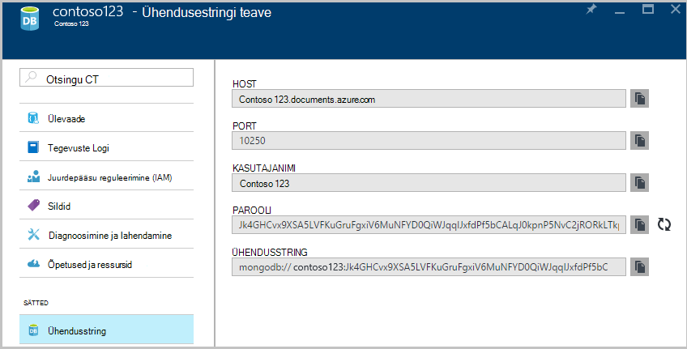

2. **Ühenduse loomine** avamiseks ühenduse haldur ja seejärel käsku **Uus ühendus**

    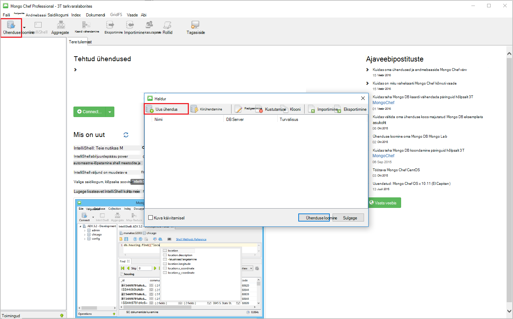
    
2. Sisestage aknas **Uus ühendus** vahekaardil **Server** HOST (FQDN) protokolli tugi MongoDB ja PORDI DocumentDB kontot.
    
    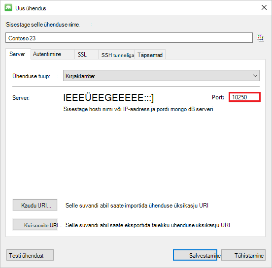

3. Klõpsake aknas **Uus ühendus** vahekaardil **autentimine** valige autentimisrežiim **Standardne (MONGODB-CR või SCARM-SHA-1)** ja sisestage kasutajanimi ja parool.  Nõustuge vaikimisi autentimise db (haldus) või sisestada oma väärtus.

    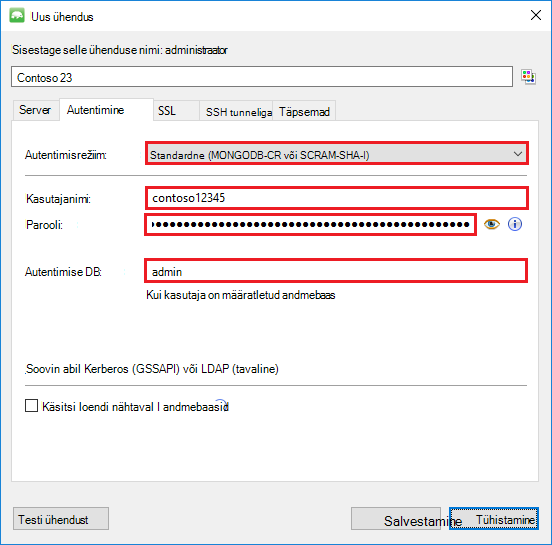

4. **Uus ühendus** aknas vahekaardil **SSL-i** märkige ruut **Kasuta SSL-protokolli ühenduse** ja **Aktsepteeri iseallkirjastatud SSL-sertide** raadionupp.

    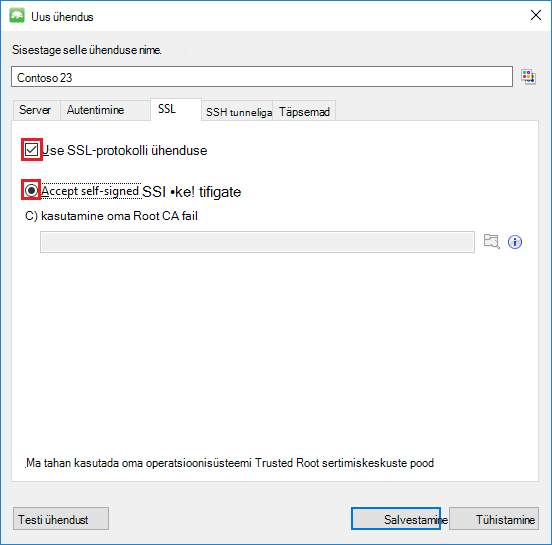

5. Klõpsake nuppu **Testi ühendust** , et kinnitada ühenduse teavet, klõpsake nuppu **OK** , et naasta aknasse uus ühendus ja klõpsake siis nuppu **Salvesta**.

    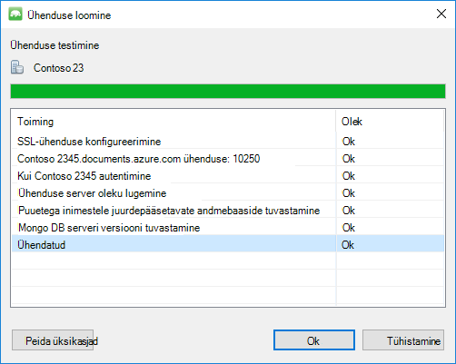

## MongoChef abil saate luua andmebaasi, saidikogumi ja dokumendid  

Andmebaasi, kogumine ja kasutamine MongoChef dokumentide loomiseks tehke järgmist.

1. **Haldur**esile ühendus ja klõpsake nuppu **Loo ühendus**.

    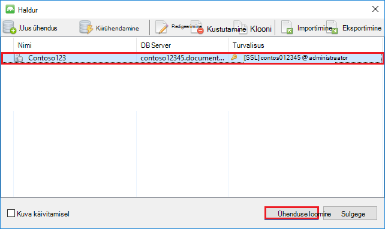

2. Paremklõpsake selle hosti ja valige käsk **Lisa andmebaasi**.  Sisestage andmebaasi nimi ja klõpsake nuppu **OK**.
    
    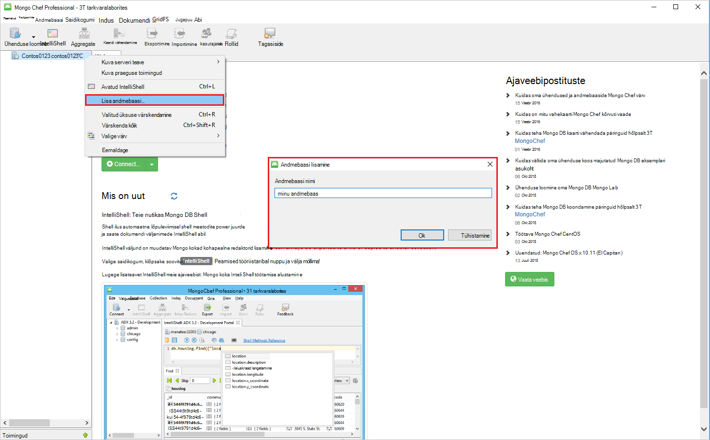

3. Paremklõpsake andmebaasist ja valige käsk **Lisa saidikogumi**.  Saidikogumi nimi ja klõpsake nuppu **Loo**.

    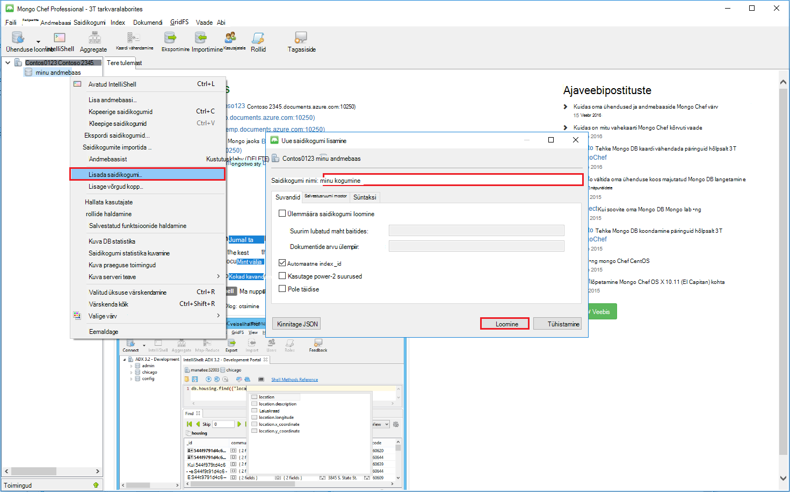

4. Klõpsake menüükäsku **saidikogumi** ja seejärel klõpsake nuppu **Lisa dokument**.

    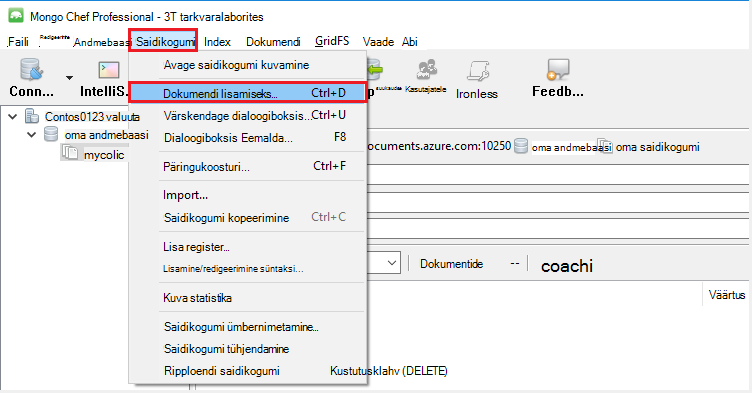

5. Dialoogiboksis dokumendi lisamine järgmine ja seejärel klõpsake nuppu **Lisa dokument**.

        {
        "_id": "AndersenFamily",
        "lastName": "Andersen",
        "parents": [
            { "firstName": "Thomas" },
            { "firstName": "Mary Kay"}
        ],
        "children": [
        {
            "firstName": "Henriette Thaulow", "gender": "female", "grade": 5,
            "pets": [{ "givenName": "Fluffy" }]
        }
        ],
        "address": { "state": "WA", "county": "King", "city": "seattle" },
        "isRegistered": true
        }

    
6. Lisage teise dokumenti, seekord sisu on järgmine.

        {
        "_id": "WakefieldFamily",
        "parents": [
            { "familyName": "Wakefield", "givenName": "Robin" },
            { "familyName": "Miller", "givenName": "Ben" }
        ],
        "children": [
            {
                "familyName": "Merriam", 
                "givenName": "Jesse", 
                "gender": "female", "grade": 1,
                "pets": [
                    { "givenName": "Goofy" },
                    { "givenName": "Shadow" }
                ]
            },
            { 
                "familyName": "Miller", 
                "givenName": "Lisa", 
                "gender": "female", 
                "grade": 8 }
        ],
        "address": { "state": "NY", "county": "Manhattan", "city": "NY" },
        "isRegistered": false
        }

7. Valimi päringut. Näiteks otsida peredele, kus "Andersen" perekonnanimi ja tagastada vanematel ja state väljad.

    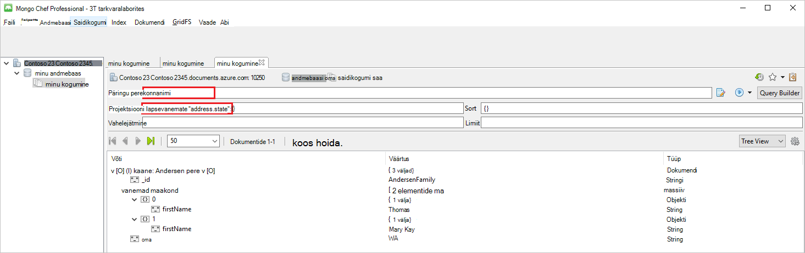
    

## Järgmised sammud

- Avasta DocumentDB protokolli tugi MongoDB [näidised](documentdb-mongodb-samples.md).

 
