<properties
    pageTitle="Jälgimine DocumentDB taotlusi ja salvestusruumi | Microsoft Azure'i"
    description="Saate teada, kuidas jõudlust mõõdikute, taotlusi ja serveri tõrgete, nt ja kasutus mõõdikute, nt salvestusruumi konto DocumentDB jälgimine."
    services="documentdb"
    documentationCenter=""
    authors="mimig1"
    manager="jhubbard"
    editor="cgronlun"/>

<tags
    ms.service="documentdb"
    ms.workload="data-services"
    ms.tgt_pltfrm="na"
    ms.devlang="na"
    ms.topic="article"
    ms.date="10/17/2016"
    ms.author="mimig"/>

# DocumentDB taotlusi, kasutus ja salvestusruumi jälgimine

Saate jälgida kontode Azure'i DocumentDB [Azure portaali](https://portal.azure.com/). Iga DocumentDB konto nii jõudluse mõõdikute, nagu taotluste serveri tõrgete ja kasutus mõõdikute, nagu salvestusruumi tarbimine, on saadaval.

Mõõdikute saate läbi vaadata enne konto või uue mõõdikute enne.

## Vaate jõudlus mõõdikute mõõdikute enne

1. Uues aknas, avage [Azure'i portaal](https://portal.azure.com/), klõpsake nuppu **Rohkem teenuseid**, klõpsake **DocumentDB (NoSQL)**ja klõpsake DocumentDB konto, mille soovite kuvada jõudluse mõõdikute nime.
2. Klõpsake menüüs ressursi **mõõdikute**.

Mõõdikute tera avaneb ja valige saidikogumi üle vaadata. Saate vaadata kättesaadavus taotlusi, ja mõõdikute ja võrrelda neid DocumentDB SLAs.

## Vaate jõudlus mõõdikute enne konto
1.  Uues aknas, avage [Azure'i portaal](https://portal.azure.com/), klõpsake nuppu **Rohkem teenuseid**, klõpsake **DocumentDB (NoSQL)**ja klõpsake DocumentDB konto, mille soovite kuvada jõudluse mõõdikute nime.

2.  **Jälgimis** lens kuvatakse vaikimisi järgmised paanid.
    *   Tänase päeva kokku taotlused.
    *   Salvestusruumi kasutada.

    Kui teie tabel kuvab **andmed** ja arvate, et andmebaasis on andmed, leiate jaotisest [tõrkeotsing](#troubleshooting) .

    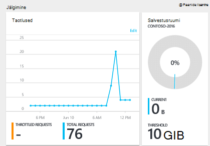

3.  Paani **taotlusi** või **salvestusruumi** nupu klõpsamisel avatakse üksikasjalik **meetermõõdustik** tera.
4.  **Meetermõõdustik** tera kuvatakse valitud mõõdikud üksikasjad.  Tera ülaosas on diagrammi taotlusi kaardistatud tunni ja all, mis on tabeli, mis näitab rakendus ja kokku taotlusi väärtuste liitmine.  Argumendil tera kuvatakse ka teatised, mis pole määratud, filtreeritud, et kuvada praegune argumendil enne mõõdikud (sellisel viisil, kui teil on mitmeid määratavaid teatised, näete ainult asjakohaste need siin esitatud).   

    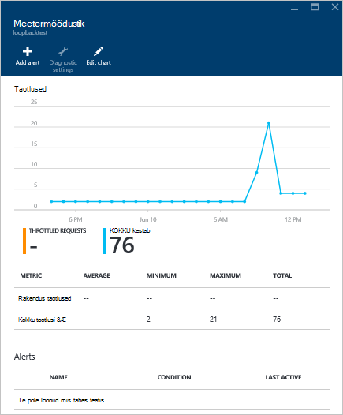

## Jõudluse argumendil vaadete portaalis kohandamine

1.  Mõõdikute, mis kuvavad kindla diagrammi kohandamiseks klõpsake diagrammi selle **väärtuseks meetermõõdustik** tera avamiseks ja seejärel klõpsake nuppu **Redigeeri diagrammi**.  
    

2.  **Diagrammi redigeerida** enne, on mõõdikute, mis kuvavad diagrammi ning nende ajavahemiku muutmiseks võimalusi.  
    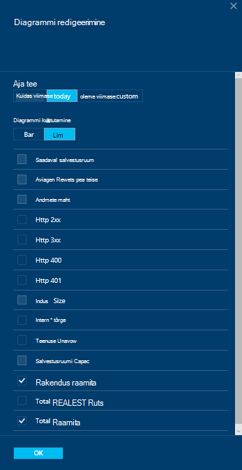

3.  Kuvatakse osa mõõdikud muutmiseks valige lihtsalt või tühjendage saadaval jõudluse mõõdikute ja seejärel klõpsake nuppu **OK** tera allosas.  
4.  Ajavahemiku muutmine valida mõne muu vahemiku (nt **kohandatud**) ja seejärel klõpsake nuppu **OK** tera allosas.  

    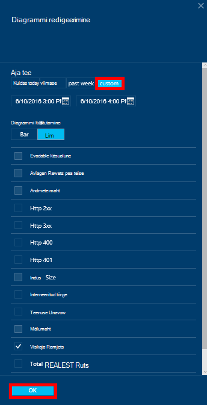

## Portaali kõrvuti Diagrammide loomine
Azure'i portaal võimaldab teil luua-kõrvuti argumendil diagrammid.  

1.  Paremklõpsake esmalt diagrammi, mida soovite kopeerida, ja valige **kohandamine**.

    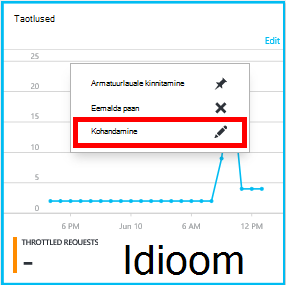

2.  Klõpsake menüü osa kopeerida ja seejärel klõpsake nuppu **valmis kohandamise** **klooni** .

    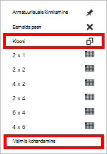  

Nüüd vastupidise see osa argumendil osa, kohandamise kuvatakse osa mõõdikute ja kellaaja vahemik.  Seda tehes näete kahte erinevat mõõdikute diagrammi-kõrvuti samal ajal.  
    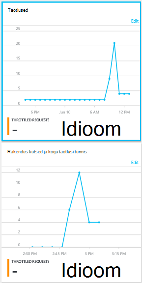  

## Häälestage teatised portaalis
1.  [Azure'i portaalis](https://portal.azure.com/)nuppu **Rohkem teenuseid**, klõpsake **DocumentDB (NoSQL)**ja klõpsake DocumentDB konto, mille jaoks soovite jõudluse argumendil teatiste häälestamine nime.

2.  Klõpsake menüü ressursi, **Teatiste reeglid** teatiste reeglid tera avamiseks.  
    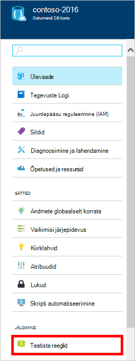

3.  Labale **teatiste reeglid** nuppu **Lisa teatis**.  
    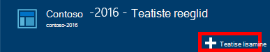

4.  **Reegli lisamine** tera määramiseks tehke järgmist.
    *   Häälestate reegli nimi.
    *   Uue reegli kirjeldus.
    *   Meetermõõdustik reegli jaoks.
    *   Tingimus, lävi ja kestus kui teatise aktiveerib määratleda. Näiteks serveritõrge loendamine 5 suurem viimase 15 minuti jooksul.
    *   Kas meilitsi teenuse administraator ja coadministrators, kui teatise tule.
    *   Täiendavate meiliaadresside teatiste.  
    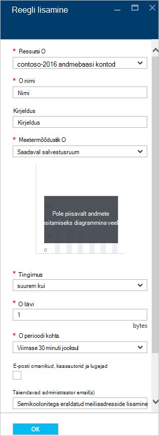

## DocumentDB programatically jälgimine
Konto taseme mõõdikute portaalis, näiteks konto salvestusruumi kasutuse ja kogusumma taotlusi, ei ole saadaval DocumentDB API-de kaudu. Siiski saate tuua kasutusandmete saidikogumi tasemel DocumentDB API abil. Saidikogumi tasemel andmete toomiseks tehke järgmist.

- Kasutada REST API, [teha saamiseks kogumist](https://msdn.microsoft.com/library/mt489073.aspx). Kvoodi ja kasutamine teabe kogumiseks, tagastatakse vastuse x ms-ressursikvoot ja x ms-ressursikasutus päised.
- Kasutage .NET SDK kasutamiseks [DocumentClient.ReadDocumentCollectionAsync](https://msdn.microsoft.com/library/microsoft.azure.documents.client.documentclient.readdocumentcollectionasync.aspx) meetod, mis tagastab [ResourceResponse](https://msdn.microsoft.com/library/dn799209.aspx) , mis sisaldab mitmeid kasutus atribuutide (nt **CollectionSizeUsage**, **DatabaseUsage**, **DocumentUsage**jm).

Täiendavad mõõdikud juurdepääsuks kasutada [Azure kuvari SDK](https://www.nuget.org/packages/Microsoft.Azure.Insights). Saadaval argumendil määratlused saate tuua, helistades:

    https://management.azure.com/subscriptions/{SubscriptionId}/resourceGroups/{ResourceGroup}/providers/Microsoft.DocumentDb/databaseAccounts/{DocumentDBAccountName}/metricDefinitions?api-version=2015-04-08

Päringute üksikute mõõdikute toomiseks kasutada järgmises vormingus:

    https://management.azure.com/subscriptions/{SubecriptionId}/resourceGroups/{ResourceGroup}/providers/Microsoft.DocumentDb/databaseAccounts/{DocumentDBAccountName}/metrics?api-version=2015-04-08&$filter=%28name.value%20eq%20%27Total%20Requests%27%29%20and%20timeGrain%20eq%20duration%27PT5M%27%20and%20startTime%20eq%202016-06-03T03%3A26%3A00.0000000Z%20and%20endTime%20eq%202016-06-10T03%3A26%3A00.0000000Z

Lisateabe saamiseks vt [Toomine ressursi mõõdikute kaudu Azure'i kuvari REST API -ga](https://blogs.msdn.microsoft.com/cloud_solution_architect/2016/02/23/retrieving-resource-metrics-via-the-azure-insights-api/). Pange tähele, et "Azure Inights" ümber "Azure jälgimine".  See ajaveebikirje viitab vanema nimega.

## Tõrkeotsing
Paanide jälgimise kuvatakse teade **pole andmeid, mis on saadaval** , kui teie Viimati tehtud taotlused või lisada andmed andmebaasi, saate redigeerida paani kajastamiseks tehtud kasutus.

### Praeguse andmete värskendamine paani redigeerimine
1.  Mõõdikute, mis kuvavad kindla osa kohandamiseks klõpsake **meetermõõdustik** tera avamiseks diagrammi ja seejärel klõpsake nuppu **Redigeeri diagrammi**.  
    

2.  **Diagrammi redigeerida** enne, **Ajavahemiku** jaotises klõpsake **viimase tunni**ja seejärel klõpsake nuppu **OK**.  
    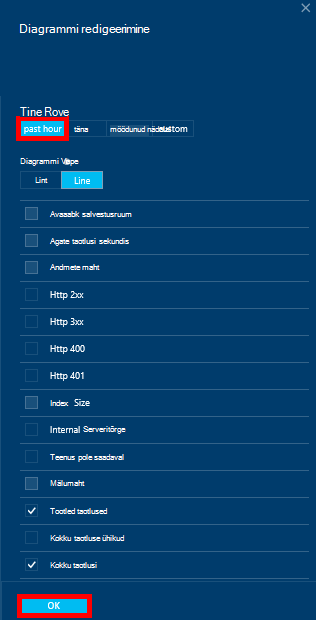

3.  Paan teie peaks nüüd värskendada oma olemasolevad andmed ja kasutamine.  
    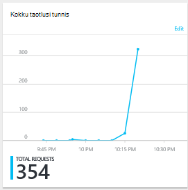

## Järgmised sammud
DocumentDB võimsus kohta leiate lisateavet teemast [haldamine DocumentDB võimsus](documentdb-manage.md).
