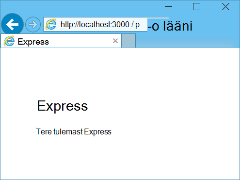

<properties 
    pageTitle="Saate teada, mis Node.js - DocumentDB Node.js õpetuse | Microsoft Azure'i" 
    description="Siit saate teada, Node.js! Õppeteema uurib majutatud Azure veebisaitide Node.js Express veebirakenduse Microsoft Azure'i DocumentDB abil saate talletada ja Accessi andmeid." 
    keywords="Rakenduste arendamise andmebaasi õppetükis saate teada, node.js node.js õpetuse, documentdb, Azure'i, Microsoft Azure'i"
    services="documentdb" 
    documentationCenter="nodejs" 
    authors="syamkmsft" 
    manager="jhubbard" 
    editor="cgronlun"/>

<tags 
    ms.service="documentdb" 
    ms.workload="data-services" 
    ms.tgt_pltfrm="na" 
    ms.devlang="nodejs" 
    ms.topic="hero-article" 
    ms.date="08/25/2016" 
    ms.author="syamk"/>

# Node.js veebirakenduse abil DocumentDB koostamine

> [AZURE.SELECTOR]
- [.NET-I](documentdb-dotnet-application.md)
- [Node.js](documentdb-nodejs-application.md)
- [Java](documentdb-java-application.md)
- [Python](documentdb-python-application.md)

Selle õpetuse Node.js näete Azure'i DocumentDB teenuse abil saate talletada ja Node.js Express rakendusest Azure veebisaitide majutatud Accessi andmeid.

Soovitame, jälgides järgmisest videost, kus saate teada, kuidas ette Azure'i DocumentDB andmebaasi konto ja JSON dokumentide talletamine teenuses Node.js rakenduse alustamine. 

> [AZURE.VIDEO azure-demo-getting-started-with-azure-documentdb-on-nodejs-in-linux]

Seejärel tagasi õppeteema Node.js, kus õpite vastused järgmistele küsimustele:

- Kuidas toimivad DocumentDB documentdb npm mooduli kasutamise?
- Kuidas ma saan kasutada veebirakenduse Azure veebisaitide otseteid.

Pärast andmebaasi õppeteema, koostate lihtsa veebipõhine tööülesande-haldamise rakendus, mis võimaldab loomise, allalaadimise ja tööülesannete lõpuleviimine. Tööülesanded salvestatakse Azure DocumentDB JSON dokumendina.

Ei ole aega õpetuse ja soovite lihtsalt täielik lahendus leida? Pole probleeme, saate avada valimi täielik lahendus [GitHub][]kaudu.

## Eeltingimused

> [AZURE.TIP] Selle õpetuse Node.js eeldab, et teil on mõni eelnev kogemus Node.js ja Azure veebisaitide abil.

Enne selle artikli juhiseid järgides, peate tagama, et teil on järgmine:

- Aktiivne Azure'i konto. Kui teil pole kontot, saate luua tasuta prooviversiooni konto vaid paar minutit. Lisateavet leiate teemast [Azure tasuta prooviversioon](https://azure.microsoft.com/pricing/free-trial/).
- [Node.js][] versioon v0.10.29 või uuem versioon.
- [Kiire generaator](http://www.expressjs.com/starter/generator.html) (see kaudu saate installida `npm install express-generator -g`)
- [Git][].

## Samm 1: DocumentDB andmebaasi konto loomine

Alustame DocumentDB konto loomine. Kui teil on juba konto, võite jätkata [Samm 2: Loo uus Node.js rakendus](#_Toc395783178).

[AZURE.INCLUDE [documentdb-create-dbaccount](../../includes/documentdb-create-dbaccount.md)]

[AZURE.INCLUDE [documentdb-keys](../../includes/documentdb-keys.md)]

## Samm 2: Saate teada, kuidas luua uue Node.js rakenduse

Nüüd luua lihtsa Tere maailma Node.js projekti abil [kiire](http://expressjs.com/) raames töölehtedega.

1. Avage oma lemmik terminal.

2. Kiire generaator abil saate luua uue rakenduse kutsutud **todo**.

        express todo

3. Avage uus **todo** kataloogi alla ja installige sõltuvused.

        cd todo
        npm install

4. Uue rakenduse käivitada.

        npm start

5. Saate vaadata oma uuele rakendusele navigeerides [http://localhost:3000](http://localhost:3000)brauseris.

    

## Samm 3: Installi täiendavad moodulid

**Package.json** fail on üks projekti juurkaustas versioonides loodud faile. See fail sisaldab loendi täiendavate moodulid vajalike Node.js rakenduse. Hiljem juurutamisel see rakendus on Azure veebisaitide, kasutatakse selle faili määrata, millised moodulid tuleb installida Azure rakenduse toetamiseks. Peame installimine rohkem pakettide jaoks selles õpetuses.

1. Olles tagasi kohas terminal, installima **asünkroonse** mooduli npm kaudu.

        npm install async --save

1. Installige **documentdb** mooduli npm kaudu. See on koht, kus kõik DocumentDB maagiline juhtub mooduli.

        npm install documentdb --save

3. Kiire kontroll **package.json** faili rakenduse peaks kuva täiendavad moodulid. Selle faili ütleb Azure'i mis pakettide alla laadima ja installima rakenduse käivitamisel. See peaks sarnaneb järgmises näites.

    

    See ütleb sõlm (ja Azure hiljem), et teie rakendus sõltub nende täiendavate moodulid.

## Samm 4: Sõlm rakenduse DocumentDB teenuse kasutamine

Mis hoolitseb Alghäälestus ja konfiguratsiooni, nüüd vaatame get allapoole, et miks oleme siin, ja see on mõned abil Azure'i DocumentDB koodi kirjutamiseks.

### Mudeli loomine

1. Projekti kataloogi, looge uus kaust nimega **mudelid**.
2. Kataloogis **mudelite** **taskDao.js**nimega uue faili loomine. See fail sisaldab meie rakenduse loodud toimingute mudel.
3. Kataloogis sama **mudelite** loomine mõne muu uus fail nimega **docdbUtils.js**. See fail sisaldab teatud kasutame kogu meie rakenduse kasulik, korduvkasutatav, kood. 
4. Järgmine kood kopeerimiseks **docdbUtils.js**

        var DocumentDBClient = require('documentdb').DocumentClient;
            
        var DocDBUtils = {
            getOrCreateDatabase: function (client, databaseId, callback) {
                var querySpec = {
                    query: 'SELECT * FROM root r WHERE r.id= @id',
                    parameters: [{
                        name: '@id',
                        value: databaseId
                    }]
                };
        
                client.queryDatabases(querySpec).toArray(function (err, results) {
                    if (err) {
                        callback(err);
        
                    } else {
                        if (results.length === 0) {
                            var databaseSpec = {
                                id: databaseId
                            };
        
                            client.createDatabase(databaseSpec, function (err, created) {
                                callback(null, created);
                            });
        
                        } else {
                            callback(null, results[0]);
                        }
                    }
                });
            },
        
            getOrCreateCollection: function (client, databaseLink, collectionId, callback) {
                var querySpec = {
                    query: 'SELECT * FROM root r WHERE r.id=@id',
                    parameters: [{
                        name: '@id',
                        value: collectionId
                    }]
                };             
                
                client.queryCollections(databaseLink, querySpec).toArray(function (err, results) {
                    if (err) {
                        callback(err);
        
                    } else {        
                        if (results.length === 0) {
                            var collectionSpec = {
                                id: collectionId
                            };
                            
                            client.createCollection(databaseLink, collectionSpec, function (err, created) {
                                callback(null, created);
                            });
        
                        } else {
                            callback(null, results[0]);
                        }
                    }
                });
            }
        };
                
        module.exports = DocDBUtils;

    > [AZURE.TIP] createCollection võtab requestOptions valikuline parameeter, määrake pakkuda kogumiseks kasutatavate. Kui pole requestOptions.offerType väärtus on saadaval siis selle saidikogumi luuakse kasutades vaikimisi pakkuda tüüp.
    >
    > DocumentDB pakkuda failitüüpide kohta lisateabe saamiseks vaadake [jõudluse tasemete DocumentDB](documentdb-performance-levels.md) 
        
3. Salvestage ja sulgege fail **docdbUtils.js** .

4. **TaskDao.js** faili alguses lisada viide **DocumentDBClient** ja **docdbUtils.js** lõime üle järgmine kood:

        var DocumentDBClient = require('documentdb').DocumentClient;
        var docdbUtils = require('./docdbUtils');

4. Järgmiseks lisamist määratlemine ja tööülesande objekti kood. See on meie tööülesande objekti lähtestamine ja andmebaas ja dokumendikogumi kasutame häälestamiseks.

        function TaskDao(documentDBClient, databaseId, collectionId) {
          this.client = documentDBClient;
          this.databaseId = databaseId;
          this.collectionId = collectionId;
        
          this.database = null;
          this.collection = null;
        }
        
        module.exports = TaskDao;

5. Järgmiseks lisada järgmine kood määratleda täiendavad meetodite tööülesande objekti, mis võimaldavad kasutusviisid DocumentDB talletatud andmetega.

        TaskDao.prototype = {
            init: function (callback) {
                var self = this;
        
                docdbUtils.getOrCreateDatabase(self.client, self.databaseId, function (err, db) {
                    if (err) {
                        callback(err);
                    } else {
                        self.database = db;
                        docdbUtils.getOrCreateCollection(self.client, self.database._self, self.collectionId, function (err, coll) {
                            if (err) {
                                callback(err);
        
                            } else {
                                self.collection = coll;
                            }
                        });
                    }
                });
            },
        
            find: function (querySpec, callback) {
                var self = this;
        
                self.client.queryDocuments(self.collection._self, querySpec).toArray(function (err, results) {
                    if (err) {
                        callback(err);
        
                    } else {
                        callback(null, results);
                    }
                });
            },
        
            addItem: function (item, callback) {
                var self = this;
        
                item.date = Date.now();
                item.completed = false;
        
                self.client.createDocument(self.collection._self, item, function (err, doc) {
                    if (err) {
                        callback(err);
        
                    } else {
                        callback(null, doc);
                    }
                });
            },
        
            updateItem: function (itemId, callback) {
                var self = this;
        
                self.getItem(itemId, function (err, doc) {
                    if (err) {
                        callback(err);
        
                    } else {
                        doc.completed = true;
        
                        self.client.replaceDocument(doc._self, doc, function (err, replaced) {
                            if (err) {
                                callback(err);
        
                            } else {
                                callback(null, replaced);
                            }
                        });
                    }
                });
            },
        
            getItem: function (itemId, callback) {
                var self = this;
        
                var querySpec = {
                    query: 'SELECT * FROM root r WHERE r.id = @id',
                    parameters: [{
                        name: '@id',
                        value: itemId
                    }]
                };
        
                self.client.queryDocuments(self.collection._self, querySpec).toArray(function (err, results) {
                    if (err) {
                        callback(err);
        
                    } else {
                        callback(null, results[0]);
                    }
                });
            }
        };

6. Salvestage ja sulgege fail **taskDao.js** . 

### Selle domeenikontrolleri loomine

1. Projekti kataloogis **marsruudib** **tasklist.js**nimega uue faili loomine. 
2. Lisage järgmine kood **tasklist.js**. See laadib DocumentDBClient ja asünkroonse moodulid, mida kasutatakse **tasklist.js**. See on määratletud ka **TaskList** funktsioon, mis on näiteks **tööülesande** objekti, mida me varem määratletud:

        var DocumentDBClient = require('documentdb').DocumentClient;
        var async = require('async');
        
        function TaskList(taskDao) {
          this.taskDao = taskDao;
        }
        
        module.exports = TaskList;

3. Jätkake, lisades **showTasks, addTask**ja **completeTasks**meetodite **tasklist.js** faili lisamine:
        
        TaskList.prototype = {
            showTasks: function (req, res) {
                var self = this;
        
                var querySpec = {
                    query: 'SELECT * FROM root r WHERE r.completed=@completed',
                    parameters: [{
                        name: '@completed',
                        value: false
                    }]
                };
        
                self.taskDao.find(querySpec, function (err, items) {
                    if (err) {
                        throw (err);
                    }
        
                    res.render('index', {
                        title: 'My ToDo List ',
                        tasks: items
                    });
                });
            },
        
            addTask: function (req, res) {
                var self = this;
                var item = req.body;
        
                self.taskDao.addItem(item, function (err) {
                    if (err) {
                        throw (err);
                    }
        
                    res.redirect('/');
                });
            },
        
            completeTask: function (req, res) {
                var self = this;
                var completedTasks = Object.keys(req.body);
        
                async.forEach(completedTasks, function taskIterator(completedTask, callback) {
                    self.taskDao.updateItem(completedTask, function (err) {
                        if (err) {
                            callback(err);
                        } else {
                            callback(null);
                        }
                    });
                }, function goHome(err) {
                    if (err) {
                        throw err;
                    } else {
                        res.redirect('/');
                    }
                });
            }
        };

4. Salvestage ja sulgege fail **tasklist.js** .
 
### Config.js lisamine

1. Projekti kataloogis nimega **config.js**uue faili loomine.
2. Lisage järgmine **config.js**. See määratleb konfiguratsioonisätted ja meie rakenduse jaoks vajalike väärtused.

        var config = {}
        
        config.host = process.env.HOST || "[the URI value from the DocumentDB Keys blade on http://portal.azure.com]";
        config.authKey = process.env.AUTH_KEY || "[the PRIMARY KEY value from the DocumentDB Keys blade on http://portal.azure.com]";
        config.databaseId = "ToDoList";
        config.collectionId = "Items";
        
        module.exports = config;

3. Värskendage failis **config.js** HOST ja AUTH_KEY abil leitud klahvid tera [Microsoft Azure portaali](https://portal.azure.com)konto DocumentDB väärtust väärtused.

4. Salvestage ja sulgege fail **config.js** .
 
### App.js muutmine

1. Projekti kataloogi **app.js** faili avada. See fail on varem loodud Express veebirakenduse loomisel.
2. Lisage järgmine kood **app.js** algusse
    
        var DocumentDBClient = require('documentdb').DocumentClient;
        var config = require('./config');
        var TaskList = require('./routes/tasklist');
        var TaskDao = require('./models/taskDao');

3. See määratleb config faili kasutada, ning lugeda selle faili teatud muutujaid kasutame kiiresti välja väärtused.
4. Asendage järgmised kaks rida **app.js** faili:

        app.use('/', routes);
        app.use('/users', users); 

      koos väljavõte järgmist:

        var docDbClient = new DocumentDBClient(config.host, {
            masterKey: config.authKey
        });
        var taskDao = new TaskDao(docDbClient, config.databaseId, config.collectionId);
        var taskList = new TaskList(taskDao);
        taskDao.init();
        
        app.get('/', taskList.showTasks.bind(taskList));
        app.post('/addtask', taskList.addTask.bind(taskList));
        app.post('/completetask', taskList.completeTask.bind(taskList));
        app.set('view engine', 'jade');

6. Nende ridade määratlemine uue eksemplari meie **TaskDao** objekti, uue ühenduse DocumentDB (abil lugemise **config.js**väärtused), mille lähtestada tööülesande objekti ja seejärel vormi toimingud sidumiseks meetodite meie **TaskList** kontrolleril. 

7. Lõpetuseks, salvestamine ja sulgege fail **app.js** , me praktiliselt valmis.
 
## Juhis 5: Koostada kasutajaliides

Nüüd vaatame lülitada meie tähelepanu kasutajaliidese nii, et kasutaja saab tegelikult suhelda meie rakendus. Lõime Express rakendus kasutab **Jade** engine vaade. Jade kohta lisateabe saamiseks vaadake [http://jade-lang.com/](http://jade-lang.com/).

1. **Vaadete** kataloogis **layout.jade** faili kasutatakse globaalmall **.jade** muid faile. Selles etapis tuleb näidatakse seda kasutada [Alglaaduri Twitteri](https://github.com/twbs/bootstrap), mis on tööriistakomplekt, mis hõlbustab kena ilmega veebisaidi kujundamiseks muuta. 
2. Avage fail **layout.jade** **vaadete** kaustas ja asendage sisu järgmine;
    
        doctype html
        html
          head
            title= title
            link(rel='stylesheet', href='//ajax.aspnetcdn.com/ajax/bootstrap/3.3.2/css/bootstrap.min.css')
            link(rel='stylesheet', href='/stylesheets/style.css')
          body
            nav.navbar.navbar-inverse.navbar-fixed-top
              div.navbar-header
                a.navbar-brand(href='#') My Tasks
            block content
            script(src='//ajax.aspnetcdn.com/ajax/jQuery/jquery-1.11.2.min.js')
            script(src='//ajax.aspnetcdn.com/ajax/bootstrap/3.3.2/bootstrap.min.js')

    See tõhusalt ütleb **Jade** mootori renderdamiseks mõned HTML meie rakenduse ja loob **plokk** nimega **sisu** , kus pakume paigutuse meie sisu lehekülgedel.
    Salvestage ja sulgege see **layout.jade** fail.

4. Nüüd avage **index.jade** fail, vaade, mis kasutab meie taotlus ja asendage faili sisu järgmist:

        extends layout
        
        block content
          h1 #{title}
          br
        
          form(action="/completetask", method="post")
            table.table.table-striped.table-bordered
              tr
                td Name
                td Category
                td Date
                td Complete
              if (typeof tasks === "undefined")
                tr
                  td
              else
                each task in tasks
                  tr
                    td #{task.name}
                    td #{task.category}
                    - var date  = new Date(task.date);
                    - var day   = date.getDate();
                    - var month = date.getMonth() + 1;
                    - var year  = date.getFullYear();
                    td #{month + "/" + day + "/" + year}
                    td
                      input(type="checkbox", name="#{task.id}", value="#{!task.completed}", checked=task.completed)
            button.btn(type="submit") Update tasks
          hr
          form.well(action="/addtask", method="post")
            label Item Name:
            input(name="name", type="textbox")
            label Item Category:
            input(name="category", type="textbox")
            br
            button.btn(type="submit") Add item

    See laiendab paigutus ja pakub sisu me vaadanud **layout.jade** faili enne **sisu** kohatäide.
    
    See paigutus lõime kaks HTML-vormi. 
    Esimene vorm sisaldab tabeli andmed ja nupp, mis võimaldab teil värskendada üksuste postitada need meie kontrolleril **/completetask** meetodit.
    Teine vorm sisaldab kahte väljad ja nupp, mis võimaldab teil luua uue üksuse postitada need meie kontrolleril **/addtask** meetodit.
    
    See peaks olema kõik, mida läheb vaja meie rakenduse töötamiseks.

5. Avage faili **style.css** **public\stylesheets** directory ja asendage kood järgmist:

        body {
          padding: 50px;
          font: 14px "Lucida Grande", Helvetica, Arial, sans-serif;
        }
        a {
          color: #00B7FF;
        }
        .well label {
          display: block;
        }
        .well input {
          margin-bottom: 5px;
        }
        .btn {
          margin-top: 5px;
          border: outset 1px #C8C8C8;
        }

    Salvestage ja sulgege see **style.css** fail.

## Samm 6: Rakenduse käivitada kohalikult

1. Käivitage rakendus oma kohalikus arvutis testimiseks `npm start` terminalis rakenduse käivitamine ja käivitage brauseris lehe, mis näeb välja nagu järgmisel pildil:

    

2. Üksuse, üksuse nimi ja kategooria esitatud väljade abil saate sisestada teavet, ja seejärel klõpsake nuppu **Lisa üksus**.

3. Lehe värskendama äsja loodud üksuse ToDo loendi kuvamiseks.

    

4. Tööülesande lõpuleviimine lihtsalt märkige ruut täielik veerus ja seejärel klõpsake nuppu **Värskenda tööülesanded**.

## Juhis 7: Juurutamine rakenduste arendamise projekti Azure veebisaitide otseteid.

1. Kui te pole seda veel teinud, lubada git hoidla Azure'i veebisaidi jaoks. Juhised leiate kohta, kuidas seda teha ka [Kohaliku Git juurutamine Azure'i rakendust Service](../app-service-web/app-service-deploy-local-git.md) teema.

2. Lisage veebisaidi Azure git remote.

        git remote add azure https://username@your-azure-website.scm.azurewebsites.net:443/your-azure-website.git

3. Juurutamine Remote vajutamine.

        git push azure master

4. Mõne sekundi, git valmis avaldada oma veebirakenduse ja käivitage Siin näete oma mugav töö töötab Azure brauseris!

## Järgmised sammud

Palju õnne! Teil on oma esimese Node.js kiire veebirakenduse abil Azure'i DocumentDB ehitatud ja avaldada Azure veebisaitide.

Lähtekoodi täielikku rakenduse saab alla laadida [GitHub][].

Lisateavet leiate teemast [Node.js Arenduskeskus](https://azure.microsoft.com/develop/nodejs/).

[Node.js]: http://nodejs.org/
[Git]: http://git-scm.com/
[Github]: https://github.com/Azure-Samples/documentdb-node-todo-app
 
