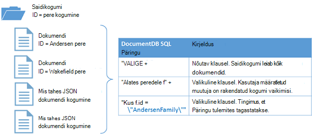

<properties
  pageTitle="NoSQL Node.js õpetuse DocumentDB | Microsoft Azure'i"
  description="NoSQL Node.js õpetuse, mis loob sõlm andmebaas ja konsooli rakenduse DocumentDB Node.js SDK abil. DocumentDB on JSON NoSQL andmebaasi."
    keywords="Node.js õpetuses sõlm andmebaas"
  services="documentdb"
  documentationCenter="node.js"
  authors="AndrewHoh"
  manager="jhubbard"
  editor="monicar"/>

<tags
  ms.service="documentdb"
  ms.workload="data-services"
  ms.tgt_pltfrm="na"
  ms.devlang="node"
  ms.topic="hero-article"
  ms.date="08/11/2016"
  ms.author="anhoh"/>

# <a name="nosql-nodejs-tutorial-documentdb-nodejs-console-application"></a>NoSQL Node.js õpetus: DocumentDB Node.js konsooli rakendus  

> [AZURE.SELECTOR]
- [.NET-I](documentdb-get-started.md)
- [Node.js](documentdb-nodejs-get-started.md)

Tere tulemast Node.js õpetuse Azure'i DocumentDB Node.js SDK! Pärast selle õpetuse, siis on teil konsooli rakendus, mis loob ja päringute DocumentDB ressursse, sh sõlm andmebaasi.

Käsitleme:

- Loomine ja DocumentDB kontoga ühenduse
- Kuidas häälestada rakenduse
- Sõlm andmebaasi loomine
- Kogumi loomine
- JSON dokumentide loomine
- Päringute kogumine
- Dokumendi asendamine
- Dokumendi kustutamine
- Sõlm andmebaasi kustutamine

Pole aega? Ära muretse! Täielik lahendus on saadaval [github](https://github.com/Azure-Samples/documentdb-node-getting-started). Vaadake [saada täielik lahendus](#GetSolution) kiirülevaate olevaid juhiseid.

Kui olete Node.js õpetuse, kasutage hääletusnuppude üla-ja selle lehe allservas meile tagasiside. Kui soovite meil teiega otse ühendust võtta, Julgelt kaasata oma meiliaadress oma kommentaarid.

Nüüd Alustagem!

## <a name="prerequisites-for-the-nodejs-tutorial"></a>Eeltingimuste Node.js õpetus

Veenduge, et teil on järgmine:

- Aktiivne Azure'i konto. Kui teil pole ühte, saate kasutajaks [Azure'i tasuta prooviversioon](https://azure.microsoft.com/pricing/free-trial/).
- [Node.js](https://nodejs.org/) versioon v0.10.29 või uuem versioon.

## <a name="step-1-create-a-documentdb-account"></a>Samm 1: DocumentDB konto loomine

Loome DocumentDB konto. Kui teil on juba konto, mida soovite kasutada, võite jätkata edasi [Node.js rakenduse](#SetupNode)häälestamine.

[AZURE.INCLUDE [documentdb-create-dbaccount](../../includes/documentdb-create-dbaccount.md)]

## <a id="SetupNode"></a>Samm 2: Häälestamise Node.js rakenduse

1. Avage oma lemmik terminal.
2. Otsige üles kaust või kausta, kuhu soovite salvestada Node.js rakenduse.
3. Kaks tühja JavaScripti failide loomine järgmised käsud:
  - Windows:
      * ```fsutil file createnew app.js 0```
        * ```fsutil file createnew config.js 0```
  - Linux/OS x
      * ```touch app.js```
        * ```touch config.js```
4. Installige documentdb mooduli npm kaudu. Kasutage järgmine käsk:
    * ```npm install documentdb --save```

Suurepärane! Nüüd, kui olete häälestamise lõpule jõudnud, Alustame mõned koodi kirjutamist.

## <a id="Config"></a>Samm 3: Määrake oma rakenduse konfiguratsioone

Avatud ```config.js``` oma lemmik tekstiredaktoris.

Seejärel, Kopeeri ja kleebi allpool koodilõigu ja atribuutide seadmine ```config.endpoint``` ja ```config.primaryKey``` DocumentDB lõpp-punkti uri ja primaarvõti. Nii neid konfiguratsioone leiate [Azure'i portaalis](https://portal.azure.com).

![Node.js õppeteema – Azure portaali, näitab DocumentDB konto, aktiivne jaoturi, mis on esile tõstetud, on esile tõstetud DocumentDB konto enne klahvid nupp ja URI, PRIMAARVÕTME ja TEISESE võtme väärtusi esile tõstetud klahvid enne - sõlm andmebaasi kuvatõmmis][keys]

    // ADD THIS PART TO YOUR CODE
    var config = {}

    config.endpoint = "~your DocumentDB endpoint uri here~";
    config.primaryKey = "~your primary key here~";

Kopeerige ja kleepige soovitud ```database id```, ```collection id```, ja ```JSON documents``` abil oma ```config``` objekti allpool, kus saate määrata oma ```config.endpoint``` ja ```config.authKey``` atribuudid. Kui teil on juba andmeid, mida soovite salvestada oma andmebaasi, saate kasutada DocumentDB's [andmete Migreerimistööriista](documentdb-import-data.md) mitte lisada dokumendi määratlusi.

    config.endpoint = "~your DocumentDB endpoint uri here~";
    config.primaryKey = "~your primary key here~";

    // ADD THIS PART TO YOUR CODE
    config.database = {
        "id": "FamilyDB"
    };

    config.collection = {
        "id": "FamilyColl"
    };

    config.documents = {
        "Andersen": {
            "id": "Anderson.1",
            "lastName": "Andersen",
            "parents": [{
                "firstName": "Thomas"
            }, {
                    "firstName": "Mary Kay"
                }],
            "children": [{
                "firstName": "Henriette Thaulow",
                "gender": "female",
                "grade": 5,
                "pets": [{
                    "givenName": "Fluffy"
                }]
            }],
            "address": {
                "state": "WA",
                "county": "King",
                "city": "Seattle"
            }
        },
        "Wakefield": {
            "id": "Wakefield.7",
            "parents": [{
                "familyName": "Wakefield",
                "firstName": "Robin"
            }, {
                    "familyName": "Miller",
                    "firstName": "Ben"
                }],
            "children": [{
                "familyName": "Merriam",
                "firstName": "Jesse",
                "gender": "female",
                "grade": 8,
                "pets": [{
                    "givenName": "Goofy"
                }, {
                        "givenName": "Shadow"
                    }]
            }, {
                    "familyName": "Miller",
                    "firstName": "Lisa",
                    "gender": "female",
                    "grade": 1
                }],
            "address": {
                "state": "NY",
                "county": "Manhattan",
                "city": "NY"
            },
            "isRegistered": false
        }
    };


Andmebaasi, saidikogumi ja dokumendi määratlused teeb oma DocumentDB ```database id```, ```collection id```, ja dokumentide andmed.

Lõpuks eksportida oma ```config``` objekt, nii, et saate otsida sees on ```app.js``` faili.

            },
            "isRegistered": false
        }
    };

    // ADD THIS PART TO YOUR CODE
    module.exports = config;

##<a id="Connect"></a>Samm 4: DocumentDB kontoga ühenduse loomine

Avage oma Tühjenda ```app.js``` faili tekstiredaktoris. Kopeerige ja kleepige kood allpool importimiseks on ```documentdb``` mooduli ja äsja loodud ```config``` mooduli.

    // ADD THIS PART TO YOUR CODE
    "use strict";

    var documentClient = require("documentdb").DocumentClient;
    var config = require("./config");
    var url = require('url');

Kopeerige ja kleepige kood kasutada varem salvestatud ```config.endpoint``` ja ```config.primaryKey``` uue DocumentClient loomiseks.

    var config = require("./config");
    var url = require('url');

    // ADD THIS PART TO YOUR CODE
    var client = new documentClient(config.endpoint, { "masterKey": config.primaryKey });

Nüüd, kui teil on koodi lähtestada documentdb klient, vaatame töötamine DocumentDB ressursid.

## <a name="step-5-create-a-node-database"></a>Juhis 5: Sõlm andmebaasi loomine
Kopeerige ja kleepige kood allpool ei leitud, andmebaasi URL-i ja saidikogumi URL-i HTTP oleku määramine. Idest on, kuidas DocumentDB klient leiab õige andmebaas ja saidikogumi.

    var client = new documentClient(config.endpoint, { "masterKey": config.primaryKey });

    // ADD THIS PART TO YOUR CODE
    var HttpStatusCodes = { NOTFOUND: 404 };
    var databaseUrl = `dbs/${config.database.id}`;
    var collectionUrl = `${databaseUrl}/colls/${config.collection.id}`;

[Andmebaasi](documentdb-resources.md#databases) saab luua, kasutades funktsiooni [createDatabase](https://azure.github.io/azure-documentdb-node/DocumentClient.html) **DocumentClient** klassi. Andmebaas on loogiline ümbris üle saidikogumid liigendatud dokumendi salvestusruumi.

Kopeerige ja kleepige uue andmebaasi loomiseks app.js faili funktsiooni **getDatabase** selle ```id``` määratletud funktsiooni ```config``` objekti. Funktsiooni märkige ruut, kui sama andmebaasi ```FamilyRegistry``` id juba olemas. Kui see on olemas, saame tagasi andmebaasi asemel luua uue eksemplari.

    var collectionUrl = `${databaseUrl}/colls/${config.collection.id}`;

    // ADD THIS PART TO YOUR CODE
    function getDatabase() {
        console.log(`Getting database:\n${config.database.id}\n`);

        return new Promise((resolve, reject) => {
            client.readDatabase(databaseUrl, (err, result) => {
                if (err) {
                    if (err.code == HttpStatusCodes.NOTFOUND) {
                        client.createDatabase(config.database, (err, created) => {
                            if (err) reject(err)
                            else resolve(created);
                        });
                    } else {
                        reject(err);
                    }
                } else {
                    resolve(result);
                }
            });
        });
    }

Kopeerige ja kleepige kood all, kus saate määrata funktsiooni **getDatabase** lisamiseks soovitud helper funktsioon **väljumine** välju sõnumi ja **getDatabase** funktsiooni prinditavad.

                } else {
                    resolve(result);
                }
            });
        });
    }

    // ADD THIS PART TO YOUR CODE
    function exit(message) {
        console.log(message);
        console.log('Press any key to exit');
        process.stdin.setRawMode(true);
        process.stdin.resume();
        process.stdin.on('data', process.exit.bind(process, 0));
    }

    getDatabase()
    .then(() => { exit(`Completed successfully`); })
    .catch((error) => { exit(`Completed with error ${JSON.stringify(error)}`) });

Oma terminal, otsige üles oma ```app.js``` fail ja käivitage käsk:```node app.js```

Palju õnne! Olete loonud DocumentDB andmebaasi.

##<a id="CreateColl"></a>Samm 6: Kogumi loomine  

> [AZURE.WARNING] **CreateDocumentCollectionAsync** loob uue saidikogumi, mis on hinnad mõju. Lisateabe saamiseks külastage meie [hinnad lehele](https://azure.microsoft.com/pricing/details/documentdb/).

[Saidikogumi](documentdb-resources.md#collections) loomist, kasutades funktsiooni [createCollection](https://azure.github.io/azure-documentdb-node/DocumentClient.html) **DocumentClient** klassi. Kogumi on JSON dokumendid ja seotud JavaScripti rakenduse loogika ümbris.

Kopeerimine ja kleepimine **getCollection** funktsiooni all **getDatabase** funktsiooni abil oma uue saidikogumi loomiseks on ```id``` määratletud funktsiooni ```config``` objekti. Klõpsake uuesti me kontrollida veendumaks, et sama kogumi ```FamilyCollection``` id juba olemas. Kui see on olemas, saame tagasi selle saidikogumi asemel luua uue eksemplari.

                } else {
                    resolve(result);
                }
            });
        });
    }

    // ADD THIS PART TO YOUR CODE
    function getCollection() {
        console.log(`Getting collection:\n${config.collection.id}\n`);

        return new Promise((resolve, reject) => {
            client.readCollection(collectionUrl, (err, result) => {
                if (err) {
                    if (err.code == HttpStatusCodes.NOTFOUND) {
                        client.createCollection(databaseUrl, config.collection, { offerThroughput: 400 }, (err, created) => {
                            if (err) reject(err)
                            else resolve(created);
                        });
                    } else {
                        reject(err);
                    }
                } else {
                    resolve(result);
                }
            });
        });
    }

Kopeerige ja kleepige kood all **getDatabase** kõne **getCollection** funktsiooni käivitada.

    getDatabase()

    // ADD THIS PART TO YOUR CODE
    .then(() => getCollection())
    // ENDS HERE

    .then(() => { exit(`Completed successfully`); })
    .catch((error) => { exit(`Completed with error ${JSON.stringify(error)}`) });

Oma terminal, otsige üles oma ```app.js``` fail ja käivitage käsk:```node app.js```

Palju õnne! Olete loonud DocumentDB saidikogumi.

##<a id="CreateDoc"></a>Juhis 7: Dokumendi loomine
[Dokumendi](documentdb-resources.md#documents) loomist, kasutades funktsiooni [createDocument](https://azure.github.io/azure-documentdb-node/DocumentClient.html) **DocumentClient** klassi. Kasutaja määratletud (suvalise) JSON sisu on dokumendid. Nüüd saate dokumenti lisada DocumentDB.

Kopeerimine ja kleepimine funktsiooni **getFamilyDocument** loomise dokumentidest, mis sisaldavad JSON andmed salvestatakse **getCollection** funktsiooni all olevat ```config``` objekti. Klõpsake uuesti me kontrollida veendumaks, et sama id-ga dokument pole veel olemas.

                } else {
                    resolve(result);
                }
            });
        });
    }

    // ADD THIS PART TO YOUR CODE
    function getFamilyDocument(document) {
        let documentUrl = `${collectionUrl}/docs/${document.id}`;
        console.log(`Getting document:\n${document.id}\n`);

        return new Promise((resolve, reject) => {
            client.readDocument(documentUrl, { partitionKey: document.district }, (err, result) => {
                if (err) {
                    if (err.code == HttpStatusCodes.NOTFOUND) {
                        client.createDocument(collectionUrl, document, (err, created) => {
                            if (err) reject(err)
                            else resolve(created);
                        });
                    } else {
                        reject(err);
                    }
                } else {
                    resolve(result);
                }
            });
        });
    };

Kopeerige ja kleepige kood all **getCollection** kõne **getFamilyDocument** funktsiooni käivitada.

    getDatabase()
    .then(() => getCollection())

    // ADD THIS PART TO YOUR CODE
    .then(() => getFamilyDocument(config.documents.Andersen))
    .then(() => getFamilyDocument(config.documents.Wakefield))
    // ENDS HERE

    .then(() => { exit(`Completed successfully`); })
    .catch((error) => { exit(`Completed with error ${JSON.stringify(error)}`) });

Oma terminal, otsige üles oma ```app.js``` fail ja käivitage käsk:```node app.js```

Palju õnne! Olete loonud DocumentDB dokumendid.


##<a id="Query"></a>Samm 8: Päringu DocumentDB ressursid

DocumentDB toetab [rikkalike päringute](documentdb-sql-query.md) JSON dokumendid salvestatakse iga saidikogumi vastu. Järgmine kood näidis kuvatakse päringu, mida saate kasutada oma saidikogumi dokumentide vastu.

Kopeerige ja kleepige **queryCollection** funktsiooni **getFamilyDocument** funktsioon all. DocumentDB toetab SQL-like päringud, nagu allpool näidatud. Keerukate päringute koostamise kohta lisateabe saamiseks vaadake [Päringu mänguväljak](https://www.documentdb.com/sql/demo) ja [päringu dokumentatsiooni](documentdb-sql-query.md).

                } else {
                    resolve(result);
                }
            });
        });
    }

    // ADD THIS PART TO YOUR CODE
    function queryCollection() {
        console.log(`Querying collection through index:\n${config.collection.id}`);

        return new Promise((resolve, reject) => {
            client.queryDocuments(
                collectionUrl,
                'SELECT VALUE r.children FROM root r WHERE r.lastName = "Andersen"'
            ).toArray((err, results) => {
                if (err) reject(err)
                else {
                    for (var queryResult of results) {
                        let resultString = JSON.stringify(queryResult);
                        console.log(`\tQuery returned ${resultString}`);
                    }
                    console.log();
                    resolve(results);
                }
            });
        });
    };


Järgmine diagramm näitab, kuidas DocumentDB SQL-päringu süntaks nimega kogumise vastu teie loodud.



[Saatja](documentdb-sql-query.md#from-clause) märksõna on valikuline, päringu, kuna DocumentDB päringud on juba rakendatud ühe saidikogumi. Seetõttu "peredele f" kaudu saate olla vahetasin "Kaudu juurkausta r" või mis tahes muu muutuja nimi, saate valida. DocumentDB tuletab ise perekonnad, root või valisite, viidata praeguse saidikogumi vaikimisi muutuja nimi.

Kopeerige ja kleepige kood all **getFamilyDocument** kõne **queryCollection** funktsiooni käivitada.

    .then(() => getFamilyDocument(config.documents.Andersen))
    .then(() => getFamilyDocument(config.documents.Wakefield))

    // ADD THIS PART TO YOUR CODE
    .then(() => queryCollection())
    // ENDS HERE

    .then(() => { exit(`Completed successfully`); })
    .catch((error) => { exit(`Completed with error ${JSON.stringify(error)}`) });

Oma terminal, otsige üles oma ```app.js``` fail ja käivitage käsk:```node app.js```

Palju õnne! Teil on edukalt esitatakse selle kohta päring DocumentDB dokumendid.

##<a id="ReplaceDocument"></a>Samm 9: Asendage dokumendi
DocumentDB toetab JSON asendades dokumendid.

Kopeerige ja kleepige **replaceDocument** funktsiooni **queryCollection** funktsioon all.

                    }
                    console.log();
                    resolve(result);
                }
            });
        });
    }

    // ADD THIS PART TO YOUR CODE
    function replaceFamilyDocument(document) {
        let documentUrl = `${collectionUrl}/docs/${document.id}`;
        console.log(`Replacing document:\n${document.id}\n`);
        document.children[0].grade = 6;

        return new Promise((resolve, reject) => {
            client.replaceDocument(documentUrl, document, (err, result) => {
                if (err) reject(err);
                else {
                    resolve(result);
                }
            });
        });
    };

Kopeerige ja kleepige kood all **queryCollection** kõne **replaceDocument** funktsiooni käivitada. Samuti lisada koodi, et kõne **queryCollection** uuesti veendumaks, et dokument on edukalt muutunud.

    .then(() => getFamilyDocument(config.documents.Andersen))
    .then(() => getFamilyDocument(config.documents.Wakefield))
    .then(() => queryCollection())

    // ADD THIS PART TO YOUR CODE
    .then(() => replaceFamilyDocument(config.documents.Andersen))
    .then(() => queryCollection())
    // ENDS HERE

    .then(() => { exit(`Completed successfully`); })
    .catch((error) => { exit(`Completed with error ${JSON.stringify(error)}`) });

Oma terminal, otsige üles oma ```app.js``` fail ja käivitage käsk:```node app.js```

Palju õnne! Teil on edukalt asendada DocumentDB dokumendi.

##<a id="DeleteDocument"></a>Toimingut 10: Dokumendi kustutamine
DocumentDB toetab JSON kustutamise dokumendid.

Kopeerige ja kleepige **deleteDocument** funktsiooni **replaceDocument** funktsioon all.

                else {
                    resolve(result);
                }
            });
        });
    };

    // ADD THIS PART TO YOUR CODE
    function deleteFamilyDocument(document) {
        let documentUrl = `${collectionUrl}/docs/${document.id}`;
        console.log(`Deleting document:\n${document.id}\n`);

        return new Promise((resolve, reject) => {
            client.deleteDocument(documentUrl, (err, result) => {
                if (err) reject(err);
                else {
                    resolve(result);
                }
            });
        });
    };

Kopeerige ja kleepige kood kõne teise **queryCollection** käivitada **deleteDocument** funktsiooni all.

    .then(() => queryCollection())
    .then(() => replaceFamilyDocument(config.documents.Andersen))
    .then(() => queryCollection())

    // ADD THIS PART TO YOUR CODE
    .then(() => deleteFamilyDocument(config.documents.Andersen))
    // ENDS HERE

    .then(() => { exit(`Completed successfully`); })
    .catch((error) => { exit(`Completed with error ${JSON.stringify(error)}`) });

Oma terminal, otsige üles oma ```app.js``` fail ja käivitage käsk:```node app.js```

Palju õnne! Edukalt kustutatud DocumentDB dokumendi.

##<a id="DeleteDatabase"></a>Samm 11: Sõlm andmebaasi kustutamine

Kustutamine loodud andmebaasi eemaldab andmebaas ja kõik laste ressursid (saidikogumid, dokumendid).

Kopeerige ja kleepige järgmine koodilõigu (funktsioon **Kettapuhastus**) eemaldamiseks andmebaasi ja kõik laste ressursid.

                else {
                    resolve(result);
                }
            });
        });
    };

    // ADD THIS PART TO YOUR CODE
    function cleanup() {
        console.log(`Cleaning up by deleting database ${config.database.id}`);

        return new Promise((resolve, reject) => {
            client.deleteDatabase(databaseUrl, (err) => {
                if (err) reject(err)
                else resolve(null);
            });
        });
    }

Kopeerige ja kleepige kood **deleteDocument** kõne käivitada **Kettapuhastus** funktsioon all.

    .then(() => deleteFamilyDocument(config.documents.Andersen))

    // ADD THIS PART TO YOUR CODE
    .then(() => cleanup())
    // ENDS HERE

    .then(() => { exit(`Completed successfully`); })
    .catch((error) => { exit(`Completed with error ${JSON.stringify(error)}`) });

##<a id="Run"></a>Samm 12: Käivita Node.js rakenduse kõik koos!

Täielikult eemaldada, järjekorra oma funktsioonide kutsumine DLL-peaks välja nägema umbes järgmine:

    getDatabase()
    .then(() => getCollection())
    .then(() => getFamilyDocument(config.documents.Andersen))
    .then(() => getFamilyDocument(config.documents.Wakefield))
    .then(() => queryCollection())
    .then(() => replaceFamilyDocument(config.documents.Andersen))
    .then(() => queryCollection())
    .then(() => deleteFamilyDocument(config.documents.Andersen))
    .then(() => cleanup())
    .then(() => { exit(`Completed successfully`); })
    .catch((error) => { exit(`Completed with error ${JSON.stringify(error)}`) });

Oma terminal, otsige üles oma ```app.js``` fail ja käivitage käsk:```node app.js```

Väljundi alustamine rakenduse toomine peaksite nägema. Väljund peaksid olema samad näide allpool olevat teksti.

    Getting database:
    FamilyDB

    Getting collection:
    FamilyColl

    Getting document:
    Anderson.1

    Getting document:
    Wakefield.7

    Querying collection through index:
    FamilyColl
        Query returned [{"firstName":"Henriette Thaulow","gender":"female","grade":5,"pets":[{"givenName":"Fluffy"}]}]

    Replacing document:
    Anderson.1

    Querying collection through index:
    FamilyColl
        Query returned [{"firstName":"Henriette Thaulow","gender":"female","grade":6,"pets":[{"givenName":"Fluffy"}]}]

    Deleting document:
    Anderson.1

    Cleaning up by deleting database FamilyDB
    Completed successfully
    Press any key to exit

Palju õnne! Teie loodud te olete täitnud Node.js õpetuse ja on teie esimene DocumentDB konsooli rakendus!

## <a id="GetSolution"></a>Saada Node.js kuueosalisest täielik lahendus
Luua GetStarted lahenduse, mis sisaldab selle artikli kõik näidised, peate järgmist:

-   [DocumentDB konto][documentdb-create-account].
-   Saadaval github [GetStarted](https://github.com/Azure-Samples/documentdb-node-getting-started) lahendus.

Installige **documentdb** mooduli npm kaudu. Kasutage järgmine käsk:
* ```npm install documentdb --save```

Järgmine, klõpsake selle ```config.js``` faili, värskendage config.endpoint ja config.authKey väärtused, nagu on kirjeldatud [Samm 3: määrake oma rakenduse konfiguratsioone](#Config).

## <a name="next-steps"></a>Järgmised sammud

-   Kas soovite keerukamaid Node.js valimi? Vt [Node.js veebirakenduse abil DocumentDB koostamine](documentdb-nodejs-application.md).
-  Siit saate teada, kuidas [kuvari DocumentDB konto](documentdb-monitor-accounts.md).
-  Päringute sooritamine meie valimi andmekomplekti [Päring mänguväljak](https://www.documentdb.com/sql/demo)suhtes.
-  Lugege lisateavet programmeerimise mudeli [DocumentDB dokumentatsiooni lehe](https://azure.microsoft.com/documentation/services/documentdb/)jaotises töötada.

[documentdb-create-account]: documentdb-create-account.md
[documentdb-manage]: documentdb-manage.md

[keys]: media/documentdb-nodejs-get-started/node-js-tutorial-keys.png
