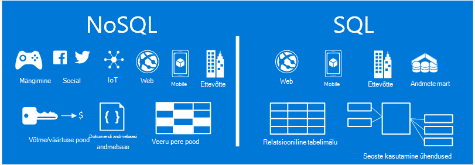
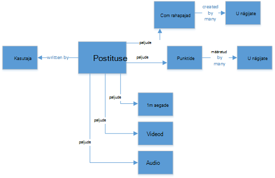
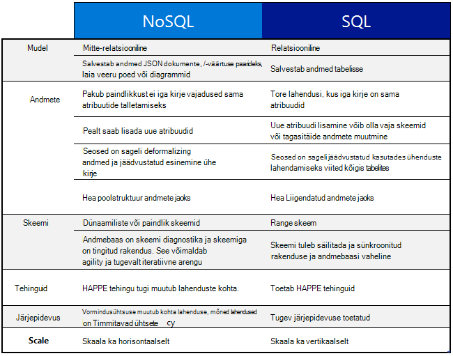
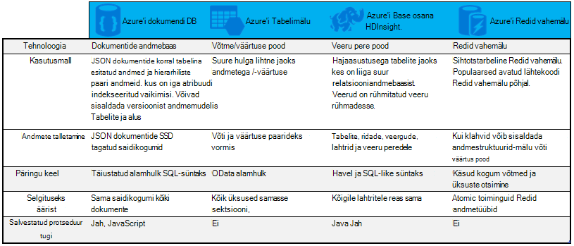

<properties
    pageTitle="Millal kasutada NoSQL vs SQL-i | Microsoft Azure'i"
    description="Võrrelge NoSQL-relatsiooniliste lahenduste ja SQL-i lahenduste kasutamise eelised. Siit saate teada, kas üks Microsoft Azure'i NoSQL teenuste või SQL serveri parima sobib teie stsenaariumi."
    keywords="nosql vs SQL-i, millal kasutada NoSQL SQL-i vs nosql"
    services="documentdb"
    documentationCenter=""
    authors="mimig1"
    manager="jhubbard"
    editor=""/>

<tags
    ms.service="documentdb"
    ms.workload="data-services"
    ms.tgt_pltfrm="na"
    ms.devlang="dotnet"
    ms.topic="article" 
    ms.date="06/24/2016"
    ms.author="mimig"/>

# NoSQL vs SQL-i

SQL serveri ja pilvepõhised andmebaasid (RDBMS) on üle 20 aasta Mine andmebaasid. Siiski on suurem vajadust protsessi suurema mahud ja sordi kiiresti andmeid muuta andmete salvestusruumi vajaduste rakenduste arendajatele laad. Selleks, et seda stsenaariumi, NoSQL andmebaasidele, mis lubamine ulatuse struktureerimata ja heterogeensete andmete talletamise on saanud populaarsemaks. 

NoSQL on kategooria andmebaaside selgelt erinevad SQL-i andmebaasid. NoSQL kasutatakse enamasti "Pole SQL" või andmete haldamiseks, mis sisaldab "mitte ainult SQL" lähenemine on andmete süsteemid viidata. On mitmeid tehnoloogiate NoSQL kategooria, sh dokumendi andmebaaside, väärtus poed, veerg pere poed ja Graphi andmebaasidele, mis on populaarsed mängimine, social, ja asjade rakendused.

Selles artiklis eesmärk on aitavad erinevused NoSQL ja SQL-i teave ja teile Microsofti pakkumisi NoSQL ja SQL-i tutvustus.  

## Millal kasutada NoSQL?

Oletagem, et olete hoone social engagement uus sait. Kasutajad saavad postitusi luua ja lisada pilte, videoid ja muusikat neid. Teised kasutajad saavad kommenteerida postituste ja hindamise postituste punkte (meeldib). Sihtleht on kanalisse postitusi, mida kasutajad saavad ühiskasutusse anda ja nendega suhelda. 

Aga kuidas andmete salvestamiseks? Kui olete tuttav SQL-i, võib-olla hakkate joonistamise umbes selline:

Nii palju hästi, kuid nüüd mõtlema struktuuri ühe postitus ja kuidas kuvada. Kui soovite kuvada postituse ja seotud pildid, heli, video, kommentaarid, punktide ja kasutajale teave veebisaidi või rakenduse, siis oleks teha päring koos kaheksa tabeli ühendused lihtsalt toomiseks sisu. Nüüd kujutage voo postitusi, mis dünaamiliselt laadimine ja kuvatakse ekraanil ja saate lihtsalt prognoosida, et läheb vaja tuhandete päringud ja palju ühendused soovitud toimingu sooritamiseks.

Nüüd saate kasutada relatsiooniline lahendust nagu SQL serveri andmed – salvestada, kuid teine võimalus NoSQL suvand, mis lihtsustab lähenemisviisi. Muutes postituse JSON dokumendiks, näiteks järgmist ja panete DocumentDB Azure NoSQL dokumendi andmebaasi teenuse jõudluse suurendamine ja tuua kogu post ühte päringut ja pole ühendused. See on lihtsam, veel lihtsad ja veel Kiire tulemus.

    {
        "id":"ew12-res2-234e-544f",
        "title":"post title",
        "date":"2016-01-01",
        "body":"this is an awesome post stored on NoSQL",
        "createdBy":User,
        "images":["http://myfirstimage.png","http://mysecondimage.png"],
        "videos":[
            {"url":"http://myfirstvideo.mp4", "title":"The first video"},
            {"url":"http://mysecondvideo.mp4", "title":"The second video"}
        ],
        "audios":[
            {"url":"http://myfirstaudio.mp3", "title":"The first audio"},
            {"url":"http://mysecondaudio.mp3", "title":"The second audio"}
        ]
    }

Lisaks saate andmed liigendatud postituse id andmed mastaapimiseks välja loomulikult ja NoSQL skaala omadused ära jäetud. Ka NoSQL võimaldavad lahti järjepidevuse ja pakkuda väga saadaolevate rakenduste arendajatele.  See lahendus ei nõua viimaks arendajate määratleda, hallata ja säilitada skeemi andmete astme, mis võimaldavad kiiresti iteratsiooni.

Seejärel saate luua see lahendus muude Azure'i teenuste kaudu:

- [Azure'i otsingu](https://azure.microsoft.com/services/search/) web appi kaudu saab kasutada lubada kasutajatel otsida postitusi.
- [Azure'i rakenduse teenuste](https://azure.microsoft.com/services/app-service/) saab majutada rakenduste ja protsesside tausta.
- [Azure'i bloobimälu](https://azure.microsoft.com/services/storage/) saab kasutada täielikku kasutajaprofiilide, sh piltide talletamiseks.
- [Azure'i SQL-andmebaasi](https://azure.microsoft.com/services/sql-database/) saab kasutada suurel hulgal andmeid nagu sisselogimise ja Kasutusanalüüsi andmete talletamiseks.
- [Azure'i masina õ](https://azure.microsoft.com/services/machine-learning/) saab koostada teadmised ja ärianalüüsi, mida saab tagasiside protsessi ja aitab tagada õige sisu õiguse kasutajatele.

See social engagement sait on vaid üks üks stsenaarium, mis NoSQL andmebaasi on õige andmemudelisse töö. Kui olete huvitatud lugemine rohkem teavet selle stsenaariumi ja andmete modelleerimise jaoks DocumentDB sotsiaalmeedia rakendused, vt [läheb social DocumentDB abil](documentdb-social-media-apps.md). 

## NoSQL vs SQL-i võrdlus

Järgmises tabelis võrreldakse NoSQL ja SQL-i Peamised erinevused. 

Kui NoSQL andmebaasi parima sobib teie vajadustele, jätkake järgmise jaotise Lisateavet NoSQL pakutavaid Azure. Muul juhul kui SQL-andmebaasi parim teie vajadustele, jätkake [mis on Microsoft SQL pakkumisi?](#what-are-the-microsoft-sql-offerings)

## Mis on Microsoft Azure'i NoSQL pakkumisi?

Azure'i on nelja-hallatavate NoSQL teenuse. 

- [Azure'i DocumentDB](https://azure.microsoft.com/services/documentdb/)
- [Azure'i Tabelimälu](https://azure.microsoft.com/services/storage/)
- [Azure Hdinsightiga osana HBase](https://azure.microsoft.com/services/hdinsight/)
- [Azure'i Redis vahemälu](https://azure.microsoft.com/services/cache/)

Järgmised võrdlustabel kaartide võtme differentiators iga teenuse jaoks välja. Millise neist kõige täpsemalt kirjeldatakse rakenduse vajadustele? 

Kui üks või mitu nende teenuste vajadustele võivad rakenduse, lugege lisateavet koos järgmistest allikatest: 

- [DocumentDB õppeteema](https://azure.microsoft.com/documentation/learning-paths/documentdb/) ja [DocumentDB kasutamine juhtudel](documentdb-use-cases.md)
- [Azure'i tabelimälu alustamine](../storage/storage-dotnet-how-to-use-tables.md)
- [Mis on rakenduses Hdinsightiga HBase](../hdinsight/hdinsight-hbase-overview.md)
- [Redis vahemälu õppeteema](https://azure.microsoft.com/documentation/learning-paths/redis-cache/)

Minge [järgmised sammud](#next-steps) tasuta prooviversiooni teavet.

## Mis on Microsoft SQL pakkumisi?

Microsoft on viis SQL-i pakkumisi. 

- [Azure'i SQL-andmebaas](https://azure.microsoft.com/services/sql-database/)
- [SQL Server Azure'i Virtuaalmasinates](https://azure.microsoft.com/services/virtual-machines/sql-server/)
- [SQL serveri](https://www.microsoft.com/server-cloud/products/sql-server-2016/)
- [SQL Azure'i andmebaas (eelvaade)](https://azure.microsoft.com/services/sql-data-warehouse/)
- [Kasutusanalüüsi platvormi süsteemi (kohapealse seade)](https://www.microsoft.com/en-us/server-cloud/products/analytics-platform-system/)

Kui olete huvitatud SQL serveri virtuaalse masina või SQL-andmebaasiga, siis lugege [Valige SQL Server suvand pilv: (PaaS) Azure SQL-i andmebaasi või SQL Server Azure'i VMs (IaaS)](../sql-database/sql-database-paas-vs-sql-server-iaas.md) Lisateavet nende kahe erinevused.

Kui SQL-i sarnane on parim valik, siis avage [SQL serveri](https://www.microsoft.com/server-cloud/products/) rohkem teada saada, mida Microsoft SQL tooteid ja teenuseid on pakkuda.

Minge [järgmised toimingud](#next-steps) tasuta prooviversioon ja hindamise lingid.

## Järgmised sammud

Kutsume lähemalt meie SQL-i ja NoSQL toodete lõikes proovite neid tasuta. 

- Kõigi Azure'i teenuste, saate registreeruda [tasuta prooviversioon ühe kuu](https://azure.microsoft.com/pricing/free-trial/) ja saate 200 $ kulutada Azure teenustega.
    - [Azure'i DocumentDB](https://azure.microsoft.com/services/documentdb/)
    - [Azure Hdinsightiga osana HBase](https://azure.microsoft.com/services/hdinsight/)
    - [Azure'i Redis vahemälu](https://azure.microsoft.com/services/cache/)
    - [SQL Azure'i andmebaas (eelvaade)](https://azure.microsoft.com/services/sql-data-warehouse/)
    - [Azure'i SQL-andmebaas](https://azure.microsoft.com/services/sql-database/)
    - [Azure'i Tabelimälu](https://azure.microsoft.com/services/storage/)

- Te saate ka [SQL Server 2016 virtual arvutisse prooviversioon](https://azure.microsoft.com/marketplace/partners/microsoft/sqlserver2016ctp33evaluationwindowsserver2012r2/) pöörata või alla laadida ka [SQL serveri prooviversioon](https://www.microsoft.com/en-us/evalcenter/evaluate-sql-server-2016).
    - [SQL serveri](https://www.microsoft.com/server-cloud/products/sql-server-2016/)
    - [SQL Server Azure'i Virtuaalmasinates](https://azure.microsoft.com/services/virtual-machines/sql-server/)

