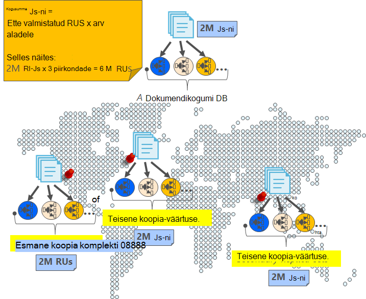
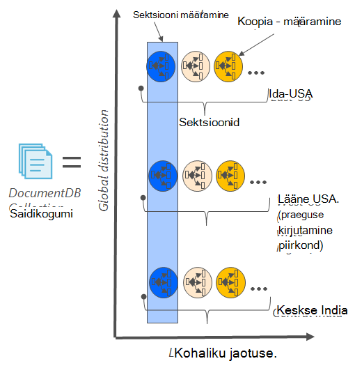
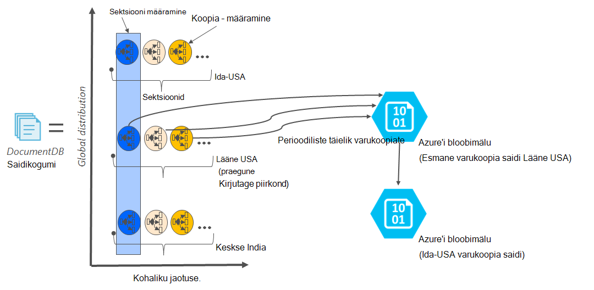

<properties
    pageTitle="Veebis varundus ja taaste koos DocumentDB | Microsoft Azure'i"
    description="Saate teada, kuidas teha automaatne varundus ja taaste NoSQL andmebaaside Azure'i DocumentDB abil."
    keywords="Varundus ja taaste online varundamine"
    services="documentdb"
    documentationCenter=""
    authors="RahulPrasad16"
    manager="jhubbard"
    editor="monicar"/>

<tags
    ms.service="documentdb"
    ms.workload="data-services"
    ms.tgt_pltfrm="na"
    ms.devlang="multiple"
    ms.topic="article"
    ms.date="09/23/2016"
    ms.author="raprasa"/>

# Automaatse online varundus ja taaste DocumentDB abil 

Azure'i DocumentDB võtab intervalliga automaatselt varukoopiaid kõik andmed. Automaatse varundamise funktsiooni võetakse mõjutamata jõudluse või kättesaadavus oma NoSQL andmebaasi toimingud. Varukoopiate salvestamiseks on salvestatud eraldi teise salvestusteenus ja nende varukoopiate ei globaalselt kopeeritud paindlikkust piirkondlike katastroofide suhtes. Automaatse varundamise funktsiooni on mõeldud stsenaariumid, kui kustutate kogemata oma saidikogumi DocumentDB ja uuemad versioonid nõuavad andmete taastamine või katastroofi taastamise lahendus.  

Selles artiklis algab kiire sulgege andmete koondamine ja-saadavus DocumentDB ja seejärel käsitletakse varukoopiad. 

## Kõrge kättesaadavuse DocumentDB - sulgege

DocumentDB on mõeldud [globaalselt jaotatud](documentdb-distribute-data-globally.md) – võimaldab mastaapimiseks läbilaskevõime üle mitme Azure'i piirkonnad koos Tõrkesiirde ja läbipaistvaid mitme sihitamise API-de poliitika. Andmebaasi süsteemi pakub [99,99%-saadavus SLAs](https://azure.microsoft.com/support/legal/sla/documentdb/v1_0/), on kõik kirjutab DocumentDB sisse enne tunnistades kliendile püsivalt pühendunud kohaliku ketast, on koopiad kohaliku andmekeskuse sees. Pange tähele, et kõrge kättesaadavus DocumentDB tugineb kohalikku ja ei sõltu tehnoloogiates välise salvestusruumi. Lisaks, kui teie andmebaasi konto on seotud mitu Azure piirkond, teie kirjutab on kopeeritud muude regiooniti. Mastaapimiseks läbilaskevõime ja Accessi andmete madal latentsused juures, saate lasta nagu paljud lugeda regioonid, kui soovite oma andmebaasi kontoga seotud. Iga loetuks piirkonnas (kopeeritud) andmed püsivalt püsis üle koopia kogum.  

Nagu on näidatud järgmisel joonisel, on ühe DocumentDB saidikogumi [horisontaalselt liigendatud](documentdb-partition-data.md). Ringi järgmisel diagrammil on tähistatud "Sektsiooni", iga sektsiooni kättesaadavaks ja tugevalt rea koopia. See on kohalik jaotuse ühtse Azure piirkonna (tähistatud X-telje). Lisaks iga sektsiooni (koos vastavate koopia seatud) seejärel globaalselt levitatakse (nt piirkondades selle joonisel kolm – Ida-USA, Lääne ja keskse) oma andmebaasi kontoga seotud mitu piirkondade lõikes. "Sektsiooni määramine" on kogu maailmas laiali üksus koosneb mitme eksemplari andmete iga piirkonna (tähistatud Y-telje). Priority (prioriteet) saate määrata oma andmebaasi kontoga seotud piirkondade ja DocumentDB on läbipaistev Tõrkesiirde järgmine redigeeritav ala katastroofi korral. Võite ka käsitsi Tõrkesiirde testimiseks rakenduse lõpuni saadavus simuleerida.  

Järgmisel pildil on näidatud koondamise koos DocumentDB kõrge.

## Täielik automaatne, online varukoopiate

Vabandust, kustutatud andmebaasi või saidikogumi! DocumentDB, kus teie andmeid, kuid varukoopiaid andmed on tehtud väga liigsete ja olles piirkondliku katastroofi. Praegu võetakse nende automaatse varundamise funktsiooni ligikaudu iga neli tundi. 

Varukoopiaid võetakse mõjutamata jõudluse või kättesaadavus oma andmebaasi toimingud. Tarbimine oma ettevalmistatud RUs või mõjutamata jõudlus ja andmebaasi NoSQL kättesaadavus mõjutamata võtab DocumentDB varukoopia taustal. 

Azure'i bloobimälu teenuse salvestatakse teie andmeid, mis on talletatud DocumentDB sees, erinevalt automaatse varundamise funktsiooni. Selleks, et tagada madal latentsus/tõhusa üles, on varukoopia hetktõmmist eksemplari Azure'i bloobimälu sama piirkonna kirjutamine praeguse ala konto DocumentDB andmebaasi üles laadida. Paindlikkust katastroofi suhtes, iga Azure'i bloobimälu varukoopia andmete hetktõmmist uuesti kopeeritud teise alale geograafilise liigne salvestusruumi (GRS) kaudu. Järgmine diagramm näitab, et kogu DocumentDB saidikogumi (koos kõigi kolme algset sektsiooni Lääne USA, selles näites) varundatakse serveri Azure'i bloobimälu konto Lääne USA ja seejärel GRS kopeeritud Ida-US. 

Järgmisel pildil on näidatud kõik DocumentDB üksused GRS Azure Storage perioodiliste täielik varukoopia.

## Säilitusperiood antud hetktõmmise

Eespool kirjeldatud võtame perioodiliselt hetktõmmiseid andmete ja meie määruste nõuetele vastavuse kohta, me säilitada uusima hetktõmmise üles 90 päeva enne lõpuks saab tuulutada. Kui kustutatakse ka saidikogumi või konto, talletab DocumentDB viimase varukoopia 90 päeva.

## Andmebaasi taastamine varukoopia veebis

Kui kustutate kogemata oma andmeid, saate [faili tugi Piletite](https://portal.azure.com/?#blade/Microsoft_Azure_Support/HelpAndSupportBlade) või [Azure toele helistamine](https://azure.microsoft.com/support/options/) andmete viimase automaatse varukoopia põhjal taastamine. DocumentDB nõuab teatud hetktõmmise varukoopia taastada andmed on vähemalt saadaval meie ajaks, et hetktõmmise varukoopia tsüklit.

## Järgmised sammud

Mitme andmekeskuste andmebaasi NoSQL korrata, lugege teemat [andmete globaalselt DocumentDB levitamine](documentdb-distribute-data-globally.md). 

Faili kontaktile Azure'i tugi, [fail on Piletite Azure portaalist](https://portal.azure.com/?#blade/Microsoft_Azure_Support/HelpAndSupportBlade).