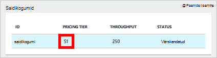
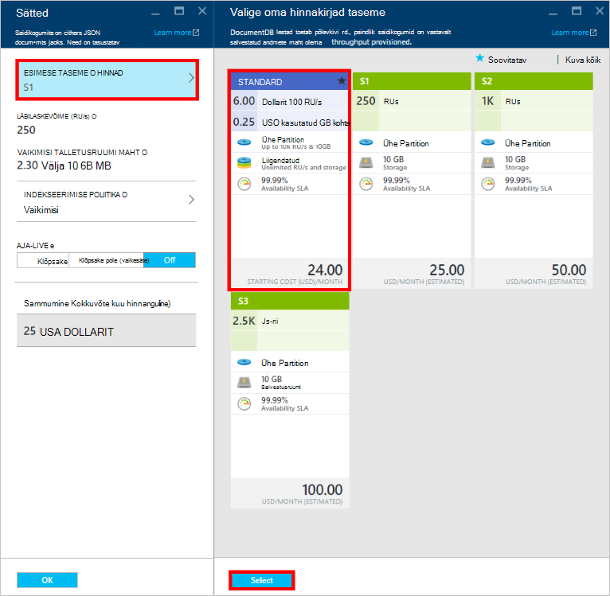
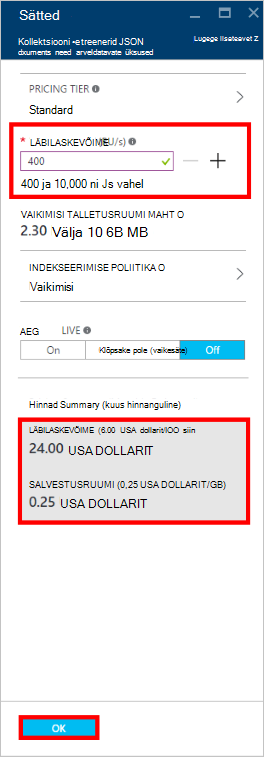
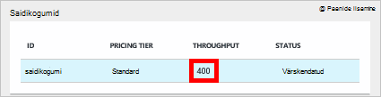

<properties
    pageTitle="Jõudluse tasemete DocumentDB | Microsoft Azure'i"
    description="Teavet, kuidas jõudlust tasemete DocumentDB võimaldavad reserveerida läbilaskevõime alusel saidikogumi kohta."
    services="documentdb"
    authors="mimig1"
    manager="jhubbard"
    editor="monicar"
    documentationCenter=""/>

<tags
    ms.service="documentdb"
    ms.workload="data-services"
    ms.tgt_pltfrm="na"
    ms.devlang="na"
    ms.topic="article"
    ms.date="08/26/2016"
    ms.author="mimig"/>

# Jõudluse tasemete DocumentDB

Selles artiklis antakse ülevaade [Microsoft Azure'i DocumentDB](https://azure.microsoft.com/services/documentdb/)jõudluse taset.

Pärast selle artikli lugemist on teil saama vastavad järgmistele küsimustele.  

-   Milleks on?
-   Kuidas läbilaskevõime reserveeritud andmebaasi konto?
-   Kuidas toimivad jõudluse tasemed?
-   Kuidas maksmine jõudluse tasemete?

## Jõudluse tasemed tutvustus

Iga DocumentDB saidikogumi loodud tavakasutajakonto on ette valmistatud ja on seotud jõudlusega. Iga saidikogumi andmebaasi võib olla erinevad jõudlusega, mis võimaldab teil määrata rohkem läbilaskevõime sageli külastatud saidikogumite ja läbilaskevõime harva juurde saidikogumid. DocumentDB toetab nii kasutaja määratletud jõudluse tasemed ja eelnevalt määratletud jõudluse tasemed.  

Iga taseme on seotud [taotluse üksus (RU)](documentdb-request-units.md) määr piirarvu. See on läbilaskevõime, mis on mõeldud kogumi alusel selle jõudluse taset, ja on ainult selle saidikogumi kasutamiseks saadaval.

<table border="0" cellspacing="0" cellpadding="0">
    <tbody>
        <tr>
            <td valign="top">

</td>
            <td valign="top">
Üksikasjad
</td>
            <td valign="top">
Läbilaskevõime piirangud
</td>
            <td valign="top">
Salvestuslimiidid
</td>
            <td valign="top">
Versioon
</td>
            <td valign="top">
API-d
</td>            
        </tr>
        <tr>
            <td valign="top">
Kasutaja määratletud jõudlus
</td>
            <td valign="top">
Salvestusruumi Mahupõhised põhjal kasutus GB.

Läbilaskevõime mõõtühikutes 100 RU/s
</td>
            <td valign="top">
Piiramatu. 400 – 250 000 taotlemine üksuste/s vaikimisi (taotluse kõrgem)
</td>
            <td valign="top">
Piiramatu. 250 GB (taotluse kõrgem) vaikimisi 
</td>
            <td valign="top">
V2
</td>
            <td valign="top">
API 2015-12-16 ja uuem
</td>  
        </tr>
        <tr>
            <td valign="top">
Eelmääratletud jõudlus
</td>
            <td valign="top">
Reserveeritud 10 GB salvestusruumi.

S1 = 250 RU/s, S2 = 1000 RU/s, S3 = 2500 RU/s
</td>
            <td valign="top">
2500 RU/s
</td>
            <td valign="top">
10 GB
</td>
            <td valign="top">
V1
</td>
            <td valign="top">
Mis tahes
</td>  
        </tr>        
    </tbody>
</table>                

DocumentDB võimaldab suurel hulgal erinevaid andmebaasi toimingud, sh päringud, päringuid kasutaja määratletud funktsioonid (UDF), Salvestatud toimingute ja käivitab. Neid toiminguid iga seotud töötlemine maksumus sõltub CPU, IO ja mälu toimingu lõpuleviimiseks nõutav. Selle asemel mõelda ja haldamise ressursid, võib ühe mõõdu ressursside taotluse üksuse võrrelda nõutav andmebaasi erinevaid toiminguid ja rakenduse päringu.

[Microsoft Azure'i portaalis](https://portal.azure.com), [REST API -ga](https://msdn.microsoft.com/library/azure/mt489078.aspx) või mis tahes [DocumentDB SDK-d](https://msdn.microsoft.com/library/azure/dn781482.aspx)saab luua saidikogumid. DocumentDB API abil saate määrata kogumi jõudluse tase.

> [AZURE.NOTE] Jõudluse tase kogumi saab kohandada selle API-d või [Microsoft Azure portaali](https://portal.azure.com/)kaudu. Jõudluse saiditasemel muudatusi oodatakse 3 minuti jooksul lõpule.

## Tulemuslikkuse tasemeid saidikogumid seadmine
Kui kogumi on loodud, RUs alusel määratud jõudlusega täielik jaotamine on mõeldud kogumist.

Pange tähele, et nii kasutaja määratletud ja eelmääratletud jõudluse taset, toimib DocumentDB läbilaskevõime reserveerimise alusel. Kogumi loomisega rakendus on reserveeritud ja on arve reserveeritud läbilaskevõime olenemata sellest, kui palju see läbilaskevõime aktiivselt kasutatakse. Kasutaja määratletud jõudluse taset, salvestusruumi on Mahupõhised tarbimine põhjal, kuid eelmääratletud jõudluse taset, on 10 GB salvestusruumi reserveeritud saidikogumi loomise ajal.  

Saidikogumite on loodud, saate muuta jõudlusega DocumentDB SDK-d või Azure klassikaline portaali kaudu.

> [AZURE.IMPORTANT] DocumentDB Standard saidikogumid on arve veebisaidil tunni ja iga saidikogumi loomist arve vähemalt üks tund kasutamine.

Kui kohandate jõudlusega kogumi ühe tunni jooksul, kuvatakse teile arveid seadmine tunni jooksul jõudluse kõrgeima taseme. Näiteks kui tõstate oma jõudlusega kell 8:53 kogumi jaoks teil tuleb tasuda uue taseme alates 8:00 am. Samuti kui teie jõudlusega kell 8:53 vähendamiseks rakendatakse uut Määra kell 9:00.

Koosolekukutse üksused on mõeldud iga saidikogumi alusel määratud jõudlust. Taotluse ühiku tarbimine hinnatakse mõne teise määr kohta. Rakendusi, mis ületavad ettevalmistatud taotlus määra (või jõudlusega) kogumi kohta on rakendus, kuni määr langeb reserveeritud tasemest selle saidikogumi jaoks. Kui teie rakendus nõuab kõrgema taseme läbilaskevõime, saate suurendada jõudlusega iga saidikogumi jaoks.

> [AZURE.NOTE] Kui rakenduse jõudluse tasemed ühe või mitme saidikogumid, kuvatakse taotlusi rakendus eraldi saidikogumi kohta. See tähendab, et mõned rakenduse taotlused võib õnnestub, samal ajal, kui teised võivad rakendus. Soovitatav on väheste korduskatsed, kui rakendus, et hallata taotluse liikluse diagrammi lisada.

## Jõudluse tasemed töötamine
DocumentDB saidikogumid abil saate rühmitada andmed päringu mustrite ja rakenduse jõudluse vajadustele. DocumentDB's automaatse indekseerimise ja päringu tugi, on üsna tavaline kollokeerida heterogeensete dokumentide sama kogumis. Peamised kaalutlused otsustada, kas eraldi saidikogumid tuleks kasutada järgmised.

- Päringute – kogumi on päringu täitmise ulatust. Kui teil on vaja üle dokumentide komplekte päringu kõige tõhusam Loe mustrid pärit kollokeerivatel dokumentide ühe saidikogumi.
- Ühe saidikogumi sees on rakendatud tehinguid – kõik tehingud. Kui teil on dokumente, mis tuleb värskendada ühe salvestatud toimingu või päästik, peavad olema talletatud sama kogumis; Täpsemalt sektsiooni võtme kogumi sees on tehingu äärist. Üksikasjalikumat teavet leiate [Eraldatav DocumentDB sisse](documentdb-partition-data.md) .
- Jõudluse eraldamise – kogumi on seotud jõudlusega. See tagab, et iga saidikogumi on prognoositavad jõudluse reserveeritud RUs kaudu. Andmeid saab eraldada erinevate saidikogumid, erinevate tulemuslikkuse tasemeid, Accessi sageduse alusel.

> [AZURE.IMPORTANT] See on oluline mõista teile saadetakse teile arve alusel loodud rakenduse saidikogumite arvu täielik standard määrade.

Soovitatav on, et teie taotlus muudab kasutus väheste saidikogumid juhul, kui teil on suur salvestusruumi või läbilaskevõime nõuete. Veenduge, et teil on ka aru rakenduse mustrid uue Saidikogumite loomine. Võite reserveerida halduse toimingu, välised rakenduse saidikogumi loomine. Samuti päisena jõudluse kohandamiseks muuta kord tunnis määr, kus on selle saidikogumi arve. Kui rakenduse reguleerib need dünaamiliselt, jälgima saidikogumi jõudluse tasemed.

## Kasutaja määratletud jõudluse S1, S2, S3 muutmine

Järgmiste juhiste abil kasutada eelmääratletud läbilaskevõime tasemed Azure portaali kasutaja määratletud läbilaskevõime tasemete muutmine. Kasutaja määratletud läbilaskevõime tasemed abil saab teie läbilaskevõime vastavalt oma vajadustele. Ja kui kasutate endiselt S1 konto, saate suurendada oma vaikimisi läbilaskevõime 250 RU/s 400 RU s vaid mõne hiireklõpsuga.

Lisateavet hinnakirjad muudatused seotud kasutaja määratletud ja eelmääratletud läbilaskevõime leiate ajaveebipostitusest [DocumentDB: kõik, mida on vaja teada hinnakirjad uusi võimalusi](https://azure.microsoft.com/blog/documentdb-use-the-new-pricing-options-on-your-existing-collections/).

> [AZURE.VIDEO changedocumentdbcollectionperformance]

1. Liikuge brauseris [**Azure portaali**](https://portal.azure.com).
2. Klõpsake nuppu **Sirvi** -> **DocumentDB kontod**ja seejärel valige DocumentDB konto, mida soovite muuta.   
3. **Andmebaaside** Lens, andmebaasi muutmiseks valige ja **andmebaasi** tera, valige saidikogumi muutmiseks. Kontode eelmääratletud läbilaskevõime on hinnakirjad taseme S1, S2 või S3.

      

4. Labale **saidikogumid** nuppu **rohkem**, seejärel ülaribal **sätted** .   
5. Tera **sätted** , klõpsake **Taseme hinnad** ja pange tähele, et **valida oma hinnakirjad taseme** tera kuvatakse kuu hinnanguline maksumus iga plaani. Kasutaja määratletud läbilaskevõime muuta, klõpsake käsku **Standardne**ja klõpsake muudatuse salvestamiseks **Valige** .

      

6. Tagasi **sätted** labale **Taseme hinnad** on muutunud **Standard** ja **läbilaskevõime (RU/s)** väljal kuvatakse koos 400 vaikeväärtus. Määrake läbilaskevõime 400 kuni 10 000 [taotlemine üksuste](documentdb-request-units.md)vahel /second (RU/s). **Hinnad Kokkuvõte** lehe allosas värskendatakse automaatselt esitada kuu kulude prognoos. Klõpsake muudatuste salvestamiseks nuppu **OK** .

    

7. Uuesti sisse **andmebaasi** tera, saate kontrollida uue läbilaskevõime kogumi.

    

Kui olete kindlaks teinud, et teil on vaja rohkem jõudlus (suurem kui 10 000 RU/s) või täiendava salvestusruumi (suurem kui 10GB) saate luua sektsioonitud saidikogumi. Sektsioonitud saidikogumi loomiseks vaadake teemat [kogumi loomine](documentdb-create-collection.md).

>[AZURE.NOTE] Jõudluse tasemeid kogumi muutmine võib kuluda kuni kaks minutit.

## Kasutades .NET SDK jõudluse tasemete muutmine

Teine võimalus oma saidikogumid jõudluse tasemete muutmine on meie SDK-d kaudu. Selles jaotises hõlmab ainult mõne saidikogumi taseme meie [.NET SDK](https://msdn.microsoft.com/library/azure/dn948556.aspx)abil muuta, kuid protsess on sarnane meie muude [SDK-d](https://msdn.microsoft.com/library/azure/dn781482.aspx). Kui teil on meie .NET SDK uus, külastage meie [alustamise õpetus](documentdb-get-started.md).

Siin on koodilõik muutmise pakkumine läbilaskevõime 50 000 taotluse ühiku sekundis.

    //Fetch the resource to be updated
    Offer offer = client.CreateOfferQuery()
                      .Where(r => r.ResourceLink == collection.SelfLink)    
                      .AsEnumerable()
                      .SingleOrDefault();

    // Set the throughput to 5000 request units per second
    offer = new OfferV2(offer, 5000);

    //Now persist these changes to the database by replacing the original resource
    await client.ReplaceOfferAsync(offer);

    // Set the throughput to S2
    offer = new Offer(offer);
    offer.OfferType = "S2";

    //Now persist these changes to the database by replacing the original resource
    await client.ReplaceOfferAsync(offer);

> [AZURE.NOTE] Saidikogumite ette valmistatud koos taotluse alla 10 000 ühiku teise migreeritud pakutakse kasutaja määratletud läbilaskevõime ja igal ajal eelmääratletud läbilaskevõime (S1, S2, S3) vahel. Teine saidikogumid, mis on ette valmistatud koos üle 10 000 taotluse ühikut ei saa teisendada eelmääratletud läbilaskevõime tasemed.

Külastage [MSDN-i](https://msdn.microsoft.com/library/azure/microsoft.azure.documents.client.documentclient.aspx) vaadata täiendavaid näited ja lisateavet meie pakkumise meetodid:

- [**ReadOfferAsync**](https://msdn.microsoft.com/library/azure/microsoft.azure.documents.client.documentclient.readofferasync.aspx)
- [**ReadOffersFeedAsync**](https://msdn.microsoft.com/library/azure/microsoft.azure.documents.client.documentclient.readoffersfeedasync.aspx)
- [**ReplaceOfferAsync**](https://msdn.microsoft.com/library/azure/microsoft.azure.documents.client.documentclient.replaceofferasync.aspx)
- [**CreateOfferQuery**](https://msdn.microsoft.com/library/azure/microsoft.azure.documents.linq.documentqueryable.createofferquery.aspx)

## Läbilaskevõime kogumi muutmine

Kui kasutate juba kasutaja määratletud jõudluse, saate muuta oma saidikogumi läbilaskevõime, tehes järgmist. Kui teil on vaja muuta kasutaja määratletud jõudluse S1, S2 või S3 jõudluse tase (eelmääratletud jõudluse), lugege [S1, S2, S3 kasutaja määratletud jõudluse muutmine](#changing-performance-levels-using-the-azure-portal).

1. Liikuge brauseris [**Azure portaali**](https://portal.azure.com).
2. Klõpsake nuppu **Sirvi** -> **DocumentDB kontod**ja seejärel valige DocumentDB konto, mida soovite muuta.   
3. Enne **DocumentDB konto** , on **andmebaaside** lens, andmebaasi muutmiseks valige ja **andmebaasi** tera, valige saidikogumi muutmiseks.
4. Klõpsake **saidikogumite** labale ülariba **sätted** .   
5. Labale **sätted** väärtust väljal **läbilaskevõime (RU/s)** ja klõpsake muudatuste salvestamiseks nuppu **OK** . **Hinnad Kokkuvõte** allosas blade Värskenduste kuvamiseks saate uue kuu selle saidikogumi prognoositud kulud ühe piirkonna.

    

Kui te pole kindel, et palju oma läbilaskevõime suurendamiseks, vt [Estimating läbilaskevõime peab](documentdb-request-units.md#estimating-throughput-needs) ja [Ühiku kalkulaator taotleda](https://www.documentdb.com/capacityplanner).

## Järgmised sammud

Hinnad ja Azure DocumentDB andmete haldamise kohta leiate lisateavet saate nende ressursside:

- [DocumentDB hinnad](https://azure.microsoft.com/pricing/details/documentdb/)
- [DocumentDB võimsus haldamine](documentdb-manage.md)
- [Andmete modelleerimine DocumentDB](documentdb-modeling-data.md)
- [Andmete DocumentDB eraldamine](documentdb-partition-data.md)
- [Taotluse ühikud](http://go.microsoft.com/fwlink/?LinkId=735027)

Lisateavet DocumentDB leiate Azure'i DocumentDB [dokumentatsiooni](https://azure.microsoft.com/documentation/services/documentdb/).

Alustada skaala ja jõudluse testimine DocumentDB teemast [jõudlus ja katsetada Azure'i DocumentDB abil](documentdb-performance-testing.md).

[1]: ./media/documentdb-performance-levels/documentdb-change-collection-performance7-9.png
[2]: ./media/documentdb-performance-levels/documentdb-change-collection-performance10-11.png
