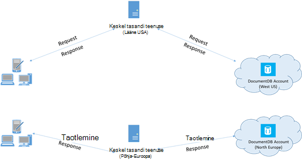

<properties 
    pageTitle="DocumentDB nõuanded | Microsoft Azure'i" 
    description="Siit saate teada, kliendi konfiguratsiooni suvandid Azure'i DocumentDB andmebaasi jõudluse parandamiseks"
    keywords="Kuidas andmebaasi jõudluse parandamiseks"
    services="documentdb" 
    authors="mimig1" 
    manager="jhubbard" 
    editor="" 
    documentationCenter=""/>

<tags 
    ms.service="documentdb" 
    ms.workload="data-services" 
    ms.tgt_pltfrm="na" 
    ms.devlang="na" 
    ms.topic="article" 
    ms.date="10/17/2016" 
    ms.author="mimig"/>

# Jõudluse DocumentDB näpunäited

Azure'i DocumentDB on kiire ja paindlik jaotatud andmebaasi skaala sujuvalt tagatud latentsus ja läbilaskevõime. Teil pole põhi arhitektuur muudatuste tegemiseks või mastaapimiseks DocumentDB andmebaasi keerukate koodi kirjutamine. Skaleerimist üles on sama lihtne kui ühe API kõne või [SDK meetod kõne](documentdb-performance-levels.md#changing-performance-levels-using-the-net-sdk)tegemine. Kuna võrgu kaudu on kasutatud DocumentDB on kliendipoolne Optimeerimised saate tippväärtus jõudluse saavutamiseks.

Nii, et kui te küsida "kuidas parandada oma andmebaasi jõudlust?" Võtke arvesse järgmisi valikuid.

## Võrgunduse

1. **Ühenduse poliitika: otse režiimi kasutamine**
    
    Kuidas klient ühendub Azure'i DocumentDB mõjutab oluliselt jõudluse, eriti seoses täheldatud kliendipoolne latentsus. Kahe võtme konfiguratsioonisätted on saadaval konfigureerimise kliendi ühenduse poliitika – ühendusega *režiimi* ja [ühendusega *Protocol (protokoll)*](#connection-protocol).  On kaks viise.

    1. Lüüsi režiim (vaikimisi)
    2. Otsest režiim

    Kuna DocumentDB on jaotatud salvestusruumi süsteem, näiteks saidikogumid on liigendatud paljude arvutites ja iga sektsiooni on kopeeritud jaoks kõrge-saadavus DocumentDB ressursid. Marsruutimise tabeli, mis on ressursi ettevõttesiseselt saadaval ka hoitakse loogiline füüsiline aadress tõlge.

    Lüüsi režiimis, DocumentDB lüüsi masinad teha seda marsruutimine, võimaldades kliendi kood olema lihtne ja tihendatud. Kliendi rakendus annab taotlusi DocumentDB lüüsi masinad, mis tõlkimine loogilise URI taotluse füüsiline aadress kirjutamata sõlm ja kutse edasi õigesti.  Seevastu otsese režiimis kliendid peavad haldamine – ja perioodiliselt värskendada – see marsruutimise tabel koopia ja seejärel otse ühendada kirjutamata DocumentDB sõlmed.

    Lüüsi režiim on toetatud kõik SDK platvormide ja on konfigureeritud vaikimisi.  Kui teie rakendus töötab ettevõtte võrgustikus range tulemüüri piirangutega, lüüsi režiim on parim valik, kuna see kasutab standard HTTPS pordi ja ühe lõpp-punkti. Jõudluse Miinuseks, on siiski, et lüüsi režiimi hõlmab ka lisavõimalusi sõnumihüppe kohta, pärast iga kord, kui andmed on lugeda või kirjutada DocumentDB.   Seetõttu otsese režiimis pakub parema jõudluse tõttu vähem võrgu humalat.

2. **Ühenduse poliitika: TCP-protokolli kasutamine**

    Kui kasutamine otsese režiimis, on kaks võimalust protokoll saadaval:

    - TCP
    - HTTPS

    DocumentDB pakub lihtne ja avage rahulik programmeerimise mudeli https. Lisaks sellele pakub tõhusa TCP-protokolli, mis on ka RESTful oma side mudel ja .net-i kliendi SDK kaudu. Otsest TCP ja HTTPS kasutada algset autentimise ja krüptimise liikluse SSL-i. Parima jõudluse tagamiseks kasutada TCP-protokolli, kui võimalik. 

    Lüüsi režiimis TCP kasutamisel TCP pordi 443 on DocumentDB port ja 10250 on MongoDB API pordi. Kasutades TCP otsese režiimis, lisaks lüüsi pordid, peate pordi tagamiseks vahemikus 10000 ja 20000 on avatud, kuna DocumentDB kasutab dünaamilise TCP-pordid. Kui need pordid ei ole avatud ja proovite kasutada TCP, saate tõrke 503 teenus pole saadaval. 

    Ühenduvus režiim on konfigureeritud DocumentClient astme ConnectionPolicy parameetriga ehituse ajal. Kui kasutatakse otsest režiimi, protokoll saab määrata ka ConnectionPolicy parameetri sees.

        var serviceEndpoint = new Uri("https://contoso.documents.net");
        var authKey = new "your authKey from Azure Mngt Portal";
        DocumentClient client = new DocumentClient(serviceEndpoint, authKey, 
        new ConnectionPolicy
        {
            ConnectionMode = ConnectionMode.Direct,
            ConnectionProtocol = Protocol.Tcp
        });

    Kuna TCP toetatakse ainult otsese režiimis, kui kasutatakse lüüsi režiimi, lüüsi suhelda kasutatakse alati HTTPS-protokolli ja Protocol (protokoll) väärtus on ConnectionPolicy ignoreeritakse.

    

3. **Kõne OpenAsync vältimiseks käivitus latentsus esimese taotluse**

    Vaikimisi esimese kutse on suurem latentsus, kuna see on toomiseks aadress marsruutimise tabeli. Selle käivitamisel latentsuse esimese taotluse vältimiseks peaksite helistama OpenAsync() üks kord lähtestamisel järgmiselt.

        await client.OpenAsync();

4. **Kollokeerida sama Azure piirkonna jõudluse kliendid**

    Kui võimalik, viige kõik rakendused, helistades DocumentDB piirkonna DocumentDB andmebaas nimega. Ligikaudse võrdlemiseks, täitke DocumentDB kõned samas piirkonnas 1-2 ms jooksul, kuid vahel Lääne ja USA idaranniku latentsus on > 50 ms. See latentsus tõenäoliselt kaudu päringut sõltub protsessi võetud taotlus, kui ta läheb kliendi Azure'i andmekeskuse äärist. Väikseim võimalik latentsus on saavutada tagada helistaja rakendus asub samas Azure piirkonnas ettevalmistatud DocumentDB lõpp-punkti. Saadaval piirkondade loendi leiate teemast [Azure regioonid](https://azure.microsoft.com/regions/#services).

    

5. **Teemad/tööülesannete arvu suurendamine**

    Kuna võrgu kaudu kõned DocumentDB, peate oma taotlused paralleelsus astet muuta nii, et klientrakenduse veedab väga vähe aega ootel taotluste vahel. Näiteks kui kasutate. NET [Tööülesande paralleelselt teeki](https://msdn.microsoft.com//library/dd460717.aspx), järjekorras 100s lugemise ja kirjutamise DocumentDB tööülesannete loomine.

## SDK kasutus

1. **Viimati tehtud SDK installimine**

    DocumentDB SDK-d pidevalt on paranenud anda parimaid tulemusi. Lugege teemat [DocumentDB SDK](documentdb-sdk-dotnet.md) lehtede määratleda viimase SDK ja uurimiseks täiustused. 

2. **Rakenduse eluiga singleton DocumentDB klientrakenduse kasutamiseks**
  
    Tähele, et iga DocumentClient eksemplar on jutulõnga ohutu ja sooritab tõhusa ühenduse haldus ja aadress vahemällu talletamise, kui otsese režiimis. Luba tõhusa ühenduse haldus ja parema jõudluse DocumentClient järgi, on soovitatav kasutada rakenduse eluiga ühekordsest DocumentClient atribuudile kohta.

3. **Suurendamine System.Net MaxConnections hosti kohta**

    DocumentDB taotlused tehakse vaikimisi HTTPS/ülejäänud ja tehakse vaikimisi ühenduse limiidist hostinimi või IP-aadress. Võimalik, et peate selle MaxConnections määramine, et kliendi teek saab kasutada mitut üheaegselt ühenduste DocumentDB suurem väärtus (100-1000). .NET SDK 1.8.0 ja kohal [ServicePointManager.DefaultConnectionLimit](https://msdn.microsoft.com/library/system.net.servicepointmanager.defaultconnectionlimit.aspx) vaikeväärtus on 50 ja väärtuse muutmiseks saate seada [Documents.Client.ConnectionPolicy.MaxConnectionLimit](https://msdn.microsoft.com/en-us/library/azure/microsoft.azure.documents.client.connectionpolicy.maxconnectionlimit.aspx) suurem väärtus.  

4. **Paralleelselt päringuid sektsioonitud saidikogumid häälestamine**

     DocumentDB .NET SDK versioon 1.9.0 ja tugiteenuste paralleelselt päringud, mis võimaldavad päringu sektsioonitud saidikogumi paralleelselt kohal ( [töötamine on SDK-d](documentdb-partition-data.md#working-with-the-sdks) ja seotud [koodinäiteid](https://github.com/Azure/azure-documentdb-dotnet/blob/master/samples/code-samples/Queries/Program.cs) kohta lisateabe saamiseks vt). Paralleelselt päringuid on mõeldud suurendada päringulatentsus ja läbilaskevõime üle nende järjestikune vaste. Paralleelselt päringuid anda kaks parameetrid, mida kasutajad saate häälestada kohandatud-Sobita nende nõuete (a) MaxDegreeOfParallelism: sektsioonid maksimumarv kontrollida, kui saate teha päringuid samal ajal ja (b) MaxBufferedItemCount: määrata eelnevalt tõmmatud tulemite arv. 
    
    (a) ***Tuning MaxDegreeOfParallelism\: *** 
    paralleelselt päring töötab mitu sektsiooni paralleelselt päringute abil. Siiski kuvatakse üksikute sektsioonitud koguda andmeid ei tõmmatud seeriatoodanguna päringu suhtes. Säte on MaxDegreeOfParallelism sektsioonid arv on maksimaalne võimalus saavutada enamik kiire päringu, esitanud kõik süsteemi tingimused jäävad samaks. Kui te ei tea sektsioonid arvu, saate selle MaxDegreeOfParallelism suurt hulka ja süsteemi valida miinimum (sektsioonid esitatud kasutaja sisendist arv) ning MaxDegreeOfParallelism nimega. 
    
    See on oluline märkida paralleelselt päringuid aedvili parim kasu, kui andmed on ühtlaselt üle kõik partitsioonid päringu suhtes. Kui sektsioonitud saidikogumi on liigendatud nii, et kõik või päringu tagastatud andmed on koondatud mõned sektsioonid (üks sektsioon halvima), siis päringu täitmise oleks asuvad, partitsioonid. 
    
    (b) ***Tuning MaxBufferedItemCount\: *** 
    paralleelse päringu on mõeldud eelnevalt toomiseks tulemuste praeguse paketi tulemuste kliendi poolt töötlemise ajal. Eelnevalt tõmbamine aitab üldise latentsuse täiustamise päringu. MaxBufferedItemCount on parameetri ette tõmmatud tulemuste arv piirata. MaxBufferedItemCount oodatud tulemite arv (või rohkem) lubab päringu eelnevalt tõmbamine maksimaalset kasu saada. 
    
    Pange tähele, et eelnevalt tõmbamine töötab samal viisil sõltumata on MaxDegreeOfParallelism on ühe puhvri kõik partitsioonid andmete jaoks.  

5. **Serveripoolne GC sisselülitamine**
    
    Mõnel juhul võib aidata Prügikoristus sagedust vähendada. .Net-i, on seatud väärtusele tõene [gcServer](https://msdn.microsoft.com/library/ms229357.aspx) .

6. **Rakendada backoff RetryAfter intervalliga**
 
    Jõudluse testimisel tuleks suurendada laadi kuni väike intressimäära taotluste saada rakendus. Kui rakendus, peaks klientrakenduse backoff ahendamise klõpsake uuesti serveri määratud intervalli. Selle backoff järgides tagab, et te veedavad aega oodanud korduste vahel minimaalne summa. Proovi uuesti poliitika tugi on kaasatud versioon 1.8.0 ja üle DocumentDB [.NET](documentdb-sdk-dotnet.md) ja [Java](documentdb-sdk-java.md)ja versiooni 1.9.0 ja üle [Node.js](documentdb-sdk-node.md) ja [Python](documentdb-sdk-python.md). Lisateavet leiate teemast [ületab reserveeritud läbilaskevõime piirangute](documentdb-request-units.md#exceeding-reserved-throughput-limits) ning [RetryAfter](https://msdn.microsoft.com/library/microsoft.azure.documents.documentclientexception.retryafter.aspx).

7. **Oma kliendi-töökoormus välja skaala**

    Kui teil on testimist kõrge läbilaskevõime tase (> 50 000 RU/s), klientrakenduse võib muutuda kitsaskoht tõttu seadme piiristamine välja CPU või võrgu kasutamise kohta. Kui jõuate seda punkti, saate jätkata push DocumentDB konto täpsemaks skaala oma klientrakendustes läbi mitme serverites.

8. **Lower loetuks latentsus vahemälu dokumendile URI-d**

    Vahemälu dokumendi URI-d võimaluse loetuks parimaid tulemusi.

9. **Lehe suuruse jaoks päringute/lugeda kanalite parema jõudluse häälestamine**

    Kui läbimiseks on hulgi lugeda lugege teemat dokumentide kanali funktsioone (nt ReadDocumentFeedAsync) või DocumentDB SQL-päring väljaandmisel tulemused tagastatakse segmenditud mood kui tulem on liiga suur. Vaikimisi tulemit osa 100 üksuste või 1 MB, kumb on esimene tulemus. 

    Arvu vähendamiseks võrgu ümardada reisi kõik rakendatav tulemeid tuua nõutav, saate suurendada kuni 1000 x-ms-max-kirje-arv taotluse päise abil lehe soovitud suurus. Juhul, kui soovite kuvada ainult mõne tulemid, nt, kui kasutaja kasutajaliidese või rakenduse API tagastab ainult 10, on tulemuseks kellaaja, saate vähendada ka 10 vähendada läbilaskevõime, loeb ja päringute tarbitud lehe suuruse.

    Lisaks saate määrata saadaval DocumentDB SDK-d abil lehe soovitud suurus.  Näiteks:
    
        IQueryable<dynamic> authorResults = client.CreateDocumentQuery(documentCollection.SelfLink, "SELECT p.Author FROM Pages p WHERE p.Title = 'About Seattle'", new FeedOptions { MaxItemCount = 1000 });

10. **Teemad/tööülesannete arvu suurendamine**

    Vt võrgunduse jaotise [Teemad/tööülesannete arvu suurendamine](#increase-threads) .

## Indekseerimise poliitika

1. **Kasutage kiirem tippväärtus aeg manustamisest määra rongile indekseerimine**

    DocumentDB võimaldab teil määrata – saidikogumi tasemel – indekseerimise poliitika, mis võimaldab teil valida, kas soovite dokumentide kogumi automaatselt indekseeritud või mitte.  Lisaks võite ka sünkroonse (järjekindel) ja asünkroonne (Lazy) index värskendused. Vaikimisi värskendatakse registri sünkroonselt iga lisa, Asenda või Kustuta dokumendi kogumi. Sünkroonselt režiim võimaldab päringute au samal [järjepidevuse tase](documentdb-consistency-levels.md) nagu dokumendi sisu ilma viivituseta indeks jõuda "".
    
    Rongile indekseerimine võib kaaluda stsenaariumid, kus andmed on kirjutatud puruneb ja soovite katta tööd, et registri sisu pikema aja jooksul. Rongile indekseerimine võimaldab teil kasutada oma ettevalmistatud läbilaskevõime tõhus ja teenida kirjutamiseks taotlused tippväärtus ajal minimaalne latentsus. See on oluline Pange tähele, et kui rongile indekseerimine on lubatud, saab päringutulemite lõpuks ühtsete sõltumata järjepidevuse taseme DocumentDB konto on konfigureeritud.

    Seega ühtsete indekseerimise režiimi (IndexingPolicy.IndexingMode on seatud järjekindel) andmesidekasutusele kirjutamise ajal Lazy indekseerimine režiimi (IndexingPolicy.IndexingMode on seatud Lazy) ja pole indekseerimine kõrgeim taotluse ühiku eest (IndexingPolicy.Automatic väärtuseks False) on null indekseerimise maksumus kirjutamise ajal.

2. **Kiirem kirjutab indekseerimine kasutamata teed välistamine**

    DocumentDB's indekseerimise ka lubab teil määrata teed, kus dokumendi kaasamiseks või välistamiseks indekseerimise tehtavate indekseerimine teed (IndexingPolicy.IncludedPaths ja IndexingPolicy.ExcludedPaths). Indekseerimise teed kasutamine pakkuda kirjutamine täiustatud jõudlus ja alumise index salvestusruumi stsenaariumid päringu mustrite teadaolevalt, nagu indekseerimise kulud on seotud otse kordumatu teed indekseeritud arv.  Näiteks järgmine kood kuvatakse kogu jaotisele dokumentide (alias välistamine alampuud) indekseerimise kasutada funktsiooni "*" metamärkide.

        var collection = new DocumentCollection { Id = "excludedPathCollection" };
        collection.IndexingPolicy.IncludedPaths.Add(new IncludedPath { Path = "/*" });
        collection.IndexingPolicy.ExcludedPaths.Add(new ExcludedPath { Path = "/nonIndexedContent/*");
        collection = await client.CreateDocumentCollectionAsync(UriFactory.CreateDatabaseUri("db"), excluded);

    Lisateavet leiate teemast [DocumentDB indekseerimise poliitikate](documentdb-indexing-policies.md).

## Läbilaskevõime

1. **Mõõtke ja viimistleda alumise taotlus üksuste sekundis kasutus**

    DocumentDB pakub suurel hulgal erinevaid andmebaasi toimingud, sh relatsiooniline ja hierarhiliste päringute UDF-ID, Salvestatud toimingute ja käivitab – kõik tegeva dokumentidega andmebaasi saidikogumi sees. Neid toiminguid iga seotud maksumus sõltuvad CPU, IO ja mälu toimingu lõpuleviimiseks nõutav. Asemel mõtlema ja hallata riistvara ressursse, võite funktsiooni taotluse üksuse (RU) kui ühe andmebaasi erinevaid toiminguid ja teenuse rakenduse päringu ressursside kohta.

    [Taotleda üksused](documentdb-request-units.md) on ette valmistatud iga andmebaasi konto soovitud arvu ostetud põhjal. Koosolekukutse ühiku tarbimine hinnatakse sekundis määra. Rakenduste ületada ettevalmistatud taotlus üksus oma konto on piiratud kuni määr langeb reserveeritud tasemest konto. Kui teie rakendus nõuab kõrgema taseme läbilaskevõime, saate osta täiendavaid võimsus.

    Päringu keerukusest mõjutab toimingu tarbitud mitu taotlemine ühikut. Arvu predicates, on predicates, arv UDF-ID ja kõik andmeallika andmehulga mahu mõjutada kulu päringu toiminguid.

    Mõõta pea kohal, mis tahes töö (loomine, värskendamine või kustutamine), kontrolli päise x-ms-kutse – tasuta (või samaväärne RequestCharge ResourceResponse<T> või FeedResponse<T> .NET SDK) mõõtmiseks taotluse ühikute tarbitud need toimingud.

        // Measure the performance (request units) of writes
        ResourceResponse<Document> response = await client.CreateDocumentAsync(collectionSelfLink, myDocument);
        Console.WriteLine("Insert of document consumed {0} request units", response.RequestCharge);
        // Measure the performance (request units) of queries
        IDocumentQuery<dynamic> queryable = client.CreateDocumentQuery(collectionSelfLink, queryString).AsDocumentQuery();
        while (queryable.HasMoreResults)
             {
                  FeedResponse<dynamic> queryResponse = await queryable.ExecuteNextAsync<dynamic>();
                  Console.WriteLine("Query batch consumed {0} request units", queryResponse.RequestCharge);
             }
        
    Taotluse tasuta, tagastatakse see päis on teie ettevalmistatud läbilaskevõime murdosa (st 2000 RUs / teine). Näiteks kui ülaltoodud päring tagastab 1000 1KB dokumente, toimingu maksumus on 1000. Sekundi, kiitusega server, vaid kahe taotlused enne pidurdamise edaspidised taotlused. Lisateabe saamiseks vt [taotluse üksused](documentdb-request-units.md) ja [taotluse ühiku kalkulaator](https://www.documentdb.com/capacityplanner).

2. **Täitepide määr piirata taotluse määr liiga suur**

    Kui Klient proovib ületada reserveeritud läbilaskevõime konto jaoks, on server pole jõudluse vähenemine ja läbilaskevõime üle reserveeritud ei kasutata. Server ei sisaldab ennatlikult lõpetada taotluse koos RequestRateTooLarge (HTTP olekukoodi 429) ja x-ms-proovi uuesti-pärast – ms päis, mis näitab, aeg millisekundites, mida kasutaja peab oodake enne reattempting kutse tagasi.
 
        HTTP Status 429,
        Status Line: RequestRateTooLarge
        x-ms-retry-after-ms :100

    Selle SDK-d kõik peidetult jaole juba seda vastust, järgima serveri määratud proovi uuesti pärast päise uuesti taotluse Kui teie konto on sellele samaaegselt juurdepääsu mitme kliendi, õnnestub järgmise proovi uuesti.

    Kui teil on rohkem kui ühe kliendi kumulatiivselt opsüsteem pidevalt kohal taotluse määr, praegu seatud 9 ettevõttesiseselt kliendi poolt vaikimisi uuesti count võib-olla ei piisa; Sel juhul kliendi põhjustab mõne DocumentClientException oleku koodiga 429 rakendusse. Vaikimisi uuesti arvu saate muuta, seades selle RetryOptions ConnectionPolicy eksemplari. Vaikimisi tagastatakse DocumentClientException oleku koodiga 429 kumulatiivse ootama aega 30 sekundi järel, kui kutse on jätkuvalt tööks taotluse määr üle. See juhtub isegi kui praegune uuesti arv on väiksem kui uuesti maksimaalne arv, olgu see vaikimisi 9 või kasutaja määratletud väärtus.

    Automatiseeritud proovi uuesti käitumine aitab parandada paindlikkust ja kasutatavuse enamiku rakenduste puhul, võib see tulla vastuolus jõudluse kriteeriumid, tehes, eriti latentsuse mõõtmisel.  Kliendi-statistiku vaadeldav latentsus on kühvel kui katse tabab serveri ahendamise ja põhjustab kliendi SDK vaikselt uuesti. Vältimiseks jõudluse katsete ajal latentsus diagrammi mõõta tasu iga toimingu tagastatud ja veenduge, et taotlused töötavad madalamal reserveeritud taotluse. Lisateabe saamiseks lugege teemat [üksuste taotlemine](documentdb-request-units.md).
   
3. **Väiksem dokumentide jaoks suurema läbilaskevõimega kujundamine**

    Toimingu taotluse tasu (s.o koosolekukutse töötlemine kulu) on seotud otse dokumendi suurust. Mahukad dokumendid toiminguid maksab rohkem kui väike dokumentide toimingud.

## Vormindusühtsuse tasemed

1. **Parem lugege latentsused nõrgem järjepidevuse tasemed kasutamiseks**

    Mõne muu oluline arvestada häälestamine DocumentDB rakenduste jõudlust on järjepidevuse tase. Vormindusühtsuse taseme valik on jõudluse mõju nii loeb ja kirjutab. Saate konfigureerida vaikimisi järjepidevuse taset andmebaasi konto ja valitud järjepidevuse tase siis rakendub kõigi saidikogumite (üle kõik andmebaasid) DocumentDB kontol. Nii kirjutada toiminguid, jälgitakse mõju järjepidevuse taseme muutmine nimega taotluse latentsus. Kui kasutatud on tugevam järjepidevuse tase, suureneb kirjutamine latentsused. Teisalt, jälgitakse osas läbilaskevõime mõju järjepidevuse taseme loetuks toimingute kohta. Luba kõrgema taseme nõrgem järjepidevuse lugeda läbilaskevõime, et aru kliendi poolt.

    Vaikimisi kõik loeb ja kasutaja määratletud ressursside antud päringute kasutada andmebaasi kontol määratud vaikimisi järjepidevuse taset. Võite, siiski vähendada järjepidevuse tase teatud lugemine päring taotluse määramisega x ms järjepidevuse taseme taotluse päis. Lisateabe saamiseks vt [järjepidevuse tasemete DocumentDB](documentdb-consistency-levels.md).

## Järgmised sammud

On valimi rakendus, mida kasutatakse hinnata DocumentDB mõne klientarvutite suure jõudlusega stsenaariumid, vt [jõudlus ja skaala testimine Azure'i DocumentDB](documentdb-performance-testing.md).

Kujundamise skaala ja suure jõudlusega rakenduse kohta lisateabe saamiseks vaadake [Eraldatav ja mastaapimist Azure'i DocumentDB sisse](documentdb-partition-data.md).
