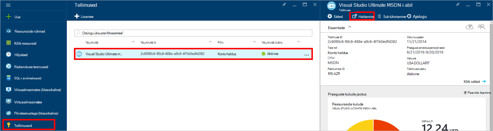
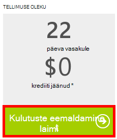

<properties
    pageTitle="DocumentDB portaali tõrkeotsing | Microsoft Azure'i"
    description="Siit saate teada DocumentDB Azure'i portaalis probleemide lahendamiseks." 
    services="documentdb"
    documentationCenter=""
    authors="mimig1"
    manager="jhubbard"
    editor="monicar"/>

<tags
    ms.service="documentdb"
    ms.workload="data-services"
    ms.tgt_pltfrm="na"
    ms.devlang="na"
    ms.topic="article"
    ms.date="08/29/2016"
    ms.author="mimig"/>

# Azure'i DocumentDB portaali tõrkeotsingu näpunäited

Selles artiklis kirjeldatakse, kuidas Azure'i portaalis DocumentDB probleemide lahendamiseks. 

## Ressursid on puudu

**Sümptom**: andmebaasides ja saidikogumite puuduvad oma portaali labad.

**Lahendus**: rakenduse kasutamine all kogumise talletusmahu maksimaalse läbilaskevõime langetada. 

**Selgitus**: portaali on rakendus, nagu kõik teised, helistamist DocumentDB andmebaasi ja saidikogumi. Kui teie taotlused on praegu on rakendus tõttu kõned tehtud eraldi rakendusest, portaali võib-olla ka olema rakendus, põhjustab ressursse, mis ei kuvata portaalis. Selle probleemi lahendamiseks kõrge läbilaskevõime kasutuse põhjus aadress ja seejärel värskendage portaali tera. [Läbilaskevõime](documentdb-performance-tips.md#throughput) osas [jõudluse näpunäiteid](documentdb-performance-tips.md) artiklist leiate teavet, kuidas mõõta ja alumise läbilaskevõime kasutuse.
 
## Lehtede või labad ei laadita

**Sümptom**: lehtede ja labad portaalis ei kuvata.

**Lahendus**: rakenduse kasutamine all kogumise talletusmahu maksimaalse läbilaskevõime langetada. 

**Selgitus**: portaali on rakendus, nagu kõik teised, helistamist DocumentDB andmebaasi ja saidikogumi. Kui teie taotlused on praegu on rakendus tõttu kõned tehtud eraldi rakendusest, portaali võib-olla ka olema rakendus, põhjustab ressursse, mis ei kuvata portaalis. Selle probleemi lahendamiseks kõrge läbilaskevõime kasutuse põhjus aadress ja seejärel värskendage portaali tera. [Läbilaskevõime](documentdb-performance-tips.md#throughput) osas [jõudluse näpunäiteid](documentdb-performance-tips.md) artiklist leiate teavet, kuidas mõõta ja alumise läbilaskevõime kasutuse.

## Lisage saidikogumi nupp on keelatud.

**Sümptom**: enne andmebaasi, nupp **Lisa saidikogumi** on keelatud.

**Selgitus**: kui Azure tellimuse on seostatud kasuks tiitrid, nagu MSDN-i tellimuse pakutakse tasuta autorid ja te olete kasutanud kõik teie krediiti kuu, ei saa luua mis tahes täiendavaid saidikogumid DocumentDB.

**Lahendus**: kulutuste limiit eemaldamine kontolt.

1. Azure'i portaalis Jumpbar, klõpsake nuppu **tellimused**, klõpsake tellimusega seostatud DocumentDB andmebaas ja **tellimuse** tera, klõpsake käsku **Halda**. 
    

2. Uues brauseriaknas, näete, et teil pole krediiti jäänud. Nuppu **Eemalda kulutuste limiit** eemaldada ainult praeguse arveldusperioodi eest või lõputult kulutuste. Järgige viisardi lisamiseks või kinnitage oma krediitkaardi andmed. 
    

 
## Päringu Explorer lõpetab vigadega

Lugege teemat [tõrkeotsing päringu Explorer](documentdb-query-collections-query-explorer.md#troubleshoot).

## Pole andmeid, mis on saadaval paanid jälgimine

Lugege teemat [tõrkeotsing jälgimise paanid](documentdb-monitor-accounts.md#troubleshooting).

## Dokumendi Exploreris tagastatud dokumendid

Vaadake teemat [tõrkeotsing dokumendi Explorer](documentdb-view-json-document-explorer.md#troubleshoot).

## Järgmised sammud

Kui teil on endiselt probleeme portaalis, saatke [askdocdb@microsoft.com](mailto:askdocdb@microsoft.com) abi või faili tugi taotlemine portaalis, klõpsates **sirvida**, **abi + tugi**, ja seejärel klõpsata käsku **Loo tugiteenuse taotluse**.
