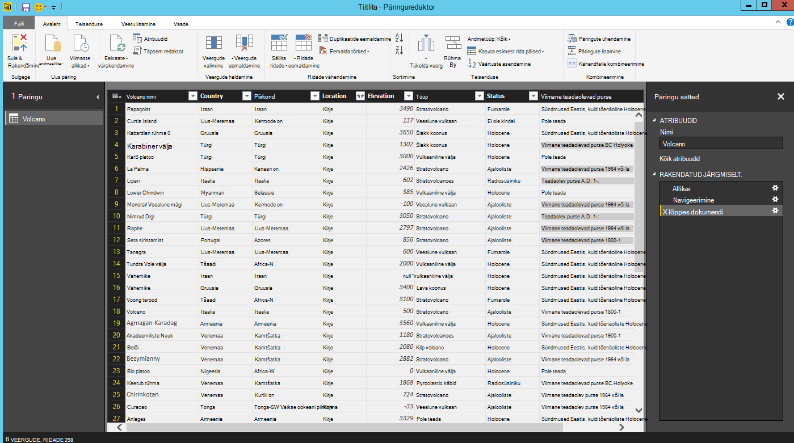
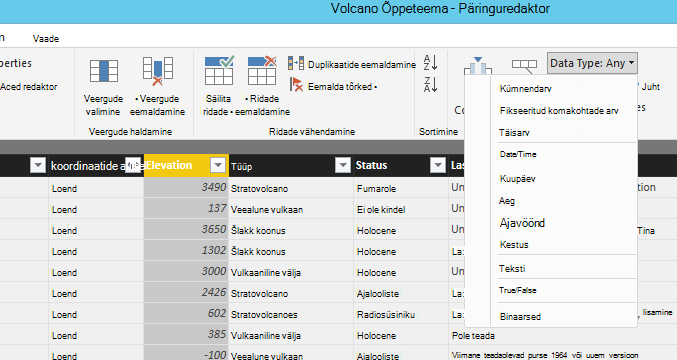

<properties
    pageTitle="Power BI õpetuse DocumentDB Connectori | Microsoft Azure'i"
    description="Selle õpetuse Power BI abil importida JSON, kasulik aruannete loomine ja visualiseerida andmeid DocumentDB ja Power BI kasutamisega."
    keywords="Power bi õpetuse, visualiseerida andmeid, power bi konnektor"
    services="documentdb"
    authors="h0n"
    manager="jhubbard"
    editor="mimig"
    documentationCenter=""/>

<tags
    ms.service="documentdb"
    ms.workload="data-services"
    ms.tgt_pltfrm="na"
    ms.devlang="na"
    ms.topic="article"
    ms.date="09/22/2016"
    ms.author="hawong"/>

# Power BI DocumentDB õpetus: Power BI kasutamisega andmete visualiseerimine

[Powerbi.com lehe kaudu](https://powerbi.microsoft.com/) on veebiteenus, kus saate luua ja ühiskasutusse andmine armatuurlaudade ja aruannete andmetega, mis on oluline, et teie ja teie asutuses.  Power BI Desktopi on sihtotstarbeline aruande loomise tööriista, mis võimaldab tuua mitmesugustest andmeallikatest pärinevate andmete, ühendamine ja muuta andmeid, luua võimsaid aruandeid ja visualiseeringuid ja aruannete avaldamine Power BI.  Power BI Desktopi uusima versiooniga saab nüüd ühenduse konto DocumentDB DocumentDB konnektor Power BI.   

Power BI selles õpetuses me sammult ühendamine DocumentDB kontoga sisse Power BI Desktopi, liikuge kogum, kus soovite navigaatori abil andmete, muuta JSON andmed tabelina, kasutades Power BI töölaud Päringuredaktori ja koostamine ja avaldamine aruande powerbi.com lehe kaudu.

Pärast selle õpetuse Power BI, on teil saama vastavad järgmistele küsimustele.  

-   Kuidas luua aruandeid andmetega: DocumentDB Power BI Desktopi kasutamine?
-   Kuidas on Power BI Desktopi DocumentDB kontoga ühenduse?
-   Kuidas saab rakenduses Power BI Desktopi kollektsioonist andmete toomiseks?
-   Kuidas saan muuta pesastatud JSON andmete Power BI Desktopi?
-   Kuidas avaldada ja minu aruannete powerbi.com lehe kaudu ühiskasutusse anda?

## Eeltingimused

Enne juhiste selles õpetuses Power BI, veenduge, et on järgmine:

- [Power BI Desktopi uusim versioon](https://powerbi.microsoft.com/desktop).
- Juurdepääs meie demo konto ja teie Azure'i DocumentDB andmeid.
    - Demo konto lisatakse volcano andmeid, mis on näidatud selles õpetuses. See demo konto ei ole mis tahes SLAs ja on mõeldud ainult tutvustamise otstarbeks.  Meil on õigus muuta demo konto sealhulgas, kuid mitte ainult, lõpetatakse konto, muutes võti, juurdepääsu, muutmise piiramine ja kustutage andmed, ilma ette teatamata või põhjus.
        - URL: https://analytics.documents.azure.com
        - Kirjutuskaitstud võti: MSr6kt7Gn0YRQbjd6RbTnTt7VHc5ohaAFu7osF0HdyQmfR + YhwCH2D2jcczVIR1LNK3nMPNBD31losN7lQ/fkw ==
    - Või oma konto loomiseks vaadake teemat [DocumentDB andmebaasi konto Azure portaali loomine](https://azure.microsoft.com/documentation/articles/documentdb-create-account/). Seejärel valimi volcano andmeid, mis on sarnane, mida kasutatakse selles õpetuses (kuid ei sisalda GeoJSON plokid) saamiseks [NOAA saidi](https://www.ngdc.noaa.gov/nndc/struts/form?t=102557&s=5&d=5) ja seejärel importida andmed [DocumentDB andmete migreerimise tööriista](https://azure.microsoft.com/documentation/articles/documentdb-import-data/)abil.

Teie aruannete powerbi.com lehe kaudu ühiskasutusse andmiseks peate konto powerbi.com lehe kaudu.  Lisateavet Power BI tasuta ja Power BI Pro, külastage [https://powerbi.microsoft.com/pricing](https://powerbi.microsoft.com/pricing).

## Alustagem
Selles õpetuses Oletagem, et olete geoloog õppimine vulkaanid kogu maailmas.  Volcano andmed salvestatakse DocumentDB konto ja JSON dokumendid näevad ühes allpool.

    {
        "Volcano Name": "Rainier",
        "Country": "United States",
        "Region": "US-Washington",
        "Location": {
            "type": "Point",
            "coordinates": [
            -121.758,
            46.87
            ]
        },
        "Elevation": 4392,
        "Type": "Stratovolcano",
        "Status": "Dendrochronology",
        "Last Known Eruption": "Last known eruption from 1800-1899, inclusive"
    }

Soovite volcano andmete toomine DocumentDB konto ja visualiseerida andmeid interaktiivse Power BI aruande nagu allpool.

Kas olete valmis seda proovida? Alustagem.

1. Käivitage Power BI Desktopi oma töökoha.
2. Kui Power BI Desktopi on käivitatud, kuvatakse *Welcome* screen.

    

3. Saate **Hankida andmeid**, vt **Tehtud allikad**või **Muud aruannete avamine** otse *tervituskuva* .  Klõpsake Kuva sulgemiseks veebisaidil paremas ülanurgas X. Kuvatakse Power BI Desktopi **aruanne** seisukohast.

    

4. Valige **Avaleht** lindil ja klõpsake nuppu **Saada andmete**põhjal.  Kuvatakse aken **Andmete hankimine** .

5. Klõpsake **Azure**, valige **Microsoft Azure'i DocumentDB (Beta)**ja seejärel nuppu **Ühenda**.  **Microsoft Azure'i DocumentDB ühenduse** akna peaks kuvatama.

    

6. Määrake DocumentDB konto lõpp-punkti URL soovite andmeid tuua, nagu allpool näidatud, ja seejärel klõpsake nuppu **OK**. Saate tuua URI väljal **[klahvid](documentdb-manage-account.md#keys)** tera Azure portaali URL-i või saate kasutada demo konto, sel juhul URL on `https://analytics.documents.azure.com`. 

    Jätke andmebaasi nimi, nimi ja SQL-lause tühjaks, kui need väljad on valikulised.  Selle asemel kasutame navigaator valige andmebaas ja saidikogumi kindlaks teha, kui andmed on pärit.

    

7. Kui ühendate selle lõpp-punkti esimest korda, palutakse konto võti.  Saate tuua võti Azure portaali **[kirjutuskaitstud klahvid](documentdb-manage-account.md#keys)** tera väljalt **Primaarvõti** või kasutage demo konto, on juhtum võti `RcEBrRI2xVnlWheejXncHId6QRcKdCGQSW6uSUEgroYBWVnujW3YWvgiG2ePZ0P0TppsrMgscoxsO7cf6mOpcA==`. Sisestage konto võti ja klõpsake nuppu **Ühenda**.

    Soovitame kasutada võti kirjutuskaitstud, kui koostamise aruandeid.  See aitab vältida mittevajalike käes juhtslaidi võtme turvalisus võimalike ohtudega. Kirjutuskaitstud võti on saadaval Azure portaali keelest [klahvid](documentdb-manage-account.md#keys) või kasutage demo konto teave kohal.

    

8. Kui konto on ühenduse loonud, kuvatakse **navigaator** .  **Navigaator** näitab konto andmebaaside loendit.
9. Klõpsake andmebaasi, kus on pärit aruande andmeid, kui kasutate demo konto, valige **volcanodb**laiendada.   

10. Nüüd valige kogum, mida te toob andmed. Kui kasutate demo konto, valige **volcano1**.

    Eelvaate paanil kuvatakse **kirje** üksuste loend.  Power BI **kirje** tüübiks on esitatud dokumendi. Samuti on ka pesastatud JSON plokk dokumendi sees **kirje**.

    

11. Klõpsake Päringuredaktori käivitada nii, et saaksime saate muuta andmete **redigeerimine** .

## Lamedamad ja muutes JSON-dokumendid
1. Power BI Päringuredaktoris, peaksite **dokumendi** veeru keskmisel paanil.

2. Klõpsake paremal küljel **dokumendi** veerupäise paisumistsükli.  Kuvatakse kontekstimenüü abil väljade loend.  Valige väljad, peate oma aruande, näiteks Volcano nimi, riik, piirkond, asukoht, kõrgus, tüüp, olek ja Viimane teada purse ja seejärel klõpsake nuppu **OK**.

    

3. Keskmisel paanil kuvatakse valitud väljadega tulemuste eelvaade.

    

4. Selles näites asukoha atribuut on GeoJSON plokk dokumendis.  Nagu näete, tähistab **kirje** tüübiks rakenduses Power BI Desktopi asukoht.  
5. Klõpsake paremal küljel asukoht veerupäise paisumistsükli.  Kuvatakse kontekstimenüü väljadega tüüp ja koordinaatide alusel.  Vaatame valige koordinaate väli ja klõpsake nuppu **OK**.

    

6. Nüüd kuvatakse keskmisel paanil **loenditüübist** koordinaate veergu.  Õpetuse alguses näidatud selles õpetuses GeoJSON andmed on punkti tüüpi salvestatud koordinaate massiivis ja väärtustega.

    Elemendi koordinaate [0] tähistab laiuskraadide ajal koordinaate [1] tähistab laiuskraad.
    

7. Ühenda koordinaate massiiv, loome **Kohandatud veeru** nimega LatLong.  Valige lindil **Lisa veerg** ja klõpsake väärtust **Kohandatud veeru lisamine**.  **Kohandatud veeru lisamine** akna peaks kuvatama.

8. Sisestage nimi uue veeru, nt LatLong.

9. Järgmisena saate määrata kohandatud valemi uue veeru.  Selles näites me ei concatenate ja väärtused, mis on eraldatud komaga, nagu on näidatud allpool, kasutades järgmist valemit: `Text.From([Document.Location.coordinates]{1})&","&Text.From([Document.Location.coordinates]{0})`. Klõpsake nuppu **OK**.

    Kohta andmeanalüüsi avaldised (DAX) sh Dax-i funktsioonide lisateabe saamiseks külastage [Power BI Desktopi põhilised Dax-i](https://support.powerbi.com/knowledgebase/articles/554619-dax-basics-in-power-bi-desktop).

    

10. Nüüd kuvatakse keskmisel paanil eeltäidetakse komaga eraldatud väärtuste ja LatLong veerupäis.

    

    Kui saate tõrketeate uue veeru, veenduge, et et rakendatud juhiseid jaotises päringu sätted vastavad on näidatud järgmisel joonisel:

    

    Kui teie toimingud on erinevad, mõningaid lisatoiminguid kustutamine ja proovige uuesti kohandatud veeru lisada. 

11. Meil on nüüd lõpetatud lamedamad andmed tabelina sisse.  Saate ära kasutada kõiki kujundit Päringuredaktoris saadaval funktsioone ja muuta andmete DocumentDB.  Kui kasutate valimi, muuta andmetüüpi registriredaktor **täisarvuni** , muutes **Andmetüüp** lindil **Avaleht** .

    

12. Klõpsake nuppu **Sule ja Rakenda** andmemudeli salvestamiseks.

    

## Aruannete koostamine
Power BI töölaud aruandevaates on, kus saate alustada andmete visualiseerimiseks aruannete loomiseks.  Saate luua aruandeid, pukseerige väljad **aruande** lõuend.

Aruandevaates, siis tuleb leida:

 1. **Väljade** paan, kus näete loendit andmemudelite väljadega, mida saate kasutada oma aruannete jaoks on.

 2. Paani **visualiseeringud** . Aruande võib sisaldada ühte või mitut visualiseeringuid.  Valige sobiv teie vajadustele paanilt **visualiseeringute** visuaalse tüübid.

 3. **Aruande** lõuend, see on, kus saab ehitada selle visuaale aruande.

 4. **Aruande** lehel. Saate lisada mitu aruande lehekülgede Power BI Desktopi.

Järgmisel joonisel on kujutatud lihtsa Interaktiivne kaart view aruande loomise põhitoimingud.

1. Selles näites loome MAPI vaadet, mis näitab iga volcano asukoht.  Klõpsake paani **visualiseeringud** pildil on rõhutatud kaardil visuaalse tüüp.  Peaksite nägema värvitud lõuendil **aruande** kaardil visuaalse tüüp.  Paani **visualiseering** tuleks kuvada ka seotud visuaalse tüüp MAPI atribuutide kogum.

2. Nüüd lohistada LatLong väli paanilt **väljad** **asukoha** atribuudi **visualiseeringute** paanil.
3. Järgmiseks pukseerige Volcano nime väljale atribuudi **Legend** .  

4. Seejärel pukseerige tõus välja atribuudi **maht** .  

5. Nüüd peaks nähtaval olema kaardi visuaalse, kus mullid, mis näitab iga volcano asukoha viitasid vulkaan kõrgus Mulli suurus kogum.

6. Nüüd olete loonud põhiaruande.  Saate, lisades paaniümbrisesse visualiseeringute aruannet kohandada.  Meie puhul lisasime Volcano tüüp tükeldi aruande interaktiivsed.  

    

## Avaldamine ja jagamine aruandesse
Aruande ühiskasutusse andmiseks peate konto powerbi.com lehe kaudu.

1. Power BI Desktopi, klõpsake menüüs **Avaleht** .
2. Klõpsake nuppu **Avalda**.  Teil palutakse sisestada kasutajanimi ja parool konto powerbi.com lehe kaudu.
3. Kui kinnitatud mandaat, aruanne on avaldatud teie valitud sihtkohta.
4. Klõpsake nuppu **Ava 'PowerBITutorial.pbix' Power BI** vaatamiseks ja jagamiseks oma aruande powerbi.com lehe kaudu.

    

## Armatuurlaua loomine powerbi.com lehe kaudu

Nüüd, kui teil on aruanne, võimaldab selle powerbi.com lehe kaudu ühiskasutusse anda

Kui avaldate oma aruanne Power BI Desktopi powerbi.com lehe kaudu, see tekitab **aruanne** ja **andmekomplekti** oma rentniku powerbi.com lehe kaudu. Näiteks kui teie avaldatud aruande nimega **PowerBITutorial** , et powerbi.com lehe kaudu, kuvatakse PowerBITutorial nii **aruannete** ja **andmekomplektide** jaotiste powerbi.com lehe kaudu.

   

Saa ühiskasutusse anda Armatuurlaua loomine nuppu **Kinnita Live lehe** aruandesse powerbi.com lehe kaudu.

   

Seejärel järgige juhiseid [PIN-koodi kaudu aruande paani](https://powerbi.microsoft.com/documentation/powerbi-service-pin-a-tile-to-a-dashboard-from-a-report/#pin-a-tile-from-a-report) loomiseks armatuurlaud. 

Aruande sihtotstarbelise muudatusi saate teha ka enne loomine armatuurlaua. Siiski, on soovitatav kasutada Power BI Desktopi tehke soovitud muudatused ja uuesti avaldada aruande powerbi.com lehe kaudu.

## Powerbi.com lehe kaudu andmete värskendamine

On kaks võimalust andmete sihtotstarbelise ja ajastatud värskendamine.

Mõne sihtotstarbelise värskendamise klõpsake varjutuste (…), **andmekomplekti**, nt PowerBITutorial. Peaksite nägema tegevusi, sh **Värskenda kohe**. Klõpsake nuppu **Värskenda kohe** andmeid värskendada.

Ajastatud värskendamise, tehke järgmist.

1. Klõpsake loendis toiming **Värskenda ajakava** . 
    

2. Klõpsake lehel **sätted** laiendamiseks **andmeallika identimisteabe**. 

3. Klõpsake **identimisteabe redigeerimine**. 

    Konfigureerimine popup kuvatakse. 

4. Sisestage andmed komplekti DocumentDB kontoga ühenduse loomiseks ja seejärel klõpsake linki **Logi sisse**. 

5. Laiendage **Värskenda ajakava** ja ajakava, mida soovite värskendada andmekomplekti häälestamine. 
  
6. Klõpsake nuppu **Rakenda** ja on valmis ajastatud värskendamise häälestamiseks.

## Järgmised sammud
- Power BI kohta leiate lisateavet artiklist [Power BI kasutamise alustamine](https://powerbi.microsoft.com/documentation/powerbi-service-get-started/).
- DocumentDB kohta leiate lisateavet teemast [DocumentDB dokumentatsiooni kuvataks lehe](https://azure.microsoft.com/documentation/services/documentdb/).
