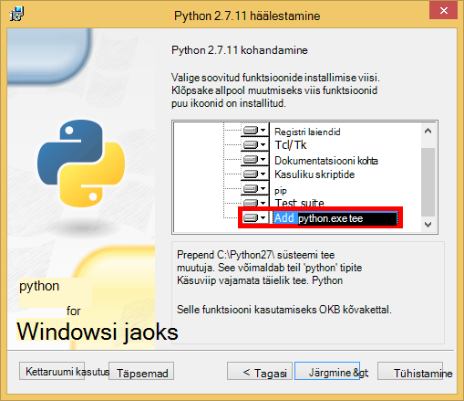

<properties
    pageTitle="Python lisatakse Web rakenduste arendamise DocumentDB | Microsoft Azure'i"
    description="Vaadake üle andmebaasi õpetus DocumentDB abil saate talletada ja pääseda Python lisatakse veebirakenduse majutatud Azure'i andmetele. Rakenduste arendamise lahenduste leidmiseks." 
    keywords="Rakenduste arendamise, andmebaasi õpetuse, python lisatakse, python veebirakenduse, python veebi arengut, documentdb, Azure'i, Microsoft Azure'i"
    services="documentdb"
    documentationCenter="python"
    authors="syamkmsft"
    manager="jhubbard"
    editor="cgronlun"/>

<tags
    ms.service="documentdb"
    ms.workload="data-management"
    ms.tgt_pltfrm="na"
    ms.devlang="python"
    ms.topic="hero-article"
    ms.date="08/25/2016"
    ms.author="syamk"/>

# <a name="python-flask-web-application-development-with-documentdb"></a>Python lisatakse Web rakenduste arendamise DocumentDB

> [AZURE.SELECTOR]
- [.NET-I](documentdb-dotnet-application.md)
- [Node.js](documentdb-nodejs-application.md)
- [Java](documentdb-java-application.md)
- [Python](documentdb-python-application.md)

Selle õpetuse näitab, kuidas kasutada Azure DocumentDB talletamiseks ja toidupala andmetele juurde veebirakenduse majutatud Azure ja eeldab, et teil on mõni eelnev kogemus Python ja Azure veebisaitide abil.

Selle õpetuse andmebaasi hõlmab:

1. Loomine ja ettevalmistamise DocumentDB konto.
2. Python MVC rakenduste loomine.
3. Ühenduse loomine ja Azure DocumentDB kaudu oma veebirakenduse.
4. Veebirakenduse Azure veebisaitide juurutamine.

Selle õpetuse järgides koostate lihtsa hääletusnuppe rakendus, mis võimaldab teil hääletada küsitlus.


## <a name="database-tutorial-prerequisites"></a>Andmebaasi kuueosalisest eeltingimused

Enne selle artikli juhiseid järgides, peate tagama, et teil on installitud järgmine:

- Aktiivne Azure'i konto. Kui teil pole kontot, saate luua tasuta prooviversiooni konto vaid paar minutit. Lisateavet leiate teemast [Azure tasuta prooviversioon](https://azure.microsoft.com/pricing/free-trial/).
- [Visual Studio 2013](http://www.visualstudio.com/) või uuemas versioonis, või [Visual Studio Express](), mis on tasuta versiooni. Selles õpetuses juhiseid kirjutada spetsiaalselt Visual Studio 2015. 
- Python Tools for Visual Studio [GitHub](http://microsoft.github.io/PTVS/)kaudu. Selle õpetuse kasutab VS 2015 Python tööriistad. 
- Azure'i Python SDK Visual Studio 2,4 või uuem versioon [azure.com](https://azure.microsoft.com/downloads/)saadaval. Microsoft Azure'i SDK kasutasime Python 2,7.
- Python 2.7 kaudu [python.org][2]. Kasutasime Python 2.7.11. 

> [AZURE.IMPORTANT] Kui installite Python 2.7 esimest korda, kohandada Python 2.7.11 ekraanil, valige kindlasti **python.exe tee lisamine**.
> 
>    

- Microsoft Visual C++ koostaja jaoks Python 2.7 [Microsofti allalaadimiskeskusest][3].

## <a name="step-1-create-a-documentdb-database-account"></a>Samm 1: DocumentDB andmebaasi konto loomine

Alustame DocumentDB konto loomine. Kui teil on juba konto, võite jätkata [Samm 2: Python täidetakse uue veebirakenduse loomine](#step-2:-create-a-new-python-flask-web-application).

[AZURE.INCLUDE [documentdb-create-dbaccount](../../includes/documentdb-create-dbaccount.md)]

<br/>
Nüüd tutvustame kaudu üles Python täidetakse uue veebirakenduse maa loomise kohta.

## <a name="step-2-create-a-new-python-flask-web-application"></a>Samm 2: Python täidetakse uue veebirakenduse loomine

1. Visual Studio, klõpsake menüüs **fail** käsk **Uus**ja seejärel klõpsake nuppu **projekti**.

    Kuvatakse dialoogiboks **Uue projekti** .

2. Klõpsake vasakpoolsel paanil laiendage **Mallid** ja seejärel **Python**ja seejärel klõpsake nuppu **Veeb**. 

3. Valige **Lisatakse Web projekti** keskmisel paanil, seejärel klõpsake **nimi** väljale tippige **õpetuse**, ja seejärel klõpsake nuppu **OK**. Pidage meeles, et Python paketi nimed tuleks väiketähtedega, nagu on kirjeldatud [Laadi juhend Python kood](https://www.python.org/dev/peps/pep-0008/#package-and-module-names).

    Nende Python lisatakse uus, on web rakenduste arendamise raamistik, mille abil saate koostada veebirakenduste Python kiiremini.

    

4. Klõpsake aknas **Python Tools for Visual Studio** **installimine virtuaalse keskkonda**. 

    

5. Aknas **Lisada virtuaalse keskkonna** aktsepteerige vaikesätted ja kasutage Python 2.7 base keskkonna Kuna PyDocumentDB ei toeta praegu Python 3.x ja klõpsake seejärel nuppu **Loo**. See loob projekti jaoks nõutav Python virtuaalse keskkonnas.

    

    Aknas väljund kuvatakse `Successfully installed Flask-0.10.1 Jinja2-2.8 MarkupSafe-0.23 Werkzeug-0.11.5 itsdangerous-0.24 'requirements.txt' was installed successfully.` kui keskkonna õnnestunult installitud.

## <a name="step-3-modify-the-python-flask-web-application"></a>Samm 3: Muutmine veebirakenduse Python lisatakse

### <a name="add-the-python-flask-packages-to-your-project"></a>Python lisatakse pakettide lisamine projekti

Pärast projekti on häälestatud, peate lisada projekti, sh pydocumentdb DocumentDB jaoks pakkimine Python nõutav lisatakse paketid.

1. Solution Exploreris avage fail nimega **requirements.txt** ja asendage sisu järgmist:

        flask==0.9
        flask-mail==0.7.6
        sqlalchemy==0.7.9
        flask-sqlalchemy==0.16
        sqlalchemy-migrate==0.7.2
        flask-whooshalchemy==0.55a
        flask-wtf==0.8.4
        pytz==2013b
        flask-babel==0.8
        flup
        pydocumentdb>=1.0.0

2. Salvestage fail **requirements.txt** . 
3. Lahenduste Explorer, paremklõpsake **keskkonna** ja klõpsake nuppu **requirements.txt installida**.

    

    Pärast edukat installi, kuvatakse järgmised väljundi aknas

        Successfully installed Babel-2.3.2 Tempita-0.5.2 WTForms-2.1 Whoosh-2.7.4 blinker-1.4 decorator-4.0.9 flask-0.9 flask-babel-0.8 flask-mail-0.7.6 flask-sqlalchemy-0.16 flask-whooshalchemy-0.55a0 flask-wtf-0.8.4 flup-1.0.2 pydocumentdb-1.6.1 pytz-2013b0 speaklater-1.3 sqlalchemy-0.7.9 sqlalchemy-migrate-0.7.2

    > [AZURE.NOTE] Harva, võib ilmneda tõrge väljundi aknas. Sel juhul kontrollida, kui Kettapuhastus on seotud tõrge. Mõnikord cleanup nurjub, kuid installimise saab successful (üles liikumine väljundi aknas selle kontrollimiseks). Saate vaadata oma installi kontrollides [virtuaalse keskkonna](#verify-the-virtual-environment). Kui installimine nurjus, kuid selle kinnitamist, on jätkamiseks OK.

### <a name="verify-the-virtual-environment"></a>Veenduge, et virtuaalse keskkonnas

Vaatame veenduge, et kõik oleks õigesti installitud.

1. Lahendus koostada, vajutades **klahvikombinatsiooni Ctrl**+**Shift**+**B**.
2. Kui koostamine õnnestub, käivitage veebisaidi, vajutades **klahvi F5**. See käivitab lisatakse arengu server ja käivitab veebibrauseris. Peaksite nägema Järgmine leht.

    

3. Peatage silumine veebisaidi, vajutades klahvikombinatsiooni **Shift**+Visual Studio**klahvi F5** .

### <a name="create-database-collection-and-document-definitions"></a>Andmebaasi, saidikogumi ja dokumendi määratluste loomine

Nüüd uute failide lisamine ja värskendamine teistele hääletusnuppe rakenduse loomine.

1. Solution Exploreris Paremklõpsake **õpetuse** projekt, klõpsake nuppu **Lisa**ja seejärel klõpsake nuppu **Uus üksus**. Valige **Tühi Python fail** ja faili **forms.py**nime.  
2. Lisada järgmine kood forms.py faili ja seejärel salvestage fail.

```python
from flask.ext.wtf import Form
from wtforms import RadioField

class VoteForm(Form):
    deploy_preference  = RadioField('Deployment Preference', choices=[
        ('Web Site', 'Web Site'),
        ('Cloud Service', 'Cloud Service'),
        ('Virtual Machine', 'Virtual Machine')], default='Web Site')
```


### <a name="add-the-required-imports-to-viewspy"></a>Nõutav impordi views.py lisamine

1. Laiendage kausta **õpetuse** Solution Exploreris ja **views.py** faili avada. 
2. Lisage järgmine importimine laused **views.py** fail üles ja seejärel salvestage fail. Need importida DocumentDB's PythonSDK ja lisatakse paketid.

    ```python
    from forms import VoteForm
    import config
    import pydocumentdb.document_client as document_client
    ```


### <a name="create-database-collection-and-document"></a>Andmebaasi, saidikogumi ja dokumendi loomine

- Veel **views.py**, lisage järgmine kood faili lõppu. See hoolitseb loomise vormi kasutatav andmebaas. Mõne olemasoleva koodi **views.py**kustutada. Lihtsalt lisa see lõppu.

```python
@app.route('/create')
def create():
    """Renders the contact page."""
    client = document_client.DocumentClient(config.DOCUMENTDB_HOST, {'masterKey': config.DOCUMENTDB_KEY})

    # Attempt to delete the database.  This allows this to be used to recreate as well as create
    try:
        db = next((data for data in client.ReadDatabases() if data['id'] == config.DOCUMENTDB_DATABASE))
        client.DeleteDatabase(db['_self'])
    except:
        pass

    # Create database
    db = client.CreateDatabase({ 'id': config.DOCUMENTDB_DATABASE })

    # Create collection
    collection = client.CreateCollection(db['_self'],{ 'id': config.DOCUMENTDB_COLLECTION })

    # Create document
    document = client.CreateDocument(collection['_self'],
        { 'id': config.DOCUMENTDB_DOCUMENT,
          'Web Site': 0,
          'Cloud Service': 0,
          'Virtual Machine': 0,
          'name': config.DOCUMENTDB_DOCUMENT 
        })

    return render_template(
       'create.html',
        title='Create Page',
        year=datetime.now().year,
        message='You just created a new database, collection, and document.  Your old votes have been deleted')
```

> [AZURE.TIP] **CreateCollection** meetod võtab on valikuline **RequestOptions** kolmanda parameetrina. See saab määrata pakkuda kogumi tüüp. Kui ei ole offerType väärtust, siis selle saidikogumi luuakse kasutades vaikimisi pakkuda tüüp. DocumentDB pakkuda failitüüpide kohta leiate lisateavet teemast [jõudluse tasemete DocumentDB](documentdb-performance-levels.md).


### <a name="read-database-collection-document-and-submit-form"></a>Andmebaasi, saidikogumi dokumendi lugemine ja esitage vorm

- Veel **views.py**, lisage järgmine kood faili lõppu. See hoolitseb häälestamise vormi, andmebaasi, saidikogumi ja dokumendi lugemine. Mõne olemasoleva koodi **views.py**kustutada. Lihtsalt lisa see lõppu.

```python
@app.route('/vote', methods=['GET', 'POST'])
def vote(): 
    form = VoteForm()
    replaced_document ={}
    if form.validate_on_submit(): # is user submitted vote  
        client = document_client.DocumentClient(config.DOCUMENTDB_HOST, {'masterKey': config.DOCUMENTDB_KEY})

        # Read databases and take first since id should not be duplicated.
        db = next((data for data in client.ReadDatabases() if data['id'] == config.DOCUMENTDB_DATABASE))

        # Read collections and take first since id should not be duplicated.
        coll = next((coll for coll in client.ReadCollections(db['_self']) if coll['id'] == config.DOCUMENTDB_COLLECTION))

        # Read documents and take first since id should not be duplicated.
        doc = next((doc for doc in client.ReadDocuments(coll['_self']) if doc['id'] == config.DOCUMENTDB_DOCUMENT))

        # Take the data from the deploy_preference and increment our database
        doc[form.deploy_preference.data] = doc[form.deploy_preference.data] + 1
        replaced_document = client.ReplaceDocument(doc['_self'], doc)

        # Create a model to pass to results.html
        class VoteObject:
            choices = dict()
            total_votes = 0

        vote_object = VoteObject()
        vote_object.choices = {
            "Web Site" : doc['Web Site'],
            "Cloud Service" : doc['Cloud Service'],
            "Virtual Machine" : doc['Virtual Machine']
        }
        vote_object.total_votes = sum(vote_object.choices.values())

        return render_template(
            'results.html', 
            year=datetime.now().year, 
            vote_object = vote_object)

    else :
        return render_template(
            'vote.html', 
            title = 'Vote',
            year=datetime.now().year,
            form = form)
```


### <a name="create-the-html-files"></a>HTML-vormingus failide loomine

1. Solution Exploreris **õpetuse** kausta, paremklõpsake kausta **Mallid** , klõpsake nuppu **Lisa**ja seejärel klõpsake nuppu **Uus üksus**. 
2. Valige **HTML leht**ja seejärel tippige väljale nimi **create.html**. 
3. Korrake juhiseid 1 ja 2, et luua kaks täiendavaid HTML-faile: results.html ja vote.html.
4. Järgmine kood lisamiseks klõpsake **create.html** soovitud `<body>` element. Kuvatakse teade selle kohta, et lõime uue andmebaasi, saidikogumi ja dokumendi.

    ```html
    
    
    <h2>{{ title }}.</h2>
    <h3>{{ message }}</h3>
    <p><a href="{{ url_for('vote') }}" class="btn btn-primary btn-large">Vote &raquo;</a></p>
    
    ```

5. Järgmine kood lisamiseks klõpsake **results.html** soovitud `<body`> element. Küsitluse tulemuste kuvamine

    ```html
    
    
    <h2>Results of the vote</h2>
        <br />
        
    
    <div class="row">
        <div class="col-sm-5">{{choice}}</div>
            <div class="col-sm-5">
                <div class="progress">
                    <div class="progress-bar" role="progressbar" aria-valuenow="{{vote_object.choices[choice]}}" aria-valuemin="0" aria-valuemax="{{vote_object.total_votes}}" style="width: {{(vote_object.choices[choice]/vote_object.total_votes)*100}}%;">
                                {{vote_object.choices[choice]}}
                </div>
            </div>
            </div>
    </div>
    
    
    <br />
    <a class="btn btn-primary" href="{{ url_for('vote') }}">Vote again?</a>
    
    ```

6. Järgmine kood lisamiseks klõpsake **vote.html** soovitud `<body`> element. See kuvab küsitlus ja aktsepteerib häälte. Klõpsake registreerimisel häälte, on juhtelemendi üle läinud views.py, kus me tuvasta hääletus cast ja lisab selle dokumendi vastavalt sellele.

    ```html
    
    
    <h2>What is your favorite way to host an application on Azure?</h2>
    <form action="" method="post" name="vote">
        {{form.hidden_tag()}}
            {{form.deploy_preference}}
            <button class="btn btn-primary" type="submit">Vote</button>
    </form>
    
    ```

7. Kausta **Mallid** , asendage sisu **index.html** järgmist. See toimib sihtleht rakenduse.
    
    ```html
    
    
    <h2>Python + DocumentDB Voting Application.</h2>
    <h3>This is a sample DocumentDB voting application using PyDocumentDB</h3>
    <p><a href="{{ url_for('create') }}" class="btn btn-primary btn-large">Create/Clear the Voting Database &raquo;</a></p>
    <p><a href="{{ url_for('vote') }}" class="btn btn-primary btn-large">Vote &raquo;</a></p>
    
    ```

### <a name="add-a-configuration-file-and-change-the-initpy"></a>Otsingukonfiguratsiooni faili lisada ja muuta selle \_ \_käivitamise\_\_.py

1. Solution Exploreris Paremklõpsake **õpetuse** projekti, klõpsake nuppu **Lisa**, nuppu **Uus üksus**, valige **Tühi Python fail**ja seejärel fail **config.py**nime. See config fail on vajalik vormide pannakse. Saate anda ka salajane võti. See võti ei ole vaja selles õpetuses küll.

2. Lisada järgmine kood config.py, tuleb teil muuta väärtuste **DOCUMENTDB\_HOST** ja **DOCUMENTDB\_klahvi** järgmises etapis.

    ```python
    CSRF_ENABLED = True
    SECRET_KEY = 'you-will-never-guess'
    
    DOCUMENTDB_HOST = 'https://YOUR_DOCUMENTDB_NAME.documents.azure.com:443/'
    DOCUMENTDB_KEY = 'YOUR_SECRET_KEY_ENDING_IN_=='
    
    DOCUMENTDB_DATABASE = 'voting database'
    DOCUMENTDB_COLLECTION = 'voting collection'
    DOCUMENTDB_DOCUMENT = 'voting document'
    ```

3. [Azure portaali](https://portal.azure.com/)liikuge **klahvid** tera, klõpsates nuppu **Sirvi**, **DocumentDB kontod**, topeltklõpsake kasutada konto nimi ja seejärel klõpsake nuppu **klahvid** **Essentialsi** ala. **Klahvid** tera, kopeerige **URI** väärtus ja kleepige see **config.py** faili, kui väärtus on **DOCUMENTDB\_HOST** atribuut. 
4. Tagasi Azure'i portaalis **klahvid** tera, kopeerige **Primaarvõti** või **Teisese võtme**väärtus ja kleepige fail **config.py** väärtusena selle **DOCUMENTDB\_klahvi** atribuut.
5. Klõpsake soovitud ** \_ \_käivitamise\_\_.py** faili, lisage järgmine rida. 

        app.config.from_object('config')

    Nii, et fail on:

    ```python
    from flask import Flask
    app = Flask(__name__)
    app.config.from_object('config')
    import tutorial.views
    ```

6. Pärast lisamist kõik failid, Solution Exploreris peaks välja nägema umbes järgmine:

    


## <a name="step-4-run-your-web-application-locally"></a>Samm 4: Käivitage veebirakendus kohalikult

1. Lahendus koostada, vajutades **klahvikombinatsiooni Ctrl**+**Shift**+**B**.
2. Kui koostamine õnnestub, käivitage veebisaidi, vajutades **klahvi F5**. Peaksite nägema järgmine ekraanil.

    

3. Klõpsake nuppu **Loo/tühjendage hääletus andmebaasi** andmebaasi loomiseks.

    

4. Seejärel klõpsake **Hääletus** ja valige oma valik.

    

5. Saate oma hääle iga hääletamiseks suurendab kajastavat vastav näidiku.

    

6. Peatage silumine projekt, vajutades klahvikombinatsiooni Shift + F5.

## <a name="step-5-deploy-the-web-application-to-azure-websites"></a>Juhis 5: Juurutamine veebirakenduse Azure veebisaitide otseteid.

Nüüd, kui teil on täieliku taotluse vastu DocumentDB töötab õigesti, siis me ei kavatse juurutada Azure veebisaitide.

1. Paremklõpsake Solution Exploreris projekt (Veenduge, et te pole veel töötab kohalik) ja klõpsake nuppu **Avalda**.  

    

2. Aknas **Avaldada** , valige **Microsoft Azure'i veebirakenduste**ja seejärel klõpsake nuppu **edasi**.

    

3. **Microsoft Azure'i Web Appsi akna** aknas nuppu **Uus**.

    

4. **Saidi loomine Microsoft Azure'i** aknas, sisestage **nimi Web app** **rakenduse teenusleping** **ressursirühm**ja **piirkond**ja seejärel käsku **Loo**.

    

5. **Veebis avaldamine** aknas, klõpsake nuppu **Avalda**.

    

3. Mõne sekundi, Visual Studio valmis avaldada oma veebirakenduse ja käivitage Siin näete oma mugav töö töötab Azure brauseris!

## <a name="troubleshooting"></a>Tõrkeotsing

Kui see on teie arvutis käivitate esimese Python rakendus, tagada, et järgmised kaustad (või samaväärne installi asukohad) oma tee muutuja:

    C:\Python27\site-packages;C:\Python27\;C:\Python27\Scripts;

Kui saate tõrketeate lehel hääletus ja te nimega projekti millegi muuga kui number **õpetuse**, veenduge, et ** \_ \_käivitamise\_\_.py** viitab reale õige projekti nime: `import tutorial.view`.

## <a name="next-steps"></a>Järgmised sammud

Palju õnne! Teil on oma esimese Python veebirakenduse abil Azure'i DocumentDB lõpetatud ja avaldada Azure veebisaitide.

Me värskendamiseks ja täiustamiseks selles teemas sageli teie tagasiside põhjal.  Kui olete lõpetanud õpetuse, palun abil hääletusnuppude üla-ja selle lehe allservas, ja kindlasti ka teie tagasisidet, mida soovite näha täiustused. Kui soovite meil teiega otse ühendust võtta, Julgelt kaasata oma meiliaadress oma kommentaarid.

Lisafunktsioone lisamiseks oma veebirakenduse läbi saadaval [DocumentDB Python SDK](documentdb-sdk-python.md)API-d.

Azure'i, Visual Studio ja Python kohta leiate lisateavet teemast [Python Arenduskeskus](https://azure.microsoft.com/develop/python/). 

Täiendavad Python lisatakse Õppematerjalid, lugege teemat [The lisatakse Mega-õpetus, i osa: Tere, maailm!](http://blog.miguelgrinberg.com/post/the-flask-mega-tutorial-part-i-hello-world). 

  [Visual Studio Express]: http://www.visualstudio.com/products/visual-studio-express-vs.aspx
  [2]: https://www.python.org/downloads/windows/
  [3]: https://www.microsoft.com/download/details.aspx?id=44266
  [Microsoft Web Platform Installer]: http://www.microsoft.com/web/downloads/platform.aspx
  [Azure portal]: http://portal.azure.com
