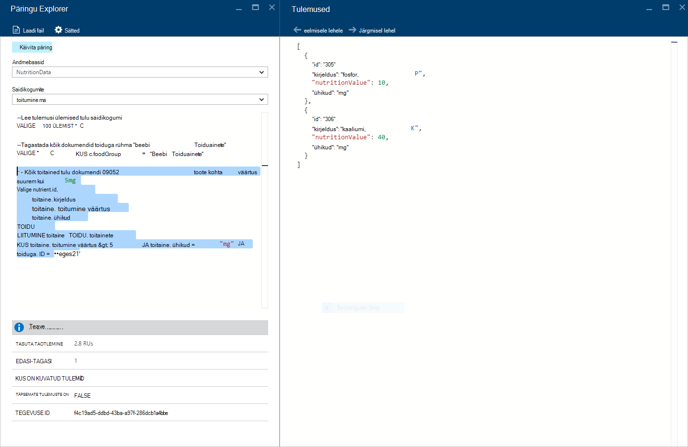

<properties
    pageTitle="DocumentDB päringu Explorer: SQL-i akna päringuredaktor | Microsoft Azure'i"
    description="Lisateavet DocumentDB päringu Explorer SQL-i päringuredaktori kirjutamiseks SQL-päringud ja nende käivitamisel vastu NoSQL DocumentDB saidikogumi Azure'i portaalis."
    keywords="sql-päringud, SQL-i päringuredaktori kirjutamine"
    services="documentdb"
    authors="kirillg"
    manager="jhubbard"
    editor="monicar"
    documentationCenter=""/>

<tags
    ms.service="documentdb"
    ms.workload="data-services"
    ms.tgt_pltfrm="na"
    ms.devlang="na"
    ms.topic="article"
    ms.date="08/30/2016"
    ms.author="kirillg"/>

# Kirjutage, redigeerimine ja SQL-päringud DocumentDB Exploreriga päringu käivitamine 

Selles artiklis antakse ülevaade [Microsoft Azure'i DocumentDB](https://azure.microsoft.com/services/documentdb/) päringu Exploreri Azure portaali tööriista, mis võimaldab kirjutada, redigeerida ja käivitage SQL-päringud [DocumentDB saidikogumi](documentdb-create-collection.md)suhtes.

1. Klõpsake Azure portaali, Jumpbar, **DocumentDB (NoSQL)**. Kui **DocumentDB (NoSQL)** pole kuvatud, klõpsake nuppu **Rohkem teenuseid** ja klõpsake **DocumentDB (NoSQL)**.

2. Klõpsake menüüs ressursi **Päringu Explorer**. 

    

3. **Päringu Exploreri** tera, valige **andmebaasid** ja **saidikogumite** ripploendist päringu ja tippige päringu käivitamiseks. 

    Ripploendite **andmebaasid** ja **saidikogumite** on juba eelnevalt täidetud vastavalt kontekstile, kus käivitamisel päringu Explorer. 

    Vaikimisi päringu `SELECT TOP 100 * FROM c` on esitatud.  Saate aktsepteerida vaikepäringut või ehitada oma päringu [SQL-päringu petma lehte](documentdb-sql-query-cheat-sheet.md) või [SQL-päringu ja SQL-süntaks](documentdb-sql-query.md) artiklis kirjeldatud SQL päringukeelt kasutavate.

    Klõpsake nuppu **Käivita päring** tulemite kuvamiseks.

    

4. **Tulemite** tera kuvab päringu väljund. 

    

## Tulemite töötamine

Vaikimisi tagastab päringu Exploreri tulemuste komplekti 100.  Kui teie päringu tulemused üle 100, lihtsalt tulemite hulk liikumiseks kasutada käske **Järgmine leht** või **eelmine leht** .

Eduka päringute **teabepaanil** sisaldab mõõdikute, nt taotluse tasuta, soovitud arv round päringu, praegu kuvatud, tulemuste komplekti ja kas on veel tulemusi, mida seejärel pääseb käsk **järgmisele lehele** nimega eelnevalt mainitud.

## Mitme päringu kasutamine

Kui kasutate mitme päringu ja soovite neid kiiresti vaheldumisi, saate kõik päringud Sisestage tekstiväljale päringu **Päringu Exploreri** teravik, ja seejärel esile tõsta see, mida soovite käivitada ja seejärel klõpsake nuppu **Käivita päring** tulemite kuvamiseks.

## Päringute faili lisada SQL-i päringuredaktoris

Käsu **Laadi fail** olemasoleva faili sisu saate laadida.

## Tõrkeotsing

Kui päringu vigadega on lõpule jõudnud, kuvatakse päringu Exploreri tõrkeid, mis on abiks tõrkeotsingu püüete loend.

## Käivitage DocumentDB SQL-i päringute väljaspool portaalis

Päringu Exploreri Azure'i portaalis on ainult üks viis, kuidas SQL-päringud vastuolus DocumentDB. Samuti saate käivitada SQL-päringud [REST API -ga](https://msdn.microsoft.com/library/azure/dn781481.aspx) või [Kliendi SDK-d](documentdb-sdk-dotnet.md)abil. Nende meetodite kasutamise kohta leiate lisateavet teemast [käivitamist SQL-päringud](documentdb-sql-query.md#executing-sql-queries)

## Järgmised sammud

Toetatud päringu Exploreris grammatika DocumentDB SQL-i kohta leiate lisateavet artiklist [SQL-päringu ja SQL-süntaks](documentdb-sql-query.md) või [SQL-päringu petma lehte](documentdb-sql-query-cheat-sheet.md)välja printida.
Võite ka nautida katsetamiset [Päringu mänguväljak](https://www.documentdb.com/sql/demo) , kus saate katsetada päringute abil valimi andmekomplekti.
