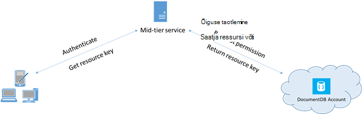

<properties 
    pageTitle="Siit saate teada, kuidas tagada DocumentDB andmetele juurdepääsu | Microsoft Azure'i" 
    description="Tutvuge Accessi juhtelemendi kontseptsioonide DocumentDB, sh juhtslaidi klahvid, kirjutuskaitstud klahvid, kasutajad ja õigused." 
    services="documentdb" 
    authors="kiratp" 
    manager="jhubbard" 
    editor="monicar" 
    documentationCenter=""/>

<tags 
    ms.service="documentdb" 
    ms.workload="data-services" 
    ms.tgt_pltfrm="na" 
    ms.devlang="na" 
    ms.topic="article" 
    ms.date="09/19/2016" 
    ms.author="kipandya"/>

# Turvaliseks DocumentDB andmetele juurdepääsu

Selles artiklis antakse ülevaade juurdepääsu [Microsoft Azure'i DocumentDB](https://azure.microsoft.com/services/documentdb/)talletatud andmed.

Pärast lugemist ülevaade sellest, on teil saama vastavad järgmistele küsimustele.  

-   Mis on DocumentDB juhtslaidi klahvid?
-   Mis on kirjutuskaitstud DocumentDB klahvide?
-   Mis on DocumentDB ressursi sõned?
-   Kuidas kasutada DocumentDB kasutajad ja õigused DocumentDB andmetele juurdepääsu turvamiseks?

## DocumentDB juurdepääsu juhtimine mõisted

DocumentDB näeb esimese klassi põhimõtet juurdepääsu DocumentDB ressursid.  Selles teemas eesmärgil DocumentDB ressursid on rühmitatud ühte kahest järgmisest kategooriast:

- Ressursside haldus
    - Konto
    - Andmebaasi
    - Kasutaja
    - Õiguste
- Rakenduse ressursid
    - Saidikogumi
    - Pakkumine
    - Dokumendi
    - Manuse
    - Salvestatud protseduur
    - Päästik
    - Kasutaja määratletud funktsioon

Nende kahe kategooria kontekstis DocumentDB toetab kolme tüüpi Accessi juhtelemendi personas: administraator, kirjutuskaitstud administraator ja andmebaasi kasutaja kontoga.  Iga juurdepääsu juhtimine persona õigused on:
 
- Konto administraator: täielik juurdepääs kõigile antud DocumentDB konto ressursse (haldus ja rakenduste).
- Kirjutuskaitstud administraator: kirjutuskaitstud juurdepääsu kõik ressursid (haldus ja taotluse antud DocumentDB konto. 
- Andmebaasi kasutaja: The DocumentDB kasutaja ressursside seostatud määratud DocumentDB andmebaasi ressursid (nt saidikogumid, dokumendid, skriptid).  Ei saa ühte või antud andmebaasi seostatud kasutaja ressursside ja iga kasutaja ressursi võib olla üks või mitu sellega seotud õigusi.

Eespool nimetatud kategooriad ja ressursside, määratleb DocumentDB juurdepääsu juhtimine mudelit kolme tüüpi Accessi importida:

- Juhtslaidi klahvid: pärast loomist DocumentDB konto, luuakse kaks juhtslaidi klahvid (esmaseid ja teiseseid).  Need klahvid luba täielik juurdepääs kõik ressursid DocumentDB kontol.

- Kirjutuskaitstud klahvid: pärast loomist DocumentDB konto, luuakse kahe kirjutuskaitstud klahvi (esmaseid ja teiseseid).  Need klahvid luba kirjutuskaitstud juurdepääs kõikidele ressurssidele DocumentDB kontol.

- Ressursi sõned: ressursi luba on seostatud DocumentDB loa ressurssi ja see sisaldab seose andmebaasi kasutaja ja luba selle kasutajal on teatud DocumentDB rakenduse ressursi (nt saidikogumi, dokumendi).

## Töötamine DocumentDB juhtslaidi ja kirjutuskaitstud võtmed

Nagu varem mainitud, sisestage DocumentDB juhtslaidi klahvid täielik juurdepääs kõigi ressursside DocumentDB konto, ajal kirjutuskaitstud klahvid luba kõik ressursside konto lugemisõigus.  Järgmised koodilõigu iseloomustab DocumentDB konto lõpp-punkti ja juhtslaidi klahvi abil väärtustada on DocumentClient ja uue andmebaasi loomiseks. 

    //Read the DocumentDB endpointUrl and authorization keys from config.
    //These values are available from the Azure Classic Portal on the DocumentDB Account Blade under "Keys".
    //NB > Keep these values in a safe and secure location. Together they provide Administrative access to your DocDB account.
    
    private static readonly string endpointUrl = ConfigurationManager.AppSettings["EndPointUrl"];
    private static readonly SecureString authorizationKey = ToSecureString(ConfigurationManager.AppSettings["AuthorizationKey"]);
        
    client = new DocumentClient(new Uri(endpointUrl), authorizationKey);
    
    // Create Database
    Database database = await client.CreateDatabaseAsync(
        new Database
        {
            Id = databaseName
        });

## Märkide DocumentDB ressursside ülevaade

Saate kasutada märgiks ressursi (loomisega DocumentDB kasutajad ja õigused) Kui soovite pakkuda juurdepääsu ressurssidele konto DocumentDB klient, mida ei saa määrata usaldusväärseks juhtslaidi võti. Teie DocumentDB juhtslaidi võtmed kaasata nii põhi- ja klahvi, mis määrab teie konto ja kõik ressursid on juurdepääs. Asetades, kas teie juhtslaidi klahvide avatakse teie konto pahatahtlik või hooletusest kasutamise võimalust. 

Samuti DocumentDB kirjutuskaitstud klahvid pakkuda lugemisõigus kõik ressursid - õiguste ressursid, välja arvatud muidugi - DocumentDB konto ja ei saa kasutada üksikasjalikuma juurdepääsu teatud DocumentDB ressursid.

DocumentDB ressursi sõned pakuvad turvaline alternatiiv, mis võimaldab klientidel lugeda, kirjutada ja kustutada kontol DocumentDB vastavalt olete andnud õigused ja ilma vajaduseta juhtslaidi või lugemine ainult võtme ressursid.

Siin on tüüpilised kujundus mustri, millega ressursi sõned võidakse taotleda, loodud ja klientideni:

1. Keskel tasandi teenus on häälestatud teenida mobiilirakenduse kasutaja fotode.
2. Keskel tasandi teenus on juhtslaidi võti DocumentDB konto.
3. Foto rakendus on installitud lõppkasutaja mobiilsideseadmetes. 
4. Login, luuakse foto rakenduse keskel tasandi teenuse kasutaja identiteet. See identiteedi ettevõtte on üksnes kuni rakendus.
5. Kui andmed on loodud, keskel tasandi teenuse taotleb määratluse õigused.
6. Keskel tasandi teenus saadab ressursside luba tagasi telefonirakenduse.
7. Telefonirakenduse edasi kasutada ressursside luba otse juurdepääsemiseks DocumentDB ressursid ressursside luba lubatud ressurss luba intervalli määratletud õigustega. 
8. Ressursi luba aegumisel edaspidised taotlused saavad 401 volitamata erand.  Selles etapis telefonirakenduse uuesti luuakse ID ja taotleb uue loa ressurssi.

## Töötamine DocumentDB kasutajad ja õigused
Ressursi DocumentDB kasutaja on seostatud DocumentDB andmebaasi.  Iga andmebaas võib sisaldada DocumentDB null või rohkem kasutajaid.  Järgmised koodilõigu näitab, kuidas luua DocumentDB kasutaja ressursi.

    //Create a user.
    User docUser = new User
    {
        Id = "mobileuser"
    };

    docUser = await client.CreateUserAsync(UriFactory.CreateDatabaseUri("db"), docUser);

> [AZURE.NOTE] Iga DocumentDB kasutajal on PermissionsLink atribuut, mida saab kasutada kasutaja õiguste loendi toomiseks.

DocumentDB loa ressurssi on seostatud DocumentDB kasutaja.  Iga kasutaja võib sisaldada null või rohkem DocumentDB õigused.  Ressursi õiguse annab juurdepääsu Turbeloa, mida kasutaja peab püüdes juurdepääsu konkreetse rakenduse ressursi.
On kaks saadaval juurdepääsutasemete, mis võib osutada loa ressurssi.

- Kõik: Kasutajal on täielik luba ressurss
- Lugege: Kasutaja saab lugeda ainult ressursi sisu, kuid ei saa teha kirjutamine, värskendamine või kustutada toimingute ressurss.

> [AZURE.NOTE] Selleks, et käivitada DocumentDB talletatud toimingute kasutaja olema kogumise salvestatud protseduur käivituvad kõik õigus.

Järgmised koodilõigu kujutatakse loa ressurssi loomine, lugemine ressursi luba õiguste ressursi ja õiguste seostada kasutaja loodud kohal.

    // Create a permission.
    Permission docPermission = new Permission
    {
        PermissionMode = PermissionMode.Read,
        ResourceLink = documentCollection.SelfLink,
        Id = "readperm"
    };
            
  docPermission = ootavad kliendi. CreatePermissionAsync (UriFactory.CreateUserUri ("db", "kasutaja"), docPermission); Console.WriteLine (docPermission.Id + "on märgiks:" + docPermission.Token);
  
Kui teie saidikogumi, siis on õigus saidikogumi määratud sektsioon klahvi, peab sisaldama dokument ja manuse ressursid ResourcePartitionKey on ResourceLink lisaks ka.

Kõigi õiguste ressursse, mis on seotud teatud kasutaja hõlpsalt saamiseks kasutada DocumentDB annab loa kanali iga kasutaja objekti.  Järgmised koodilõigu näitab, kuidas tuua õigus, mis on seotud kasutaja loodud kohal, koostada loendi õiguste ja uue DocumentClient lähtestada kasutaja nimel.

    //Read a permission feed.
    FeedResponse<Permission> permFeed = await client.ReadPermissionFeedAsync(
      UriFactory.CreateUserUri("db", "myUser"));

    List<Permission> permList = new List<Permission>();
      
    foreach (Permission perm in permFeed)
    {
        permList.Add(perm);
    }
            
    DocumentClient userClient = new DocumentClient(new Uri(endpointUrl), permList);

> [AZURE.TIP] Ressursi märgid on vaikimisi lubatud kuuline ajavahemik on 1 tund.  Sümboolne eluiga, kuid otseselt määrata, kuni 5 tundi.

## Järgmised sammud

- DocumentDB kohta lisateabe saamiseks klõpsake [siin](http://azure.com/docdb).
- Juhtslaidi ja kirjutuskaitstud haldamise kohta lisateabe saamiseks klõpsake linki [siin](documentdb-manage-account.md).
- Saate teada, kuidas koostada DocumentDB autoriseerimine sõned, klõpsake [siin](https://msdn.microsoft.com/library/azure/dn783368.aspx)
 
