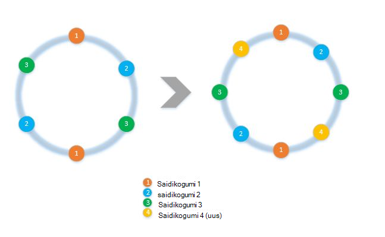
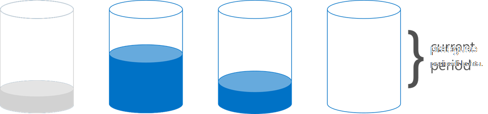

<properties 
    pageTitle="Kuidas rakendada kliendi küljel eraldamine koos selle SDK-d | Microsoft Azure'i" 
    description="Saate teada, kuidas kasutada funktsiooni Azure'i DocumentDB SDK-d partition (Kildu) andmed ja marsruutimiseks päringutele üle mitme saidikogumid" 
    services="documentdb" 
    authors="arramac" 
    manager="jhubbard" 
    editor="cgronlun" 
    documentationCenter=""/>

<tags 
    ms.service="documentdb" 
    ms.workload="data-services" 
    ms.tgt_pltfrm="na" 
    ms.devlang="na" 
    ms.topic="article" 
    ms.date="10/27/2016" 
    ms.author="arramac"/>

# <a name="how-to-partition-data-using-client-side-support-in-documentdb"></a>Sektsiooni andmete kasutamine DocumentDB kliendipoolne tugi

Azure'i DocumentDB toetab [Automaatne eraldamine kogumite](documentdb-partition-data.md). On siiski kasutada juhul, kui on kasulik peene tekstuuriga juhtida eraldamine käitumine. Tööülesannete jagamine nõutav müügipakkumise-plaat koodi vähendamiseks oleme lisanud funktsioonide .net-i, Node.js ja Java SDK-d, mis hõlbustab luua rakendusi, mis on mastaabitud välja üle mitme saidikogumid.

Selles artiklis võtame pilk tunnid ja liideste .NET SDK ja kuidas saate neid kasutada, arendada sektsioonitud rakendusi. Muud SDK-d, nt Java, Node.js ja Python toetavad sarnaseid meetodite ja liideste kliendipoolne jagamine.

## <a name="client-side-partitioning-with-the-documentdb-sdk"></a>Kliendipoolne eraldamine DocumentDB SDK

Enne me tõrkeid süvitsi uurida eraldamine, sulgege Vaatame mõned DocumentDB põhimõtted, mis on seotud eraldamine. Iga Azure'i DocumentDB andmebaasi konto koosneb andmebaase, kumbki sisaldab mitut saidikogumid, mis võib sisaldada salvestatud toimingute, päästikute, UDF-ID, dokumente ja seotud manused. Saidikogumite saab ühe-sektsiooni või sektsioonitud, ise ja on järgmised atribuudid:

- Saidikogumite pakkuda jõudluse eraldamise. Seega on jõudluse kasulik on sarnane sama kogumis dokumentide võrdlemiseks. Näiteks sarja kellaajaandmete, võite asetada andmete eelmine kuu, mis on sageli esitama päringu, sees kogumine kõrgema ettevalmistatud läbilaskevõime tuleks vanemate andmed paigutatakse ettevalmistatud väikese läbilaskevõimega saidikogumite jaoks.
- HAPPE tehingud st salvestatud toimingute ja käivitab ei saa jaotada kogumi. Tehingud ulatus on määratud sektsioon ühe võtmeväärtuse kogumi sees.
- Saidikogumite Jõusta skeemile, nii, et neid saab kasutada sama tüüpi või erinevat tüüpi JSON dokumentide jaoks.

Alustades versiooni [1.5.x, Azure'i DocumentDB SDK-d](documentdb-sdk-dotnet.md), saate dokumendi toiminguid teha otse andmebaasis. Ettevõttesiseselt [DocumentClient](https://msdn.microsoft.com/library/azure/microsoft.azure.documents.client.documentclient.aspx) kasutab teie määratud PartitionResolver marsruutimiseks taotluste vastav saidikogumi andmebaasist.

>[AZURE.NOTE] [Serveripoolne eraldamine](documentdb-partition-data.md) kasutusele REST API 2015-12-16 ja SDK-d 1.6.0+ deprecates kliendipoolne partition lahendaja lähenemine lihtsa kasutamise juhtudel. Kliendipoolne eraldamine siiski on paindlikumad ja abil saate reguleerida jõudluse eraldamise üle partition klahvid, taseme paralleelsus määrata mitu sektsiooni: tulemuste lugemise ajal ja kasutada vahemiku/ruumiline eraldamine lähenemisel vs räsi.

Näiteks .net-i, on iga PartitionResolver klassi konkreetne rakendamine [IPartitionResolver](https://msdn.microsoft.com/library/azure/microsoft.azure.documents.client.ipartitionresolver.aspx) kasutajaliides, mis on kolm võimalust – [GetPartitionKey](https://msdn.microsoft.com/library/azure/microsoft.azure.documents.client.ipartitionresolver.getpartitionkey.aspx), [ResolveForCreate](https://msdn.microsoft.com/library/azure/microsoft.azure.documents.client.ipartitionresolver.resolveforcreate.aspx) ja [ResolveForRead](https://msdn.microsoft.com/library/azure/microsoft.azure.documents.client.ipartitionresolver.resolveforread.aspx). LINQ päringute ja ReadFeed Iteraatorid kasutage ResolveForRead meetodit ettevõttesiseselt kordamiseks üle kõigi saidikogumite sektsiooni võti taotluse vastavad. Samuti saate luua ResolveForCreate meetodi abil saate marsruutida loob õige sektsiooni toimingute kasutamine. Pole vaja Asenda muudatusi, kustutamine ja lugeda, kuna need kasutavad dokumentidega, mis sisaldavad juba vastavate saidikogumi viide.

Funktsiooni SDK-d sisaldab ka kahte klassi, mis toetavad kahe kanoonilise eraldamine meetodid, räsi ja vahemiku otsingud, on [HashPartitionResolver](https://msdn.microsoft.com/library/azure/microsoft.azure.documents.partitioning.hashpartitionresolver.aspx) ja on [RangePartitionResolver](https://msdn.microsoft.com/library/azure/mt126047.aspx)kaudu. Nende klassi abil saate hõlpsalt rakenduse eraldamine loogika lisamine.  

## <a name="add-partitioning-logic-and-register-the-partitionresolver"></a>Eraldamine loogika lisamine ja selle PartitionResolver registreerimine 

Siin on tekstifail, mis näitab, kuidas luua mõne [HashPartitionResolver](https://msdn.microsoft.com/library/azure/microsoft.azure.documents.partitioning.hashpartitionresolver.aspx) ja andmebaasi DocumentClient registreerida.

```cs
// Create some collections to partition data.
DocumentCollection collection1 = await client.CreateDocumentCollectionAsync(...);
DocumentCollection collection2 = await client.CreateDocumentCollectionAsync(...);

// Initialize a HashPartitionResolver using the "UserId" property and the two collection self-links.
HashPartitionResolver hashResolver = new HashPartitionResolver(
    u => ((UserProfile)u).UserId, 
    new string[] { collection1.SelfLink, collection2.SelfLink });

// Register the PartitionResolver with the database.
this.client.PartitionResolvers[database.SelfLink] = hashResolver;

```

## <a name="create-documents-in-a-partition"></a>Sektsiooni dokumentide loomine  

Kui olete selle PartitionResolver on registreerunud, saate teha loob ja päringute otse andmebaasis, nagu allpool näidatud. Selles näites kasutatakse SDK on PartitionResolver ekstraktida soovitud kasutajanimi, räsi see ja seejärel kasutage väärtust marsruutimiseks õige saidikogumi loomine toiming.

```cs
Document johnDocument = await this.client.CreateDocumentAsync(
    database.SelfLink, new UserProfile("J1", "@John", Region.UnitedStatesEast));
Document ryanDocument = await this.client.CreateDocumentAsync(
    database.SelfLink, new UserProfile("U4", "@Ryan", Region.AsiaPacific, UserStatus.AppearAway));
```

## <a name="create-queries-against-partitions"></a>Päringute vastu sektsioonid loomine  

Saate päringu, mille andmebaas ja sektsiooni võtme [CreateDocumentQuery](https://msdn.microsoft.com/library/azure/microsoft.azure.documents.linq.documentqueryable.createdocumentquery.aspx) meetodi abil. Päring tagastab ühe tulemite üle kõigi saidikogumite sees andmebaasi, mis vastendamine sektsiooni võti.  

```cs
// Query for John's document by ID - uses PartitionResolver to restrict the query to the partitions 
// containing @John. Again the query uses the database self link, and relies on the hash resolver 
// to route the appropriate collection.
var query = this.client.CreateDocumentQuery<UserProfile>(
    database.SelfLink, null, partitionResolver.GetPartitionKey(johnProfile))
    .Where(u => u.UserName == "@John");
johnProfile = query.AsEnumerable().FirstOrDefault();
```

## <a name="create-queries-against-all-collections-in-the-database"></a>Andmebaasi päringute vastu kõigi Saidikogumite loomine 

Saate päringu kõigi saidikogumite andmebaasi sees ja loetlemine tulemused nagu allpool sektsiooni võtme argumendi vahele.

```cs
// Query for all "Available" users. Here since there is no partition key, the query is serially executed 
// across each partition/collection and returns a single result-set. 
query = this.client.CreateDocumentQuery<UserProfile>(database.SelfLink)
    .Where(u => u.Status == UserStatus.Available);
foreach (UserProfile activeUser in query)
{
    Console.WriteLine(activeUser);
}
```

## <a name="hash-partition-resolver"></a>Räsi Partition lahendaja
Koos räsi eraldamine, sektsioonid on määratud väärtuse räsi funktsioon, mis võimaldab teil ühtlaselt jaotada taotlusi ja andmete kogu sektsioonide arvu põhjal. See lähenemine on tavaliselt kasutatakse sektsiooni andmete toodeti või tarbitud paljude erinevate klientide ja on kasulik kasutajaprofiilid, kataloogiüksuste ja asjade ("asjade Internetis") telemeetria andmete talletamiseks. Räsi eraldamine kasutavad ka DocumentDB's serveripoolne eraldamine tugi kogumi sees.

**Räsi eraldatav:**


Lihtne räsi eraldamine värviskeemi üle *N* saidikogumid oleks võtta mis tahes dokument, mis see on paigutatud saidikogumi määratlemiseks *hash(d) mod N* arvutada. Kuid probleem seda lihtsat meetodit, et see ei tööta ka siis, kui uued saidikogumid lisada või eemaldada saidikogumid, nagu see nõuaks peaaegu kõik andmed, et saada reshuffled. [Ühtsete räsi] (http://citeseerx.ist.psu.edu/viewdoc/summary?doi=10.1.1.23.3738) on tuntud algoritmi, mis käsitleb see rakendades loob rakendus värviskeemi, mis vähendab summa andmete liikumise ajal lisamise või eemaldamise saidikogumid on vajalik.

Klassi [HashPartitionResolver](https://msdn.microsoft.com/library/azure/microsoft.azure.documents.partitioning.hashpartitionresolver.aspx) rakendab loogika koostamiseks ühtsete räsi ring räsi funktsiooni määratud [IHashGenerator](https://msdn.microsoft.com/library/azure/microsoft.azure.documents.partitioning.ihashgenerator.aspx) kasutajaliidese üle. Vaikimisi on HashPartitionResolver kasutab funktsioon MD5 räsi, kuid saate selle välja vahetada oma loob rakendus rakendamist. Soovitud HashPartitionResolver loob ettevõttesiseselt 16 hashes või "virtuaalse sõlmed" sees räsi Helista iga saidikogumi jaoks saavutamiseks ühtlustada jaotumine dokumentide kogumite üle, kuid teil võib olla muutuv selle välja andmete asümmeetriakordaja summa kliendi küljel arvutus trade arvu.

**Ühtse räsi koos HashPartitionResolver:**


## <a name="range-partition-resolver"></a>Vahemiku Partition lahendaja

Klõpsake vahemiku eraldamine, määratakse sektsioonid vastavalt sellele, kas sektsiooni võti on teatud vahemikus. See on levinud jagamine aja tempel omadused (nt eventTime 1 aprill 2015 ja 14 aprill 2015 vahel). Klassi [RangePartitionResolver](https://msdn.microsoft.com/library/azure/mt126047.aspx) aitab säilitada vastenduse vahel\<T\> ja saidikogumi omas link. 

[Vahemiku\<T\> ](https://msdn.microsoft.com/library/azure/mt126048.aspx) on lihtne klassi vahemikud, mis tahes tüüpi juurutama liidese IComparable haldava\<T\> ja IEquatable\<T\> nagu stringide või arve. Jaoks loeb ja loob, võite anda mis tahes suvalise vahemikus ja selle lahendaja tuvastab kõik testversiooni saidikogumid tuvastades vahemikud sektsioonide, mis kattuks nõutud paljude. See funktsioon võib olla kasu, täites vahemiku päringute kellaajaandmeid sarja vastu.

**Vahemiku eraldamine:**  

  

Vahemiku eraldamine teisiti juhtumi on kui vahemik on vaid ühe eraldi väärtuse, nimetatakse "eraldamine otsing". See on levinud jagamine regiooniti (nt sektsioon Scandinavia sisaldab Norra, Taani ja Rootsi) või mitme rentniku rakenduse rentnikega jagamine.

## <a name="samples"></a>Näidised 

Heitke pilk [DocumentDB eraldamine näidised Github projekti](https://github.com/Azure/azure-documentdb-dotnet/tree/287acafef76ad223577759b0170c8f08adb45755/samples/code-samples/Partitioning) sisaldav Koodilõigud, kuidas kasutada neid PartitionResolvers ja laiendamine neid rakendada oma selsüünid mahutamiseks teatud kasutamise juhtudel, näiteks järgmine: 

* Kuidas määrata avaldise suvalise lambda GetPartitionKey ja seda kasutada liitindeksi eraldamine klahvid või partition erinevat tüüpi objektid teisiti.
* Kuidas luua lihtne [LookupPartitionResolver](https://github.com/Azure/azure-documentdb-dotnet/blob/287acafef76ad223577759b0170c8f08adb45755/samples/code-samples/Partitioning/Partitioners/LookupPartitionResolver.cs) , mida kasutab käsitsi otsingutabel eraldamine. See muster on levinud jagamine eraldi väärtuste nagu piirkond, rentniku ID või rakenduse nimi.
* Kuidas luua [ManagedPartitionResolver](https://github.com/Azure/azure-documentdb-dotnet/blob/287acafef76ad223577759b0170c8f08adb45755/samples/code-samples/Partitioning/Partitioners/ManagedHashPartitionResolver.cs) , mis loob automaatselt põhjal Mall, mis määrab nime värviskeemi, IndexingPolicy ja salvestatud toimingute, mis on vaja registreerida vastu uued saidikogumid saidikogumid.
* Kuidas luua värviskeemi-vähem [SpilloverPartitionResolver](https://github.com/Azure/azure-documentdb-dotnet/blob/287acafef76ad223577759b0170c8f08adb45755/samples/code-samples/Partitioning/Partitioners/SpilloverPartitionResolver.cs) , mis loob uue saidikogumid lihtsalt täitke vana saidikogumid.
* Kuidas serialiseerida ja andmeatribuutide oleku PartitionResolver JSON, kui nii, et saate ühiskasutusse anda ja protsesside vahel sulgemiste. Saate need config faili või isegi DocumentDB saidikogumi jää püsima.
* Ühtse räsi põhjal [DocumentClientHashPartitioningManager](https://github.com/Azure/azure-documentdb-dotnet/blob/287acafef76ad223577759b0170c8f08adb45755/samples/code-samples/Partitioning/Util/DocumentClientHashPartitioningManager.cs) klassis dünaamiliselt lisamine ja eemaldamine sektsioonide liigendatud andmebaasi. Ettevõttesiseselt see kasutab [TransitionHashPartitionResolver](https://github.com/Azure/azure-documentdb-dotnet/blob/287acafef76ad223577759b0170c8f08adb45755/samples/code-samples/Partitioning/Partitioners/TransitionHashPartitionResolver.cs) marsruutimiseks loeb ja kirjutab migreerimisel, kasutades ühte neljast režiimid - lugeda vana eraldamine kava (ReadCurrent) uue (ReadNext) ühendamine tulemusi (ReadBoth) või olla saadaval migreerimisel (pole).

Soovitame teil pull taotlusi panuse, millest võib olla kasu muude DocumentDB arendajate näidised on avatud allikas. Lugege juhised selle kohta, kuidas täiendada [haldaja juhised](https://github.com/Azure/azure-documentdb-net/blob/master/Contributing.md) .  

>[AZURE.NOTE] Saidikogumi loob on määr-piiratud DocumentDB, et mõned siin näidatud valimi meetodid võib kuluda mõni minut lõpuleviimiseks.

##<a name="faq"></a>KKK
**Kas DocumentDB toetab serveripoolne eraldamine?**

Jah, toetab DocumentDB [serveripoolne eraldamine](documentdb-partition-data.md). DocumentDB toetab samuti kliendipoolne eraldamine kaudu kliendipoolne partition selsüünid täpsemate kasutamise juhtudel.

**Millal peaks kasutama serveripoolne vs kliendipoolne eraldamine?**
Enamikul juhtudel kasutamine, soovitame serveripoolne eraldamine, kuna käsitlemisel haldustoiminguid eraldamine andmete ja kutsed marsruutimine kasutamine. Kui teil on vaja vahemiku eraldamine või on eriotstarbeline kasutamine puhul jõudluse partition klahvid erinevate väärtuste vahelise eraldustaseme, siis kliendipoolne eraldamine võib siiski parim lahendus.

**Kuidas lisada või eemaldada kogumi minu eraldamine värviskeemi?**

Heitke pilk DocumentClientHashPartitioningManager rakendamise näidised projekti jaoks näide sellest, kuidas rakendada ümbersektsioonimist.

**Kuidas püsida või minu eraldamine konfiguratsiooni jagamine teiste klientide?**

Saate serialiseerida JSON partitioner riigi ja salvestada failid, või isegi DocumentDB saidikogumid. Heitke pilk RunSerializeDeserializeSample meetodit, näiteks Projectis näidised.

**Kuidas ma keti mitmesuguste eraldamine tehnikate?**

Rakendades oma IPartitionResolver, mis kasutab ettevõttesiseselt ühe või mitme olemasoleva selsüünid saab keti PartitionResolvers. Heitke pilk TransitionHashPartitionResolver näidised projekti näidet.

##<a name="references"></a>Viited
* [Serveripoolne eraldamine DocumentDB sisse](documentdb-partition-data.md)
* [DocumentDB saidikogumite ja jõudluse tasemed](documentdb-performance-levels.md)
* [Eraldamine koodinäiteid github](https://github.com/Azure/azure-documentdb-dotnet/tree/287acafef76ad223577759b0170c8f08adb45755/samples/code-samples/Partitioning)
* [DocumentDB .NET SDK dokumentatsiooni MSDN-i](https://msdn.microsoft.com/library/azure/dn948556.aspx)
* [DocumentDB .net-i näited](https://github.com/Azure/azure-documentdb-net)
* [DocumentDB piirangud](documentdb-limits.md)
* [Jõudluse näpunäiteid DocumentDB ajaveeb](https://azure.microsoft.com/blog/2015/01/20/performance-tips-for-azure-documentdb-part-1-2/)
 
