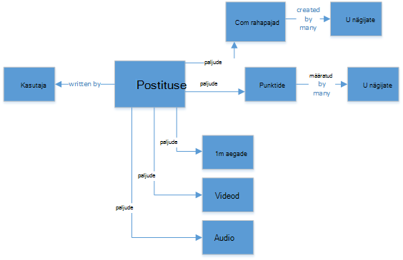
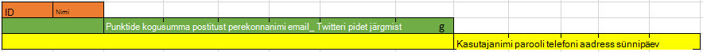
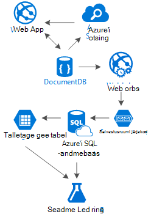

<properties 
    pageTitle="DocumentDB kujundus mustri: sotsiaalmeedia rakendused | Microsoft Azure'i" 
    description="Lisateavet kujundus mustri suhtlusvõrgustike tehtavate salvestusruumi paindlikkust DocumentDB ja Azure teenuseid." 
    keywords="sotsiaalmeedia rakendused"
    services="documentdb" 
    authors="ealsur" 
    manager="jhubbard" 
    editor="" 
    documentationCenter=""/>

<tags 
    ms.service="documentdb" 
    ms.workload="data-services" 
    ms.tgt_pltfrm="na" 
    ms.devlang="na" 
    ms.topic="article" 
    ms.date="09/27/2016" 
    ms.author="mimig"/>

# Avage social DocumentDB abil

Elavad oluliselt omavahel ühiskonnas tähendab, et elu mingil hetkel jääte **suhtlusvõrgu**. Kasutame suhtlusvõrgustike kursis hoida perekonna, sõprade, kolleegide või meie ühiskasutusse inimestele ühiste huvide vahel.

Inseneride või arendajate, me võib mõelnud, kuidas neid võrke talletada ja meie andmed ühendada või võimalik on ka ülesandeks loomiseks või arhitekt mõne kindla turunišši uue suhtlusvõrgu ise. Siis suur küsimus: kuidas see kõik andmed talletatakse?

Oletame, et loome uue ja särav suhtlusvõrgu, kus saate meie kasutajad postitavad artiklid seotud meediaga, nt pildid, videod või isegi. Kasutajad saavad kommenteerida postitusi ja anda punktide hinnangute. On postitusi, mida kasutajad näevad kanalisse ja saaksid suhelda sihtleht pealehele. See ei heli väga keerukate (alguses), kuid huvides lihtne, vaatame lõpe (me võib süveneda seosed poolt mõjutatud kasutajate kanalid, kuid see ületab käesoleva artikli eesmärk).

Jah, kuidas saaksime seda talletada ja kus?

Paljud võis kogemus SQL andmebaase või olema vähemalt mõiste [relatsiooniliste andmete modelleerimine](https://en.wikipedia.org/wiki/Relational_model) ja võite soovida alustamiseks joonistamise umbes selline:

 

Täiesti normaliseeritud ja päris andmestruktuur... mida ei skaala. 

Ärge mind valesti, olete töötanud SQL andmebaase kogu oma elu, nad on hea, kuid iga muster, tava- ja tarkvara platvorm, nagu see pole täiuslik kõigi stsenaariumide.

Miks ei ole SQL-i parim valik selle stsenaariumi? Vaatame struktuuri ühe postituse, kui ma ma pean tehke päring koos selle postituse kuvamiseks veebisaidi või rakenduse... 8 tabeli ühendused (!) lihtsalt ühe ühe postituse, nüüd voo postitusi, mis dünaamiliselt laadimine ja kuvatakse ekraani ja võidakse kuvada, kui ma pildi kuvamiseks.

Võiks muidugi kasutame humongous SQL-i eksemplari piisavalt Power lahendada tuhandete päringute abil neid paljude ühenduste teenida meie sisu, kuid tõesti, miks me kui lihtsam lahendus on olemas?

## NoSQL tee

Olemas on ka teisiti Graphi andmebaasidele, mis saab [käivitada Azure](http://neo4j.com/developer/guide-cloud-deployment/#_windows_azure) , kuid need ei ole odav ja IaaS services nõutav (taristu-kui-a-Service, Virtuaalmasinates peamiselt) ja hooldus. Ma eesmärk selles artiklis alumise maksumus lahenduse, mis töötavad enamik stsenaariumid, töötavate Azure NoSQL andmebaasi [DocumentDB](https://azure.microsoft.com/services/documentdb/). [NoSQL](https://en.wikipedia.org/wiki/NoSQL) lähenemisviisi, JSON-vormingus andmete talletamiseks ja [denormalization](https://en.wikipedia.org/wiki/Denormalization), rakendades meie varem keeruline postituse saab muuta ühe [dokumendi](https://en.wikipedia.org/wiki/Document-oriented_database):

    {
        "id":"ew12-res2-234e-544f",
        "title":"post title",
        "date":"2016-01-01",
        "body":"this is an awesome post stored on NoSQL",
        "createdBy":User,
        "images":["http://myfirstimage.png","http://mysecondimage.png"],
        "videos":[
            {"url":"http://myfirstvideo.mp4", "title":"The first video"},
            {"url":"http://mysecondvideo.mp4", "title":"The second video"}
        ],
        "audios":[
            {"url":"http://myfirstaudio.mp3", "title":"The first audio"},
            {"url":"http://mysecondaudio.mp3", "title":"The second audio"}
        ]
    }

Ja see saab ühe päringu ja pole ühendused. See on palju lihtne ja arusaadav ja budget-wise, see nõuab vähem ressursse parema tulemuse saavutamiseks.

Azure'i DocumentDB teeb kindel, et kõik atribuudid on indekseeritud selle [automaatse indekseerimise](documentdb-indexing.md), mis saab isegi [kohandada](documentdb-indexing-policies.md). Skeemi häirimatu lähenemine võimaldab meile erinevate ja dünaamiline struktuuriga, võib-olla homme soovime postituste olema loendi kategooriad või nendega seotud hashtags dokumentide talletamine, DocumentDB tegeleb uued dokumendid lisatakse atribuutidega koos nõutud meile ilma lisatööd.

Postituse kommentaare saate käsitletakse ainult muude postituste ema atribuut (lihtsustab meie objekti vastenduse). 

    {
        "id":"1234-asd3-54ts-199a",
        "title":"Awesome post!",
        "date":"2016-01-02",
        "createdBy":User2,
        "parent":"ew12-res2-234e-544f"
    }

    {
        "id":"asd2-fee4-23gc-jh67",
        "title":"Ditto!",
        "date":"2016-01-03",
        "createdBy":User3,
        "parent":"ew12-res2-234e-544f"
    }

Ja kõik social kasutusviisid saab salvestada eraldi objekti hinnale.

    {
        "id":"dfe3-thf5-232s-dse4",
        "post":"ew12-res2-234e-544f",
        "comments":2,
        "likes":10,
        "points":200
    }

Kanalite loomise on vaid paari postituse antud asjakohasuse Tellimuse ID algusse loendi reguleerivad dokumentide loomine.

    [
        {"relevance":9, "post":"ew12-res2-234e-544f"},
        {"relevance":8, "post":"fer7-mnb6-fgh9-2344"},
        {"relevance":7, "post":"w34r-qeg6-ref6-8565"}
    ]

Saaksime "viimast" voo postituste loomine kuupäeva järgi, "kuumimas" voo koos nende postitustega rohkem meeldib viimase 24 tunni jooksul, me ei saanud isegi rakendada kohandatud voo iga kasutaja loogika nagu jälgijad ja huvide põhjal ja oleks postituste loendit. See on küsimus, kuidas koostada nende loendite, kuid lugemise jõudlus jääb takistamatult. Kui me omandada üks need loendid, oleme välja ühe päringu DocumentDB abil soovitud [tehtemärk IN](documentdb-sql-query.md#where-clause) saada postituste lehekülge korraga.

Kanali voogu võiks ehitada abil [Azure rakenduse teenuste](https://azure.microsoft.com/services/app-service/) taust protsessid: [Webjobs](../app-service-web/web-sites-create-web-jobs.md). Kui postitusele on loodud, saate tausta töötlemine käivitanud [Azure Storage](https://azure.microsoft.com/services/storage/) [järjekorrad](../storage/storage-dotnet-how-to-use-queues.md) ja Webjobs vallandanud abil [Azure'i Webjobs SDK](../app-service-web/websites-dotnet-webjobs-sdk.md), postituse paljundamine sees voogu vastavalt oma kohandatud loogika rakendamise abil. 

Punktide ja meeldimiste üle postituses saab töödelda see sama võtet abil luua lõpuks ühtsete keskkond viivitatud viisil.

Jälgijad on keerukam. DocumentDB on dokumendi suuruspiirangut 512 KB, nii arvate dokumendina selle struktuuriga jälgijad salvestamise kohta.

    {
        "id":"234d-sd23-rrf2-552d",
        "followersOf": "dse4-qwe2-ert4-aad2",
        "followers":[
            "ewr5-232d-tyrg-iuo2",
            "qejh-2345-sdf1-ytg5",
            //...
            "uie0-4tyg-3456-rwjh"
        ]
    }

Kasutaja, kellel on mõni tuhandeliste puhul jälgijad, kuid kui mõni kuulsus ühendab meie ridadesse, see lähenemine on lõpuks tabas dokumendi suurus ots.

Seda probleemi lahendada, kasutame kombineeritud lähenemine. Kasutajastatistika dokumendi osana saame talletada arvu jälgijad:

    {
        "id":"234d-sd23-rrf2-552d",
        "user": "dse4-qwe2-ert4-aad2",
        "followers":55230,
        "totalPosts":452,
        "totalPoints":11342
    }

Ja tegelik graafik jälgijad saab salvestada Azure'i salvestusruumi tabelite abil [laiend](https://github.com/richorama/AzureStorageExtensions#azuregraphstore) , mis võimaldab lihtsa "A-toimingutega-B" salvestamine ja otsing. Me saate delegeerida andmetoomisteenused protsessi täpse jälgijad loendi (kui peame) Azure'i salvestusruumi tabelitele, kuid kiirülevaate arvude otsingu jaoks nii edasi kasutada DocumentDB.

## "Redeli" mustri ja andmete kordamine

Kui te olete märganud JSON dokument, mis viitab postituses, on kasutaja kordumist. Ja te soovite arvasid right, see tähendab, et teavet, mis tähistab antud selle denormalization kasutaja, võib esineda rohkem kui ühes kohas.

Selleks, et kiirem päringuid, meil tekivad andmete kordamise. See pool efekt probleem on, et kui teatud toimingu, kasutaja andmete muutmine, läheb vaja leida kõiki tegevusi ta kunagi ei ega Värskenda neid kõik. Ei heli väga praktiline, õige?

Graafik andmebaaside lahendada see oma viisil, me seda klahvi atribuutide kasutaja, mis on meie rakenduse iga tegevuse näitame tuvastades lahendada. Kui visuaalselt Kuva postituses meie rakenduses ja kuvada ainult soovitud autori nimi ja pilt, miks talletada kõik kasutaja andmed atribuudi "createdBy"? Kui iga kommentaari näitame vaid kasutaja pildi, me ei pea tingimata oma andmed. Siin tuleb midagi helistada "redel muster" mängu.

Vaatame kasutajateabe, nagu näiteks:

    {
        "id":"dse4-qwe2-ert4-aad2",
        "name":"John",
        "surname":"Doe",
        "address":"742 Evergreen Terrace",
        "birthday":"1983-05-07",
        "email":"john@doe.com",
        "twitterHandle":"@john",
        "username":"johndoe",
        "password":"some_encrypted_phrase",
        "totalPoints":100,
        "totalPosts":24
    }
    
Selle teabe vaadates me kiiresti avastada mis on kriitilist teavet ja mis pole, luues "Redeli":

Väikseim etappi nimetatakse UserChunk, minimaalne infokillu, mille abil tuvastatakse kasutaja ja seda kasutatakse andmete kordamise. Dubleeritud andmete maht vähendades ainult teavet "näitame" me vähendada ulatusliku uuendused võimalust.

Teise eesnime etappi nimetatakse kasutaja, on täielik andmed, mida kasutatakse enamik jõudluse sõltuv päringud DocumentDB juurde ja kriitiline. See sisaldab mõnda UserChunk tähistatud teavet.

Suurim on laiendatud kasutaja. See sisaldab kriitiline kasutaja teabe Plusi muid andmeid, mis ei nõua väga kiiresti lugeda või see kasutamine on lõpliku (nt protsessi Logi sisse). Väljaspool DocumentDB Azure'i SQL-andmebaasi või Azure salvestusruumi tabeleid saab salvestada andmed.

Miks me tükeldamine kasutaja ja isegi talletamise erinevates kohtades? Kuna DocumentDB mäluruum on [pole lõpmatu](documentdb-limits.md) ja jõudluse osutage vaade, seda suurem dokumendid, on kallim päringud. Säilita dokumentide õhuke tehke kõik teie jõudluse sõltuv päringud oma suhtlusvõrgustikku, ja salvestada selle täiendavat teavet lõpliku stsenaariumid, nt täielik profiili muudatused sisselogimise, isegi andmete hankimise Kasutusanalüüsi ja Big Data algatused õige teabega. Väga ei teeme kui andmete kogumine andmete hankimiseks on aeglasem, kuna see töötab Azure'i SQL-andmebaasi, meil on seotud küll, et kasutajatel on kiire ja õhuke kogemus. Kasutaja, salvestatud DocumentDB, peaks välja nägema selline:

    {
        "id":"dse4-qwe2-ert4-aad2",
        "name":"John",
        "surname":"Doe",
        "username":"johndoe"
        "email":"john@doe.com",
        "twitterHandle":"@john"
    }

Ja näeks postitusele.

    {
        "id":"1234-asd3-54ts-199a",
        "title":"Awesome post!",
        "date":"2016-01-02",
        "createdBy":{
            "id":"dse4-qwe2-ert4-aad2",
            "username":"johndoe"
        }
    }

Ja kui redigeerimise tekib, kus üks see kogum atribuudid mõjutab, on lihtne leida probleemse dokumentide abil päringuid, mis viitavad indekseeritud atribuute (valige * FROM postituste p kus p.createdBy.id == "edited_user_id") ja seejärel värskendamise tükkideks.

## Välja Otsing

Kasutajaid luua Õnneks palju sisu. Meil peaks oskama võimaluse otsida ja sisu otsimine, mis ei pruugi olla otse oma sisu voogu ehk Kuna järgime loojad ja võib-olla me lihtsalt üritavad see vana postitus ikka 6 kuud tagasi.

Õnneks ja kuna me kasutame Azure'i DocumentDB, saame hõlpsalt rakendada otsingumootori kasutamine [Azure otsida](https://azure.microsoft.com/services/search/) paar minutit ja üks rida koodi (välja arvatud ilmselt, otsingu protsess ja UI) tippimata.

Miks on see nii lihtne?

Azure'i otsingu rakendab, mida nad kutsuvad [Indexers](https://msdn.microsoft.com/library/azure/dn946891.aspx), millega teie andmete hoidlate tausta protsesside ja automagically lisamine, värskendamine või eemaldamine indeksid oma objektid. Mõne [Azure'i SQL-andmebaasi indexers](https://blogs.msdn.microsoft.com/kaevans/2015/03/06/indexing-azure-sql-database-with-azure-search/), [Azure plekid indexers](../search/search-howto-indexing-azure-blob-storage.md) ja Õnneks [Azure'i DocumentDB indexers](../documentdb/documentdb-search-indexer.md)toega. Üleminek DocumentDB teabe otsimiseks Azure on väga lihtne, nii poe teavet JSON-vormingus, kui vaja ainult [meie indeksi](../search/search-create-index-portal.md) loomiseks ja kaardi, millised atribuudid meie dokumentidest soovime indekseeritud ja mis on, paari minutiga (sõltub meie andmete maht), kõik meie sisu on kättesaadav pilvetaristu parim lahendus otsing-kui-a-Service, otsida. 

Azure'i otsingu kohta lisateabe saamiseks võite külastada [Linnunradan juhendi otsing](https://blogs.msdn.microsoft.com/mvpawardprogram/2016/02/02/a-hitchhikers-guide-to-search/).

## Aluseks oleva teadmisi

Pärast salvestamise kogu selle sisu, mis kasvab ja kasvab iga päev, me võib leida ennast mõtlete: mida teha koos kõigi selle voo teave minu kasutajate eest?

Vastus on väga lihtne: Pane see töötada ja õppida.

Kuid, mida me õppida? Mõned lihtne näited [meeleolu analüüsi](https://en.wikipedia.org/wiki/Sentiment_analysis)sisu soovitused, mis põhineb kasutaja eelistused või isegi mõni automatiseeritud sisu moderaator mis tagab, et kogu sisu, mis on avaldatud meie suhtlusvõrgu on turvalised pere jaoks.

Nüüd, kui mul on teil ühendatud, kuvatakse tõenäoliselt arvate, peate mõne PhD matemaatika teadus nende mustrite ja teavet välja lihtsa andmebaasid ja failide ekstraktimiseks, kuid oleks vale.

[Azure'i masina õ](https://azure.microsoft.com/services/machine-learning/), osa [Cortana ärianalüüsi komplekti](https://www.microsoft.com/en/server-cloud/cortana-analytics-suite/overview.aspx), on selle täielikult hallatud pilveteenuses, mis võimaldab teil luua töövoogude abil algoritmide lihtne-hiirega liides, kood oma algoritmide [r](https://en.wikipedia.org/wiki/R_(programming_language)) või kasutage mõnda juba loodud ja kasutusvalmis API-de näiteks: [Teksti Analytics](https://gallery.cortanaanalytics.com/MachineLearningAPI/Text-Analytics-2), [Sisu moderaator](https://www.microsoft.com/moderator) või [soovitusi](https://gallery.cortanaanalytics.com/MachineLearningAPI/Recommendations-2).

Saavutada nende masina õ stsenaariumide, me [Azure'i andmed Lake](https://azure.microsoft.com/services/data-lake-store/) abil saate eri allikatest pärit teabe neelata ja teabe töötlemine ja luua väljundi, mida saab töödelda Azure seadme õ [U-SQL-i](https://azure.microsoft.com/documentation/videos/data-lake-u-sql-query-execution/) abil.

Teine võimalus on kasutada [Microsoft kognitiivse teenuste](https://www.microsoft.com/cognitive-services) analüüsimiseks meie kasutajate sisu; saate me need paremini mõista (analüüsimine, mida nad kirjutada [teksti Analytics](https://www.microsoft.com/cognitive-services/en-us/text-analytics-api)API-ga) kaudu, vaid saaksime ka soovimatud või küps sisu avastada ja tegutseda [arvuti nägemine](https://www.microsoft.com/cognitive-services/en-us/computer-vision-api)API-ga. Kognitiivne teenused sisaldavad palju out-of-box lahendusi, mis ei nõua iga liiki seadme õ teadmisi kasutada.

## Kokkuvõte

Selles artiklis proovib huvipakkuvaid mõned alternatiivid loomise suhtlusvõrgustike täielikult Azure madala hinnaga teenustega ja hea tulemuste kasutamist mitmekihilist salvestusruumi lahenduse ja andmete jaotuse nimega "Redeli" üheks.

Etalonina on seal pole hõbedane täpi stsenaariumid selline, oleks hea teenuseid, mis võimaldavad luua suurepärase kogemusi kombinatsiooni loodud sünergia: Azure'i DocumentDB esitada on hea rakenduse ärianalüüsi taha esimese klassi otsingu lahenduse Azure'i otsing, nt vaba ja kiiruse Azure rakenduse teenuste Host paindlikkust isegi keele diagnostika rakenduste aga võimsaid taustaprotsessid ja laiendatav Azure Storage ja Azure SQL-i andmebaas suurel hulgal andmeid ja analüütiline power Azure seadme õppe luua teadmisi ja ärianalüüsi, mida saab tagasiside meie protsesside ja abi õige kasutajad täita õige sisu salvestamine.

## Järgmised sammud

Lisateavet andmete modelleerimine [DocumentDB andmete modelleerimise](documentdb-modeling-data.md) artiklist. Kui olete huvitatud DocumentDB kasutamine mõnel, vaadake [levinud DocumentDB kasutada juhtudel](documentdb-use-cases.md).

Või lugege lisateavet DocumentDB [DocumentDB Õppeteema](https://azure.microsoft.com/documentation/learning-paths/documentdb/)järgides.
