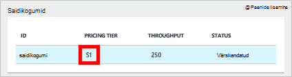
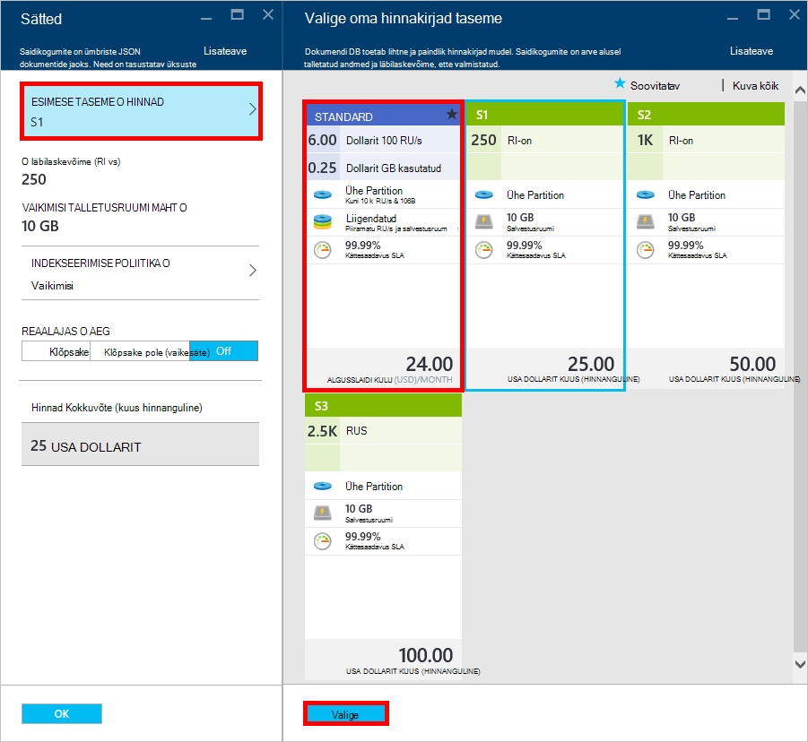
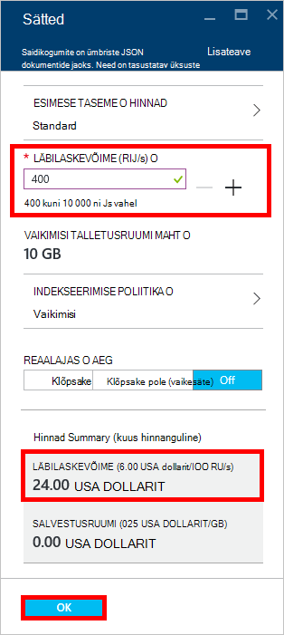
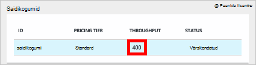

<properties 
    pageTitle="Konto DocumentDB S1 ülelaadimine | Microsoft Azure'i" 
    description="Ära suurema läbilaskevõime kontol DocumentDB S1, muutes mõne lihtsa muutusi Azure'i portaalis." 
    services="documentdb" 
    authors="mimig1" 
    manager="jhubbard" 
    editor="monicar" 
    documentationCenter=""/>

<tags 
    ms.service="documentdb" 
    ms.workload="data-services" 
    ms.tgt_pltfrm="na" 
    ms.devlang="na" 
    ms.topic="article" 
    ms.date="08/25/2016" 
    ms.author="mimig"/>

# Ülelaadimine DocumentDB kontole

Järgmiste juhiste abil ära suurema läbilaskevõime Azure'i DocumentDB S1 konto jaoks. Vähe tasuta, saate suurendada läbilaskevõime olemasolevale S1 kontole 250 [RU/s](documentdb-request-units.md) -400 RU/s või rohkem!  

> [AZURE.VIDEO changedocumentdbcollectionperformance]

## Kasutaja määratletud jõudluse Azure'i portaalis muutmine

1. Liikuge brauseris [**Azure portaali**](https://portal.azure.com). 
2. Klõpsake nuppu **Sirvi** -> **DocumentDB (NoSQL)**, seejärel valige DocumentDB konto, mida soovite muuta.   
3. **Andmebaaside** Lens, andmebaasi muutmiseks valige ja **andmebaasi** tera, valige saidikogumi koos S1 hinnakirjad taseme.

      

4. **Saidikogumi** tera, klõpsake nuppu **veel**ja seejärel klõpsake nuppu **sätted**.   
5. Tera **sätted** , klõpsake **Taseme hinnad** ja pange tähele, et iga plaani kuu hinnanguline maksumus kuvatakse. **Valige oma hinnakirjad taseme** tera, klõpsake käsku **Standardne**ja klõpsake muudatuse salvestamiseks **Valige** .

      

6. Tagasi **sätted** labale **Taseme hinnad** on muutunud **Standard** ja **läbilaskevõime (RU/s)** väljal kuvatakse koos 400 vaikeväärtus. Klõpsake muudatuste salvestamiseks nuppu **OK** . 

    > [AZURE.NOTE] Saate määrata läbilaskevõime 400 kuni 10 000 [taotlemine üksuste](../articles/documentdb/documentdb-request-units.md)vahel /second (RU/s). **Hinnad Kokkuvõte** lehe allosas värskendatakse automaatselt esitada kuu kulude prognoos.
    
    

8. Uuesti sisse **andmebaasi** tera, saate kontrollida ülelaadimisega läbilaskevõime kogumist. 

    

Kasutaja määratletud ja eelmääratletud läbilaskevõime seotud muudatuste kohta lisateabe saamiseks leiate ajaveebipostitusest [DocumentDB: kõik, mida on vaja teada hinnakirjad uusi võimalusi](https://azure.microsoft.com/blog/documentdb-use-the-new-pricing-options-on-your-existing-collections/).

## Järgmised sammud

Kui olete kindlaks teinud, et teil on vaja rohkem jõudlus (suurem kui 10 000 RU/s) või täiendava salvestusruumi (suurem kui 10GB) saate luua sektsioonitud saidikogumi. Sektsioonitud saidikogumi loomiseks vaadake teemat [kogumi loomine](documentdb-create-collection.md).