<properties
    pageTitle="DocumentDB dokumendi Exploreri vaatamiseks JSON | Microsoft Azure'i"
    description="Lisateavet dokumendi DocumentDB Exploreri Azure portaali aitab JSON vaatamine, redigeerimine, loomine ja DocumentDB NoSQL dokumendi andmebaasi JSON dokumentide üleslaadimine."
        keywords="json kuvamine"
    services="documentdb"
    authors="kirillg"
    manager="jhubbard"
    editor="monicar"
    documentationCenter=""/>

<tags
    ms.service="documentdb"
    ms.workload="data-services"
    ms.tgt_pltfrm="na"
    ms.devlang="na"
    ms.topic="article"
    ms.date="08/30/2016"
    ms.author="kirillg"/>

# Kuvada, redigeerida, luua ja DocumentDB dokumendi Exploreriga JSON dokumentide üleslaadimine

Selles artiklis antakse ülevaade [Microsoft Azure'i DocumentDB](https://azure.microsoft.com/services/documentdb/) dokumendi Exploreri Azure portaali tööriista, mis võimaldab teil vaadata, redigeerida, luua, üles laadida ja filtreerimine JSON dokumentide DocumentDB. 

Pange tähele, et dokumendi Explorer on lubatud protokolli tugi MongoDB DocumentDB kontodel. Kui see funktsioon on lubatud, värskendatakse selle lehe.

## Käivitage dokumendi Explorer

1. Klõpsake Azure portaali, Jumpbar, **DocumentDB (NoSQL)**. Kui **DocumentDB (NoSQL)** pole kuvatud, klõpsake nuppu **Rohkem teenuseid** ja klõpsake **DocumentDB (NoSQL)**.

2. Valige konto nimi. 

3. Klõpsake menüüs ressursi **Dokumendi Explorer**. 
 
    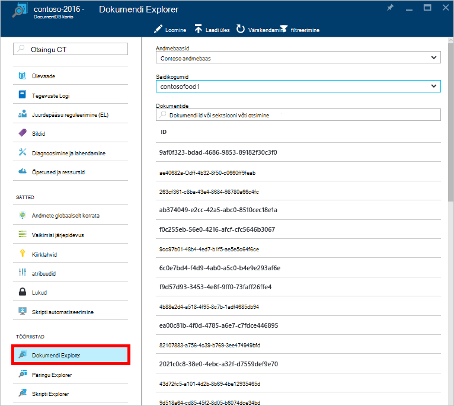

    **Dokumendi Exploreri** tera, on **andmebaaside** ja **saidikogumite** ripploendite eelasustatud vastavalt kontekstile, kus saate dokumendi Exploreri käivitatud. 

## Dokumendi loomine

1. [Käivitage dokumendi Explorer](#launch-document-explorer).

2. Klõpsake **Dokumendi Exploreri** labale **Dokumendi loomine**. 

    Minimaalne JSON koodilõigu on esitatud **dokumendi** tera.

    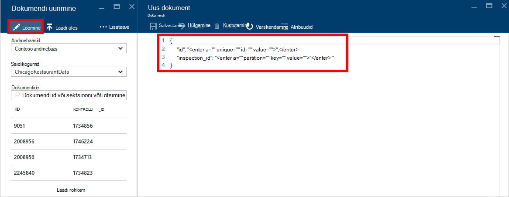

2. Labale **dokumendi** tippige või kleepige JSON soovite luua dokumendi sisu ja seejärel käsku **Salvesta** andmebaas ja **Dokumendi Exploreri** tera määratud saidikogumi dokumendi kinnitamiseks.

    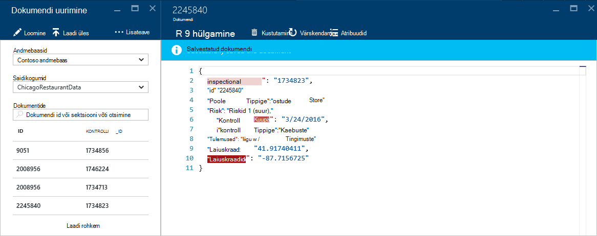

    > [AZURE.NOTE] Kui annate vara "id", seejärel dokumendi Explorer automaatselt lisab id-atribuutide ja genereeritud GUID id-väärtusena.

    Kui teil on juba JSON andmete faile, MongoDB, CSV-failid, SQL Server Azure'i tabelimälu, Amazon DynamoDB, HBase, või muude DocumentDB saidikogumid, kaudu saate DocumentDB's [andmete Migreerimistööriista](documentdb-import-data.md) kiirelt oma andmeid importida.

## Dokumendi redigeerimine

1. [Käivitage dokumendi Explorer](#launch-document-explorer).

2. Olemasoleva dokumendi redigeerimiseks valige see **Dokumendi Exploreri** tera, **dokumendi** tera dokumendi redigeerimise ja klõpsake siis nuppu **Salvesta**.

    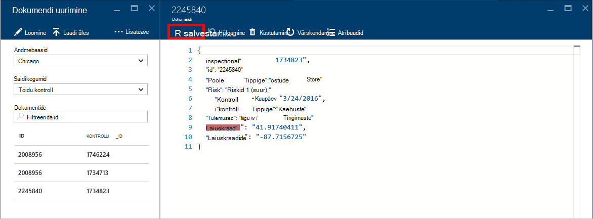

    Kui redigeerite dokumenti, kuid otsustate, et soovite praegusi muudatused hüljata, lihtsalt nuppu **Hülga** **dokumendi** tera, Hülga toimingu kinnituseks ja dokumendi eelmise oleku uuesti.

    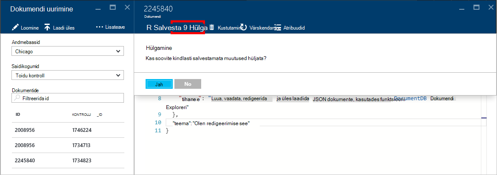

## Dokumendi kustutamine

1. [Käivitage dokumendi Explorer](#launch-document-explorer).

2. Valige dokument **Dokumendi**Exploreris, klõpsake käsku **Kustuta**ja seejärel kinnitage Kustuta. Pärast kinnitab, eemaldatakse dokumendi kohe dokumendi Exploreri loendist.

    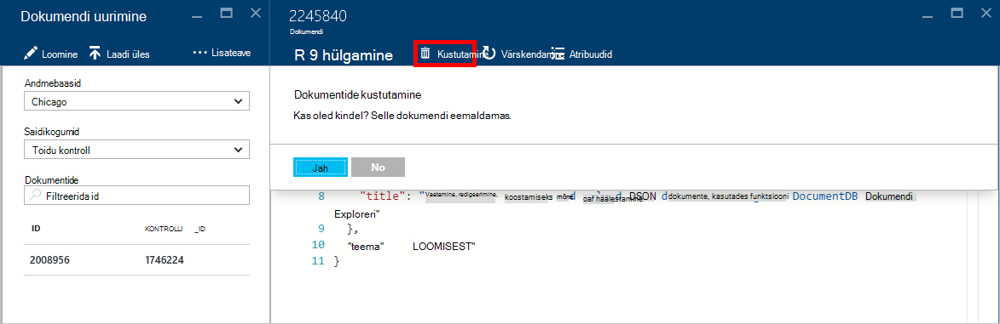

## JSON dokumentidega töötamine

Dokumendi Exploreri kinnitab, et iga uue või redigeeritud dokumendi sisaldab kehtiv JSON.  Saate isegi Kuva JSON tõrked libistamisel üle vale jaotis saada üksikasjalikku teavet valideerimisreegli tõrge.

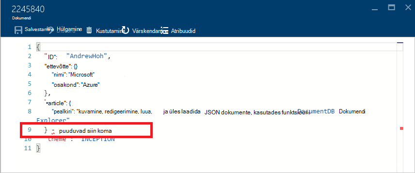

Lisaks dokumendi Explorer takistab sobimatu JSON sisuga dokumendi salvestamine.

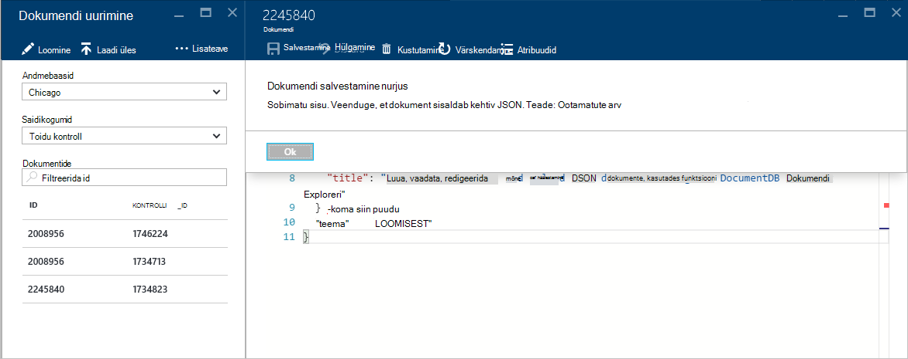

Lõpuks dokumendi Explorer võimaldab teil hõlpsasti vaadata Süsteemiatribuudid praegu laaditud dokumendi, klõpsates käsku **Atribuudid** .

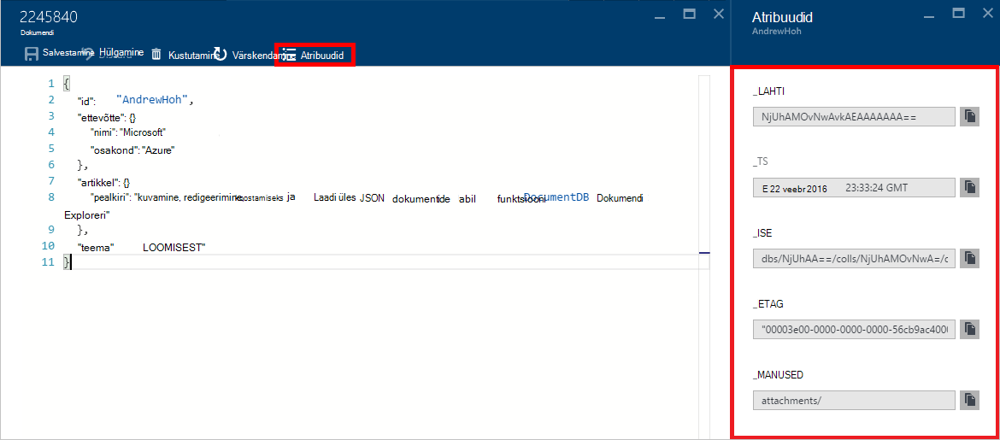

> [AZURE.NOTE] Atribuudi ajatempli (_ts) on esindatud ettevõttesiseselt epohhi aeg, kuid dokumendi Explorer kuvab väärtuse GMT inimeste loetavas vormingus.

## Dokumentide filtreerimine
Dokumendi Explorer toetab Navigeerimissuvandid arvu ja Täpsemad sätted.

Vaikimisi dokumendi Explorer laadib esimest 100 dokumentidele kuvatakse valitud saidikogumi varaseimast, et uusim oma loodud kuupäeva järgi.  Täiendavad dokumendid (pakkidena 100) saate laadida **rohkem laadimine** dokumendi Exploreri tera allosas valikut. Saate valida, milliseid dokumente laadimiseks kaudu käsk **Filtreeri** .

1. [Käivitage dokumendi Explorer](#launch-document-explorer).

2. **Dokumendi Exploreri** tera ülaosas nuppu **Filtreeri**.  

    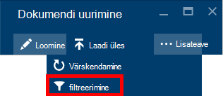
  
3.  Filtrisätted kuvatakse all asuvat käsuriba. WHERE-klausli ja/või klausel ORDER BY filtrisätted, ja seejärel nuppu **Filtreeri**.

    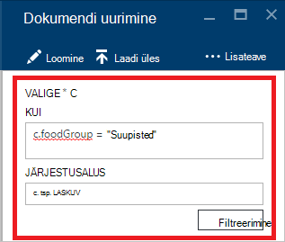

    Dokumendi Exploreris värskendab tulemused automaatselt dokumentidega sobitamine filtri päring. Lugege lisateavet DocumentDB SQL-i grammatika [SQL-päringu ja SQL-süntaks](documentdb-sql-query.md) artiklit või [SQL-päringu cheat lehele](documentdb-sql-query-cheat-sheet.md)printida.

    Ripploendi väljad **andmebaasi** ja **saidikogumi** saab hõlpsalt muuta saidikogumi, millest on praegu dokumente vaadata ilma sulgeda ja uuesti käivitada dokumendi Explorer.  

    Dokumendi Explorer toetab samuti filtreerimine id-atribuutide praegu laaditud dokumentide hulka.  Tippige lihtsalt ruut id dokumentide Filtreeri.

    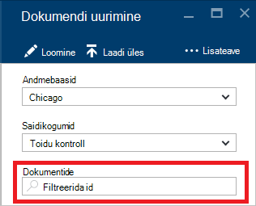

    Teie esitatud kriteeriumide alusel dokumendi Exploreris loend on filtreeritud tulemused.

    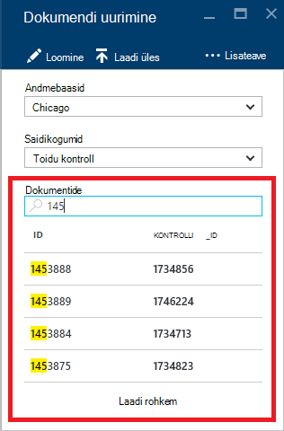

    > [AZURE.IMPORTANT] Dokumendi Exploreri filter funktsioonid ainult filtrid: on ***praegu*** laaditud dokumendid ja teha päring praegu valitud saidikogumi.

4. Dokumendi Exploreriga laadida dokumentide loendi värskendamiseks nuppu **Värskenda** tera ülaosas.

    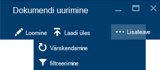

## Dokumentide lisamine mitmekaupa

Dokumendi Explorer toetab ühe või mitme olemasoleva JSON dokumente, kuni 100 JSON faili üleslaadimine toimingus mitmekaupa manustamisest.  

1. [Käivitage dokumendi Explorer](#launch-document-explorer).

2. Üleslaadimine alustamiseks klõpsake nuppu **Laadi dokument üles**.

    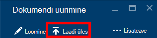

    **Laadi dokument üles** tera avaneb. 

2. Klõpsake nuppu Sirvi, et avada file Exploreri aknas, valige üks või mitu JSON dokumente üles laadida, ja seejärel klõpsake nuppu **Ava**.

    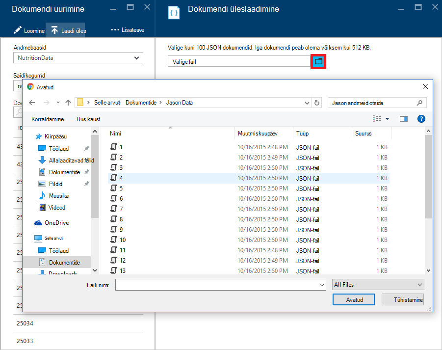

    > [AZURE.NOTE] Dokumendi Explorer toetab praegu kuni 100 JSON dokumentide arv üksikute üleslaadimise lõpuleviimiseks.

3. Kui olete oma valikut, klõpsake nuppu **üles laadida** .  Dokumentide lisatakse automaatselt dokumendi Exploreri koordinaatvõrgule ja laadi tulemused kuvatakse edenedes toiming. Impordi tõrgete esitatakse üksikuid faile.

    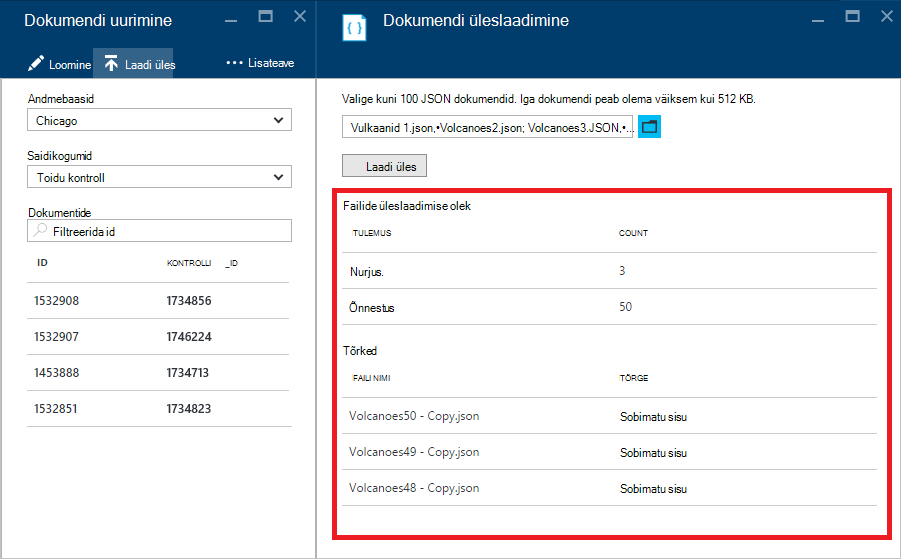

4. Pärast selle toimingu lõpuleviimist, saate valida kuni 100 teise dokumenti üles laadida.

## Väljaspool portaali JSON dokumentidega töötamine

Dokumendi Exploreri Azure'i portaalis on ainult üks viis, kuidas DocumentDB asuvate dokumentidega töötamine. Saate töötada ka dokumentide [REST API -ga](https://msdn.microsoft.com/library/azure/mt489082.aspx) või [Kliendi SDK-d](documentdb-sdk-dotnet.md). Näiteks koodi, [.NET SDK dokumendi näited](documentdb-dotnet-samples.md#document-examples) ja [Node.js SDK dokumendi näited](documentdb-nodejs-samples.md#document-examples).

Kui soovite importida või failide migreerimine mõnest muust allikast (JSON failide, MongoDB, SQL Server, CSV-failid, Azure'i tabeli salvestusruumi, Amazon DynamoDB, või HBase), saate kiiresti oma andmete importimiseks DocumentDB DocumentDB [andmete Migreerimistööriista](documentdb-import-data.md) .

## Tõrkeotsing

**Sümptom**: dokumendi Exploreri tagastab **dokumente ei leitud**.

**Lahendus**: Veenduge, et olete valinud õige tellimus, andmebaasi ja saidikogumi, kus dokumendid on lisatud. Ka, veenduge, et töötab teie läbilaskevõime kvoodi piires. Kui töötate veebisaidil rakendus oma maksimaalse läbilaskevõime taseme ja saada alumise rakenduse kasutamine kogumise talletusmahu maksimaalse läbilaskevõime all.

**Selgitus**: portaali on rakendus, nagu kõik teised, helistamist DocumentDB andmebaasi ja saidikogumi. Kui teie taotlused on praegu on rakendus tõttu kõned tehtud eraldi rakendusest, portaali võib-olla ka olema rakendus, põhjustab ressursse, mis ei kuvata portaalis. Selle probleemi lahendamiseks kõrge läbilaskevõime kasutuse põhjus aadress ja seejärel värskendage portaali tera. [Läbilaskevõime](documentdb-performance-tips.md#throughput) osas [jõudluse näpunäiteid](documentdb-performance-tips.md) artiklist leiate teavet, kuidas mõõta ja alumise läbilaskevõime kasutuse.

## Järgmised sammud

Toetatud dokumendi Exploreris grammatika DocumentDB SQL-i kohta leiate lisateavet artiklist [SQL-päringu ja SQL-süntaks](documentdb-sql-query.md) või [SQL-päringu petma lehte](documentdb-sql-query-cheat-sheet.md)välja printida.

[Õppeteema](https://azure.microsoft.com/documentation/learning-paths/documentdb/) on ka kasulikke ressursi juhendab teid, kui te DocumentDB kohta rohkem teada. 
