<properties
    pageTitle="JavaScripti redaktor DocumentDB skripti Exploreris | Microsoft Azure'i"
    description="Lisateavet Exploreris DocumentDB skripti Azure portaali aitab hallata DocumentDB serveripoolne programmeerimise esemeid, sealhulgas salvestatud toimingute, päästikute ja kasutaja määratletud funktsioonid."
    keywords="JavaScripti redaktor"
    services="documentdb"
    authors="kirillg"
    manager="jhubbard"
    editor="monicar"
    documentationCenter=""/>

<tags
    ms.service="documentdb"
    ms.workload="data-services"
    ms.tgt_pltfrm="na"
    ms.devlang="na"
    ms.topic="article"
    ms.date="08/30/2016"
    ms.author="kirillg"/>

# Loomine ja käivitamine salvestatud toimingute, päästikute ja kasutaja määratletud funktsioonid DocumentDB skripti Explorerit

Selles artiklis antakse ülevaade [Microsoft Azure'i DocumentDB](https://azure.microsoft.com/services/documentdb/) skripti Exploreris, mis on JavaScripti redaktor Azure'i portaalis, mis võimaldab teil vaadata ja käivitada DocumentDB serveripoolne programmeerimise esemeid, sealhulgas salvestatud toimingute, päästikute ja kasutaja määratletud funktsioonid. Lisateavet leiate DocumentDB serveripoolne programmeerimise [Salvestatud toimingute ja andmebaasi päästikute, leiate ülevaate](documentdb-programming.md) artikli kohta.

## Käivitage skripti Explorer

1. Klõpsake Azure portaali, Jumpbar, **DocumentDB (NoSQL)**. Kui **DocumentDB kontod** ei ole nähtav, klõpsake nuppu **Rohkem teenuseid** ja klõpsake **DocumentDB (NoSQL)**.

2. Klõpsake menüüs ressursid **Skripti Explorer**.

    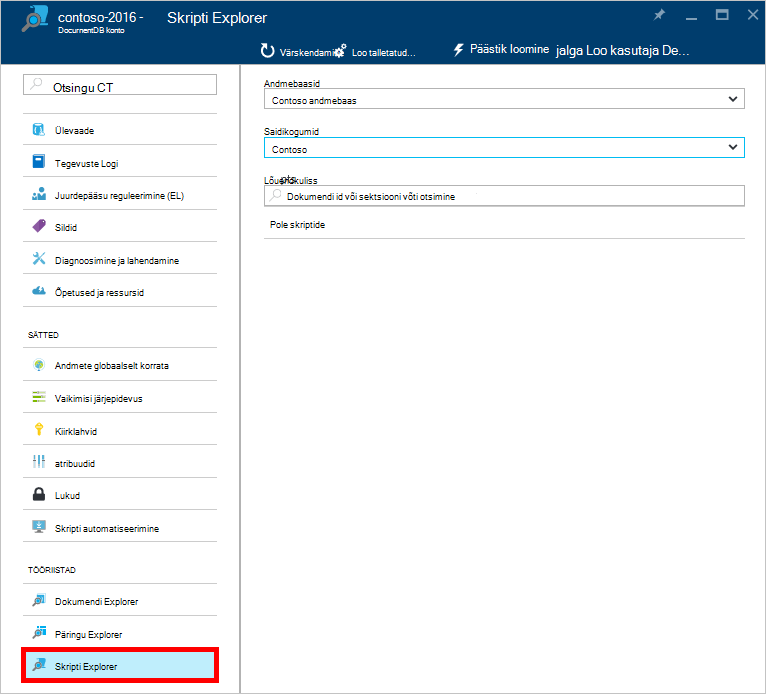
 
    Ripploendi väljad **andmebaasi** ja **saidikogumi** eelasustatud vastavalt kontekstile, kus käivitamisel skripti Explorer.  Näiteks kui käivitate andmebaasi tera kaudu, siis praeguse andmebaasi on juba eelnevalt täidetud.  Kui käivitate saidikogumi tera kaudu, siis praeguse saidikogumi on juba eelnevalt täidetud.

4.  Ripploendi väljad **andmebaasi** ja **saidikogumi** abil saate hõlpsalt muuta, kust on praegu skriptide vaadata ilma sulgeda ja uuesti käivitada skripti Explorer.  

5. Skripti Explorer toetab samuti filtreerimine skriptide praegu laaditud määramine nende id atribuut.  Lihtsalt tippige väljale filtri ja tulemused skripti Exploreri loendis on filtreeritud oma esitatud kriteeriumide alusel.

    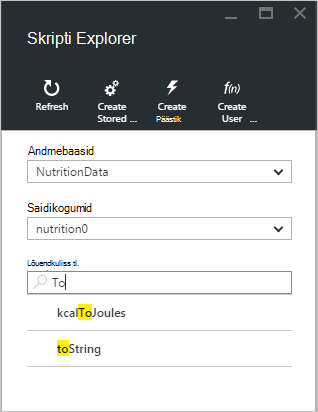

    > [AZURE.IMPORTANT] Skripti Exploreri filtreerimine funktsioonid ainult filtrid ***praegu*** laaditakse põhinevad skripte ja automaatne värskendamine praegu valitud saidikogumi.

5. Skriptide skript Exploreriga laadida loendi värskendamiseks klõpsake lihtsalt tera ülaosas käsk **Värskenda** .

    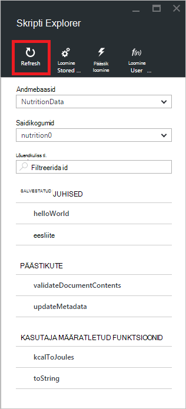

## Luua, vaadata ja redigeerida salvestatud toimingute, päästikute ja kasutaja määratletud funktsioonid

Skripti Explorer võimaldab teil hõlpsasti toiminguid CRUD DocumentDB serveripoolne programmeerimise esemeid.  

- Luua skripti, klõpsa kohaldatavate luua skripti Exploreri käsu, pakuvad id, sisestage skripti sisu ja klõpsake nuppu **Salvesta**.

    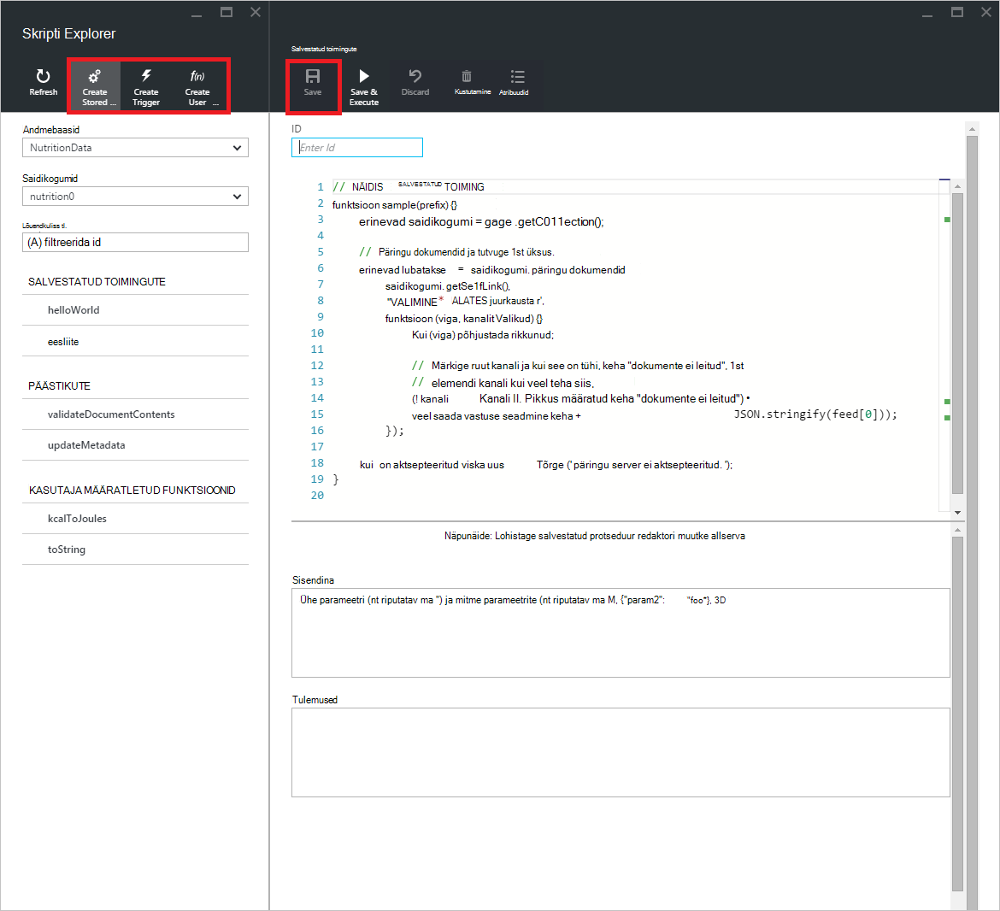

- Kui loote käivitamiseks, peate määrama toimingu tüüp ja päästik päästik

    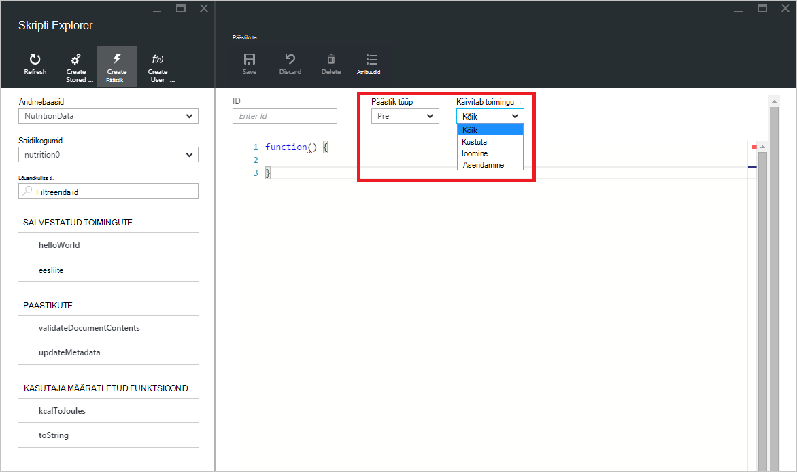

- Skripti vaatamiseks klõpsake lihtsalt skripti, mis teile huvi.

    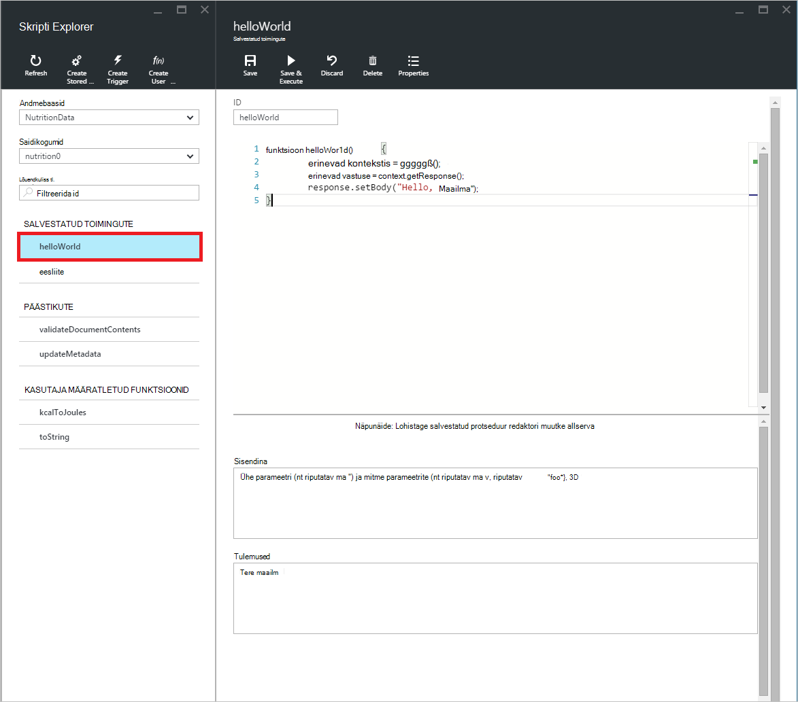

- Skripti redigeerimiseks lihtsalt editor JavaScript tehke soovitud muudatused ja klõpsake nuppu **Salvesta**.

    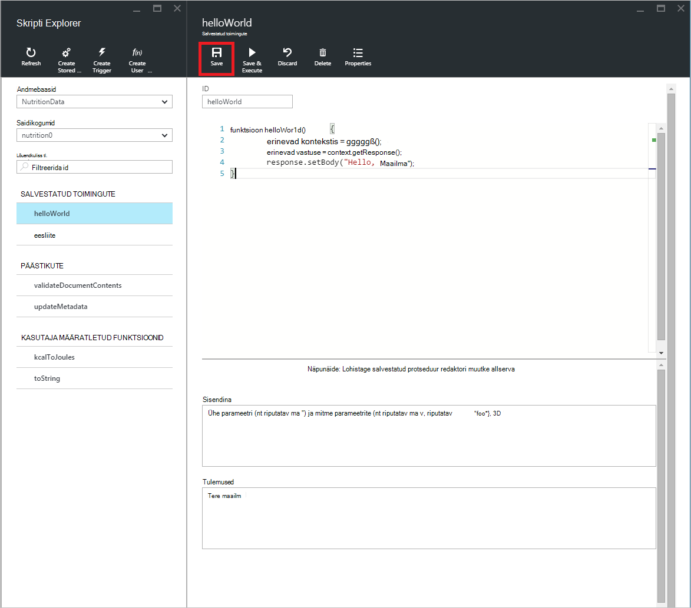

- Skripti Ootel muudatuste hülgamiseks lihtsalt käsku **Hülga** .

    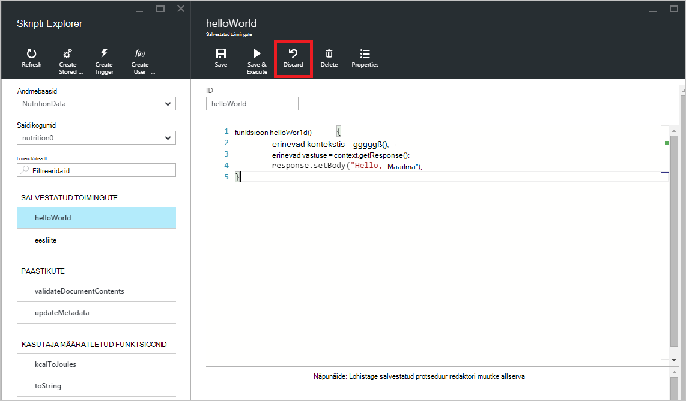

- Skripti Explorer võimaldab teil vaadata Süsteemiatribuudid praegu laaditud skripti, klõpsates käsku **Atribuudid** .

    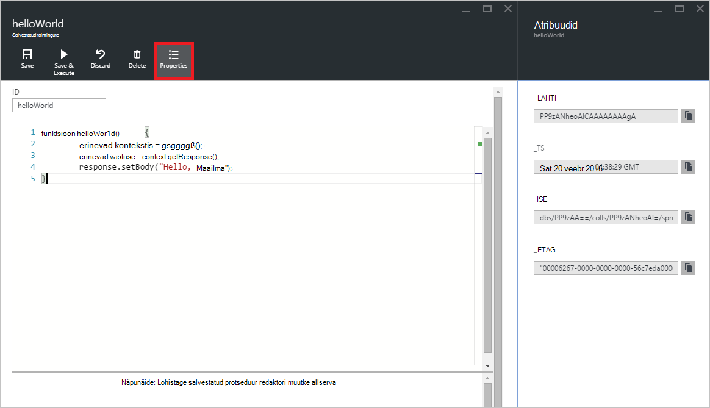

    > [AZURE.NOTE] Atribuudi ajatempli (_ts) on esindatud ettevõttesiseselt epohhi aeg, kuid skripti Explorer kuvab väärtuse GMT inimeste loetavas vormingus.

- Skripti kustutamiseks valige see Script Exploreris ja klõpsake käsku **Kustuta** .

    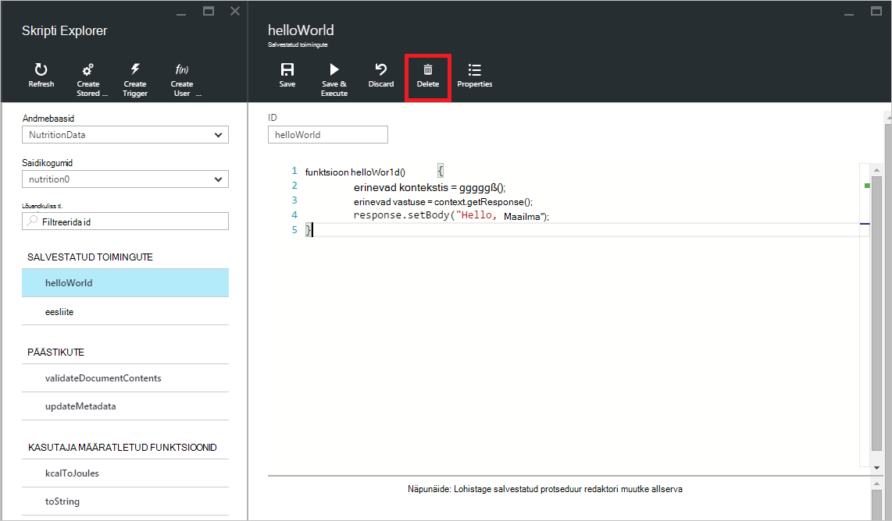

- Kustutustoiming kinnitada, klõpsates nuppu **Jah** või Kustuta toimingu tühistamine, klõpsates nuppu **ei**.

    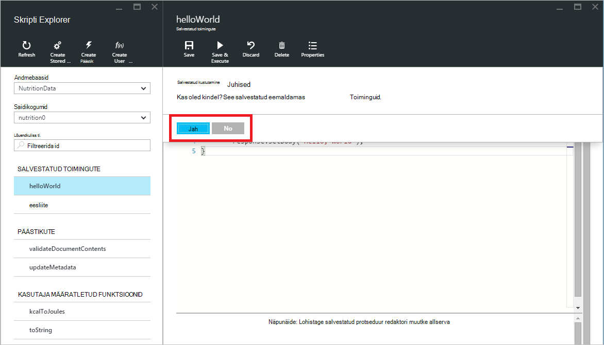

## Käivitada salvestatud protseduur

> [AZURE.WARNING] Salvestatud toimingute käivitamisel skripti Exploreris veel ei toetata serveri pool liigendatud saidikogumid. Lisateabe saamiseks külastage [Eraldatav ja mastaapimine DocumentDB sisse](documentdb-partition-data.md).

Skripti Explorer võimaldab teil käivitada serveripoolne salvestatud toimingute Azure portaalist.

- Uue Loo salvestatud protseduur blade avamisel vaikimisi script (*eesliide*) juba andnud. *ID-d* ja *sisendina*lisamiseks *eesliite* skripti või oma skripti käivitamiseks. Salvestatud toimingute aktsepteerida mitut parameetrite, peab olema kõik sisendina massiivi (nt *["foo", "lint"]*).

    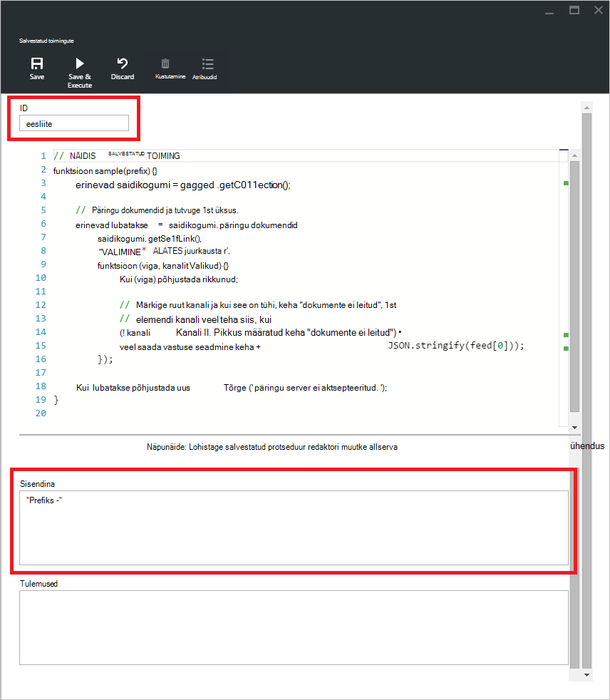

- Salvestatud toimingu käivitada, klõpsake käsku **Salvesta ja käivitada** script editor paanil.

    > [AZURE.NOTE] Käsu **Salvesta ja käivitada** salvestab teie salvestatud protseduur enne, mis tähendab, et see kirjutab salvestatud protseduur varem salvestatud versiooni.

- Eduka salvestatud protseduur täitmised on *nüüd salvestatud ja täidetud salvestatud protseduur* olek ja tagastatud tulemite olema täidetud järgmised *tulemuste* paanil.

    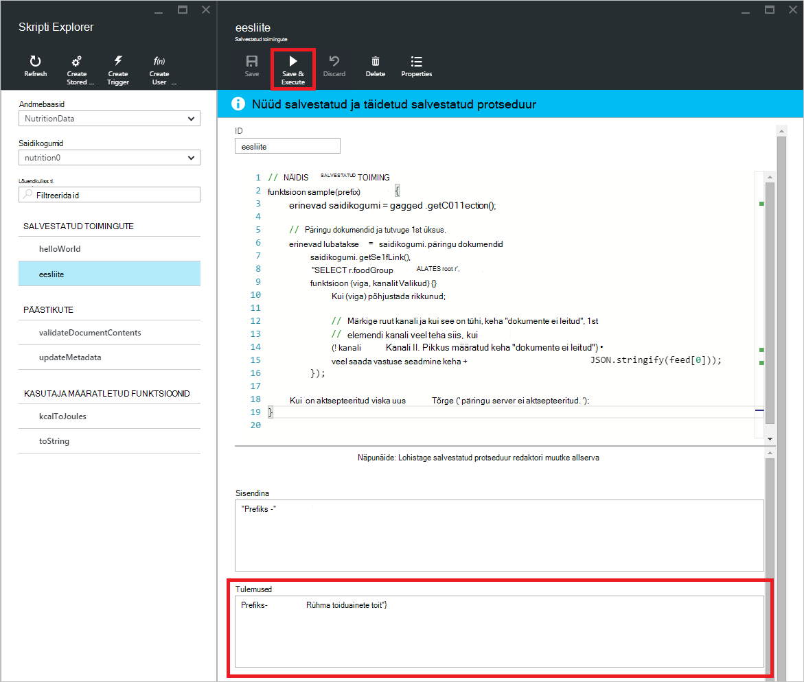

- Kui täitmise tõrge, kuvatakse tõrge kasutajanimedega *tulemuste* paanil.

    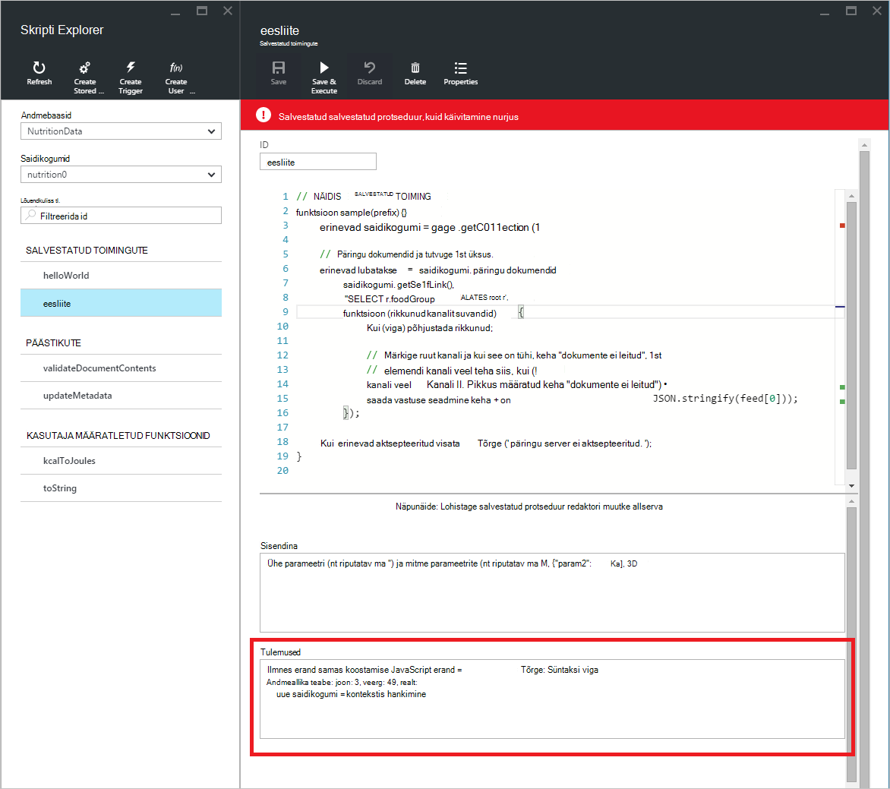

## Skriptide väljaspool portaali töötamine

Skripti Exploreri Azure'i portaalis on ainult üks viis, kuidas salvestatud toimingute, päästikute ja kasutaja määratletud funktsioonide DocumentDB töötamine. Skriptide abil saate töötada ka selle REST API-ga ja [Kliendi SDK-d](documentdb-sdk-dotnet.md). REST API dokumentatsiooni sisaldab näidised [Salvestatud toimingute abil ülejäänud](https://msdn.microsoft.com/library/azure/mt489092.aspx), [kasutaja määratletud funktsioonid, kasutades ülejäänud](https://msdn.microsoft.com/library/azure/dn781481.aspx)ja [päästikute kasutamine ülejäänud](https://msdn.microsoft.com/library/azure/mt489116.aspx)töötamiseks. Näidised on ka saadaval näitab, kuidas [töötada skriptide abil C#](documentdb-dotnet-samples.md#server-side-programming-examples) ja [skriptide abil Node.js töötamine](documentdb-nodejs-samples.md#server-side-programming-examples).

## Järgmised sammud

Lugege lisateavet DocumentDB serveripoolne programmeerimise [Salvestatud toimingute ja andmebaasi päästikute, leiate ülevaate](documentdb-programming.md) artiklist.

[Õppeteema](https://azure.microsoft.com/documentation/learning-paths/documentdb/) on ka kasulikke ressursi juhendab teid, kui te DocumentDB kohta rohkem teada.  
